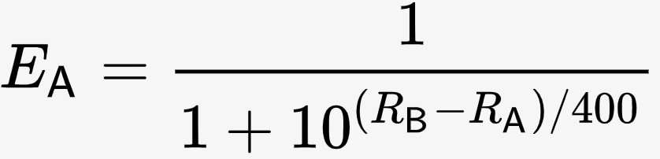
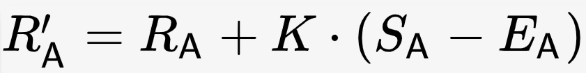
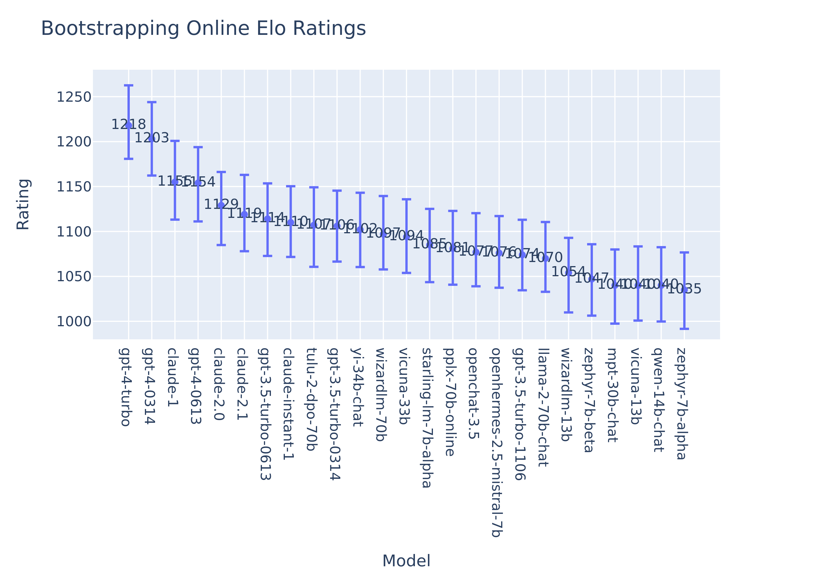
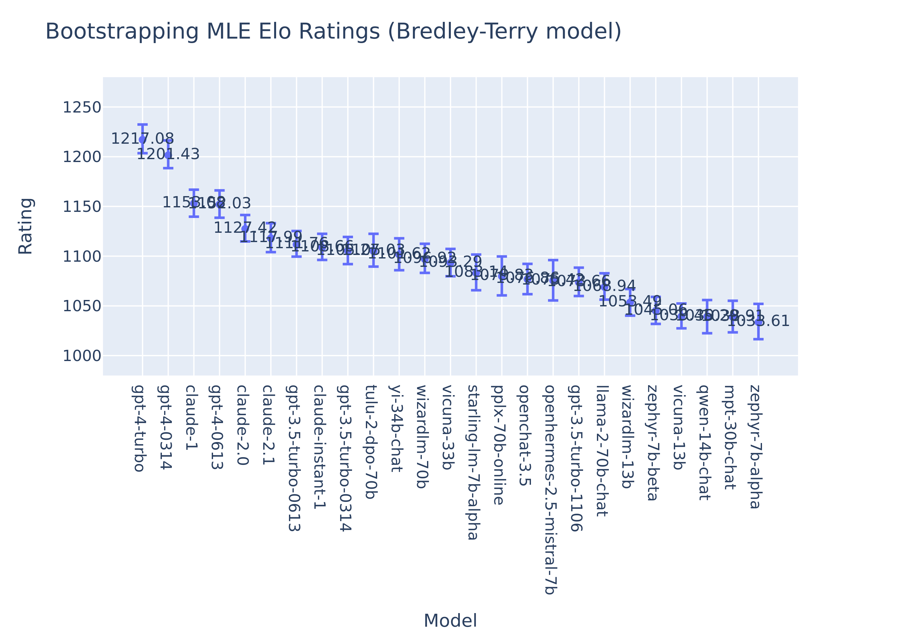

# Chatbot Arena: New models & Elo system update
> LMSYS更新模型排名，Elo算法，Yi-34B-Chat排名靠前

blog：https://lmsys.org/blog/2023-12-07-leaderboard/

Arena：https://arena.lmsys.org/

lmsys/chatbot-arena-leaderboard：https://huggingface.co/spaces/lmsys/chatbot-arena-leaderboard

另一篇重要blog：[Chatbot Arena: Benchmarking LLMs in the Wild with Elo Ratings](https://lmsys.org/blog/2023-05-03-arena/)
> 里面提到了online elo rating system，相关代码[参考notebook](https://colab.research.google.com/drive/1RAWb22-PFNI-X1gPVzc927SGUdfr6nsR?usp=sharing#scrollTo=hytEb0aXfcwm)

 
&nbsp;&nbsp;&nbsp;&nbsp;欢迎来到我们关于Chatbot Arena的最新更新，这是我们的开放评估平台，用于测试最先进的LLMs。我们很高兴分享，现在已经收集了超过` 130,000 votes `，用于排名最能力的40多个模型！在这篇博文中，我们将介绍几个新模型的结果：

- 1. Tulu-2-DPO-70B和Yi-34B-Chat是新的SoTA开源模型
- 2. 基于Mistral的7B模型（OpenChat，OpenHermes-2.5，Starling-7B）显示出令人期待的性能

&nbsp;&nbsp;&nbsp;&nbsp;我们还介绍了专有模型版本的差异（例如，GPT-4 => GPT-4-0314，GPT-4-0613），以及从在线Elo系统过渡到Bradley-Terry模型的结果，后者给我们带来了更稳定的评分和精确的置信区间。

 

## Introducing new models:

&nbsp;&nbsp;&nbsp;&nbsp;LLM已经变得比以往任何时候都更智能，对它们进行正确评估成为一项真正的挑战。传统的基准测试，如MMLU，虽然有用，但可能无法捕捉到人类偏好的细微差别和现实对话的开放性质。我们认为在真实世界中部署聊天模型以从用户那里获得反馈产生了最直接的信号。这促使了Chatbot Arena在五月份的推出。自那时以来，开源社区已经起飞。在过去的几个月里，我们在Arena中部署了45多个模型，收集了超过` 130,000 votes `。我们相信这样的规模涵盖了各种用例，为我们提供了有益的见解，了解这些模型在真实场景中的运作方式。

&nbsp;&nbsp;&nbsp;&nbsp;在十一月份，我们新增了九个创纪录的新模型，大小从7B到70B不等，还有专有模型，并为它们收集了超过`25,000 votes`。令人振奋的是，我们现在看到专有和开源模型之间的差距在缩小。新模型，如`Tulu-2-DPO-70B`和`Yi-34B-Chat`，在开放领域表现出色，接近gpt-3.5的性能水平。

| Model                                                                                     |Arena Elo Rating|Vote count|License|
|-------------------------------------------------------------------------------------------|--|--|--|
| [**GPT-4-Turbo**](https://platform.openai.com/docs/models/gpt-4-and-gpt-4-turbo)          |1217|7007|Proprietary|
| [GPT-4-0613](https://platform.openai.com/docs/models/gpt-4-and-gpt-4-turbo)               |1153|11944|Proprietary|
| [**Claude-2.1**](https://www.anthropic.com/index/claude-2-1)                              |1118|5929|Proprietary|
| [GPT-3.5-Turbo-0613](https://platform.openai.com/docs/models/gpt-3-5)                     |1112|15974|Proprietary|
| [Claude-instant-1](https://www.anthropic.com/index/releasing-claude-instant-1-2)          |1108|5929|Proprietary|
| [**Tulu-2-DPO-70B**](https://huggingface.co/allenai/tulu-2-dpo-70b)                       |1105|2922|AI2 ImpACT Low-risk|
| [**Yi-34B-Chat**](https://huggingface.co/01-ai/Yi-34B-Chat)                               |1102|3123|Yi License|
| [Wizardlm-70B](https://huggingface.co/WizardLM/WizardLM-70B-V1.0)                         |1096|5865|Llama 2 Community|
| [Vicuna-33B](https://huggingface.co/lmsys/vicuna-33b-v1.3)                                |1093|11671|Non-commercial|
| [**Starling-LM-7B-alpha**](https://huggingface.co/berkeley-nest/Starling-LM-7B-alpha)     |1083|2250|CC-BY-NC-4.0|
| [**PPLX-70B-Online**](https://blog.perplexity.ai/blog/introducing-pplx-online-llms)       |1080|1500|Proprietary|
| [**OpenChat-3.5**](https://huggingface.co/openchat/openchat_3.5)                          |1077|4662|Apache-2.0|
| [**Openhermes-2.5-mistral-7B**](https://huggingface.co/teknium/OpenHermes-2.5-Mistral-7B) |1075|1180|Apache-2.0|
| [**Llama-2-70B-chat**](https://huggingface.co/meta-llama/Llama-2-70b-chat-hf)             |1069|8659|Llama 2 Community|
| [Zephyr-7B-beta](https://huggingface.co/HuggingFaceH4/zephyr-7b-beta)                     |1045|8412|MIT|
| [**PPLX-7B-Online**](https://blog.perplexity.ai/blog/introducing-pplx-online-llms)        |1016|1041|Proprietary|

&nbsp;&nbsp;&nbsp;&nbsp;另一方面，7B模型也显示出显著的改进。对`7B Mistral`模型进行微调产生了`Zephyr`、`OpenChat-3.5`、`Starling-lm-7b-alpha`和`OpenHermes-2.5-Mistral-7b`，尽管规模较小，但它们都表现出色。向推动极限的开源社区致敬！另一方面，为了了解新鲜度和基础信息如何帮助LLMs回答用户的查询，我们还在竞技场引入了Perplexity AI的在线LLMs。我们已经为`PPLX-70B-Online`收集了超过`1500 votes`，初步结果显示出巨大的潜力。祝贺所有团队，我们期待在未来看到更多的模型！

			
&nbsp;&nbsp;&nbsp;&nbsp;Please find the latest leaderboard [here](https://huggingface.co/spaces/lmsys/chatbot-arena-leaderboard) or try [Arena demo](https://chat.lmsys.org/) to chat with 20+ models! We also prepare a [notebook](https://colab.research.google.com/drive/1KdwokPjirkTmpO_P1WByFNFiqxWQquwH) to reproduce all the calculation of Elo ratings and confidence intervals.
			

 

## Tracking Performance of Proprietary APIs - GPT-4-0314 vs 0613?

&nbsp;&nbsp;&nbsp;&nbsp;自OpenAI在6月份更新了GPT-4以来，社区一直在猜测新版本的GPT-4是否有性能变化。有些人在某些领域发现了性能下降（[参考链接](https://twitter.com/matei_zaharia/status/1681467961905926144?s=20)），但目前仍然不清楚究竟发生了什么。之前，我们将两个版本的投票合并为一个GPT-4。随着我们从 `online Elo` 过渡到`BT model`（稍后在文章中解释），我们决定将专有模型API的不同版本分开，以更好地满足模型保持不变的假设。

令人惊讶的是，根据Chatbot Arena用户的喜好，我们观察到`gpt-4-0314`和`gpt-4-0613`之间存在显著差异（评分1201 vs 1152）。GPT-4 API于6月27日自动从0314版本更新到0613版本，并且自那时起，0314版本已经从Arena中下线。可能的假设：

1. Arena用户分布在7月之前/之后发生了变化（例如，prompt distribution, voting behaviors等）。
2. 与7月之后新增的模型进行比较可能是不公平的，因为0314版本没有与之进行比较的数据。
3. Arena用户确实更喜欢GPT-4的0314版本而不是0613版本。

为了解决这个问题，我们重新上线了`gpt-4-0314`，收集了新的votes，并直接与其较新的0613版本进行比较。截至目前，我们已经为`gpt-4-0314`收集了`1,000 votes`，其性能仍然强大，胜率超过其他模型，如下所示。我们将在未来提供更多关于此事的更新。

			

&nbsp;&nbsp;&nbsp;&nbsp;有趣的是，经历了类似版本更改（0314 -> 0613）的`gpt-3.5-turbo`似乎是正常的。正如您所看到的，`gpt-3.5-turbo-0613`的评分略高于`gpt-3.5-turbo-0314`（1112 vs 1106）。然而，我们再次观察到最新版本`gpt-3.5-turbo-1106`的性能下降，该版本已经获得了`5000 votes`。我们希望通过开发新工具来分析用户提示，识别模型在不同领域的优势和劣势，从而深入调查这个问题。

 

## Transition from online Elo rating system to Bradley-Terry model

&nbsp;&nbsp;&nbsp;&nbsp;自从推出Chatbot Arena以来，我们就采用了Elo评分系统来排名模型。这一系统很有用，将人们的两两偏好转化为Elo评分，作为模型之间胜率的预测指标。

具体来说，如果玩家A的评分为Ra，玩家B的评分为Rb，那么玩家A获胜的概率为:

&nbsp;&nbsp;&nbsp;&nbsp;ELO评分已经在国际象棋界使用了60多年。标准ELO评分系统假设玩家的表现会随时间而变化。因此，需要一种在线算法来捕捉这种动态变化，即最近的比赛应该比较早期的比赛更具权重。具体而言，在每场比赛之后，玩家的评分会根据预测的结果与实际结果之间的差异进行更新。

这个算法有两个显著的特点：
- 它可以由世界各地的玩家异步计算。
- 它允许玩家的表现动态变化 - 不假设玩家评分的固定未知值。

&nbsp;&nbsp;&nbsp;&nbsp;这种适应能力由参数 K 决定，它控制着可以影响整体结果的评分变化的幅度。较大的 K 实际上更加重视最近的比赛，这对于表现迅速提升的新手可能是合理的。然而，随着玩家变得更加资深和他们的表现“趋同”，较小的 K 值更为适用。因此，USCF 根据玩家完成的比赛和锦标赛的数量采用了 K 的基准（[参考](https://new.uschess.org/sites/default/files/media/documents/the-us-chess-rating-system-revised-september-2020.pdf)）。也就是说，资深玩家的 Elo 评分变化较慢，而新手的变化较快。

&nbsp;&nbsp;&nbsp;&nbsp;当我们推出 Arena 时，我们注意到使用经典的在线算法计算评分时存在相当大的变异性。我们试图调整 K 的值，使其足够稳定，同时又允许新模型在排行榜上迅速上升。我们最终决定采用一种类似于自助法的技术，从 1000 次对在线比赛进行排列组合的结果中抽样 Elo 分数。您可以在这个 [notebook](https://colab.research.google.com/drive/1KdwokPjirkTmpO_P1WByFNFiqxWQquwH) 中找到详细信息。这提供了一致的稳定分数，并使我们能够快速纳入新模型。这也在 [Cohere](https://arxiv.org/abs/2311.17295) 最近的一项工作中得到了证实。然而，我们使用相同的样本来估计置信区间，因此这些置信区间太宽（实际上是原始在线 Elo 估计的置信区间）。

&nbsp;&nbsp;&nbsp;&nbsp;在 LLM 排名的背景下，与经典的国际象棋 Elo 排名系统相比，有两个重要的区别。首先，我们可以访问所有模型的所有游戏的整个历史，因此我们不需要分散的算法。其次，大多数模型是静态的（我们可以访问它们的权重），因此我们不希望它们的性能发生变化。然而，值得注意的是，托管的专有模型可能不是静态的，它们的行为可能会在没有通知的情况下发生变化。我们会尽最大努力锁定特定的模型 API 版本（如果可能的话）。

&nbsp;&nbsp;&nbsp;&nbsp;为了提高我们排名的质量和置信度估计，我们采用了另一种广泛使用的评级系统，称为 [Bradley–Terry（BT）](https://en.wikipedia.org/wiki/Bradley%E2%80%93Terry_model)模型。该模型实际上是对基础 Elo 模型的最大似然（MLE）估计，假设两两比赛的固定但未知的胜率。与 Elo 评分类似，BT 模型也是基于两两比较来推导玩家的评分，以估计彼此之间的胜率。BT 模型与在线 Elo 系统之间的核心区别在于，BT 模型假设玩家的表现不会发生变化（即游戏顺序不重要），计算以集中的方式进行。

&nbsp;&nbsp;&nbsp;&nbsp;在静态性能假设的情况下，可以通过最大似然估计（MLE）获得模型评分，即最大化给定模型评分的观察游戏结果的似然。下面的代码片段显示了如何使用 MLE 计算模型评分。

&nbsp;&nbsp;&nbsp;&nbsp;同样，我们还可以使用`MLE` `Bradley-Terry`分数进行自助采样，以获取模型评分的置信区间。我们观察到两种方法得到的平均评分非常相似，排名几乎相同。

&nbsp;&nbsp;&nbsp;&nbsp;更重要的是，使用BT模型，自助采样置信区间现在更好地捕捉了模型性能估计的方差。我们观察到下图中有明显的改善。新添加的模型，由于得到的投票较少，其置信区间范围较宽。

&nbsp;&nbsp;&nbsp;&nbsp;请注意，我们扩展了BT模型以考虑平局，将平局视为半胜和半负。可在此 [notebook](https://colab.research.google.com/drive/1KdwokPjirkTmpO_P1WByFNFiqxWQquwH) 中找到重现计算的代码。

 

## Bonus: Topic modeling on user prompts

&nbsp;&nbsp;&nbsp;&nbsp;我们还对50,000个用户 prompt 进行了主题建模，以更好地了解用户如何与这些模型进行交互。我们的方法使用了OpenAI embeddings `text-embedding-ada-002` 和 `K-means` ，然后使用GPT-4对每个聚类的中心附近的提示进行主题总结。这个分析揭示了各种各样的主题，从角色扮演、故事创作到编程建议。我们在下面展示了主题分布和一些例子。

| Cluster ID |Arena User Prompt|
|------------|--|
| 1          |You are a Chief information Officer for a Biotechnology Manufacturing company and will act like one. Write a business need and objectives for a case study to Engage Info-Tech technical consulting services to conduct a comprehensive assessment of our current application development practices, including analyzing our development methodologies, tools, and frameworks.|
| 2          |	Write a short scene from a novel where a beautiful, wicked lamia coils around an unfortunate, quippy human adventurer.|
| 3          |How should the balance be struck between freedom of speech and the ability to function in a world without continual distractions and distortions from misinformation?|
| 4          |Can you give me a list of 5 suggestions on how to write software with fewer bugs?|
	

&nbsp;&nbsp;&nbsp;&nbsp;在未来，我们的目标是优化我们的方法，以过滤掉低质量的提示，提高分类，更清晰地了解模型在不同领域的优势和劣势。

