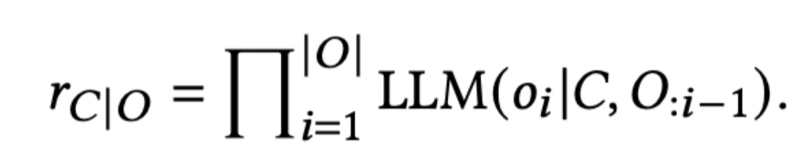
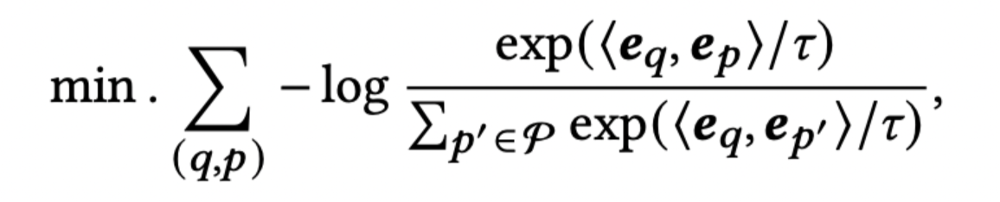
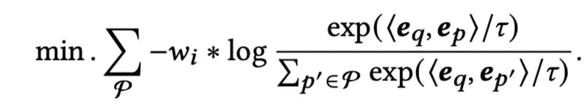
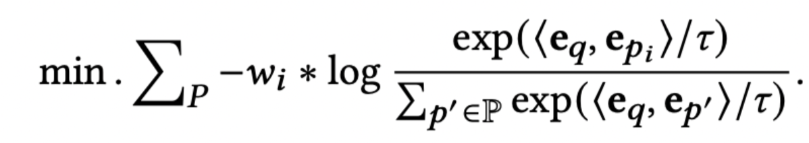

# Retrieve Anything To Augment Large Language Models

- 论文地址：https://arxiv.org/abs/2310.07554

- 中文翻译地址：https://blog.csdn.net/weixin_43751415/article/details/134113657

- 作者：中国人民大学 & 智源研究所

- 论文解决问题：通用检索器没有合理优化，特定检索器缺乏通用性，这影响了他们在不同场景下的性能

- 核心贡献：通过一个统一LLM-embedder来进行检索增强，包括：knowledge enhanced(知识增强)，Long Memory（增强记忆），In-Context Learning（上下文学习），Tool Augmented（工具增强）。

## 1 INTRODUCTION

上图展示了不同种类的检索器可以解决大语言模型不同的边界问题；当前大模型的主要有三类边界问题：

- `Knowledge boundary`：LLMs受到它们的知识容量的限制。由于有限的模型参数，它们无法完全内化庞大的世界知识体系。此外，LLMs的内部知识是静态的，难以随着不断演变的世界进行更新。此外，LLMs主要是在公开可用的高频数据上进行训练的，这可能在处理领域特定或长尾知识时导致不准确性。
- `Memory boundary`：LLMs在记忆方面也面临严重的限制，主要是由于对上下文长度的限制。虽然在不断扩大最大上下文长度方面已经取得了进展，但仍然无法实现与人类用户的终身交往目标。此外，对具有扩展上下文的LLMs进行训练和部署可能会在计算和存储上产生巨大的负担，使其在实践中无法显著扩展其内存。
- `Capability boundary`：在行动和自主性方面，LLMs的能力受到限制。首先，它们受限于“语言空间”，无法与物理世界进行有意义的互动。其次，这些模型严重依赖于人类的引导，需要清晰的用户说明和适当的示范示例，以有效地执行特定任务。

**常见retrievers：**

- `Knowledge Retriever`：为了支持LLMs解决知识密集型任务，提供外部知识。
- `Memory Retriever`：收集超越即时上下文的信息，帮助生成长序列。
- `Tool Retriever`：选择合适的工具，使LLMs能够有效地与物理世界互动。
- `Example Retriever`：定位预缓存的演示示例，从中可以自动生成LLM提示，以促进上下文学习。

检索增强是桥接LLMs和外部工具的重要机制，外部工具包括**知识库、记忆存储、演示示例和其他工具**。
为实现统一LLM-embedder，论文提出了四种优化策略：
- （1）基于大语言模型反馈的奖励机制；
- （2）知识蒸馏的稳定化；
- （3）明确指示的多任务微调；
- （4）同质负抽样的使用。

## 2 LLM-EMBEDDER

### 2.1 Training Data

LLM-Embedder旨在作为LLMs检索增强的统一模型。

- **多样化的训练数据集；**
    - `Question Answering`：我们利用 MSMARCO 和 自然问题 来建立模型的知识检索能力。
    - `Conversational Search`：使用QReCC数据集 进一步提高模型在会话上下文中寻求信息的能力。
    - `Tool Learning`：使用ToolLLM数据集 来学习在使用工具的上下文中选择适当工具。
    - `Instruction Tuning`：为了检索用于上下文学习的有用演示示例，我们重新使用了最初设计用于指令调整的FLAN 和UPRISE 。
    - `Generation`：该模型经过训练，可以基于长对话数据集（如Multi-Session Chat ）以及长范围语言建模数据集（包括Books3 、ArXiv 、CodeParrot ）提取有价值的历史信息（即记忆），这些数据集根据标签的可用性分为两种类型。

- **Labels：**
  - `Labeled data`：在前三类任务的数据集中，由成对文本组成，其中呈现了硬编码的标签。对于问答数据集（MSMARCO、NQ），每个数据实例由一个查询和答案的源文段组成，表示为<query, passage>。对于会话搜索数据集（QReCC），每个数据实例由一个对话查询和答案的源文段组成，表示为<conversation, passage>。对于工具学习数据集（ToolLLM），每个数据实例包括一条指令和所需工具的描述，表示为<instruction, tool desc>。
  - `Non-labeled data`：相比之下，最后两类数据集没有明确的标签。对于指令调整数据集（FLAN、UPRISE），每个实例包括人类的指令和期望的输出：<instruction, output>。对于生成数据集，每个实例是一个长文本序列，分成多个块：[chunk_0, ..., chunk_L]。Books3、ArXiv和CodeParrot由普通文本组成，被分成相等长度的跨度（每个块128个标记）。Multi-Session Chat由对话组成，其中每个块对应于一对连续的话语。

### 2.2 Training Methodology

**1、训练奖励怎么算的？在哪些场景下应用？**

LLM的期望输出表示为𝑂，检索候选表示为𝐶，候选的奖励表示为𝑟𝐶|𝑂，由以下方程导出：

𝑜𝑖表示期望输出的第𝑖个标记，而LLM(𝑥 | 𝑦)表示在给定上下文𝑦的情况下，LLM生成𝑥的可能性。换句话说，如果一个检索候选导致期望输出的生成可能性更高，那么将分配更高的奖励。

那么这种奖励是怎么应用的呢？
- a. 问答任务：奖励计算为在给定一个单一候选段落的情况下，生成答案的可能性。
- b. 指令调整：奖励计算为在给定一个候选示例的情况下，生成指定的输出的可能性。
- c. 生成任务：奖励计算为在给定一个候选历史块的情况下，生成新内容的可能性。需要注意的是，LLM奖励不适用于会话搜索和工具学习数据集，因为在这些情况下没有对LLM输出的明确期望。

**2、对比学习的损失函数和其在框架中的设计特点？**

对比学习的损失函数用于一对硬标记的文本样本，表示为𝑞和𝑝（例如，查询和文段）。损失函数的形式如下所示：

其中，𝒆∗表示嵌入，〈·〉表示内积运算符，P是正负样本的并集，𝜏是温度参数。

损失函数的目标是将相似的样本的内积值最大化，而不相似样本的内积值最小化。通过调整嵌入和温度参数，可以使嵌入的分布更有判别力，以更好地表示不同样本之间的相似性和差异性。

**3、知识蒸馏的目的？如何减小奖励波动对知识蒸馏的影响？**

知识蒸馏的目标是通过最小化使用LLM的奖励计算的候选样本分布与由嵌入模型预测的分布之间的差距来提高模型性能。

计算KL散度，以减小LLM的奖励的波动对蒸馏的负面影响，公式如下：

公式中的𝑞代表查询（query），𝑝𝑖代表候选样本中的第𝑖个候选（candidate），𝑖表示候选的索引。〈𝒆𝑞, 𝒆𝑝𝑖〉表示查询𝑞和候选𝑝𝑖之间的内积（inner product）。这部分代表了模型对候选的相似度评分，其中𝒆𝑞是查询的嵌入向量，𝒆𝑝𝑖是候选𝑝𝑖的嵌入向量。𝜏（tau）是温度参数，用于调整损失函数的尺度。

这个kl散度公式的核心思想是计算模型的相似度评分（𝑞和𝑝𝑖之间的内积）并将其用作指导知识蒸馏的一部分。

**进一步优化这个损失函数：**

优化后的公式通过引入稳定化处理（通过重新排序候选列表中的候选样本并引入一种新的权重机制）和多样性采样策略（通过重新排序候选列表中的候选样本并引入一种新的权重机制）。这些改进有助于解决LLM奖励波动性较大或奖励偏向极端值的情况。

### 2.3 Retrieval Augmentation of LLMs

LLM-Embedder的多任务能力使其成为一种多才多艺的解决方案。通过连接到矢量数据库，存储任何需要的外部元素，它可以支持各种检索增强任务。

在这里，我们讨论了LLM-Embedder赋予力量的典型场景（图2），重点关注三个关键问题：
1. 在矢量数据库中存储什么；
2. 用什么来查询矢量数据库；
3. 如何利用检索到的数据。

 

- **`Knowledge Enhancement：`**
    在处理知识密集型任务时，可以对知识语料库中的整个文档进行编码并存储在矢量数据库中:
  - 在许多情况下，问题被明确提出，可以用作查询矢量数据库的依据；
  - 在其他情况下，在生成过程中的工作上下文可以用作查询；检索到的文档可以直接应用或细化为更具信息量的片段。最后，将查询和检索到的文档连接起来生成基于知识的答案，例如，[knowledge, query] → answer。

- **`Long-Context Modeling：`**
    在处理长篇上下文时，整个历史可以被分块、编码并卸载到矢量数据库中。在生成过程中，工作上下文可用于查询矢量数据库以获取相关的块。
  - 在许多情况下，相关的块，例如`chunk_𝑖`，以及其后续的`chunk_𝑖+1`都用于内存增强，因为后续的块可能对未来的生成更为关键；
  - 检索到的块用于回填当前上下文，新内容可以通过远程但重要的记忆生成，例如，[retrieved chunks, current context] → new generation。

- **`In-context Learning`：**
    演示示例以“(task instruction, expected output)”的形式组织，可以被编码并预先存储在矢量数据库中：
  - 当给定一个新任务时，使用任务的指示来查询矢量数据库；
  - 检索到的示例与任务的指示连接在一起，基于这些示例可以进行上下文学习，例如，[retrieved examples, instruction] → task completion。

- **`Tool Learning.`：**
    工具的功能可以被描述为一种说明，并与其API配对：“(description, API)”。通过这种方式，可以根据编码的说明在矢量数据库中管理大量工具包。
  - 给定涉及使用工具的用户请求，可以对用户请求进行编码并用于查询矢量数据库；
  - 通过其API执行检索到的工具，执行结果返回供LLM完成剩余生成：[user request, tool’s execution result] → generation。

## IMPACT OF LLM-EMBEDDER ON DIFFERENT LLMS

&nbsp;&nbsp;&nbsp;&nbsp;首先，从外部世界检索有助于LLM在所有四种情景下的性能，因为普通LLM（即None）的性能低于检索增强型LLM（BGE和LLM-Embedder）。此外，我们提出的LLM-Embedder能够很好地推广并在大多数数据集上保持其优越性（特别是PopQA和ICL）。唯一的例外是MMLU，其中在使用Qwen、Baichuan和Llama-2-13B时，LLM-Embedder在某种程度上被BGE略微胜过。似乎不同的LLM以不同的方式利用相同的知识，从而获得略有不同的结果。

