# LLM大语言模型

ChatGLM、LLaMA、OPT、FLAN、Alpaca、PaLM、Baichuan、Qwen等；

## 目录

- [1.开源模型整理](#开源模型整理)
- [2.BenchMark](#benchmark)
- [3.LLaMA](#metallamaopen-and-efficient-foundation-language-models)
- [4.LLaMA2](#metallama-2)
- [5.OPT](#metaoptopen-pre-trained-transformer-language-models)
- [6.FLAN](#googleflanfinetuned-language-netfinetuned-language-models-are-zero-shot-learners)
- [7.FLAN-T5](#googleflan-t5scaling-instruction-finetuned-language-models)
- [8.COT](#googlecotchain-of-thought-prompting-elicits-reasoning-in-large-language-models-)
- [9.PaLM](#googlepalm-scaling-language-modeling-with-pathways)
- [10.T5](#googlet5text-to-text-transfer-transformer)
- [11.Alpaca](#stanfordalpacaself-instruct-aligning-language-models-with-self-generated-instructions)
- [12.ChatGLM](#清华chatglm)
  - [ChatGLM-2](#chatglm-2)
  - [GLM](#glmgeneral-language-model)
- [13.QWen](#阿里通义千问qwen)
- [14.BELLE](#bellebe-everyones-large-language-model-engine)
- [15.BLOOM](#bloombigscience-large-open-science-open-access-multilingual-language-model)
- [16.BaiChuan](#baichuan-intelligent-technologybaichuan)
  - [BaiChuan-7b](#baichuan-7b)
  - [BaiChuan-13b](#baichuan-13b)
  - [BaiChuan2](#baichuan-2)
- [17.Switch Transformers](#googleswitch-transformers)

<BR>

## 开源模型整理:

| 模型                          | 含义                                                                                                                                                              | 模型结构            | 模型大小                    | 训练数据                                       | 参数结构 | PE                          | attention，FNN                                                                | norm    | MSL  | 激活函数   | 备注其他                                                                                                                                                                                                                                                                                                                                                                                                                                                                                                                                                                                                                                                                                                                                                                                                                                                                                                                                                                                                                                                                                                                                                                                                                                                                                                                                                                                                                                                                                                                                                                                                                                                                                                                                                                                                                                                                                                                                                                                                                                                                                                                                                                                                                                                                                                                                                                                                                                                                                                                                                                                                                                                                                      |
|:-|:-|:-|:-|:-|:-----|:----------------------------|:-----------------------------------------------------------------------------|:--------|:-----|:-------|:------------------------------------------------------------------------------------------------------------------------------------------------------------------------------------------------------------------------------------------------------------------------------------------------------------------------------------------------------------------------------------------------------------------------------------------------------------------------------------------------------------------------------------------------------------------------------------------------------------------------------------------------------------------------------------------------------------------------------------------------------------------------------------------------------------------------------------------------------------------------------------------------------------------------------------------------------------------------------------------------------------------------------------------------------------------------------------------------------------------------------------------------------------------------------------------------------------------------------------------------------------------------------------------------------------------------------------------------------------------------------------------------------------------------------------------------------------------------------------------------------------------------------------------------------------------------------------------------------------------------------------------------------------------------------------------------------------------------------------------------------------------------------------------------------------------------------------------------------------------------------------------------------------------------------------------------------------------------------------------------------------------------------------------------------------------------------------------------------------------------------------------------------------------------------------------------------------------------------------------------------------------------------------------------------------------------------------------------------------------------------------------------------------------------------------------------------------------------------------------------------------------------------------------------------------------------------------------------------------------------------------------------------------------------------------------|
| LLaMA等小模型：                  | -                                                                                                                                                               | -               | -                       | -                                          | -    | -                           | -                                                                            | -       | -    | -      | -                                                                                                                                                                                                                                                                                                                                                                                                                                                                                                                                                                                                                                                                                                                                                                                                                                                                                                                                                                                                                                                                                                                                                                                                                                                                                                                                                                                                                                                                                                                                                                                                                                                                                                                                                                                                                                                                                                                                                                                                                                                                                                                                                                                                                                                                                                                                                                                                                                                                                                                                                                                                                                                                                         |
| LLaMA                       | 通过比通常情况下使用更多的token进行训练，在各种推理预算下达到最佳性能，由此产生的模型被称为LLaMA                                                                                                           | decoder-only    | 7B、13B、30B、65B          | 1.4T tokens                                |      | 旋转位置嵌入（RoPE）                | 因果多头注意力算子                                                                    | RMSNorm | 2048 | SwiGLU |                                                                                                                                                                                                                                                                                                                                                                                                                                                                                                                                                                                                                                                                                                                                                                                                                                                                                                                                                                                                                                                                                                                                                                                                                                                                                                                                                                                                                                                                                                                                                                                                                                                                                                                                                                                                                                                                                                                                                                                                                                                                                                                                                                                                                                                                                                                                                                                                                                                                                                                                                                                                                                                                                           |
| LLaMA-2                     | -同上                                                                                                                                                             | decoder-only    | 7B、13B、34B、70B          | 1.96T tokens                               |      | 旋转位置嵌入（RoPE）                | <li> 分组查询注意力(GQA)；<br> <li> Faster Transformer推理加速；<br> <li> PagedAttention； | RMSNorm | 4096 | SwiGLU | <details><summary>**LLaMA-2-chat**：</summary> <br> Llama 2 使用公开的在线数据进行预训练。 然后通过使用监督微调创建 Llama-2-chat 的初始版本。 接下来，Llama-2-chat 使用人类反馈强化学习 (RLHF) 进行迭代细化，其中包括拒绝采样和近端策略优化 (PPO)。</details>                                                                                                                                                                                                                                                                                                                                                                                                                                                                                                                                                                                                                                                                                                                                                                                                                                                                                                                                                                                                                                                                                                                                                                                                                                                                                                                                                                                                                                                                                                                                                                                                                                                                                                                                                                                                                                                                                                                                                                                                                                                                                                                                                                                                                                                                                                                                                                                                                                                                                                    |
| Alpaca                      | 引入了self-instruction框架，调用GPT3模型生成一系列instruction来对LLaMA进行微调，提高指令遵循能力来自我迭代进化，指令遵循语言模型叫Alpaca                                                                       | decoder-only    | 7B                      | 微调52K指令                                    |      | -                           | -                                                                            | -       | 2048 | -      | <details><summary> **中文指令数据**：</summary> <br> 原英文版数据用175 个人工编写的任务种子集合作为初始化指令样例，用text-davinci-003生成。[中文指令数据](https://github.com/carbonz0/alpaca-chinese-dataset)是由原英文版数据集用机器翻译和self-instruct生成。</details> <br> <details><summary>**训练**：</summary> 使用了完全分片数据并行（Fully Sharded Data Parallel） 和混合精度（mixed precision） 等训练等技术。</details>                                                                                                                                                                                                                                                                                                                                                                                                                                                                                                                                                                                                                                                                                                                                                                                                                                                                                                                                                                                                                                                                                                                                                                                                                                                                                                                                                                                                                                                                                                                                                                                                                                                                                                                                                                                                                                                                                                                                                                                                                                                                                                                                                                                                                                                                                                                                                       |
| BELLE                       | Be Everyone’s Large Language Engine，对LLaMA，BLOOMZ等开源大模型进行微调                                                                                                     | decoder-only    | LLaMA -7B/13B、BLOOMZ-7B | 20万、60万、100万、200万样本的指令数据                   |      | -                           | -                                                                            | -       | 2048 | -      |                                                                                                                                                                                                                                                                                                                                                                                                                                                                                                                                                                                                                                                                                                                                                                                                                                                                                                                                                                                                                                                                                                                                                                                                                                                                                                                                                                                                                                                                                                                                                                                                                                                                                                                                                                                                                                                                                                                                                                                                                                                                                                                                                                                                                                                                                                                                                                                                                                                                                                                                                                                                                                                                                           |
| Baichuan                    | 是由百川智能开发的一个开源可商用的大规模预训练语言模型。基于 Transformer 结构，支持中英双语，上下文窗口长度为 4096；在标准的中文和英文 benchmark（C-Eval/MMLU）上均取得同尺寸最好的效果                                                 | decoder-only    | 7B、13B                  | 1.2T tokens【7B】；1.4T tokens【13B】           |      | 旋转位置嵌入（RoPE）【7B】、ALiBi【13B】 | Flash-Attention                                                              | RMSNorm | 4096 | SwiGLU | <details><summary> **数据处理：** </summary> <br> <li>原始数据包括开源的中英文数据和自行抓取的中文互联网数据，以及部分高质量知识性数据；<li>参考相关数据工作，频率和质量是数据处理环节重点考虑的两个维度。我们基于启发式规则和质量模型打分，对原始数据集进行篇章和句子粒度的过滤。在全量数据上，利用局部敏感哈希方法，对篇章和句子粒度做滤重；<li>经过不断的调整和多轮测试，最终确认了一个在下游任务上表现最好的中英文配比；<li>使用了一个基于自动学习的数据权重策略，对不同类别的数据进行配比；</details> <br> <details><summary>**分词SentencePiece**：</summary> <br>参考学术界方案使用 SentencePiece 中的 Byte-Pair Encoding (BPE) 作为分词算法，并且进行了以下的优化：<br> <li>目前大部分开源模型主要基于英文优化，因此对中文语料存在效率较低的问题。我们使用2000万条以中英为主的多语言语料训练分词模型，显著提升对于中文的压缩率。 <li> 对于数学领域，我们参考了 LLaMA 和 Galactica 中的方案，对数字的每一位单独分开，避免出现数字不一致的问题，对于提升数学能力有重要帮助。 <li> 对于罕见字词（如特殊符号等），支持 UTF-8 characters 的 byte 编码，因此做到未知字词的全覆盖。</details> <br> <details><summary>**ALiBi**：</summary> <br> <li> ALiBi 线性偏置技术，相对于 Rotary Embedding 计算量更小，对推理性能有显著提升。</details>                                                                                                                                                                                                                                                                                                                                                                                                                                                                                                                                                                                                                                                                                                                                                                                                                                                                                                                                                                                                                                                                                                                                                                                                                                                                                                                                                                                                                                                                                                                                                                                                                                                                                                                                                                                                                                                                                               |
| Baichuan-2                  | -                                                                                                                                                               | decoder-only    | 7B、13B                  | 2.6T tokens                                |      | -                           |                                                                              |         |      |        |                                                                                                                                                                                                                                                                                                                                                                                                                                                                                                                                                                                                                                                                                                                                                                                                                                                                                                                                                                                                                                                                                                                                                                                                                                                                                                                                                                                                                                                                                                                                                                                                                                                                                                                                                                                                                                                                                                                                                                                                                                                                                                                                                                                                                                                                                                                                                                                                                                                                                                                                                                                                                                                                                           |
| Qwen                        | -                                                                                                                                                               | 未披露             | 开源7B，闭源上T               | 2.2T tokens                                |      | -                           |                                                                              |         | 8K   |        |                                                                                                                                                                                                                                                                                                                                                                                                                                                                                                                                                                                                                                                                                                                                                                                                                                                                                                                                                                                                                                                                                                                                                                                                                                                                                                                                                                                                                                                                                                                                                                                                                                                                                                                                                                                                                                                                                                                                                                                                                                                                                                                                                                                                                                                                                                                                                                                                                                                                                                                                                                                                                                                                                           |
| ChatGLM-2                   | ChatGLM GLM-130B上中注入了代码预训练，通过有监督微调（Supervised Fine-Tuning）、RLHF等技术实现人类意图对齐；不同于 BERT、GPT-3 以及 T5 的架构，是一个包含多目标函数的自回归预训练模型                                         | prefix LM       | 6B、12B、32B、66B、130B     | 1.4T tokens                                |      | 旋转位置嵌入（RoPE）                | <li> **Flash Attention** 扩充上下文长度；<br> <li> **Muilt-Query Attention**，更高效推理；  |         | 32K  |        | <details><summary> **Muilt-Query Attention：** </summary> <br> [Multi-Query Attention](https://arxiv.org/abs/1911.02150)，提高了生成速度，同时也降低了生成过程中KV Cache的显存占用，此外，ChatGLM2-6B采用Causal Mask进行对话训练，连续对话时可复用前面轮次的KV Cache，进一步优化了显存占用。因此，使用6GB显存的显卡进行INT4量化的推理时，初代的ChatGLM-6B模型最多能够生成1119个字符就会提示显存耗尽，而ChatGLM2-6B能够生成至少8192个字符。</details> <br>  <details><summary>**Flash Attention：** </summary> <br> 基于[FlashAttention](https://github.com/Dao-AILab/flash-attention)技术，我们将基座模型的上下文长度（Context Length）由 ChatGLM-6B 的2K扩展到了32K，并在对话阶段使用8K的上下文长度训练。</details>                                                                                                                                                                                                                                                                                                                                                                                                                                                                                                                                                                                                                                                                                                                                                                                                                                                                                                                                                                                                                                                                                                                                                                                                                                                                                                                                                                                                                                                                                                                                                                                                                                                                                                                                                                                                                                                                                                                                                                                                                                                                                                                                        |
| 100B以上大模型：                  | -                                                                                                                                                               | -               | -                       | -                                          | -    | -                           | -                                                                            |-|-|-| -                                                                                                                                                                                                                                                                                                                                                                                                                                                                                                                                                                                                                                                                                                                                                                                                                                                                                                                                                                                                                                                                                                                                                                                                                                                                                                                                                                                                                                                                                                                                                                                                                                                                                                                                                                                                                                                                                                                                                                                                                                                                                                                                                                                                                                                                                                                                                                                                                                                                                                                                                                                                                                                                                         |
| GLM                         | 采用自回归空白填充方式（auto-regressive blank infilling），随机对tokens中连续的spans机进行掩盖，以autoregressive blank infilling objective目标，通过调整span的长度和数量，让模型分别训练NLU、LM长文本生成，seq2seq等多个目标 | prefix LM       | 130B                    | 1.2T英文tokens + 1.3T 中文tokens               |      | 旋转位置嵌入（RoPE）                | <li> Faster Transformer推理加速；<br>  <li> FNN替换为GLU；                            |Post-Norm + DeepNorm|2048|GeLU| <details><summary>**RoPE优点**：</summary> <br> <li> 当序列长度增长时，RoPE的实现速度更快；<br> <li> RoPE对双向注意力更友好，在下游微调实验中效果更好；</details> <br> <br> <details><summary> **训练目标：自回归文本填空** </summary> <br> GLM利用自回归文本填空作为其主要的预训练目标。它掩盖了随机的连续跨度，并对其进行自回归预测；<br> <li> 上下文之间的注意力（例如，"like a [MASK], like a rolling stone"）是双向 fully vision attention的；
<br> <li>被掩盖的标记之间的注意力，和从上下文到被掩盖的标识符的注意力是自回归掩码的，即causal attention；</details> <br> <br> <details><summary>**两种不同的MASK标识符，表示两个不同的目的**：</summary> <br> <li> **[MASK]**根据[泊松分布](https://en.wikipedia.org/wiki/Poisson_distribution) (λ=3)对输入中标识符进行短跨度的采样；训练时进行掩码回填，类似MLM；
<br> <li> **[gMASK]**掩盖一个长的跨度，从其位置到整个文本的结束；训练时预估后面全部的文本，类似LM；当输入不包含任何 MASK 标记时，[gMASK] 将被自动附加到文本的末尾；</details> <br> <br> <details><summary>**归一化DeepNorm**：</summary> <br> <li> 1）在现有的实践中，Pre-LN在用FP16训练大规模模型时仍然可能不稳定。[OPT-175B](https://arxiv.org/abs/2205.01068)在训练崩溃时手动调整学习率；[BLOOM](https://huggingface.co/bigscience/bloom)使用BF16（仅适用于NVIDIA Ampere GPU：A100s和3090s）以获得更好的浮点精度来避免崩溃。[CogView](https://proceedings.neurips.cc/paper/2021/file/a4d92e2cd541fca87e4620aba658316d-Paper.pdf)提出了Sandwich-LN作为一种补救措施。更重要的是，[近期工作](https://aclanthology.org/2021.findings-acl.81.pdf)表明，与Post-LN相比，Pre-LN的下游微调性能更差。<br> <li> 2）考虑到所有这些因素，在GLM-130B中，我们决定使用Post-LN，并使用新提出的[DeepNorm](https://arxiv.org/abs/2203.00555)来克服不稳定性。DeepNorm的重点是改进初始化，可以帮助Post-LN变换器扩展到1000层以上。在我们的初步实验中，模型扩展到130B，Sandwich-LN的梯度在大约2.5k步时就会出现损失突变（导致损失发散），而带有DeepNorm的Post-Ln则保持健康并呈现出较小的梯度大小（即更稳定）。</details> <br> <br> <details><summary>**多目标构造方式**：</summary> <br> 对于[MASK]，为short span，其中span长度满足λ=3的泊松分布，同时spans至少覆盖15% tokens；在autoregressive blank infilling objective下，进行训练，不同的span在训练时进行随机shuffling，由此训练得到的模型在下游NLU任务上性能显著；另一方面为使模型，具备长文本生成能力，在autoregressive blank infilling objective中，进行多目标训练，新增两个目标：<br> <li> **文本级别**：从原文长度的50%～100%中进行随机采样，用于长文本生成训练；
<br> <li> **句子级别**：强约束mask spans必须是一个完整的句子，且覆盖15% tokens；该目标针对seq2seq任务类型；
<br>这两个新目标，采用[gMASK]的形式。</details>                                                                                                                                                                                                                                                                                                                                                                                                                                                                                                                                                                                                                                                                                                                            |
| BLOOM                       | BLOOM目标不仅是公开发布一个能够和近期开发的系统相媲美的大规模多语言的语言模型，而且还记录其开发中的协调过程；【在BLOOM之前几乎没有开源的大模型】                                                                                   | decoder-only    | 176B                    | 1.61T tokens                               |      | ALiBi                       ||Pre-Norm|2048|GeLU| <details><summary>**浮点数格式**：</summary> <br>在初步的实验中，104B参数模型在NVIDIA V100 GPUs，我们观察到数值不稳定，导致不可逆的训练发散。我们假设这些不稳定来自于最初使用的IEEE float16，动态范围非常有限的16-bit浮点数格式，可能导致溢出。我们最终获得了支持bfloat16格式的权限，其具有同float32相同的动态范围。另一方面，bfloat16精度仍然低很多，这促使我们使用混合精度训练。**该技术在float32精度上执行精度敏感的操作，例如梯度累积和softmax**，余下的操作则使用低精度，这允许实现高表现和训练稳定性之间的平衡。最终，我们以bfloat16混合精度执行最终的训练，其被证明解决了训练不稳定的问题。</details>                                                                                                                                                                                                                                                                                                                                                                                                                                                                                                                                                                                                                                                                                                                                                                                                                                                                                                                                                                                                                                                                                                                                                                                                                                                                                                                                                                                                                                                                                                                                                                                                                                                                                                                                                                                                                                                                                                                                                                                                                                                                                                                                                                                                                                                                                                                 |
| OPT                         | Open Pre-trained Transformer Language Models，一个完全开放的预训练Transformer语言模型                                                                                          | decoder-only    | 175B                    | 0.18T tokens                               |      | Learned                     ||Pre-Norm|2048|ReLU|                                                                                                                                                                                                                                                                                                                                                                                                                                                                                                                                                                                                                                                                                                                                                                                                                                                                                                                                                                                                                                                                                                                                                                                                                                                                                                                                                                                                                                                                                                                                                                                                                                                                                                                                                                                                                                                                                                                                                                                                                                                                                                                                                                                                                                                                                                                                                                                                                                                                                                                                                                                                                                                                                           |
| PaLM                        | Pathways Language Model                                                                                                                                         | decoder-only    | 8B、62B、540B             | 0.78T tokens                               |      | 旋转位置嵌入（RoPE）                |<li> Multi-query attention；<br> <li> FNN和Attention 并行；<br> <li> FNN替换为GLU；|Pre-Norm|2048|SwiGLU| <details><summary>**Bias**：</summary> <br> 去除所有Bias，提升训练稳定性；</details> <br> <details><summary>**batchsize**：</summary> <br> 在训练时增加batch size。在50k step之前使用的batch size为512，在115k步骤之前则使用的batch size为1024，在训练完成的255k step之前则使用2048的batch size。较小的模型遵循类似的方案。使用这种batch size调度的方法主要原因有2个：(1) 较小的batch size在训练早期样本效率更高；(2) 更大的batch size会带来更大的矩阵乘法维度，其增加TPU效率；</details> <br> <details><summary>**训练不稳定性**：</summary> <br> <li> 对于最大的模型，尽管使用了梯度裁剪，在训练过程中观察到大于20次损失函数锋值。这些峰值的出现非常的不规律，有时出现在训练的后期，且在较小的模型中没有观察到。由于训练最大模型的代价，不能确定缓解这些峰值的主要策略。<br> <li> 相反，本文发现一个简单的策略可以有效的缓解这个问题：从峰值前的100步的checkpoints训练，并且跳过200-500个data batches，其涵盖了爆炸前以及爆炸之间的batches。通过这种缓解策略，损失函数不会在相同的点爆炸。这些峰值不太可能是由"bad data"导致的，因为跑了一些消融实验，将峰值周围的batch数据拿出来，然后从一个较早的不同的checkpoint上训练这些数据。在这些案例中，没有看到峰值。这意味着峰值仅会由特定batch的数据和特定模型参数结合而发生。</details> <br> <details><summary>**关于记忆**：</summary> <br> <li> 相比于小模型，更大的模型有更高的记忆率。<br> <li> 记忆需要一定的数量，因此模型对常见的模板能够生成精确的匹配。然而，训练数据上的记忆率显著的高于留出数据上的记忆率，这意味着模型确实记忆住了部分数据。<br> <li> 一个样本被记住的几率和其在训练中的独特性高度相关。被看见一次的样本不太可能比看见多次的样本更容易被记忆。</details>                                                                                                                                                                                                                                                                                                                                                                                                                                                                                                                                                                                                                                                                                                                                                                                                                                                                                                                                                                                                                                                                                                                                                                                                                                                                                                                                                                                                                                                                                                                                                                                                                                      |
| T5                          | Text-To-Text transfer Transformer，提出统一框架，将所有NLP任务转化为text-to-text任务；适合NLU和“有条件”的文本生成任务，例如文本总结，respose生成等                                                         | encoder-decoder | 3B、11B                  |                                            |      | Relative PE                 ||RMSNorm|512|ReLU| <details><summary>**text-to-text**：</summary> <br> <li> “text-to-text” format—that is, a task where the model is fed some text for context or conditioning and is then asked to produce some output text；<br> <li> This framework provides a consistent training objective both for pre-training and fine-tuning. Specifically, the model is trained with a maximum likelihood objective；<br> <li> To specify which task the model should
perform, we add a task-specific (text) prefix to the original input sequence before feeding it
to the model. </details> <br> 整体框架还是有那种任务导向味道在里面，首先不同的任务数据，需要设定相关的prefix来区分任务类型，同时训练数据要进行相关的结构构造；<br> <details><summary>**几个关键Takeaways**：</summary> <br> <li> Text-to-text Our text-to-text framework provides a simple way to train a single model
on a wide variety of text tasks using the same loss function and decoding procedure.
We showed how this approach can be successfully applied to generative tasks like
abstractive summarization, classification tasks like natural language inference, and
even regression tasks like STS-B. In spite of its simplicity, we found the text-to-
text framework obtained comparable performance to task-specific architectures and
ultimately produced state-of-the-art results when combined with scale. <br> <li> Architectures While some work on transfer learning for NLP has considered architectural
variants of the Transformer, we found the original encoder-decoder form worked
best in our text-to-text framework. Though an encoder-decoder model uses twice as
many parameters as “encoder-only” (e.g. BERT) or “decoder-only” (language model)
architectures, it has a similar computational cost. We also showed that sharing the
parameters in the encoder and decoder did not result in a substantial performance
drop while halving the total parameter count. <br> <li> Unsupervised objectives Overall, we found that most “denoising” objectives, which train
the model to reconstruct randomly corrupted text, performed similarly in the text-to-
text setup. As a result, we suggest using objectives that produce short target sequences
so that unsupervised pre-training is more computationally efficient.  </details> <br> <details><summary>**Relative PE**：</summary> <br> <li> 原版Transformer里的PE是一种绝对的位置信息，但相对位置性质没有显式地体现；更严重的是，当测试集里的样本长度远大于训练集中的普遍长度时，得到的位置编码是网络没见过的，因此网络会得到不鲁棒的结果；<br> <li>计算i和j的attention时，考虑i和j的差值，超过k则取k；<br> <li>在计算attention weight，及context vector的时候分别作用一次； </details> <br> <details><summary>**一些训练超参数**：</summary> <br> <li> BERT-style 式的破坏方法；
<br> <li> Replace Span（小段替换）法；
<br> <li> 破坏比为15%；
<br> <li> 小段长度破坏长度为3。</details>|
| 基于指令微调【Instruction Tuning】： | -                                                                                                                                                               | -               | -                       | -                                          | -    | -                           |-|-|-|-| -                                                                                                                                                                                                                                                                                                                                                                                                                                                                                                                                                                                                                                                                                                                                                                                                                                                                                                                                                                                                                                                                                                                                                                                                                                                                                                                                                                                                                                                                                                                                                                                                                                                                                                                                                                                                                                                                                                                                                                                                                                                                                                                                                                                                                                                                                                                                                                                                                                                                                                                                                                                                                                                                                         |
| FLAN                        | 在137B LaMDA-PT的预训练LM上，将60个NLP任务用自然语言指令的方式描述并把它们混合在一起，进行指令微调（instruction tuning）；这个模型，我们称之为FLAN（Finetuned Language Net）                                          | decoder-only    | 137B                    | <li> 1）预训练 2.49T tokens；<li> 2）微调60*30K指令； | -    | -                           |-|-|1024|-| <details><summary>**Instruction Tuning**：</summary> <br> <li> 首次提出指令微调Instruction Tuning，不仅提升了对多种NLP任务的适应性，而且提升了对于zero-shot任务的准确率；<br> <li> 在消融实验中，我们发现，提升微调时的任务cluster数量，能提升模型在未见过任务上的效果，另外，指令微调的增益只在大型语言模型上才会出现。<br> <li> “instruction tuning”的目的，是提升LM响应NLP指令的能力——通过监督学习让LM执行指令形式的任务，LM可以习得遵循指令的能力，从而能够泛化到未见过的任务上。</details>                                                                                                                                                                                                                                                                                                                                                                                                                                                                                                                                                                                                                                                                                                                                                                                                                                                                                                                                                                                                                                                                                                                                                                                                                                                                                                                                                                                                                                                                                                                                                                                                                                                                                                                                                                                                                                                                                                                                                                                                                                                                                                                                                                                                                                                                                                                                                           |
| FLAN-T5                     | 通过在超大规模的任务上进行微调，让语言模型具备了极强的泛化性能，做到单个模型就可以在1800多个NLP任务上都能有很好的表现                                                                                                  | encoder-decoder | 3B、11B                  | -                                          | -    | -                           ||||| <details><summary>**关键结论**：</summary> <br> <li> 与不微调相比，通过基于指令的微调（FLAN）可以大幅度提高语言模型的效果； <br> <li> 模型越大效果越好&任务越多效果越好； <br> <li> 混杂CoT相关的任务很重要；<br> <br> 【本质上任务还是需要多样性的，相似的任务增加并不会带来性能提升，增加一些难度大的推理性的任务，带来的效果提升更明显】</details>                                                                                                                                                                                                                                                                                                                                                                                                                                                                                                                                                                                                                                                                                                                                                                                                                                                                                                                                                                                                                                                                                                                                                                                                                                                                                                                                                                                                                                                                                                                                                                                                                                                                                                                                                                                                                                                                                                                                                                                                                                                                                                                                                                                                                                                                                                                                                                                                                                                                 |
| COT                         | 对于某些问题，即使给出一个示范（one-shot或者few-shot），LM也无法很好的解答，但是如果我们一步一步地引导，那么模型就能够得到正确答案，这种一步一步引导的prompting就称为Chain of Thought prompting                                      | -               | 100B以上                  | -                                          | -    | -                           ||||| <details><summary>**COT背景、定义**：</summary> <br> <li> 怎么结合 in-context few shot 和中间步骤来改善算术推理、常识推理和符号推理等能力是一个问题。COT思维链的一系列工作就是在这样的大环境下诞生的；
<br> <li> 思维链是解决推理任务时，人类思维过程遵循的一系列典型步骤。它可以帮助我们将一个问题分解成一系列的子问题，然后逐个解决这些子问题，从而得出最终的答案。在大型语言模型中，思维链可以用来引出推理。相比于传统的上下文学习，思维链多了中间的推导提示；
 </details> <br> <br> <details><summary>**COT结论**：</summary> <br> <li> CoT 对小模型作用不大，模型参数至少达到 10B 才有效果，达到 100B 效果才明显；<br> <li> CoT 对复杂的问题的性能增益更大；<br> <li> 加上 CoT 的 PaLM 540B 超过了任务特定的用监督学习训练的模型的最优结果；<br> <li> CoT 可以通过将其加入到 few-shot prompting 示例中，从而在足够大的语言模型中引导出推理能力；<br> <li> 人工设计思维链仍然是代价过大，大规模的人工标注思维链是不可行的；</details>                                                                                                                                                                                                                                                                                                                                                                                                                                                                                                                                                                                                                                                                                                                                                                                                                                                                                                                                                                                                                                                                                                                                                                                                                                                                                                                                                                                                                                                                                                                                                                                                                                                                                                                                                                                                                                                                                                                                                                                                                                                                                    |


GPT-3，FLAN、T5都有类似提示词的味道，但<font color="#dd0000">三者本质上是完全不同的：</font>
1. GPT-3提示的方式是使提示看起来像模型已经预训练过的数据，然后模型完成接下来的内容；
    `————> 非人类自然语言的形式，像书面语；`
2. T5的提示主要只是数据集的标签，这在zero-shot设置中是行不通的；
   `————>本身并不适合自然语言的形式；`
3. FLAN中使用的提示与要求人类执行任务时使用的提示类似；
    `————> 人类的自然语言形式；`


    所以在这种情况下，FLAN的prompts，是需要在预训练模型上进行微调的，让模型理解人类自然语言的沟通形式；

*PaLM几个点补充：*
- **1）在偏见方面**，模型会错误的肯定刻板印象；这种影响的来源和训练数据有关，为此对训练数据进行高质量的清洗非常重要，例如性别、年龄、职业、种族、宗教等；
- **2）在有毒性方面**，模型生成的毒性与prompt的毒性高度相关。这表明与人类生成的文本相比，模型严重依赖于prompt的风格；
- **3）关于记忆性**，大模型在这方面能力强于小模型；为此对于预训练好的模型，在进行in-context learning时，<font color="#dd0000">输入prompts模版和训练数据中出现的模版更接近效果更好，可以生成更准确的回答</font>；同时也说明了，记忆是需要成本的，一个独特且有一定出现次数的样本，更容易被记住；


*一些vocabuary size*：
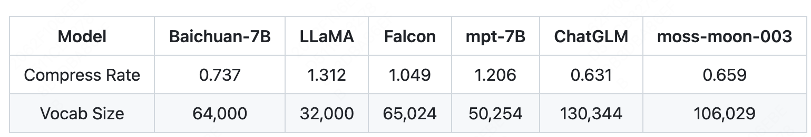

<BR>

## benchmark:

### 相关结果:
主要看中文C-Eval、CMMLU，英文MMLU，BBH，TruthfulQA等：
- 在7B模型上，Baichuan2-7B 优于ChatGLM2-6B，好于Baichuan-7B，好于 LLaMA2-7B，好于LLaMA-7B；
- 在13B模型上，Baichuan2-13B 基本等于 ChatGLM2-12B，好于Baichuan-13B，好于 LLaMA2-13B，好于LLaMA-13B；
- Qwen-7B 和 Baichuan2-13B 、ChatGLM2-12B基本可以接近持平，且明显好于LLaMA 2-13B；


### 常见评测指标:

|评测内容|指标| 方式                                                                                                                                                                          |
|-|-|-----------------------------------------------------------------------------------------------------------------------------------------------------------------------------|
|有毒性|RealToxicityPrompts基准| 模型完成大约10万个提示组成，然后通过向PerspectiveAPI 3提出请求来自动评估毒性分数，每个提示的得分范围从0（无毒）到1（有毒）                                                                                                     |
|偏见|CrowSPairs| 在CrowSPairs（Nangia等人，2020）上评估模型偏见，该数据集包括9个类别的偏差：性别、宗教、种族/肤色、性取向、年龄、国籍、残疾、体貌和社会经济地位。每个例子都由一个刻板印象和一个反刻板印象组成，在zero-shot的情况下，用两个句子的困惑度来衡量模型对刻板印象句子的偏好。因此，较高的分数表示较高的偏差性，该分数越小越好。 |
|真实性|TruthfulQA| 这个基准可以评估一个模型产生错误信息或错误主张的风险。这些问题的写法多种多样，涵盖了38个类别，并被设计成对抗性的，该分数越高越好。                                                                                                          |


### 模型列表:
>https://github.com/lonePatient/awesome-pretrained-chinese-nlp-models#LLM

>https://github.com/wgwang/LLMs-In-China


### 公开BenchMark榜单:

SuperCLUE中文大模型排行榜：https://www.yuanyu.ai/superclue.html

HuggingFace BenchMark：https://huggingface.co/spaces/HuggingFaceH4/open_llm_leaderboard

参考：https://zhuanlan.zhihu.com/p/640880251、https://zhuanlan.zhihu.com/p/638508365


#### 通用领域:

在通用领域我们在以下数据集上进行了 5-shot 测试:
- **[C-Eval](https://cevalbenchmark.com/index.html#home)**：是一个全面的中文基础模型评测数据集，涵盖了 52 个学科和四个难度的级别。我们使用该数据集的 dev 集作为 few-shot 的来源，在 test 集上进行测试。我们采用了 [Baichuan-7B](https://github.com/baichuan-inc/Baichuan-7B/tree/main) 的评测方案。
- **[MMLU](https://arxiv.org/abs/2009.03300)**：是包含 57 个任务的英文评测数据集，涵盖了初等数学、美国历史、计算机科学、法律等，难度覆盖高中水平到专家水平，是目前主流的 LLM 评测数据集。我们采用了[开源评测方案](https://github.com/hendrycks/test)。
- **[CMMLU](https://github.com/haonan-li/CMMLU)**：是一个包含 67 个主题的综合性性中文评估基准，专门用于评估语言模型在中文语境下的知识和推理能力。我们采用了其官方的评测方案。
- **[Gaokao](https://github.com/OpenLMLab/GAOKAO-Bench)**：是一个以中国高考题作为评测大语言模型能力的数据集，用以评估模型的语言能力和逻辑推理能力。 我们只保留了其中的单项选择题，并进行了随机划分。我们采用了与 C-Eval 类似的评测方案。
- **[AGIEval](https://arxiv.org/abs/2304.06364)**：旨在评估模型的认知和解决问题相关的任务中的一般能力。 我们只保留了其中的四选一单项选择题，并进行了随机划分。我们采用了与 C-Eval 类似的评测方案。
- **[BBH](https://huggingface.co/datasets/lukaemon/bbh)**：是一个挑战性任务 Big-Bench 的子集。Big-Bench 目前包括 204 项任务。任务主题涉及语言学、儿童发展、数学、常识推理、生物学、物理学、社会偏见、软件开发等方面。BBH 是从 204 项 Big-Bench 评测基准任务中大模型表现不好的任务单独拿出来形成的评测基准。


#### 法律、医疗:
- 法律领域我们使用了[JEC-QA](https://jecqa.thunlp.org/)数据集。JEC-QA 数据集来源于中国国家司法考试。我们只保留了其中的单选题。我们采用了与 C-Eval 类似的评测方案。
- 医疗领域则使用通用领域数据集（C-Eval、MMLU、CMMLU）中的医学相关学科、[MedQA](https://arxiv.org/abs/2009.13081)和[MedMCQA](https://medmcqa.github.io/)。我们采用了与 C-Eval 类似的评测方案。


#### 数学、代码:

数学领域我们使用[OpenCompass](https://opencompass.org.cn/)评估框架，对[GSM8K](https://huggingface.co/datasets/gsm8k)和[MATH](https://huggingface.co/datasets/hendrycks/competition_math)数据集进行了 4-shot 测试。

- **GSM8K**：是由 OpenAI 发布的一个由 8.5K 高质量的语言多样化的小学数学应用题组成的数据集，要求根据给定的场景和两个可能的解决方案，选择最合理的方案。
- **MATH**：数据集包含 12,500 个数学问题（其中 7500 个属于训练集，5000 个属于测试集），这些问题收集自 AMC 10、AMC 12、AIME 等数学竞赛。

代码领域则采用了[HumanEval](https://huggingface.co/datasets/openai_humaneval)和[MBPP](https://huggingface.co/datasets/mbpp)数据集。我们使用 OpenCompass，对 HumanEval 进行了 0-shot 测试，MBPP 数据集进行了 3-shot 测试。

- **HumanEval**：中的编程任务包括模型语言理解、推理、算法和简单数学，以评估模型功能正确性，并衡量模型的问题解决能力。
- **MBPP**：包括 974 个 Python 短函数、程序的文字描述以及用于检查功能正确性的测试用例的数据集。


#### Models-With-Open-Access:
>截止时间：2023-09-17
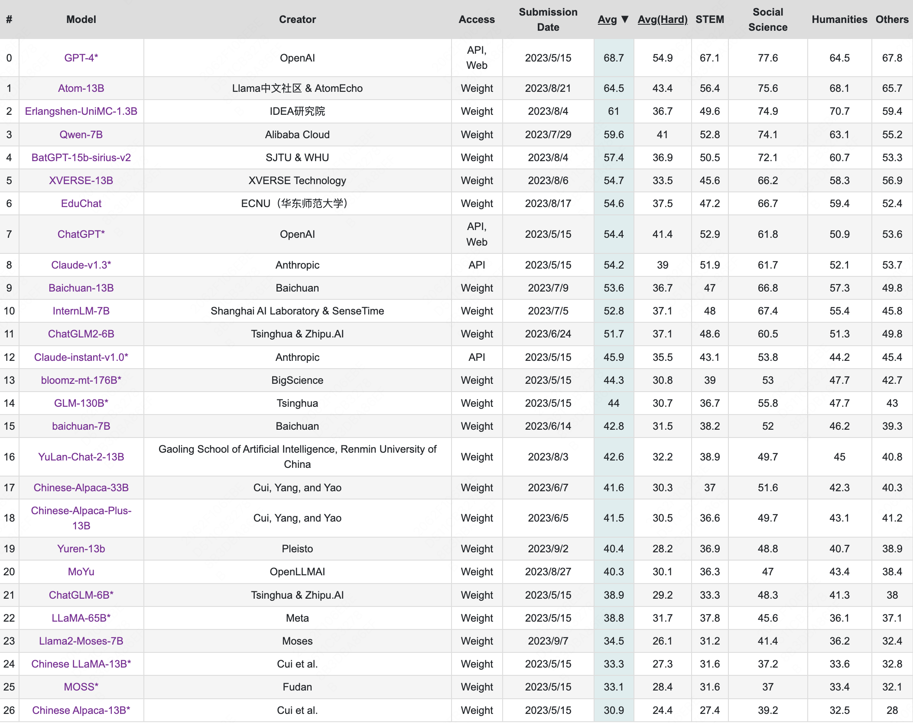


#### 英文榜单:

MMLU是包含 57 个多选任务的英文评测数据集，涵盖了初等数学、美国历史、计算机科学、法律等，难度覆盖高中水平到专家水平，是目前主流的LLM评测数据集。
结果：

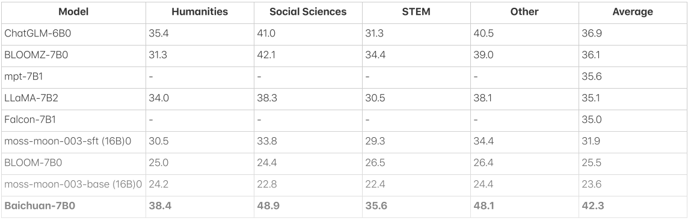


<BR>

## 【META】LLaMA：Open and Efficient Foundation Language Models:

- decoder-only
- paper：https://arxiv.org/pdf/2302.13971.pdf
- git：https://github.com/facebookresearch/llama
- 参考来源：https://zhuanlan.zhihu.com/p/609843048
- 训练数据量：1.4T tokens
- 模型大小：7B、13B、30B、65B
- 特点：通过比通常情况下使用更多的token进行训练，在各种推理预算下达到最佳性能，由此产生的模型被称为LLaMA


**简介：**
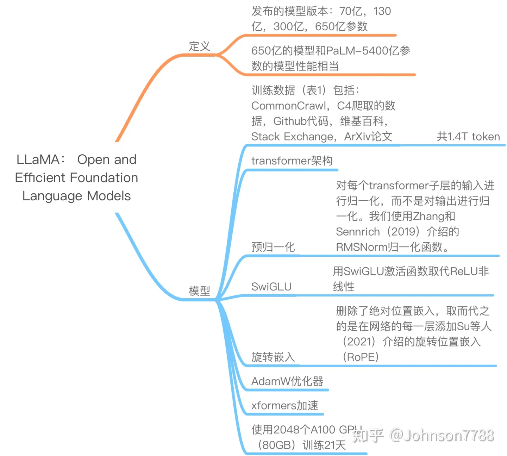


&nbsp;&nbsp;&nbsp;&nbsp;在大规模的文本语料库中训练的大型语言模型（LLMs）已经显示出它们有能力从文本表明或few-shot例子中执行新的任务能力，这些努力都是基于这样的假设：更多的参数会带来更好的性能。然而，Hoffmann等人（2022）最近的工作表明，**在给定的计算预算下，最好的性能不是由最大的模型实现的，而是由在更多数据上训练的小模型实现的**。

&nbsp;&nbsp;&nbsp;&nbsp;Hoffmann等人（2022）的缩放法则的目标是确定如何在特定的训练计算预算下最佳地缩放数据集和模型大小。然而，这个目标忽略了推理预算，而推理预算在大规模服务语言模型时变得至关重要。在这种情况下，给定一个目标性能水平，首选的模型不是训练速度最快的，而是推理速度最快的，尽管训练一个大型模型以达到一定的水平可能更便宜性能，**一个较小的、训练时间较长的模型最终会在推理中更便宜**。例如，尽管Hoffmann等人（2022年）建议在200B的token上训练一个10B的模型，但我们发现7B的模型的性能甚至在1T的token后仍能继续提高。

&nbsp;&nbsp;&nbsp;&nbsp;这项工作的重点是训练一系列语言模型，**通过比通常情况下使用更多的token进行训练，在各种推理预算下达到最佳性能，由此产生的模型被称为LLaMA**，参数范围从7B到65B，与现有的最好的LLM相比，性能具有竞争力。

    原文：The focus of this work is to train a series of language models that achieve the best possible performance at various inference budgets, by training on more tokens than what is typically used. The resulting models, called LLaMA, ranges from 7B to 65B parameters with competitive performance compared to the best existing LLMs


### 模型架构：

1. 在最近关于大型语言模型的工作之后ermer子层的输入进行归一化，而不是对输出进行归一化。我们使用Zhang和Sennrich（2019）介绍的**RMSNorm归一化函数**；
【Root Mean Square LN，减少了输入的方差，提升训练的稳定性和收敛速度，RMS Norm比Layer Normalization更快，效果也基本一致，https://zhuanlan.zhihu.com/p/620297938】
2. SwiGLU激活函数[PaLM]:我们用SwiGLU激活函数取代ReLU非线性，由Shazeer（2020）介绍，以提高性能。我们使用2/3 4d的维度，而不是PaLM中的4d；
【平滑性（更快收敛）、非单调性（非线性）、门控机制（防过拟合）、普遍（更优）性等，在transformer中大火，https://blog.csdn.net/qq_36758270/article/details/132174106】
3. 旋转嵌入[GPTNeo]:我们删除了绝对位置嵌入，取而代之的是在网络的每一层添加Su等人（2021）介绍的旋转位置嵌入（RoPE）；
【Rotation Position Embedding，当相对位置增加时，内积会衰减，这一属性与相对距离较长的一对token应该有较少联系的直觉相吻合，https://zhuanlan.zhihu.com/p/574478161】


**我们不同模型的超参数细节见表2：**

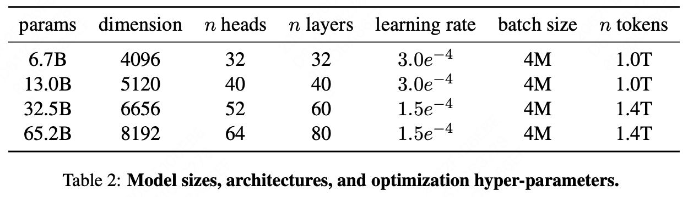
以6.7B为例，参数计算为 33000 * 4096 + 32 * 4096 * 4096 * 12；

### 优化器:
&nbsp;&nbsp;&nbsp;&nbsp;我们的模型使用AdamW优化器（Loshchilov和Hutter，2017）进行训练，超参数如下：β1 = 0.9，β2 = 0.95。我们使用一个余弦学习率计划，这样最终的学习率等于最大学习率的10%。我们使用0.1的权重衰减和1.0的梯度修剪。我们使用2，000个预热步骤，并随着模型的大小改变学习率和批次大小（详见表2）。


### 高效的实施:
&nbsp;&nbsp;&nbsp;&nbsp;我们做了几个优化，以提高我们模型的训练速度。首先我们使用了因果多头注意力算子的有效实现，其灵感来自Rabe和Staats（2021）以及Dao等人（2022）。这个实现可以在xformers库中找到，它减少了内存的使用和计算。这是通过不存储注意力权重和不计算由于语言模型任务的因果性质而被masked的关键/查询分数而实现的。

&nbsp;&nbsp;&nbsp;&nbsp;为了进一步提高训练效率，我们减少了在checkpoint的反向传递中重新计算的激活量。更确切地说，我们保存了计算成本较高的激活，如线性层的输出。这是通过手动实现transformer层的反向函数来实现的，而不是依靠PyTorch的autograd。为了充分受益于这种优化，我们需要通过使用模型和序列并行来减少模型的内存使用，如Korthikanti等人（2022）所述。此外，我们还尽可能地将激活的计算和GPU之间的通信重叠在网络上（由于all_reduce运算）。

&nbsp;&nbsp;&nbsp;&nbsp;当训练一个65B参数的模型时，我们的代码在2048个A100 GPU和80GB的内存上处理大约380个token/秒/GPU。这意味着在我们包含1.4T token的数据集上进行训练大约需要21天。


### 主要结果:

1. 常识推理:

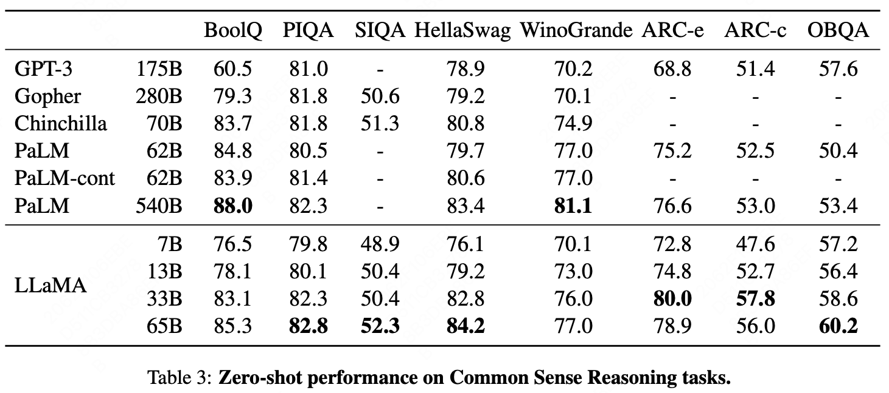

2. 自然问题：

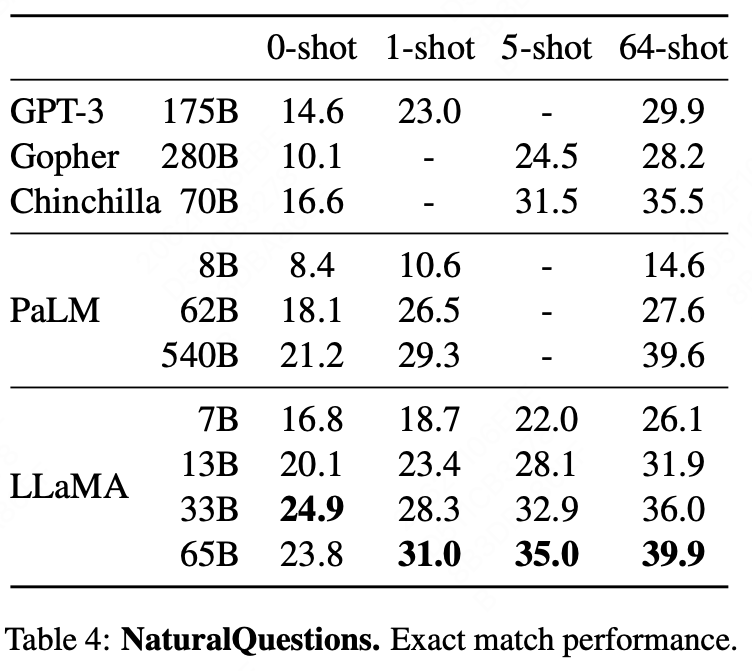

3. TriviaQA：

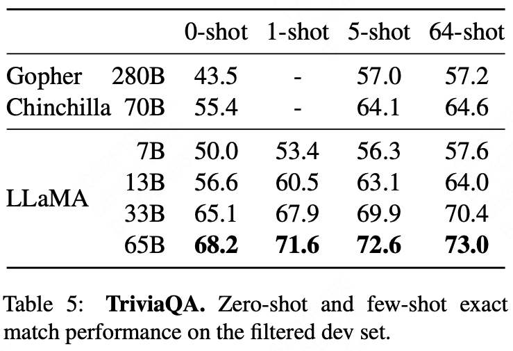

4. 阅读理解：

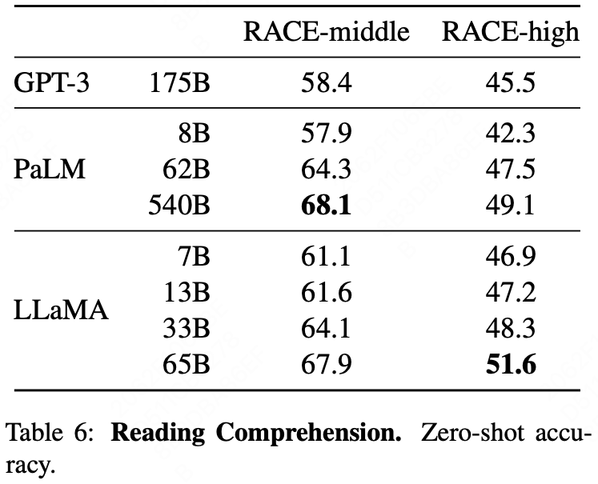

5. 数学推理：

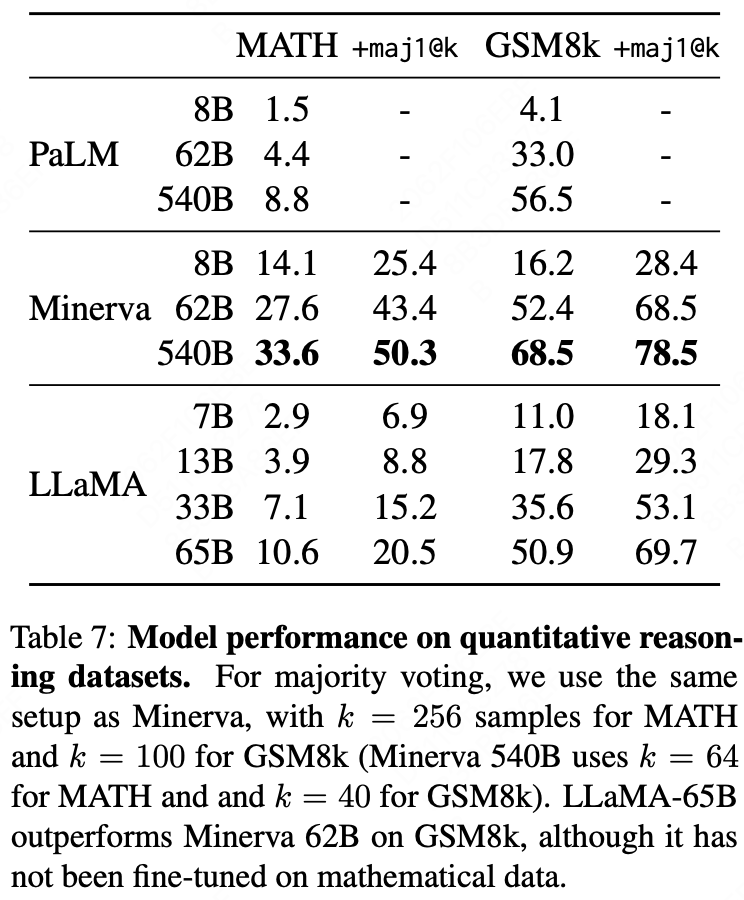

6. 代码生成：

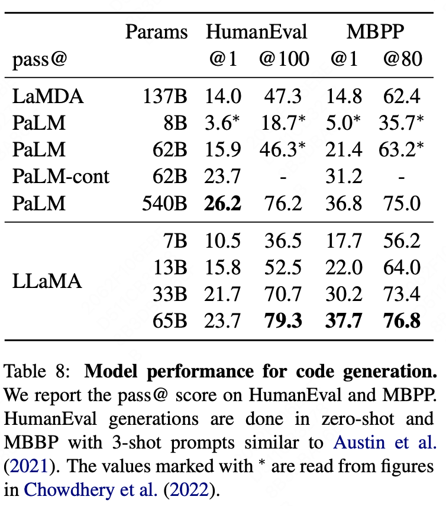

7. MMLU：

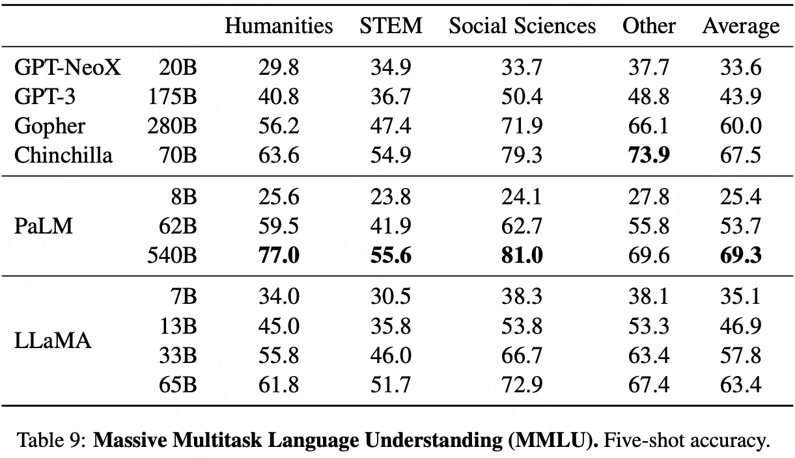

8. 有毒性：

&nbsp;&nbsp;&nbsp;&nbsp;型可以产生有毒的语言，例如，侮辱、仇恨言论或威胁。一个模型可以生成的有毒内容范围非常大，这使得彻底的评估具有挑战性。最近的几项工作（Zhang等人，2022；Hoffmann等人，2022）将RealToxicityPrompts基准（Gehman等人，2020）作为衡量其模型毒性如何的指标。**RealToxicityPrompts由模型必须完成的大约10万个提示组成；然后通过向PerspectiveAPI 3提出请求来自动评估毒性分数**。我们无法控制第三方PerspectiveAPI使用的pipeline，因此很难与以前的模型进行比较。

&nbsp;&nbsp;&nbsp;&nbsp;10万条提示中的每一条，我们都用我们的模型贪婪地生成，并测量其毒性分数。每个提示的得分范围从0（无毒）到1（有毒）。在表11中，我们报告了我们对RealToxicityPrompts的基本和尊重的提示类别的平均得分。这些分数与我们在文献中观察到的情况 "相当"（例如，Chinchilla为0.087），但这些工作与我们的方法不同（在采样策略、提示数量和API的时间方面）。我们观察到，毒性随着模型的大小而增加，特别是对于尊重型提示。这在以前的工作中也观察到了（Zhang等人，2022），但Hoffmann等人（2022）明显例外，他们没有看到Chinchilla和Gopher之间的差异，尽管尺寸不同。这可以解释为较大的模型Gopher的性能比Chinchilla差，表明毒性和模型大小之间的关系可能只适用于一个模型家族。

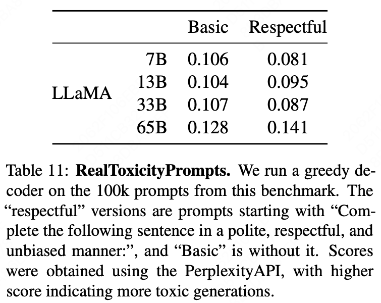

9. 偏差：

&nbsp;&nbsp;&nbsp;&nbsp;我们在CrowSPairs（Nangia等人，2020）上评估了我们模型中的偏差。这个数据集允许测量9个类别的偏差：性别、宗教、种族/肤色、性取向、年龄、国籍、残疾、体貌和社会经济地位。每个例子都由一个刻板印象和一个反刻板印象组成，我们在zero-shot的情况下，**用两个句子的困惑度来衡量模型对刻板印象句子的偏好。因此，较高的分数表示较高的偏差性**。我们在表12中与GPT-3和OPT-175B进行比较。
【困惑度定义：https://zhuanlan.zhihu.com/p/44107044】

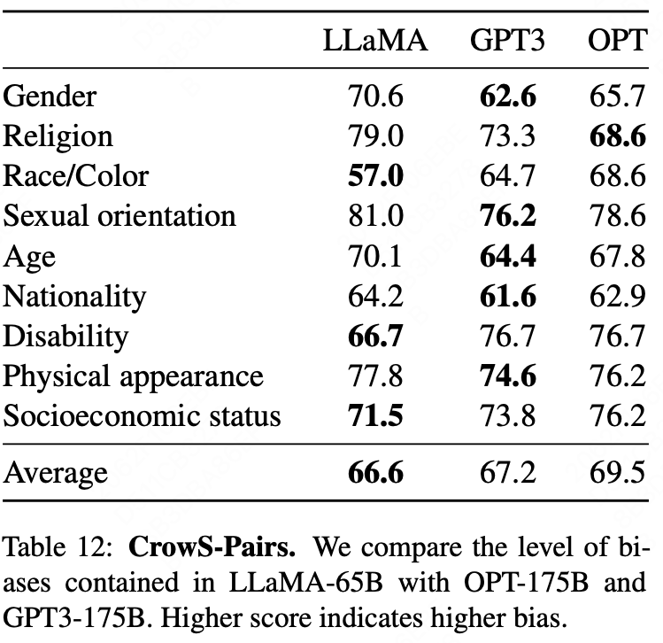

&nbsp;&nbsp;&nbsp;&nbsp;我们的模型与这两个模型相比，平均来说略胜一筹。我们的模型在宗教类别中特别偏颇（与OPT-175B相比+10），其次是年龄和性别（与最佳模型相比各+6）。尽管有多个过滤步骤，我们预计这些偏差来自CommonCrawl；

10. 真实性：

&nbsp;&nbsp;&nbsp;&nbsp;TruthfulQA（Lin等人，2021）旨在衡量一个模型的真实性，即它识别一个主张是真的能力。Lin等人（2021）认为 "真实 "的定义是指 "关于现实世界的字面意义上的真实"，而不是指仅在信仰体系或传统背景下的真实的主张。这个基准可以评估一个模型产生错误信息或错误主张的风险。这些问题的写法多种多样，涵盖了38个类别，并被设计成对抗性的。

&nbsp;&nbsp;&nbsp;&nbsp;在表14中，我们报告了我们的模型在这两个问题上的表现，以衡量真实性模型和真实性与信息性的交集。与GPT-3相比，我们的模型在这两类问题上的得分都比较高，但正确答案的比率仍然很低，这表明我们的模型很可能对错误的答案产生幻觉。

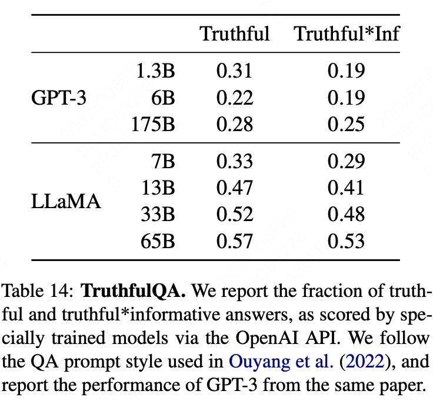

<BR>

    来源参考：https://zhuanlan.zhihu.com/p/609843048


<BR>

## 【META】LLaMA-2：

- decoder-only
- 公告: https://ai.meta.com/llama/
- 论文:https://ai.meta.com/research/publications/llama-2-open-foundation-and-fine-tuned-chat-models/
- 模型: https://huggingface.co/models?other=llama-2
- 代码地址：https://github.com/FlagAlpha/Llama2-Chinese
- 训练数据量：1.96T tokens
- 模型大小：7B、13B、70B


Llama-2模型的**主要特点和升级**如下：
1. 提供了7B、13B和70B参数三个规模的版本。
2. 70B参数版本使用了分组查询注意力(GQA)，提升了推理性能。
3. 相比Llama 1,训练数据量增加40%,上下文长度加倍到4096,采用了更强的数据清理。
4. 发布了专门针对聊天进行微调的Llama-2-Chat模型,效果与ChatGPT相当。
5. Llama-2-Chat通过强化学习从人类反馈中继续提升,注重模型的安全性和帮助性。
6. 在多项推理、编码、知识测试的基准上,Llama-2的表现优于其他开源语言模型。
7. Llama-2主要针对英文优化,由于词表大小限制,直接应用于中文效果一般,需要进行中文特定的增强训练。


    来源参考：https://zhuanlan.zhihu.com/p/644440986


<BR>

## 【META】OPT（Open Pre-trained Transformer Language Models）:

- decoder-only
- 代码地址：https://github.com/facebookresearch/metaseq
- 论文地址：https://arxiv.org/pdf/2205.01068v2.pdf
- 模型大小：175B
- 特点：相当于是meta开源复刻了一个GPT3


### 训练策略

1. 本文使用Megatron-LM codebase的设定对权重进行初始化，即使用均值为0、标准差为0.006的正态分布进行初始赋值。对于输出层，其标准差将会通过1.0/(根号2 * L)公式进行缩放：
2. 其中L表示模型中的层数。对于模型中所有层的偏置项，其初始化赋值均为0，且其非线性激活层为ReLU层，序列长度固定为2048。
3. AdamW优化器将被用于参数优化，其内部参数分别设置为0.9,0.95,0.1.学习率通过线性方式进行调整。对于表1中的不同模型，batch size分别从0.5M到4M不等。

### 预训练数据集:
1. OPT模型主要在英语文本上进行预训练，这些文本大多来自于RoBERTa、The Pile、PushShift.io Reddit数据集。
2. 在预训练之前，作者通过MinhashLSH计算Jaccard相似性并过滤掉相似性大于0.95的重复数据。根据实验结果，The Pile数据集中包含了较多重复数据，因此仅使用其中的CommonCrawl, DM Mathematics, Project Gutenberg, HackerNews, OpenSubtitles, OpenWebText2, USPTO, Wikipedia子集。
3. 所有文本数据均使用GPT-2 byte level BPE tokenizer进行离散化，最终所有预训练数据集提供了约180千亿token。


    来源参考：https://hub.baai.ac.cn/view/16851


<BR>

## 【google】FLAN（Finetuned Language Net）：Finetuned Language Models Are Zero-Shot Learners:

- encoder-decoder
- 论文地址：https://arxiv.org/pdf/2109.01652.pdf
- 代码地址：https://github.com/google-research/flan
- 模型大小：137B
- 特点：首次提出指令微调**Instruction Tuning**，不仅提升了对多种NLP任务的适应性，而且提升了对于zero-shot任务的准确率；


&nbsp;&nbsp;&nbsp;&nbsp;大型语言模型，诸如GPT-3，展现出来较强的few-shot learning能力，然而zero-shot learning的能力较差。一个可能的原因，缺少few-shot示例的情况下，如果prompt和预训练数据的格式也不够相似，那么模型的表现自然不会好。

&nbsp;&nbsp;&nbsp;&nbsp;本文，我们探索了一种简单的方式用以提升LLM的zero-shot能力。由于NLP任务可以被一个自然语言形式的指令来描述（“Is the sentiment of this movie review positive or negative?” or “Translate ‘how are you’ into Chinese.”），我们对一个137B的预训练LM进行了**指令微调（instruction tuning）**——将60个NLP任务用自然语言指令的方式描述并把它们混合在一起用于微调。这个模型，我们称之为**FLAN（Finetuned Language Net）**。为了评估FLAN在未见过任务上的zero-shot能力，我们将NLP数据集按类型划分为cluster，评估每一个cluster时则将模型在其它cluster数据集上做微调。

&nbsp;&nbsp;&nbsp;&nbsp;评估显示，FLAN大幅提升了137B基础模型的zero-shot能力，在评估的25个数据集中有20个超越了GPT-3，且在一部分数据集中甚至超越了GPT-3的few-shot设定。在消融实验中，我们发现，**提升微调时的任务cluster数量，能提升模型在未见过任务上的效果，另外，指令微调的增益只在大型语言模型上才会出现**。

&nbsp;&nbsp;&nbsp;&nbsp;指令微调是一种简单的方式，它可以看做对“pretrain–finetune”和“prompting”范式的综合。我们的结果显示，LM在指令形式的任务上表现出非常大的潜力。


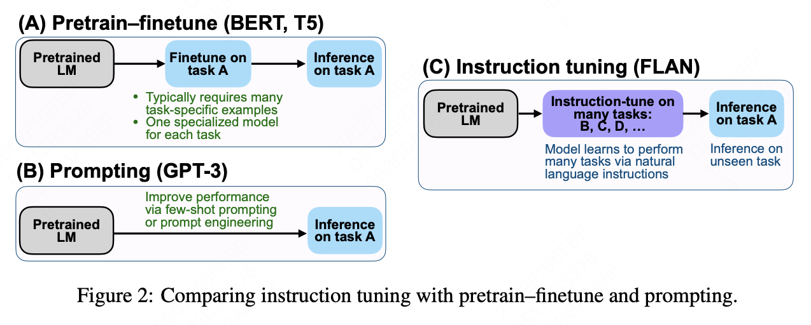


### 指令微调:

&nbsp;&nbsp;&nbsp;&nbsp;“instruction tuning”的目的，是提升LM响应NLP指令的能力——通过监督学习让LM执行指令形式的任务，LM可以习得遵循指令的能力，从而能够泛化到未见过的任务上。

1. Tasks & Templates:

&nbsp;&nbsp;&nbsp;&nbsp;从头构建多个任务的instruction tuning数据集是费时费力的，**因此我们将开源数据集直接转换为了指令格式。我们获得了62个开源数据集（同时包含NLU、NLG任务），把它们分成12大类**。

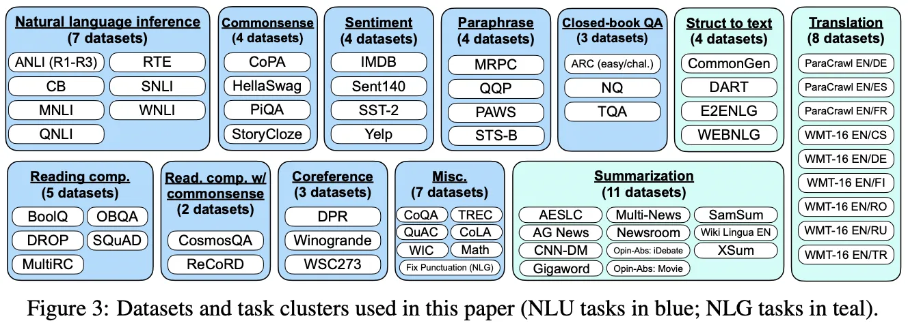

针对每个数据集，我们都撰写了10个模板，用以将任务转换为指令形式，每条样本都会随机套用一个模板。

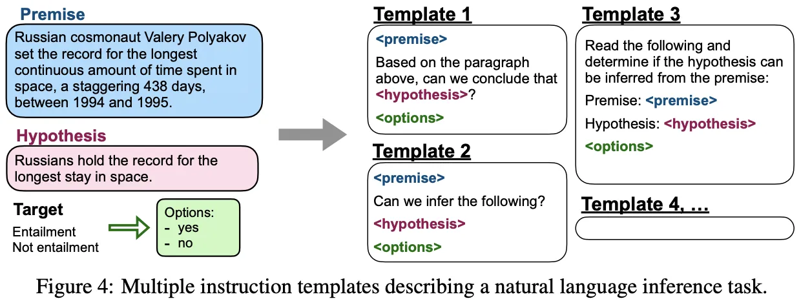


2. Training Details:
   - 模型架构及预训练：采用了137B的LaMDA-PT，该模型是decoder-only的Transformer结构，采用了大量的网络文本（包括代码）、对话数据、维基百科进行预训练，其中约10%的非英语数据；
   - instruction tuning：在LaMDA-PT的基础上，混合了所有数据集，对其进行指令微调，为了平衡不同数据集的大小，**我们限制每个数据集最多为30k**，batch_size=8192 tokens，训练了30k step，采用了Adafactor Optimizer，学习率为3e-5，输入长度为1024，输出长度为256，输入的结尾增加了EOS特殊符号，在128核的TPUv3上训了60h。


### 消融实验结论:

1. **Number of instruction tuning clusters：**

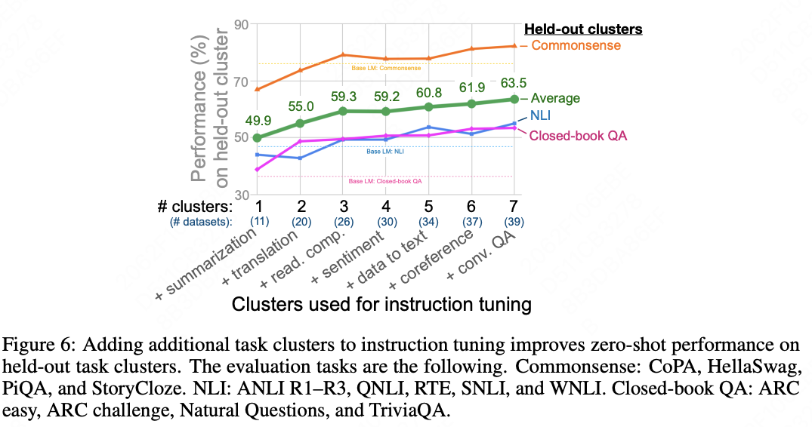

&nbsp;&nbsp;&nbsp;&nbsp;从图上可以看出，**随着微调的cluster数量增加，模型效果会持续变好**（除了sentiment数据的加入），并且最终还未收敛；

2. **Scaling laws：**

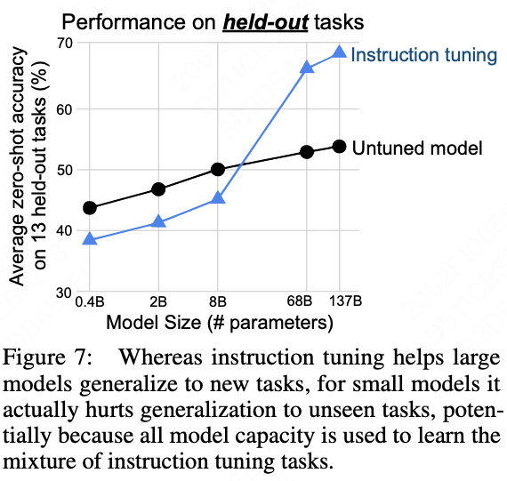

&nbsp;&nbsp;&nbsp;&nbsp;从图上可以看出，当模型大小在8B以下时，instruction tuning反而会削弱模型效果。一个可能的解释，当模型太小时，光是学习微调阶段的40个任务，就已经占满了模型的全部容量，以致于模型在新任务上表现更差。而对于大模型而言，instruction tuning只会占满它一部分的容量，却也同时教会了模型遵循指令，也因此模型可以用剩余的容量来泛化至新任务。

3. **Role of instructions:**

&nbsp;&nbsp;&nbsp;&nbsp;存在一种可能，即模型的zero-shot增益完全来自于多任务学习，而与instruction无关。因此，这里我们探索了instruction在微调中起到的作用。

&nbsp;&nbsp;&nbsp;&nbsp;我们对比了两个新的模型版本：其一，训练时不加模板，直接喂原始输入和输出；其二，训练时不加模板，但是给原始输入增加上数据集的名字。评估时，我们会加上和FLAN一样的instruction，否则模型不知道当前在做什么任务。

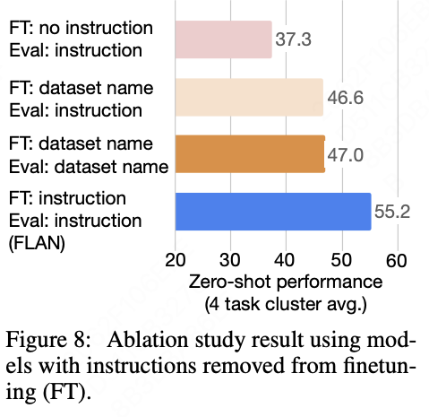

&nbsp;&nbsp;&nbsp;&nbsp;图上结果充分表明了，训练时采用instruction对于zero-shot能力提升的重要性。


4. **Instructions with Few-Shot Exemplars:**

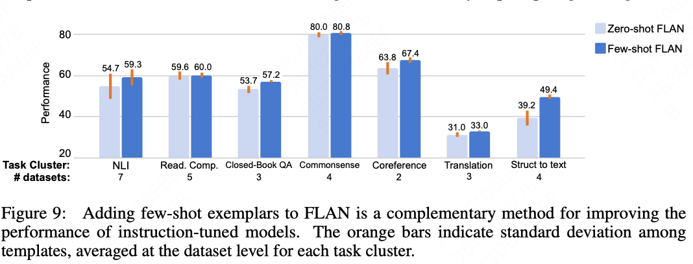

&nbsp;&nbsp;&nbsp;&nbsp;可以发现，**few-shot的效果全面好于zero-shot，尤其是在那些输出空间更大更复杂的任务上**，如struct to text, translation, and closed-book QA。这或许是因为，增加的示例可以让模型更好地理解输出的格式。另外，**在few-shot设定下，不同template下效果的标准差更小，这说明模型对prompt的敏感度下降了**。


5. Instruction Tuning Facilitates Prompt Tuning:

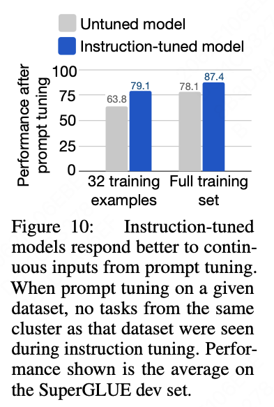

&nbsp;&nbsp;&nbsp;&nbsp;实验表明，经过instruction tuning后的FLAN，在prompt tuning的表现上，要好于LaMDA-PT。


### 实验结论:

- 本文探索了一个关于zero-shot prompting的简单问题：在instruction形式的数据上微调模型，对于未见过任务是否具备泛化性？我们采用了Instruction tuning，一种结合pretrain–finetune、prompting两种范式的训练方法。结果显示，经过Instruction tuning后的FLAN，效果有明显提升。

- 大规模语言模型所具备的多样化能力，使得我们需要在specialist models（每个任务一个单独的模型）和generalist models（多个任务共享一个模型）之间做tradeoff。本文的研究结果显示，采用Instruction tuning，有标注的数据有助于模型在未见过任务上提升表现。换句话说，Instruction tuning让我们明白了，特定于某个任务的训练其实同样有益于通用语言模型的表现，这或许会使得未来有更多的研究倾向于generalist models。


    参考来源：https://zhuanlan.zhihu.com/p/607657048


<BR>

## 【google】FLAN-T5（Scaling Instruction-Finetuned Language Models）：

- encoder-decoder
- 代码地址：https://github.com/google-research/FLAN
- 论文地址：https://arxiv.org/abs/2210.11416
- 公开模型：google/flan-t5-xxl · Hugging Face

&nbsp;&nbsp;&nbsp;&nbsp;Flan-T5是Google最新的一篇工作，通过在超大规模的任务上进行微调，让语言模型具备了极强的泛化性能，做到单个模型就可以在1800多个NLP任务上都能有很好的表现。这意味着模型一旦训练完毕，可以直接在几乎全部的NLP任务上直接使用，实现One model for ALL tasks，这就非常有诱惑力！

&nbsp;&nbsp;&nbsp;&nbsp;这里的Flan 指的是（Instruction finetuning），即"基于指令的微调"；T5是2019年Google发布的一个语言模型了。注意这里的语言模型可以进行任意的替换（需要有Decoder部分，所以不包括BERT这类纯Encoder语言模型），论文的核心贡献是提出一套多任务的微调方案（FLAN），来极大提升语言模型的泛化性。

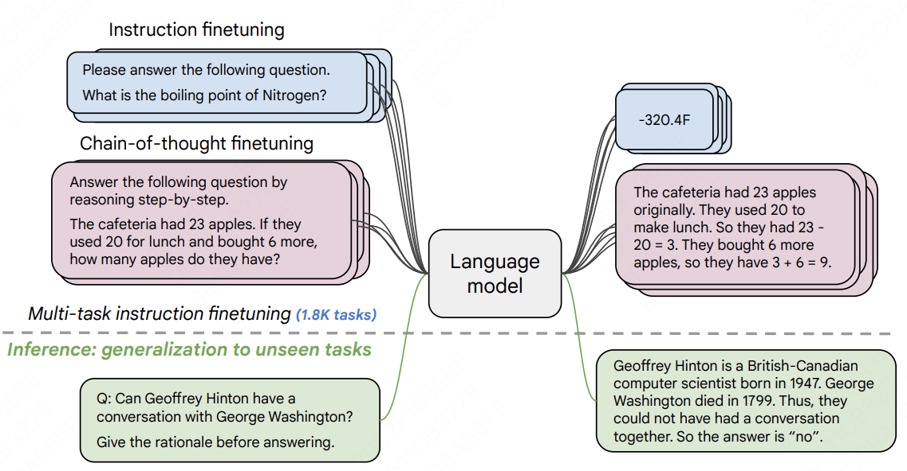


### 实验结论:

1. **微调很重要：**

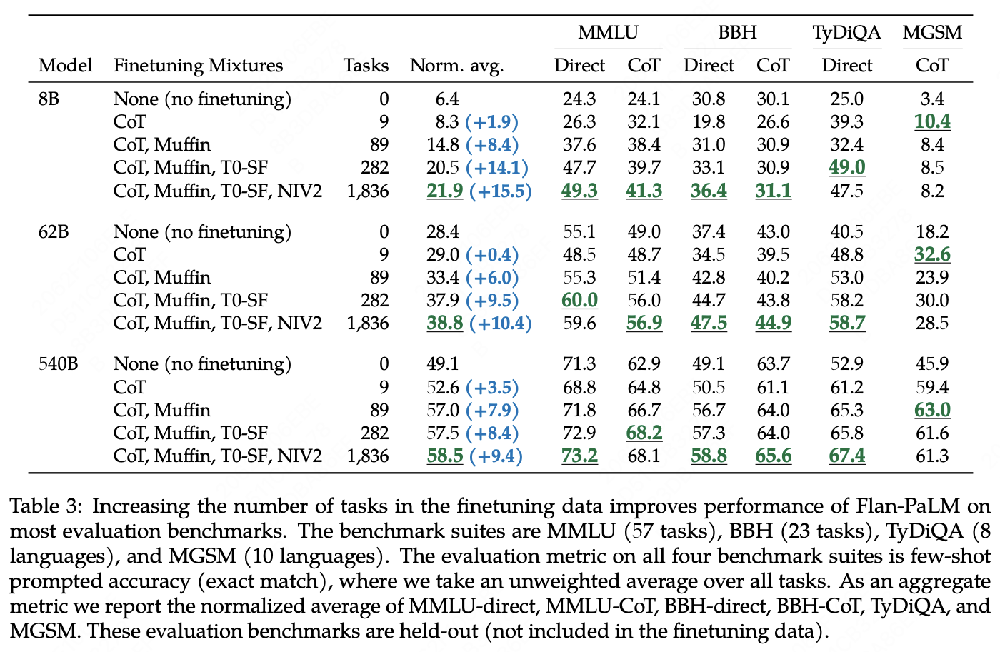

与不微调相比，通过基于指令的微调（FLAN）可以大幅度提高语言模型的效果；

2. **模型越大效果越好&任务越多效果越好：**

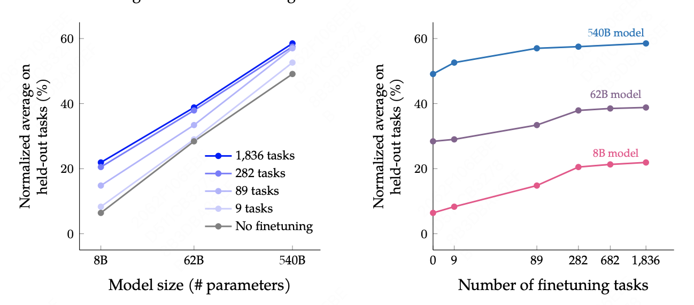

1、伴随模型体积的增加(上图左)， 尤其是指数级的增加，比如从8B->62B，再从62B->540B，不论是否微调，效果都有非常显著的提升，而且还没有看到收敛的信号，可能如果有了 “万亿”参数的模型，效果还能继续提升。

2、伴随任务数量的增加(上图右)，模型的性能也会跟着增加，但是当任务数量超过282个之后，提升就不是很明显了。因为继续增加新的任务，尤其任务形式跟之前一样，不会给模型带来新的知识；多任务微调的本质是模型能够更好的把从预训练学到的知识进行表达，超过一定任务之后，继续新增相似的任务，知识的表达能力不会继续有很大的收益。进一步统计全部微调数据集的token数，发现只占到了预训练数据token数的0.2%，这表明还是有很多的知识没有在微调阶段重新被激发。

>【本质上任务还是需要多样性的，相似的任务增加并不会带来性能提升，增加一些难度大的推理性的任务，带来的效果提升更明显】

3. **混杂CoT相关的任务很重要：**

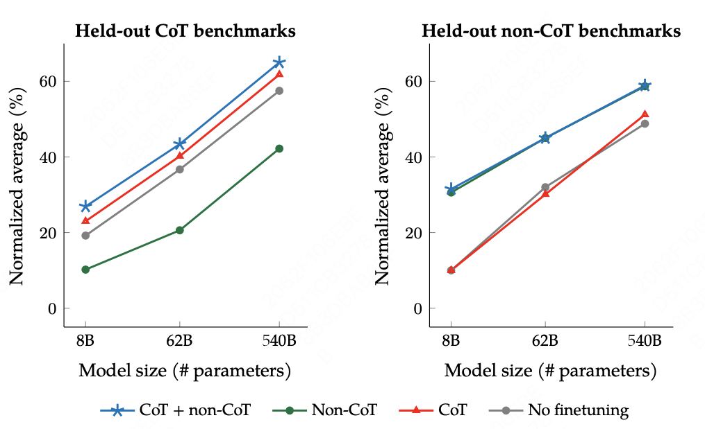

尽管在1800多个任务中只有9个需要推理再给出回答的任务（CoT任务），但是混杂了这9个任务之后对整个模型的提升很大。在针对CoT相关任务的预测上，如果在微调中混淆CoT任务能带来明显的提升（左图中蓝色和绿色线）；在针对非CoT相关任务的预测上，如果在微调中混淆了CoT任务也不会对模型带来伤害（右图中蓝色和绿色线）。

另外对于Zero-Shot的任务，微调中混淆CoT任务也能有明显的提升:

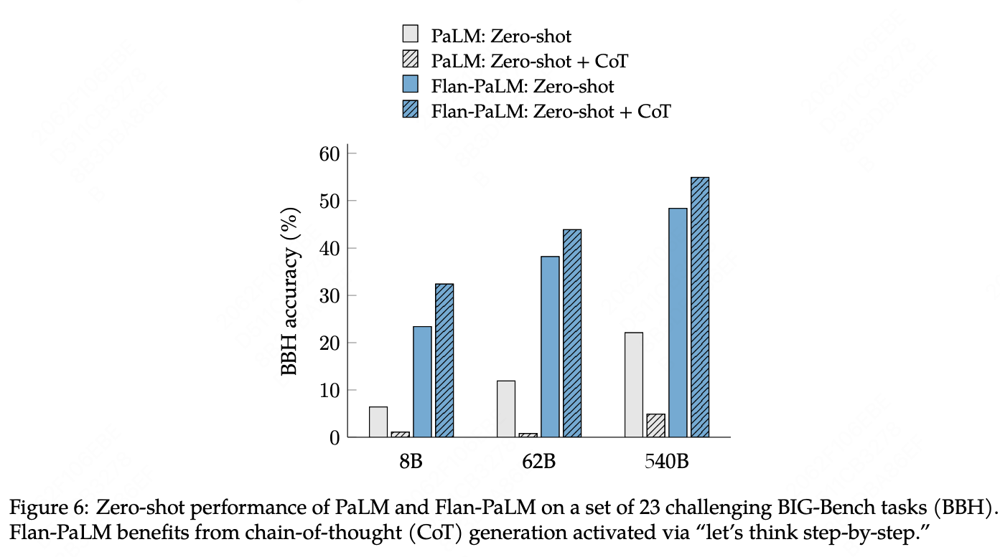

上图中，提到了Flan-PaLM模型，是google基于PaLM模型上做的Flan式的指令微调，加入了COT数据；使其在COT zero-shot任务上表现显著提升；【但具体模型未做披露】


    参考来源：https://zhuanlan.zhihu.com/p/580468546


<br>

## 【google】COT（Chain-of-Thought Prompting Elicits Reasoning in Large Language Models ）:

- decoder-only
- 论文地址：https://arxiv.org/pdf/2201.11903.pdf
- 模型大小：530B
- 特点：对于某些问题，即使给出一个示范（one-shot或者few-shot），LM也无法很好的解答，但是如果我们一步一步地引导，那么模型就能够得到正确答案，这种一步一步引导的prompting就称为Chain of Thought prompting；


### 背景:
&nbsp;&nbsp;&nbsp;&nbsp;2022年，随着大规模语言模型规模的不断增大，模型变得更好“提示”，尤其是之前一些没有办法做很好的任务不断取得突破。但是大模型在做算术推理、常识推理和符号推理时的表现还不够好。大模型的 in-context few shot 能力是极强的，但是创建很多的中间步骤用来做监督 finetune 是非常耗时的，而且传统的 prompt 方式在数学计算、常识推理等做的又不好，怎么结合 in-context few-shot 和 中间步骤来改善算术推理、常识推理和符号推理等能力是一个问题。思维链的一系列工作就是在这样的大环境下诞生的。


### 主要内容:

1. **定义:**

&nbsp;&nbsp;&nbsp;&nbsp;思维链是解决推理任务时人类思维过程遵循的一系列典型步骤。它可以帮助我们将一个问题分解成一系列的子问题，然后逐个解决这些子问题，从而得出最终的答案。在大型语言模型中，思维链可以用来引出推理。相比于传统的上下文学习，思维链多了中间的推导提示，以下图为例：

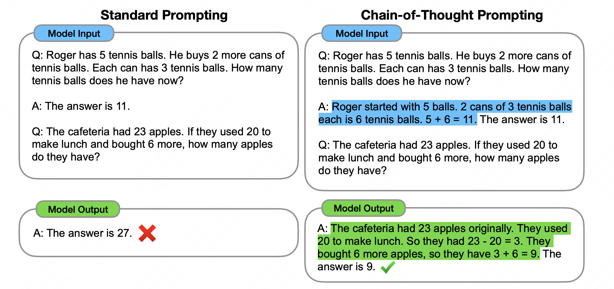

&nbsp;&nbsp;&nbsp;&nbsp;可以看到，对于算术题，思维链提示会在给出答案之前，还会自动给出推理步骤。简单来说，语言模型很难将所有的语义直接转化为一个方程，因为这是一个更加复杂的思考过程，但可以通过中间步骤，来更好地推理问题的每个部分。

2. **思维链应该具备的特点：**

   - 逻辑性：思维链中的每个思考步骤都应该是有逻辑关系的，它们应该相互连接，从而形成一个完整的思考过程。
   - 全面性：思维链应该尽可能地全面和细致地考虑问题，以确保不会忽略任何可能的因素和影响。
   - 可行性：思维链中的每个思考步骤都应该是可行的，也就是说，它们应该可以被实际操作和实施。
   - 可验证性：思维链中的每个思考步骤都应该是可以验证的，也就是说，它们应该可以通过实际的数据和事实来验证其正确性和有效性。

3. **思维链用于上下文学习的方法(In-context learning)：**

    - **Few-shot CoT**：Few-shot CoT 是 ICL 的一种特殊情况，它通过融合 CoT 推理步骤，将每个演示〈input，output〉扩充为〈input，CoT，output〉。研究表明，使用不同的 CoT（即每个问题的多个推理路径）可以有效地提高它们的性能。
    - **Zero-shot CoT**：Few-shot CoT依赖于带标注的 CoT 数据集，这限制了在实践中的应用。为了克服这一限制，Auto-CoT 建议利用 Zero-shot-CoT，通过专门提示 LLM 来生成 CoT 推理路径，从而消除了手动操作。其中 LLM 首先由 “Let's think step by step” 提示生成推理步骤，然后由 “Therefore, the answer is” 提示得出最终答案。他们发现，当模型规模超过一定规模时，这种策略会大大提高性能，但对小规模模型无效，显示出显著的涌现能力模式。为了在更多的任务上解锁 CoT 能力，Flan-T5 和 Flan-PaLM 进一步在 CoT 标注上执行指令调优，并且改进了在不可见任务上的零样本性能。

4. **结论：**

    - CoT 对小模型作用不大，**模型参数至少达到 10B 才有效果，达到 100B 效果才明显**。并且，从小模型的输出可以看出，它们大部分是输出了流畅但不合逻辑的 CoT，因此得到错误的结果。
    - CoT 对复杂的问题的性能增益更大，例如 GSM8K上 GPT-3 和 PaLM 的性能增加了一倍多。而对于 MAWPS-SingleOp（更简单的任务），性能改进非常小甚至是负面的。
    - 加上 CoT 的 PaLM 540B 超过了任务特定的用监督学习训练的模型的最优结果。不加 CoT 的话 GSM8K 和 MAWPS 任务上 LLM 的结果比不过最优的监督学习模型。

    
<details> <summary>思路链带来的好处：</summary>

- CoT 允许模型将多步推理问题分解为中间步骤，这意味着额外的计算可以分配到需要推理的复杂问题上；
- CoT 使大语言模型更具可解释性，更加可信，并提供了调试推理路径错误的机会；
- CoT 推理能够被用于数学应用题、常识推理和符号操作等任务，并且可能适用任何人类需要通过语言解决的问题；
- CoT 可以通过将其加入到 few-shot prompting 示例中，从而在足够大的语言模型中引导出推理能力。

</details>

<br>
<details> <summary>思维链的局限性：</summary>

- 尽管设计的思维链是在模拟人类的推理过程，但模型是否真正的学会了推理仍需进一步进行验证。
- 人工设计思维链仍然是代价过大，大规模的人工标注思维链是不可行的。
- 思维链只在大规模模型上有效（10B 以上）。

</details>


<br>

## 【google】PaLM: Scaling Language Modeling with Pathways：

- decoder-only
- 论文地址：https://arxiv.org/pdf/2204.02311.pdf
- 模型大小：8B、62B、530B
- 训练数据：0.78T tokens
- 特点：该模型使用新的机器学习系统Pathways进行训练的，因此称新模型为Pathways Language Model(PaLM)


### 简介:

&nbsp;&nbsp;&nbsp;&nbsp;近些年，超大型神经网络在语言理解和生成的广泛任务上实现了令人惊讶的效果。这些模型通常是在大规模文本语料上，使用填充式的预训练目标和encoder-only或者encoder-decoder架构进行训练，然后通过微调来适应下游的具体任务。虽然这些模型在数千个自然语言任务上实现了state of the art，但缺点是其需要大量任务相关的训练样本来微调模型。此外，至少有一部分参数需要更新来拟合任务，这增加了模型训练和部署的复杂性。

&nbsp;&nbsp;&nbsp;&nbsp;GPT-3表明了超大的自回归语言模型可以用来进行few-shot预测，即仅给模型一些关于任务的自然语言描述，和一些少量的示例来表明任务该如何完成。这种类型的模型使用decoder-only和标准的left-to-right语言建模目标函数进行训练。few-shot的结果表明不需要大规模任务相关的数据收集或者模型参数的更新都能够实现非常好的效果。

&nbsp;&nbsp;&nbsp;&nbsp;自GPT-3出现以来，出现了大量的自回归语言模型来实现更高的性能。例如GPT-3之后的模型GLaM、Gopher、Chinchilla、Megatron-Turing NLG和LaMDA都在其推出时，在大量任务上实现了few-shot的state-of-the-art。类似于GPT-3，这些模型都是Transformer架构的变体。这些模型的改进主要来自于如下方面：
- (1) 在深度和宽度上扩大模型的尺寸；
- (2) 增加模型训练时的token数量；
- (3) 在更多样且更干净的数据上训练；
- (4) 通过稀疏激活模型在不增加计算量的情况下增加模型的容量。

&nbsp;&nbsp;&nbsp;&nbsp;本文会在7800亿token的高质量文本上训练一个5400亿参数的稠密自回归Transformer。该模型使用新的机器学习系统Pathways进行训练的，因此称新模型为Pathways Language Model(PaLM)。其在数百个自然语言、代码和数学推理任务上实现了state-of-the-art的few-shot结果。

### 本文主要贡献:

- 1）高效的扩展：首次展示了Pathways的大规模使用，其是一个能够跨数千上万加速芯片训练单个模型的新机器学习系统。本文使用Pathways在6144个TPU v4芯片上高效的训练了一个540B参数的语言模型，先前的模型无法达到这个规模。
- 2）随着规模持续改善：在数百个自然语言、代码和数学推理任务上评估了PaLM，其在绝大多数基准上都实现了state-of-the-art的结果。这充分证明了大语言模型随着规模的改进还没有趋于稳定或者达到饱和点。
- 3）突破能力：在许多困难任务上展示了语言理解和生成的突破性能力。在推理任务上，先前的最优结果是将任务相关的微调、领域相关的架构以及任务相关的验证相结合才实现好的结果。本文表明了当大模型与chain-of-thought prompting 相结合就能够在广泛的推理任务上匹敌或者超过先前的微调模型。
- 4）不连续改进：为了更好的理解规模的行为，本文呈现了不同参数规模的结果：8B、62B和540B。通常，从62B至540B带来的效果类似于从8B至62B，其与神经网络中经常观察到的"power law"一致。然而，对于某些任务，观察到了不连续的改善，相比于8B至62B的规模变化，从62B至540B在准确率上将带来戏剧性的跳跃。这表明当模型达到足够规模时，语言模型会涌现新的能力。
- 5）多语言理解：现有的大语言模型通常会在多语言领域进行有限的评估。本文在机器翻译、摘要和问答上进行了更彻底的评估。即使在非英文数据占训练数据相对小比例(≈ 22 % \approx 22\%≈22%)的情况下，540B模型的few-shot的评估结果也能在非英文摘要上接近先前最优的微调方法，并在翻译任务上超越先前的最优。未来的工作需要进一步理解英文中的多语言数据比例的影响。
- 6）偏见和毒性：本文还评估了模型在偏见和毒性上的表现，其带来几个洞见。首先，对于性别和职业的偏见，PaLM 540B在1-shot和few-shot设置下实现了新的state-of-the-art。其次，通过对种族/宗教/性别的prompt延续的共享分析表明，模型可能会错误的肯定刻板印象，例如将穆斯林和恐怖主义、极端主义和暴力联系在一起。最后，对prompt延续的毒性分析表明，相较于8B模型，62B和540B模型的毒性略高。然而，模型生成的毒性与prompt的毒性高度相关。这表明，与人类生成的文本相比，模型严重依赖于prompt的风格。

### 模型结构:

PaLM使用了标准Transformer架构的解码器，并作如下修改：

- **1）SwiGLU激活**：<br>
  对于MLP的中间激活函数使用SwiGLU激活函数( Swish ( x W ) ⋅ x V )，因为与标准的ReLU、GeLU和Swish相比，其已经被证明能够显著的提高质量。注意，这需要MLP层中进行三次矩阵乘法运算，而不是两次。

- **2）并行层**：<br>在每个Transformer块中使用"并行"的形式，而不是标准的"序列化"形式。 具体来说，标准形式可以写为：
<br>
  y = x + MLP(LayerNorm(x+Attention(LayerNorm(x)))) 
<br>
  而并行形式则写为：
<br>
  <font color="#dd0000">y = x + MLP(LayerNorm(x)) + Attention(LayerNorm(x)) </font>
<br>
  并行的方式将会为训练带来大约15%的提速，因为MLP和Attention的输入句子乘法可以被混合。消融实验显示，其在8B模型上效果略有下降，但是在62B模型上没有影响，所以推断并行层在540B规模的模型上没有影响。
  
- **3）多Query注意力**：<br>标准的Transformer会使用k个注意力头，其每个时间步的输入向量被线性投影为形状[ k , h ] [k,h][k,h]的"query"、"key"和"value"张量，其中h是注意力头的尺寸。这里，对于每个头共享key/value投影，即key和value被投影为[1,h]，但是"query"仍然被投影为形状[k,h]。我们发现**这对模型的训练速度和质量没有影响，但是能够显著的减少自回归解码的时间**。这是因为多头注意力在自回归解码时对硬件加速的利用率较低，因为key/value张量在样本间不共享，在一个时刻仅解码单个token。
  
- **4）RoPE嵌入层**：<br>这里使用RoPE嵌入，而不是绝对或者相对位置嵌入，因为RoPE嵌入向量在长序列上的表现更好。
  
- **5）共享输入-输出嵌入层**：<br>共享输入和输出嵌入矩阵，其在过去的工作中很常见。
  
- **6）没有Biases**：<br>在任何稠密核或者layer norms都不使用biases，这可以增加大模型的训练稳定性。
  
- **7）词表**：<br>使用具有256k token的SentencePiece词表，其能够支持训练语料中的大量语言。词表是从训练数据中生成的，其可以提高训练效率。词表是完全无损且可逆的，意味着"空白"也是保留在词表里的，并且袋外词的Unicode字符被划分为UTF-8 bytes，每个byte都是一个词表的token。数字总是被划分为独立的数值tokens(例如: “123.5->1 2 3 . 5”)


### 模型规模超参数:

&nbsp;&nbsp;&nbsp;&nbsp;本文中会比较不同的模型规模：540B、62B和8B参数量。每个token的FLOPs数量近似等于参数量，因为这些模型是标准的稠密模型。这些模型使用上表的超参数进行构造。上面三个模型使用相同的数据和词表来独立训练。

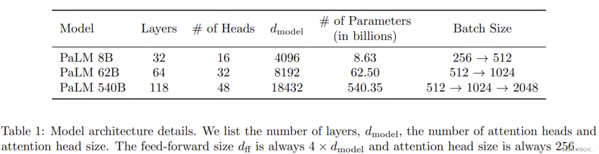

### 训练参数设置:

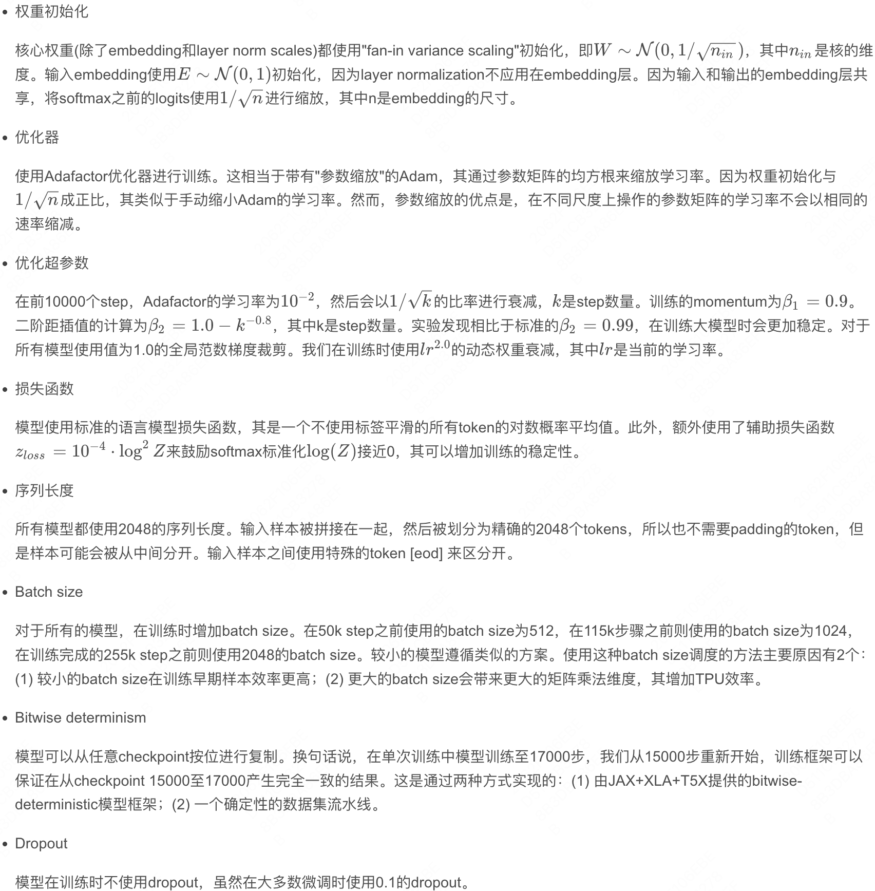

### 训练不稳定:

&nbsp;&nbsp;&nbsp;&nbsp;对于最大的模型，尽管使用了梯度裁剪，在训练过程中观察到大于20次损失函数锋值。这些峰值的出现非常的不规律，有时出现在训练的后期，且在较小的模型中没有观察到。由于训练最大模型的代价，不能确定缓解这些峰值的主要策略。

&nbsp;&nbsp;&nbsp;&nbsp;相反，本文发现一个简单的策略可以有效的缓解这个问题：从峰值前的100步的checkpoints训练，并且跳过200-500个data batches，其涵盖了爆炸前以及爆炸之间的batches。通过这种缓解策略，损失函数不会在相同的点爆炸。这些峰值不太可能是由"bad data"导致的，因为跑了一些消融实验，将峰值周围的batch数据拿出来，然后从一个较早的不同的checkpoint上训练这些数据。在这些案例中，没有看到峰值。**这意味着峰值仅会由特定batch的数据和特定模型参数结合而发生**。


## 记忆:

关于记忆的结论：
1. 相比于小模型，**更大的模型有更高的记忆率**；
2. 记忆需要一定的数量，因此**模型对常见的模板能够生成精确的匹配**。然而，训练数据上的记忆率显著的高于留出数据上的记忆率，这意味着模型确实记忆住了部分数据。
3. 一个样本被记住的几率和其在训练中的独特性高度相关。被看见一次的样本不太可能比看见多次的样本更容易被记忆。


    参考来源：https://blog.csdn.net/bqw18744018044/article/details/128809221

<br>

## 【google】T5（Text-To-Text Transfer Transformer）:

- encoder-decoder
- 论文地址：https://arxiv.org/abs/1910.10683
- 代码地址：https://github.com/google-research/text-to-text-transfer-transformer
- 模型大小：3B、11B
- 特点：提出统一框架，将所有NLP任务转化为text-to-text任务


&nbsp;&nbsp;&nbsp;&nbsp;**该框架为预训练和微调提供了一致的训练目标**。具体来说，无论任务如何，都以极大似然为目标训练模型；为指定模型执行的任务，需要向原始输入序列添加特定于任务的（文本）前缀后再输入模型。


&nbsp;&nbsp;&nbsp;&nbsp;从框架中可以看出，在进行微调时，将输入转化为文本输入到模型，输出文本结果；

&nbsp;&nbsp;&nbsp;&nbsp;模型训练时，token size = 32000【采用SetencePiece方式自动生成】，encoder-decoder部分都为768维，12个block，12和head，为此参数量为bert-base的两倍；训练时dropout=0.1，batchsize=128；warm-up step = 10^4【即在warm-up step之前固定lr = 0.01，之后采用衰减的形式】；


### 模型架构：

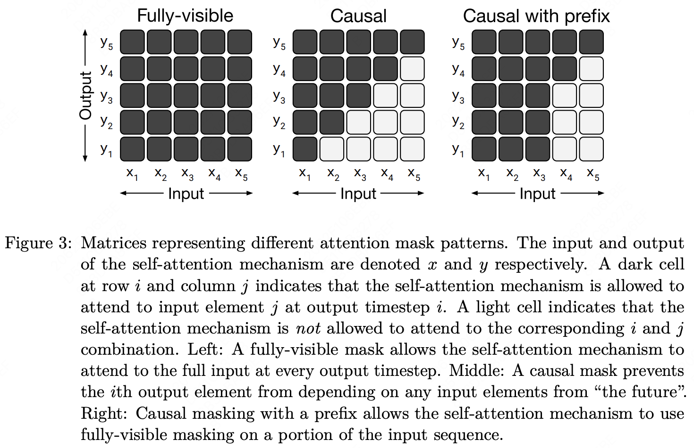

当前常见的attention结构分为上述三种：
1. **fully-visible attention**：所有输入token之间两两做双向attention；
2. **causal attention**：因果的attention，即每个token只与其前面的token做单向attention；
3. **causal with prefix attention**：带前缀的因果attention，即prefix的token相互之间是双向attention，之后的token则采用causal attention的方式进行单项attention；

除了上述三种attention形式外，还有一种cross attention形式，来融合不通输入的信息；其本质实现逻辑和causal attention比较像，此时q，k，v来源不同，q来源输入信息y，k和v来源交叉信息x；

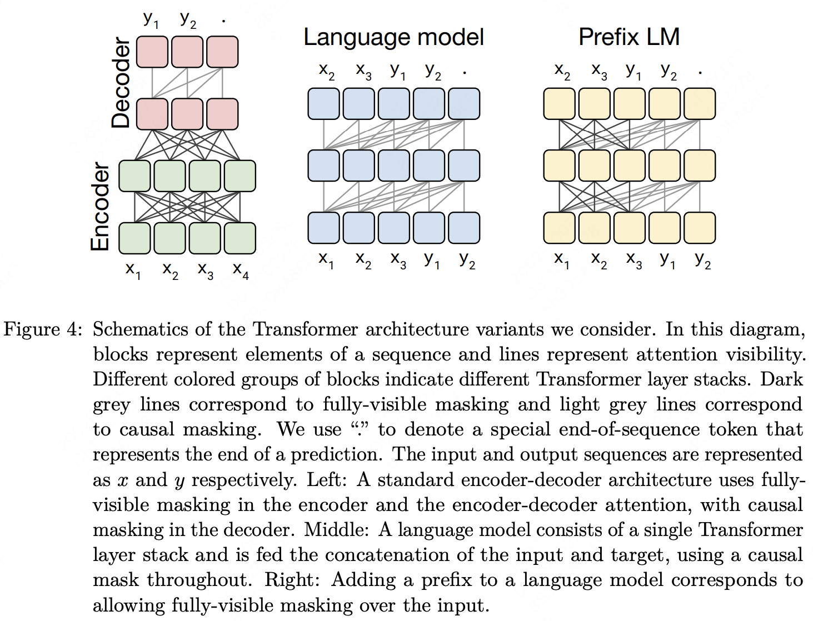

当前常见的大语言模型的架构（不包括 encoder-only）：
1. **encoder-decoder**：在encoder部分采用双向fully-vision attention，而在decoder部分，则采用cross attention形式进行casual attention（encoder和decoder参数可以share，也可以不share）；
2. **decoder-only（Language model）**：在decoder部分采用casual attention的形式，docoder-only架构 + LM obj 是目前预训练语言模型中最常用的结构；但对于text-to-text任务，由于存在前缀prefix/context，对采用causal attention会对prefix信息利用不全的现象；
3. **prefix LM**：即采用Causal with prefix attention的结果，对前缀输入进行fully vision attention，对后面进行causal attention 的生成；这种架构对于text-to-text任务非常高效；


**下面介绍下prefix LM和encoder-decoder，以及encoder之间关系**：
1. prefix LM和encoder-decoder结构很相似，共享encoder和decoder参数，同时encoder和decoder交互从cross attention转化为causal attention形式；
2. 从分类任务上来看，prefix LM和BERT非常相似；prefix LM通过构造相关的prefix，基于最后一个词预估分类label，此时前缀都是fully vision attention；而BERT采用encoder-only架构，也是在做fully vision attention，然后再CLS token输出结果；即BERT是整体作为一个分类器，而prefix LM则是在prefix LM 前部分集成分类器能力；


### 模型架构对比:

模型架构对比，需要考虑参数量和计算量两部分：

1）L + L层的encoder-decoder计算量，和L层decoder计算量相当：
  - 按照LLM中FLOPs的计算逻辑，encoder部分计算量约等于（6｜8）* tokens/2 * parameters，decoder也约等于（6｜8）* tokens/2 * parameters；两者FLOPs之和约等于 decoder-only的计算量；

2）L + L层的encoder-decoder参数量，和2个L层decoder参数量接近：
  - 以（33000 token，12层，12 head ，768维）为例，decoder架构中，参数量为 33000 * 768 + (1+1+1+1+4+4)*768*768*12 = 110MB；
  - encoder-decoder架构中，encoder部分：33000 * 768 + 12 * 768 * 768 * 12，decoder部分：(1 + 1 + 1 + 1 + 1 + 1 + 4 + 4) * 768 * 768 * 12，总共 = 209MB；


以12层768维 transformer layer参数为P，FLOPs为M，则有如下：

| 模型 | 参数量 | FLOPs |
|-|-----|-------|
|encoder-decoder| 2P  | M     |
|decoder-only| P   | M     |
|prefix-LM| P   | M     |

———— 这里的FLOPs其实存在一定偏差，因为encoder-decoder参数量是其他的两倍，在训练时为了不占用显存，可能会存在内存里面，这时候就涉及到参数激活重计算时长，大约是1/4M的FLOPs；

———— 参数激活重计算是指，由于参数量太大，无法存在显存，为此前向计算完成后，直接从显存中删掉；为此在反向更新参数时，还需要重新计算一遍；这是一种常见的大模型训练时，时间换空间的方法；


T5论文中，对不同的encoder-decoder、decoder-only、prefix-LM的结果进行对比，**发现encoder-decoder的效果最佳，在训练机器资源情况下，训练计算量并没有提升**；为此他们采用来encoder-decoder的结构；


### 训练目标:

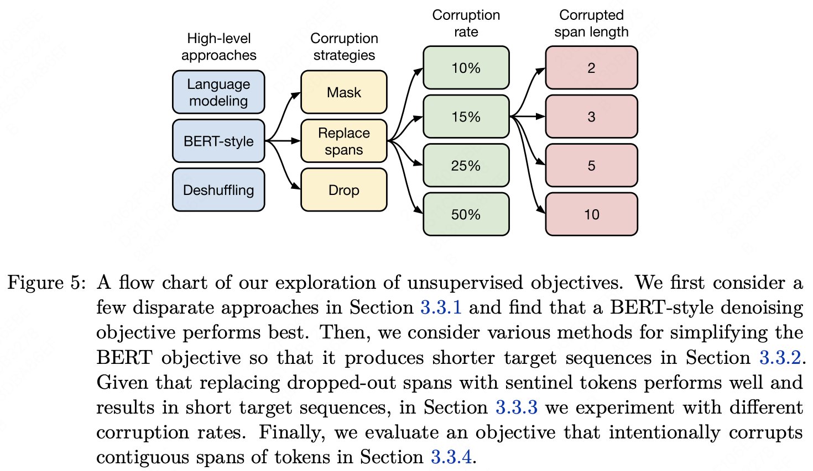

T5模型在进行目标选择时，进行了大量实验，终于获得了完整的 T5 模型，还有它的训练方法：
- Transformer Encoder-Decoder 模型；
- BERT-style 式的破坏方法；
- Replace Span（小段替换）法；
- 破坏比为15%；
- 小段长度破坏长度为3。


    参考来源：https://zhuanlan.zhihu.com/p/88438851


<br>

## 【Stanford】Alpaca（SELF-INSTRUCT: Aligning Language Models with Self-Generated Instructions）:

- decoder-only【基于LLaMA】
- 论文地址：https://arxiv.org/pdf/2212.10560.pdf
- 代码地址：https://github.com/tatsu-lab/stanford_alpaca
- 模型大小：7B
- 特点：调用GPT3模型生成一系列instruction来对LLaMA进行微调，有点类似蒸馏；


下图给出基于LLaMA的微调模型体系：

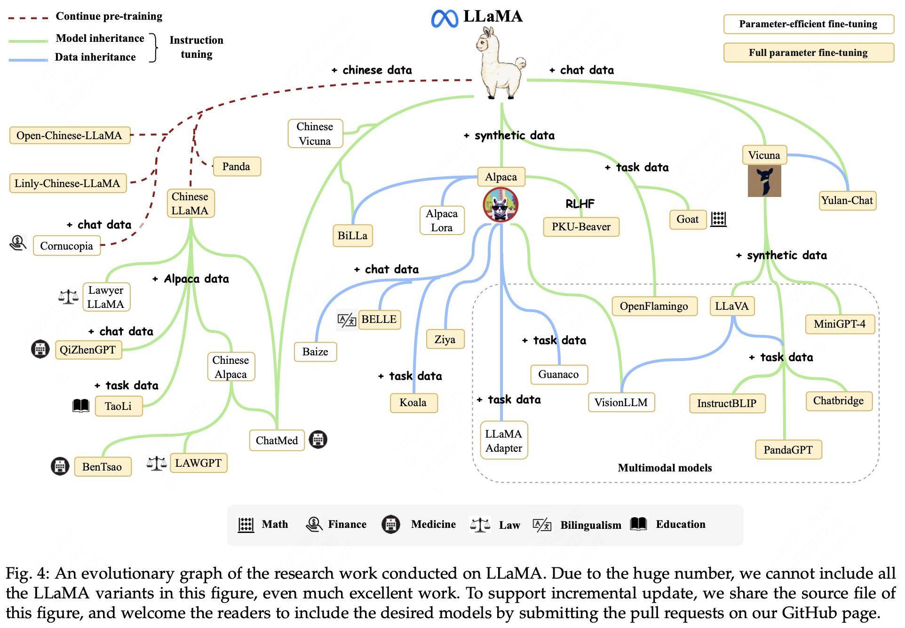

> 上图可以看出Alpaca本身是一个全参数微调。

&nbsp;&nbsp;&nbsp;&nbsp;大型“指令调优”语言模型在新任务上展现了Zero-shot的卓越能力，但严重依赖于人类编写的指令数据，而这些数据在数量、多样性和创造性方面都是有限的。[自驱力超强的羊驼？斯坦福Alpaca媲美text-davinci-003，成本不到600美元！](https://mp.weixin.qq.com/s/lUO1a-UFv5IdBvOB6QTxVg)

&nbsp;&nbsp;&nbsp;&nbsp;斯坦福科研人员引入了self-instruction框架，提高指令遵循能力来自我迭代进化，与InstructGPT的性能相当，相比原始GPT3提升33%！将大模型与指令对齐再也不用人工标注（annotation-free），最后还发布了他们合成的自生成指令数据集，来促进对指令调优的研究。

### Part1：自我提示self-instruct

&nbsp;&nbsp;&nbsp;&nbsp;self-instruct是一种任务不可知（task-agnostic）的方法，通过自己生成指令数据(指令、输入和输出样本)并使用它进行引导来提高语言模型的指令遵循能力。自动指示执行的流程：

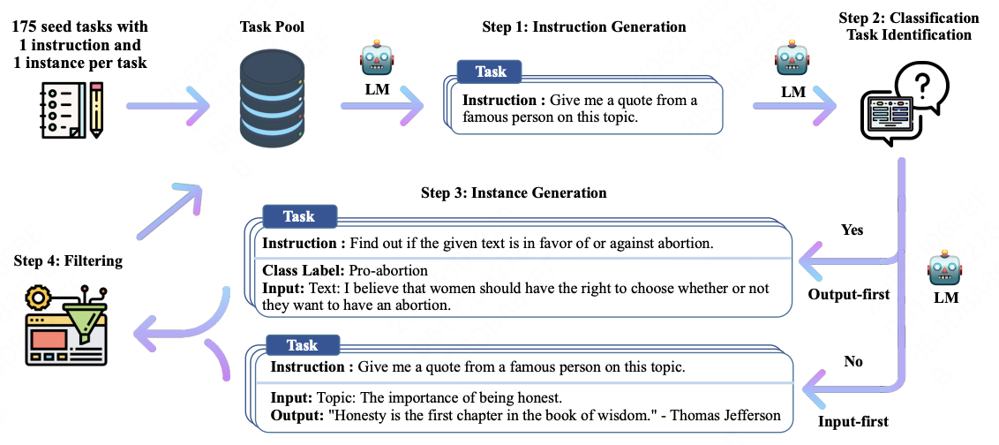

&nbsp;&nbsp;&nbsp;&nbsp;首先准备好一个小的任务种子集(每个任务的一条指令和一个输入-输出实例)作为任务池开始，从任务池中抽取随机任务用于提示语言模型LM（例如GPT3）生成新的指令和实例，再过滤低质量或类似的生成，合格的就添加回任务池；


### Part2：羊驼Alpaca模型

&nbsp;&nbsp;&nbsp;&nbsp;指令遵循语言模型叫Alpaca羊驼，是在近期Meta开源的LLaMA 7B模型上进行微调的。语料使用的是text-davinci-003生成的52K指令。stanford_alpaca在GitHub开源，alpaca_data.json文件中。

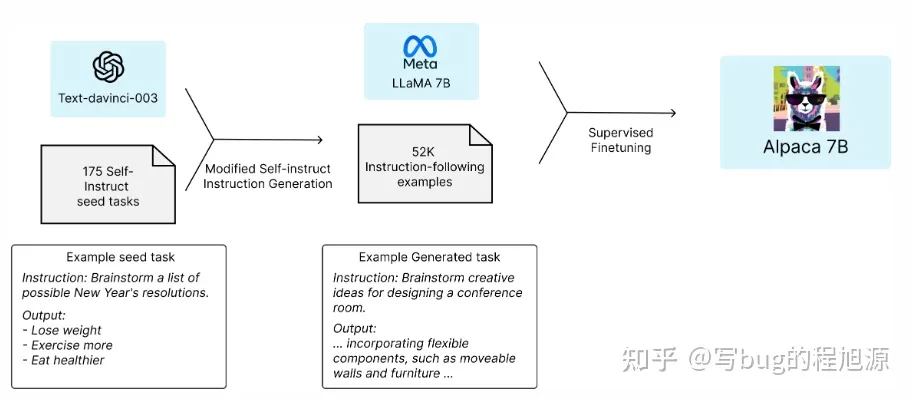

训练过程中，使用了**完全分片数据并行（Fully Sharded Data Parallel） 和混合精度（mixed precision） 等训练等技术**，硬件方面：**在8个80GB A100上对7B LLaMA模型进行微调3个小时**，成本竟然不到100美元！但效果惊人，与InstructGPT_001的性能相当。


### 数据集合评估方法:

52k数据集分布：

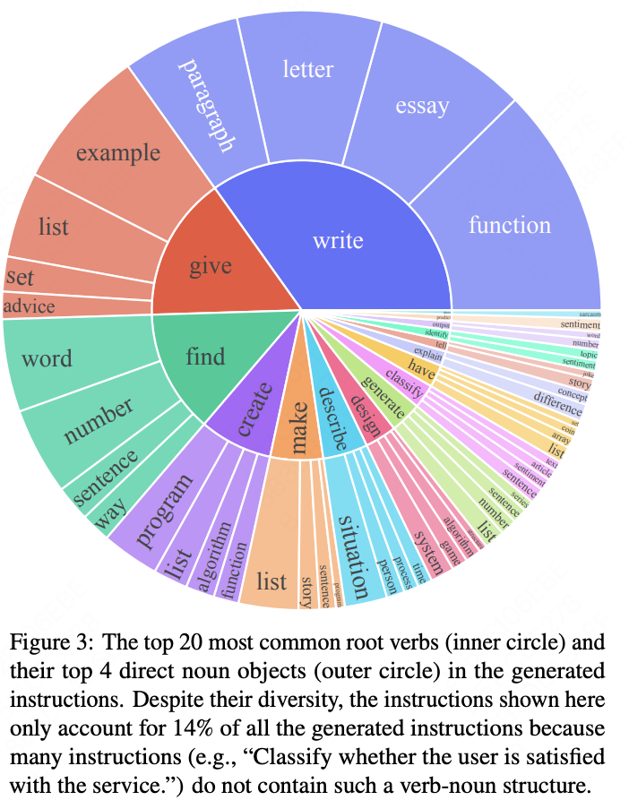

模型评估 采用四级评级系统，用于分类模型输出的质量，定义如下:
- A：回答是有效和令人满意的；
- B：响应是可以接受的，但有一些小错误或缺陷可以改进；
- C：响应是相关的，并响应指令，但它在内容中有重大错误；
- D：响应不相关或无效，包括重复输入，完全不相关的输出等。

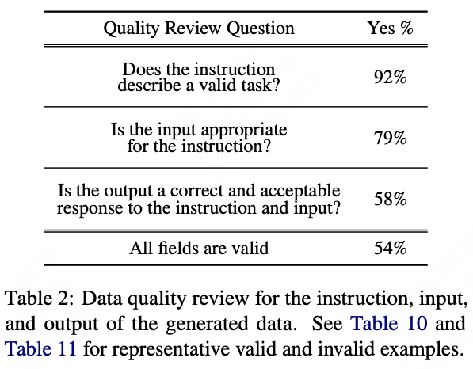


### Alpaca微调指令（中文版）:

| 数据集                                                          | 规模  | 数据类型                    |数据特点|
|--------------------------------------------------------------|-----|-------------------------|-|
| [中文指令数据](https://github.com/carbonz0/alpaca-chinese-dataset) | 52k | 种子数据包含：问答、摘要、数学推理、代码生成等 |原英文版数据用175 个人工编写的任务种子集合作为初始化指令样例，用text-davinci-003生成|
| [Alpaca_GPT4](https://github.com/Instruction-Tuning-with-GPT-4/GPT-4-LLM) | 52k | 同上                      |用 GPT-4 生成的，并做了中文翻译|


    参考来源：https://zhuanlan.zhihu.com/p/615279976


<br>

## 【清华】ChatGLM：

&nbsp;&nbsp;&nbsp;&nbsp;ChatGLM 参考了 ChatGPT 的设计思路，在千亿基座模型 [GLM-130B](https://chatglm.cn/blog#fn:1) 中注入了代码预训练，通过有监督微调（Supervised Fine-Tuning）等技术实现人类意图对齐。ChatGLM 当前版本模型的能力提升主要来源于独特的千亿基座模型 GLM-130B。它是不同于 BERT、GPT-3 以及 T5 的架构，是一个包含多目标函数的自回归预训练模型。
参考来源：https://chatglm.cn/blog

## ChatGLM-2:

- prefix LM
- 代码地址：https://github.com/THUDM/ChatGLM2-6B
- 模型大小：6B、12B、32B、66B、130B
- 训练数据：1.4T tokens

&nbsp;&nbsp;&nbsp;&nbsp;ChatGLM2-6B 是开源中英双语对话模型[ChatGLM-6B](https://github.com/THUDM/ChatGLM-6B)的第二代版本，在保留了初代模型对话流畅、部署门槛较低等众多优秀特性的基础之上，ChatGLM2-6B 引入了如下新特性：

1. **更强大的性能**：基于 ChatGLM 初代模型的开发经验，我们全面升级了 ChatGLM2-6B 的基座模型。ChatGLM2-6B 使用了 [GLM](https://github.com/THUDM/GLM) 的混合目标函数，经过了 1.4T 中英标识符的预训练与人类偏好对齐训练，[评测结果](https://github.com/THUDM/ChatGLM2-6B#%E8%AF%84%E6%B5%8B%E7%BB%93%E6%9E%9C)显示，相比于初代模型，ChatGLM2-6B 在 MMLU（+23%）、CEval（+33%）、GSM8K（+571%） 、BBH（+60%）等数据集上的性能取得了大幅度的提升，在同尺寸开源模型中具有较强的竞争力。
2. **更长的上下文**：基于 [FlashAttention](https://github.com/Dao-AILab/flash-attention) 技术，我们将**基座模型的上下文长度（Context Length）由 ChatGLM-6B 的 2K 扩展到了 32K**，**并在对话阶段使用 8K 的上下文长度训练**。对于更长的上下文，我们发布了 [ChatGLM2-6B-32K](https://huggingface.co/THUDM/chatglm2-6b-32k) 模型。[LongBench](https://github.com/THUDM/LongBench) 的测评结果表明，在等量级的开源模型中，ChatGLM2-6B-32K 有着较为明显的竞争优势。
3. **更高效的推理**：基于 [Multi-Query Attention](https://arxiv.org/abs/1911.02150) 技术，ChatGLM2-6B 有更高效的推理速度和更低的显存占用：在官方的模型实现下，推理速度相比初代提升了 42%，INT4 量化下，6G 显存支持的对话长度由 1K 提升到了 8K。
4. **优化的模型架构和大小**： 吸取 GLM-130B 训练经验，修正了二维 RoPE 位置编码实现，使用传统FFN结构。6B（62亿）的参数大小，也使得研究者和个人开发者自己微调和部署 ChatGLM-6B 成为可能。
5. **充分的中英双语预训练**： ChatGLM-6B 在 1:1 比例的中英语料上训练了 1T 的 token 量，兼具双语能力。
6. **人类意图对齐训练**： 使用了监督微调（Supervised Fine-Tuning）、反馈自助（Feedback Bootstrap）、人类反馈强化学习（Reinforcement Learning from Human Feedback） 等方式，使模型初具理解人类指令意图的能力。输出格式为 markdown，方便展示。
7. **更开放的协议**：ChatGLM2-6B 权重对学术研究完全开放，在填写[问卷](https://open.bigmodel.cn/mla/form)进行登记后亦允许免费商业使用。


### 效果评估:

**通用领域7B**：Baichuan2-7B-Base > ChatGLM2-6B > Baichuan-7B > LLaMA2-7B > LLaMA-7B

**通用领域13B**：ChatGLM2-12B = Baichuan2-13B-Base > Baichuan-13B-Base > LLaMA2-13B > LLaMA-13B
（Baichuan2-7B-Base > Baichuan-13B-Base）

**法律、医疗 7B**：Baichuan2-7B-Base > ChatGLM2-6B > Baichuan-7B > LLaMA2-7B > LLaMA-7B

**法律、医疗 13B**：Baichuan2-13B-Base > Baichuan-13B-Base > LLaMA2-13B > LLaMA-13B
（Baichuan2-7B-Base > Baichuan-13B-Base）

**数学、代码 7B**：ChatGLM2-6B > Baichuan2-7B-Base > LLaMA2-7B > LLaMA-7B > Baichuan-7B

**数学、代码 13B**：Baichuan2-13B-Base > LLaMA2-13B > Baichuan-13B-Base > LLaMA-13B
（Baichuan2-7B-Base > Baichuan-13B-Base）


**<font color="#dd0000"> 从评估结果看：</font>**

1）在7B模型上，Baichuan2-7B 优于ChatGLM2-6B，好于Baichuan-7B，好于 LLaMA2-7B，好于LLaMA-7B；

2）在13B模型上，Baichuan2-13B 基本等于 ChatGLM2-12B，好于Baichuan-13B，好于 LLaMA2-13B，好于LLaMA-13B；


### 13B模型结果:

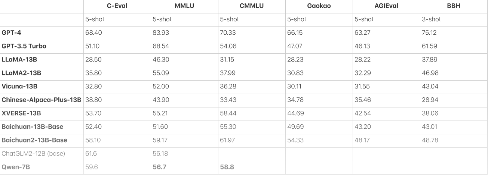


### 7B模型结果:

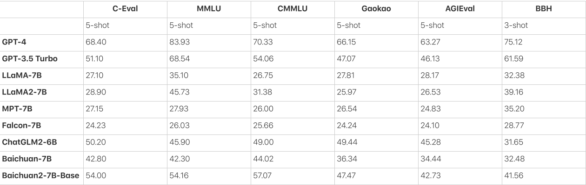


### 推理性能:

&nbsp;&nbsp;&nbsp;&nbsp;ChatGLM2-6B 使用了Multi-Query Attention，提高了生成速度。生成 2000 个字符的平均速度对比如下:

| Model       |推理速度 (字符/秒)|
|-------------|-|
| ChatGLM-6B  |31.49|
| ChatGLM2-6B |44.62|

&nbsp;&nbsp;&nbsp;&nbsp;使用官方实现，batch size = 1，max length = 2048，bf16 精度，测试硬件为 A100-SXM4-80G，软件环境为 PyTorch 2.0.1；Multi-Query Attention 同时也降低了生成过程中 KV Cache 的显存占用，此外，ChatGLM2-6B 采用 Causal Mask 进行对话训练，连续对话时可复用前面轮次的 KV Cache，进一步优化了显存占用。因此，使用 6GB 显存的显卡进行 INT4 量化的推理时，初代的 ChatGLM-6B 模型最多能够生成 1119 个字符就会提示显存耗尽，而 ChatGLM2-6B 能够生成至少 8192 个字符。

| 量化等级       |编码 2048 长度的最小显存| 生成 8192 长度的最小显存 |
|--------|-|-----------------|
| FP16 / BF16 |13.1 GB| 12.8 GB         |
| INT8 |8.2 GB| 8.1 GB          |
|INT4|5.5 GB| 5.1GB           |


&nbsp;&nbsp;&nbsp;&nbsp;ChatGLM2-6B 利用了 PyTorch 2.0 引入的 torch.nn.functional.scaled_dot_product_attention 实现高效的 Attention 计算，如果 PyTorch 版本较低则会 fallback 到朴素的 Attention 实现，出现显存占用高于上表的情况。我们也测试了量化对模型性能的影响。结果表明，量化对模型性能的影响在可接受范围内。

| 量化等级 | Accuracy (MMLU) | Accuracy (C-Eval dev) |
|-----|-----------------|-----------------------|
|BF16 | 45.47           | 53.57                 |
|INT4| 43.13           | 50.30                 |


## GLM（General Language Model）:

- prefix LM
- 代码地址：https://github.com/THUDM/GLM-130B/tree/main
- 论文地址：https://arxiv.org/pdf/2103.10360.pdf
- 模型大小：130B
- 训练数据：1.2T英文tokens + 1.3T 中文tokens

&nbsp;&nbsp;&nbsp;&nbsp;GLM-130B 是一个开源开放的双语（中文和英文）双向稠密模型，拥有 1300 亿个参数，模型架构采用通用语言模型（GLM）。它旨在支持在一台 A100（40G * 8） 或 V100（32G * 8）服务器上对千亿规模的参数进行推理。

### 模型架构:

下图为GLM的attention结构：

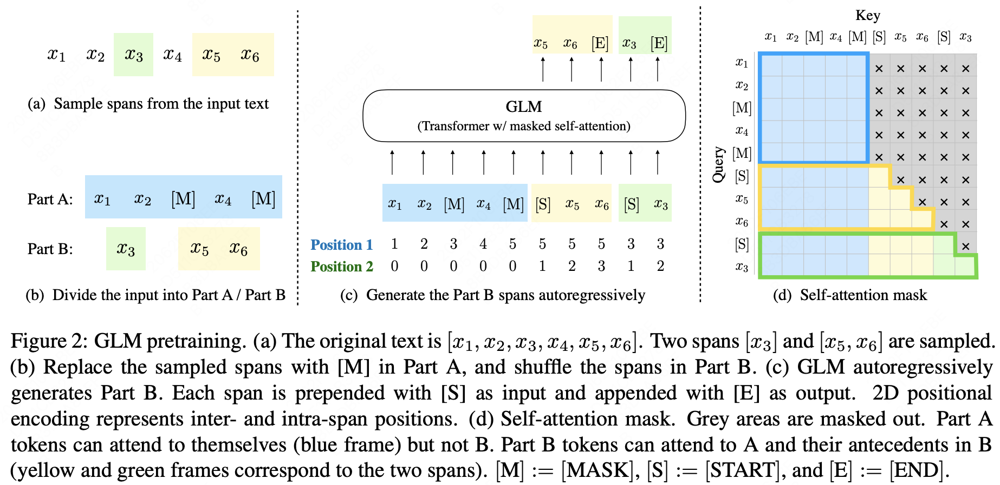

&nbsp;&nbsp;&nbsp;&nbsp;GLM-130B将BERT和GPT的目标进行了统一，并与最近提出的一些技术进行结合以提升语言模型的性能表现。GLM采用自回归空白填充方式（auto-regressive blank infilling），随机对tokens中连续的spans机进行掩盖（该想法来源auto-encoding自编码），然后训练模型去按照顺序重新生成这些spans（该想法来源auto-regressive pretraining）；在T5中也才用了这两种方法，但GLM提出两种改进：span shuffling 和 2D positional encoding；

&nbsp;&nbsp;&nbsp;&nbsp;论文发现，在相同参数和计算消耗情况下，GLM性能超过BERT、RoBERTa等；同时GLM在更少的参数和训练数据下，在NLU和文本生成任务上也优于T5；

&nbsp;&nbsp;&nbsp;&nbsp;受到Pattern-Exploiting Training（PET）的启发，我们将NLU任务重新定义为手工制作的填空问题，以模仿人类语言。与PET使用的基于BERT的模型不同，GLM可以通过自回归空白填充自然地处理填空问题的多个标记答案。

&nbsp;&nbsp;&nbsp;&nbsp;此外，**论文还展示了通过改变span序列的数量和长度，自回归空白填充目标可以为有条件和无条件的生成任务预训练语言模型**。通过多任务学习不同的预训练目标，单个GLM可以在NLU和（有条件和无条件的）文本生成任务中表现出色。实验证明，与独立的基准模型相比，通过共享参数的多任务预训练的GLM在NLU、有条件文本生成和语言建模任务中都取得了改进。


### 训练目标：自回归文本填空

GLM利用自回归文本填空作为其主要的预训练目标。它掩盖了随机的连续跨度，并对其进行自回归预测；
- 上下文之间的注意力（例如，"like a [MASK], like a rolling stone"）是双向 fully vision attention的；
- 被掩盖的标记之间的注意力，和从上下文到被掩盖的标识符的注意力是自回归掩码的，即causal attention；
<br>
在GLM-130B的实现中，有两种不同的MASK标识符，表示两个不同的目的：
- [MASK]根据[泊松分布](https://en.wikipedia.org/wiki/Poisson_distribution) (λ=3)对输入中标识符进行短跨度的采样；
- [gMASK]掩盖一个长的跨度，从其位置到整个文本的结束。

[sop]标识符表示一个片断的开始，[eop]表示一个片断的结束。这两个目标在GLM-130B的预训练中是混合的，分别占预训练标记的30%和70%。

对于[MASK]，为short span，其中span长度满足λ=3的泊松分布，同时spans至少覆盖15% tokens；在autoregressive blank infilling objective下，进行训练，不同的span在训练时进行随机shuffling，由此训练得到的模型在下游NLU任务上性能显著；
<br>
另一方面为使模型，具备长文本生成能力，在autoregressive blank infilling objective中，进行多目标训练，新增两个目标：
- 文本级别：从原文长度的50%～100%中进行随机采样，用于长文本生成训练；
- 句子级别：强约束mask spans必须是一个完整的句子，切覆盖15% tokens；该目标针对seq2seq任务类型；

这两个新目标，采用[gMASK]的形式。

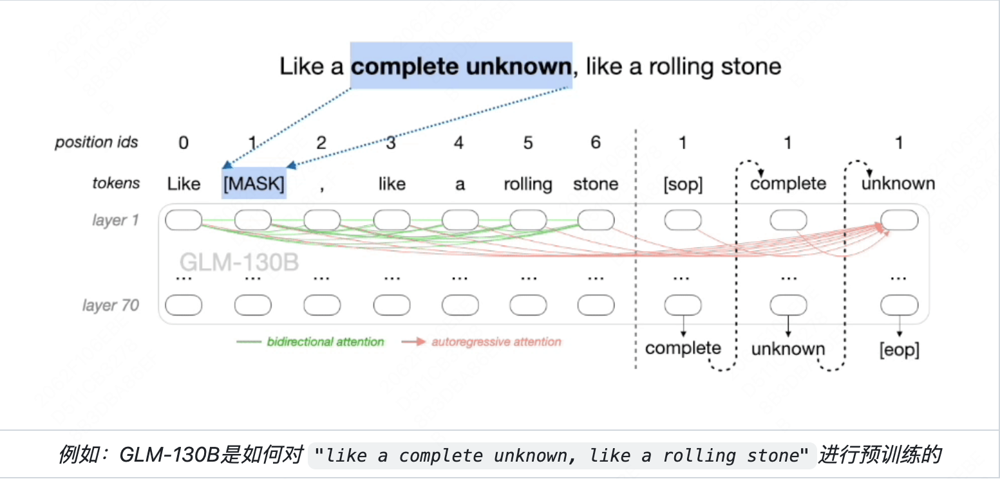


### 位置编码：旋转位置编码

&nbsp;&nbsp;&nbsp;&nbsp;GLM-130B使用[旋转位置编码（RoPE）](https://arxiv.org/abs/2104.09864)，谷歌的[PaLM](https://blog.research.google/2022/04/pathways-language-model-palm-scaling-to.html)和[ElutherAI](https://www.eleuther.ai/)的GPT-*系列也采用这种编码。RoPE是一种相对位置编码，它利用复数空间的正交投影矩阵来表示标识符的相对距离。还有其他的相对位置编码选项，如Bigscience的[BLOOM](https://huggingface.co/bigscience/bloom)所使用的[AliBi](https://arxiv.org/abs/2108.12409)。但在我们的初步实验中，我们发现。
- 当序列长度增长时，RoPE的实现速度更快；
- RoPE对双向注意力更友好，在下游微调实验中效果更好；

因此，对于GLM-130B，RoPE是一种有效的、高效的位置编码。


### 归一化：使用DeepNet的Post-LN

&nbsp;&nbsp;&nbsp;&nbsp;层归一化（LayerNorm，或LN）是transformer中的一个重要组成部分，其应用可以大大影响训练的稳定性和性能。BERT应用了Post-LN，这意味着LayerNorm是在添加残余分支后应用的。然而，[后续工作](https://arxiv.org/abs/2002.04745)表明，单纯的Post-LN会导致预训练的不稳定，因此现有的大规模模型都选择Pre-LN架构，即在添加残差分支之前应用LayerNorm。

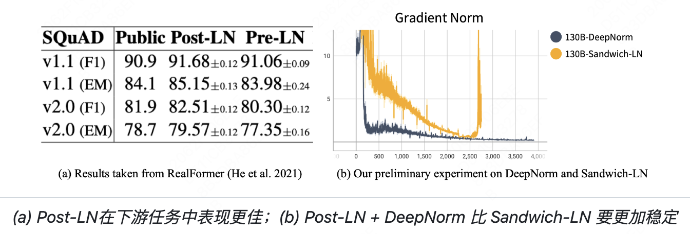

&nbsp;&nbsp;&nbsp;&nbsp;尽管如此，在现有的实践中，**Pre-LN在用FP16训练大规模模型时仍然可能不稳定**。[OPT-175B](https://arxiv.org/abs/2205.01068)在训练崩溃时手动调整学习率；[BLOOM](https://huggingface.co/bigscience/bloom)使用BF16（仅适用于NVIDIA Ampere GPU：A100s和3090s）以获得更好的浮点精度来避免崩溃。[CogView](https://proceedings.neurips.cc/paper/2021/file/a4d92e2cd541fca87e4620aba658316d-Paper.pdf)提出了Sandwich-LN作为一种补救措施。更重要的是，[近期工作](https://aclanthology.org/2021.findings-acl.81.pdf)表明，与Post-LN相比，Pre-LN的下游微调性能更差。

&nbsp;&nbsp;&nbsp;&nbsp;考虑到所有这些因素，在GLM-130B中，我们决定使用Post-LN，并使用新提出的[DeepNorm](https://arxiv.org/abs/2203.00555)来克服不稳定性。DeepNorm的重点是改进初始化，可以帮助Post-LN变换器扩展到1000层以上。在我们的初步实验中，模型扩展到130B，Sandwich-LN的梯度在大约2.5k步时就会出现损失突变（导致损失发散），而**带有DeepNorm的Post-Ln则保持健康并呈现出较小的梯度大小（即更稳定）**。


### 前馈网络：Gated Linear Unit (GLU) + GeLU 激活

&nbsp;&nbsp;&nbsp;&nbsp;最近一些改进transformer结构的努力集中在前馈网络（FFN）上，包括用[GLU](https://arxiv.org/abs/1612.08083)（在PaLM中采用）和新提出的[门控注意单元（GAU）](https://arxiv.org/abs/2202.10447)取代它。

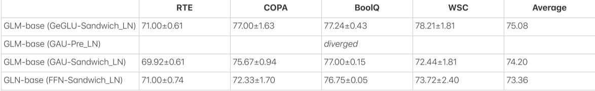

&nbsp;&nbsp;&nbsp;&nbsp;我们在初步实验中通过对随机的50G中英文混合语料库进行GLM-base（110M）的预训练来测试它们。我们发现，虽然**GLU和GAU可以比原始FFN实现更好，但GLU在训练中可以更好、更稳定**。

&nbsp;&nbsp;&nbsp;&nbsp;因此，在GLM-130B的实现中，我们选择带有GeLU激活的GLU，即GeGLU。GeGLU需要三个投影矩阵；为了保持相同数量的参数，与只利用两个矩阵的FFN相比，我们将其隐藏状态减少到2/3。

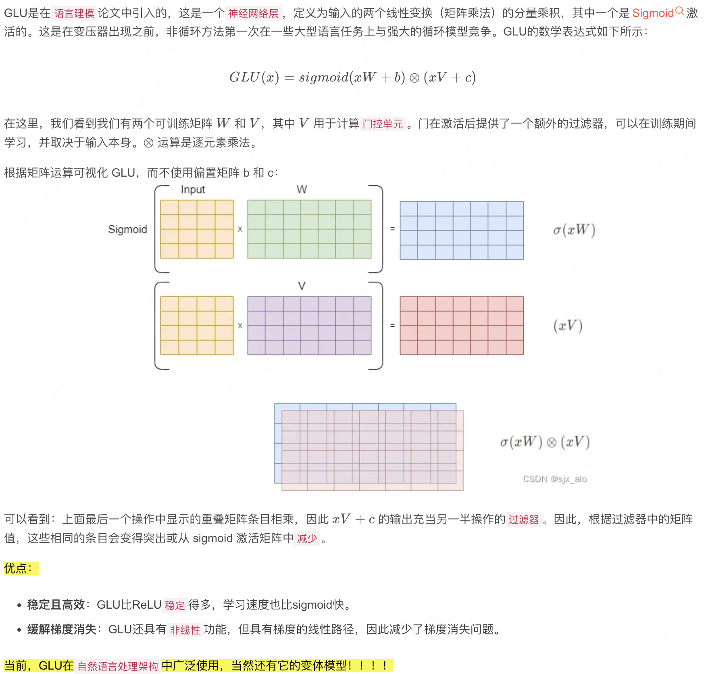


### 总结:

基于以上所有设计，GLM-130B的参数配置为：


该词表和分词器是基于[icetk](https://github.com/THUDM/icetk)实现的。icetk是一个统一的图像、中文和英文的多模态标记器。


### 训练:

&nbsp;&nbsp;&nbsp;&nbsp;训练大规模语言模型的最关键挑战是**训练的稳定性**，无一例外。GLM-130B的预训练持续了60天，使用96个DGX-A100（40G）节点，等价花费490万美元的云服务费用；如果训练在半路上失败，并无法恢复训练，那将是一个巨大的损失。

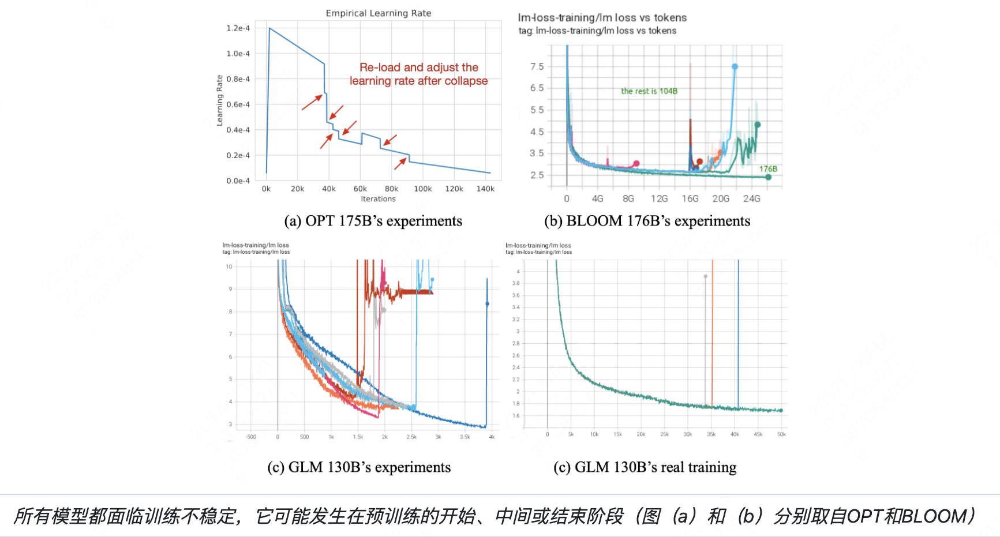

不幸的是，据我们观察，<font color="#dd0000">大模型比我们认为的那些小模型更容易受到不可避免的噪音数据和意外涌现的梯度影响</font>。原因是，在训练效率和稳定性之间存在着权衡：
- **效率**：我们需要一个低精度的浮点格式（如FP16），以减少内存和计算成本；
- **稳定性**：低精度浮点格式容易出现溢出和下溢。
而为了平衡这两个要素，我们以及最近的开放性大型模型（如OPT-175B、BLOOM）都付出了巨大的努力来寻找解决方案。在此，我们提出我们的答案。

1. **浮点数格式：FP16 混合精度**

&nbsp;&nbsp;&nbsp;&nbsp;FP16混合精度已经成为主流大规模模型训练框架的默认选项，用于训练十亿到百亿规模的模型。但其仍太容易遇到精度问题。作为补救措施，NVIDIA Ampere GPU提供了**BF16浮点格式（被BLOOM采用）来缓解这个问题**。然而，BF16在其他平台上不被支持，这大大缩小了它在更广泛的应用中的潜力。

&nbsp;&nbsp;&nbsp;&nbsp;为了让更多开发者使用，GLM-130B仍然选择FP16作为其训练浮点格式。同时，这意味着GLM-130B将面临着更多的稳定性挑战。幸运的是，经过多次尝试，我们发现以下的训练策略最终有助于稳定GLM-130B的训练。

2. **嵌入层：梯度缩减**

&nbsp;&nbsp;&nbsp;&nbsp;我们观察到，在训练的早期阶段，嵌入层的梯度范数明显比其他层大。根据经验，我们发现大多数训练崩溃都发生在其梯度范数激增之后。为了解决这个问题，BLOOM汇报了使用[嵌入归一化](https://openreview.net/pdf?id=rI7BL3fHIZq)（我们也发现它能稳定训练），但同时，其牺牲了相对较大的下游性能。
由于根本问题是输入嵌入层的急剧梯度，我们建议缩小输入嵌入层的梯度。实现起来相当简单。
<br>
**word_embedding = word_embedding * α + word_embedding.detach() * (1 - α)**
<br>
这就把梯度缩小到α。在我们的实践中，我们发现α=0.1对GLM-130B是最好的。

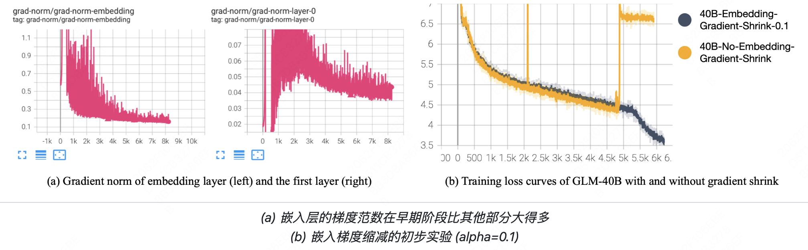

我们的初步实验中，我们观察到，对于早期阶段的训练来说，缩小嵌入梯度并没有减缓收敛速度；相反，没有缩小梯度的模型会出现意外的尖峰，并在5k步左右出现训练崩溃的情况。


###  注意力计算：FP32 Softmax

<font color="#dd0000">梯度收缩是一种避免训练崩溃的事后技术。从本质上讲，崩溃是由异常的损失 "梯度"形成的，要么是由于噪声数据，要么是正向计算中的精度上溢或者下溢。</font>

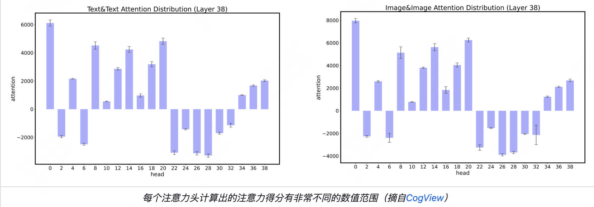

&nbsp;&nbsp;&nbsp;&nbsp;我们观察到，在大型语言模型中，注意力的计算操作是最容易上溢或下溢的。CogView显示，**不同的注意力头对其注意力分数有非常不同的数值范围，有些注意力头计算出的平均分数可以达到+1e4或-1e-3。这种不同的数值范围会导致在softmax计算中FP16下的频繁上溢或下溢**。CogView提出了精度瓶颈放松（PB-Relax）来缓解这个问题，它**在做softmax之前扣除了每个头的注意力得分矩阵中的最大绝对值**。

&nbsp;&nbsp;&nbsp;&nbsp;然而，事实证明，PB-Relax在GLM-130B的训练中很慢，可能是因为在96个大小为2048*2048的注意分数矩阵中寻找最大值和操作标量对CUDA内核不友好。最后，经过几周的艰苦探索，**我们发现避免这一问题的最快和最简单的方法是在softmax计算中使用FP32**。与完全的FP16计算相比，它几乎没有任何速度上的损失，但明显提高了训练的稳定性。


### 预训练数据

1. **自监督预训练:**

&nbsp;&nbsp;&nbsp;&nbsp;我们在2.5T网络爬取的语料上，对GLM-130B进行了预训练，包括英文1.2T来自Pile的语料和1.3T中文语料；

2. **多任务指令预训练（Multi-Task Instruction Pre-Training，MIP）:**

&nbsp;&nbsp;&nbsp;&nbsp;同时，[FLAN](https://arxiv.org/pdf/2109.01652.pdf)和[T0](https://arxiv.org/pdf/2110.08207.pdf)的最新进展表明，大规模语言模型的多提示多任务指令微调可以促进更好的零样本学习能力。此外，正如T5和ExT5所指出的，将多任务的下游数据合并到预训练中，甚至比多任务微调更有帮助。
<br>
&nbsp;&nbsp;&nbsp;&nbsp;因此，在GLM-130B的预训练中，我们包括了许多从自然语言理解到生成的提示数据集，作为自监督预训练的补充。我们设定95%的标记来自自监督的预训练语料，5%的训练标记来自MIP数据集。这些数据集是从T0和[DeepStruct](https://arxiv.org/pdf/2205.10475.pdf)中收集和转换的。按照T0的做法，每个多提示数据集中的样本都应被截断到最大数量（一般来说，T0数据集为100k，DeepStruct数据集为200k）。
<br>
&nbsp;&nbsp;&nbsp;&nbsp;不幸的是，由于数据准备中的一个错误，在前20k个预训练步骤中，我们意外地包括了T0++的所有数据集（其中包括最初用于评估T0中零样本任务泛化的任务）、没有调成权重进行截断、并排除了所有DeepStruct数据集。虽然我们把这个问题在20000步时进行了修正，但GLM-130B似乎对训练样本的记忆非常好，直到50000步也没有出现大量遗忘的现象，因此我们在此提醒所有用户***切勿在这个[列表](https://github.com/THUDM/GLM-130B/blob/main/resources/multitask_list.txt)的数据集上评估GLM-130B在零样本或少样本学习的性能。


### GLM-130B表现如何？

众所周知，像[GPT-3](https://arxiv.org/pdf/2005.14165.pdf)这样的大规模语言模型是优秀的少样本和零样本学习器。与GPT-3和OPT-175B的零样本学习相比，GLM-130B有一些架构上的劣势。
- 首先，它是一个双语语言模型，不能像GPT-3（350B tokens）和OPT-175B（350B tokens）那样看到很多英语标记（GLM-130B大概见到了200B 英文tokens）。
- GLM-130B的参数比GPT-3（175B）和OPT-175B少。
	
尽管有这些缺点，GLM-130B仍有上述的许多技术改进，这可能会弥补其在零点学习性能方面的差距。
- **双向注意力**。GLM-130B是一个类似于BERT的双向模型，而现有的大型语言模型主要是GPT（单向的）；双向模型在语言理解和条件生成方面远远优于GPT；
- **改进的架构设计**。GLM-130B采用了新的架构设计，包括GeGLU、RoPE和DeepNorm。这些技术已被证明可以提高语言模型的性能；
- **多任务指令预训练**。正如FLAN和T0所指出的，多任务指令预训练有助于提高零样本学习性能；

从目前的中间结果来看，GLM-130B在中文与英文中都是一个强大的零样本学习器。具体来说，它的表现是:
- 在英语中与GPT-3 175B相当。
- 在英语中优于BLOOM-176B和OPT-175B。
- 在中文方面比ERNIE 3.0 Titan（260B）更好。


### 自回归文本生成 / 中间文本填空:

- **掩码标记：**

&nbsp;&nbsp;&nbsp;&nbsp;GLM-130B 使用两种不同的掩码标记：[MASK] 用于简短的填空任务，[gMASK] 用于从左到右的长文本生成。当输入不包含任何 MASK 标记时，[gMASK] 将被自动附加到文本的末尾。

- **样例：**

<details><summary> 1）长文本生成样例：</summary>

- **Example 1：**

&nbsp;&nbsp;&nbsp;&nbsp;Input: Who is the greatest artist? The greatest artist is [gMASK]

&nbsp;&nbsp;&nbsp;&nbsp;Output: Who is the greatest artist? The greatest artist is not the one who paints the most beautiful picture, or writes the best poem, or plays the best symphony. The greatest artist is the one whose work has the greatest impact on the lives of others. The Greatest Artist is the artist who inspires us to be our best selves. The Great Artist is not the artist whose work is flawless. The great artist is not one who is perfect. The true great artist has the ability to make us feel something. The artist who makes us feel is the great artist. The art of the great artists is to make you feel something that you have never felt before. The greatness of an artist is in the ability of their work to touch the lives and hearts of others, and to make them feel something they have never experienced before. This is the true greatness of the artist. 2. The Significance of the Great Artist The significance of the greatest artist cannot be overstated. The significance and impact of the art of a great artist cannot even be measured. The impact of a single work of art can change the course of history. A single work can change a person’s life. A work of great art can make you laugh, make you cry, make your heart race, or make you think. A great work of artistic expression has the power to change the way you look at the world. The work of a truly great artist can change your life forever. 3. The Impact of the Greatest Artist The greatest artists have the ability and the power of their art to change people’s lives. They have the power and the ability, through their art, to make people feel something new. The power of the work of the truly great artists cannot be measured, but it can be felt. The greater the impact of an artists work, the greater the power it has to change lives. 4. The Influence of the Art of the Artist The art and the work created by the greatest artists has the potential to change a life. The influence of the artists work cannot be quantified, but is felt by those who experience it. The truly great work has an ability to touch people’ lives in a way that no other work can.

- **Example 2 (Chinese)：**

&nbsp;&nbsp;&nbsp;&nbsp;Input: 问题：冬天，中国哪座城市最适合避寒？问题描述：能推荐一些国内适合冬天避寒的城市吗？回答用户：旅游爱好者 回答： [gMASK]

&nbsp;&nbsp;&nbsp;&nbsp;Output: 问题:冬天,中国哪座城市最适合避寒?问题描述:能推荐一些国内适合冬天避寒的城市吗?回答用户:旅游爱好者 回答:避寒的话,建议去海南三亚。 三亚位于海南岛的最南端,是中国最南部的热带滨海旅游城市,中国海滨城市,是中国空气质量最好的城市、全国最长寿地区(平均寿命80岁)。三亚市别称鹿城,又被称为"东方夏威夷",位居中国四大一线旅游城市"三威杭厦"之首,拥有全岛最美丽的海滨风光。三亚拥有被无数城市嫉妒的清新空气,柔和海滩。在沙滩悠闲散步、沐浴傍晚温和阳光,在海边玩耍,在雨林里面呼吸健康,欣赏自然奇观,一切都是那么令人享受。 气候 三亚地处热带,属热带季风气候区域,终年气温高,寒暑变化不大,年平均气温25.5度。三亚最热的月份是6月,平均气温为28.5°C,极端最高气温为35.7°C ,三亚没有明显的冬季,而且冬季更是到海滨旅游的最好时候,所以三亚是全年全天候避寒、消暑、度假、旅游的好地方。不过,三亚最旺的旅游时间是从10月份到农历春节,这个时候的人特别多,房间也不好订,建议最好避开高峰。三亚的三个旅游高峰期是"五一"、"十一"、"春节",这三个节日期间的房价都会上浮几倍,如果你选择了这三个假期来三亚的话要提前一个星期定房和咨询。

</details>
<br>
<details><summary> 2）文本填空样例：</summary>

- **Example 1:**

&nbsp;&nbsp;&nbsp;&nbsp;Input: Ng is an adjunct professor at [MASK] (formerly associate professor and Director of its Stanford AI Lab or SAIL ). Also a pioneer in online education, Ng co-founded Coursera and deeplearning.ai.

&nbsp;&nbsp;&nbsp;&nbsp;Output: Ng is an adjunct professor at Stanford University (formerly associate professor and Director of its Stanford AI Lab or SAIL ). Also a pioneer in online education, Ng co-founded Coursera and deeplearning.ai.

- **Example 2 (Chinese):**

&nbsp;&nbsp;&nbsp;&nbsp;Input: 凯旋门位于意大利米兰市古城堡旁。1807年为纪念[MASK]而建，门高25米，顶上矗立两武士青铜古兵车铸像。

&nbsp;&nbsp;&nbsp;&nbsp;Output: 凯旋门位于意大利米兰市古城堡旁。1807年为纪念拿破仑胜利而建,门高25米,顶上矗立两武士青铜古兵车铸像。

</details>


### 使用 FasterTransformer 加速推理速度（高达 2.5 倍）
通过将 GLM-130B 模型与 [FasterTransfomer](https://github.com/NVIDIA/FasterTransformer)（NVIDIA 高度优化的 Transformer 模型库）相适应，我们可以在生成时达到 2.5 倍的速度，详见 [Inference with FasterTransformer](https://github.com/THUDM/GLM-130B/blob/main/docs/inference-with-fastertransformer.md) 。


<br>

## 【阿里】通义千问（QWen）:

- 代码地址：https://github.com/QwenLM
- 模型大小：1.8B、7B、14B、72B
- 训练数据：3万亿tokens
- 特点：Qwen系列模型拿出非常有竞争力的表现，显著超出同规模模型并紧追一系列最强的闭源模型


|     |                                                              Qwen-Chat                                                               |                                                                Qwen-Chat (Int4)                                                                |                        Qwen-Chat (Int8)                         |                                                            Qwen                                                            |
|-----|:------------------------------------------------------------------------------------------------------------------------------------:|:----------------------------------------------------------------------------------------------------------------------------------------------:|:---------------------------------------------------------------:|:--------------------------------------------------------------------------------------------------------------------------:|
| 1.8B  |  <a href="https://modelscope.cn/models/qwen/Qwen-1_8B-Chat/summary">🤖</a>  <a href="https://huggingface.co/Qwen/Qwen-1_8B-Chat">🤗</a>  |  <a href="https://modelscope.cn/models/qwen/Qwen-1_8B-Chat-Int4/summary">🤖</a>  <a href="https://huggingface.co/Qwen/Qwen-1_8B-Chat-Int4">🤗</a>  | <a href="https://modelscope.cn/models/qwen/Qwen-1_8B-Chat-Int8/summary">🤖</a>  <a href="https://huggingface.co/Qwen/Qwen-1_8B-Chat-Int8">🤗</a>  |  <a href="https://modelscope.cn/models/qwen/Qwen-1_8B/summary">🤖</a>  <a href="https://huggingface.co/Qwen/Qwen-1_8B">🤗</a>  |
| 7B  |  <a href="https://modelscope.cn/models/qwen/Qwen-7B-Chat/summary">🤖</a>  <a href="https://huggingface.co/Qwen/Qwen-7B-Chat">🤗</a>  |  <a href="https://modelscope.cn/models/qwen/Qwen-7B-Chat-Int4/summary">🤖</a>  <a href="https://huggingface.co/Qwen/Qwen-7B-Chat-Int4">🤗</a>  | <a href="https://modelscope.cn/models/qwen/Qwen-7B-Chat-Int8/summary">🤖</a>  <a href="https://huggingface.co/Qwen/Qwen-7B-Chat-Int8">🤗</a>  |  <a href="https://modelscope.cn/models/qwen/Qwen-7B/summary">🤖</a>  <a href="https://huggingface.co/Qwen/Qwen-7B">🤗</a>  |
| 14B | <a href="https://modelscope.cn/models/qwen/Qwen-14B-Chat/summary">🤖</a>  <a href="https://huggingface.co/Qwen/Qwen-14B-Chat">🤗</a> | <a href="https://modelscope.cn/models/qwen/Qwen-14B-Chat-Int4/summary">🤖</a>  <a href="https://huggingface.co/Qwen/Qwen-14B-Chat-Int4">🤗</a> | <a href="https://modelscope.cn/models/qwen/Qwen-14B-Chat-Int8/summary">🤖</a>  <a href="https://huggingface.co/Qwen/Qwen-14B-Chat-Int8">🤗</a> | <a href="https://modelscope.cn/models/qwen/Qwen-14B/summary">🤖</a>  <a href="https://huggingface.co/Qwen/Qwen-14B">🤗</a> |
| 72B | <a href="https://modelscope.cn/models/qwen/Qwen-72B-Chat/summary">🤖</a>  <a href="https://huggingface.co/Qwen/Qwen-72B-Chat">🤗</a> | <a href="https://modelscope.cn/models/qwen/Qwen-72B-Chat-Int4/summary">🤖</a>  <a href="https://huggingface.co/Qwen/Qwen-72B-Chat-Int4">🤗</a> | <a href="https://modelscope.cn/models/qwen/Qwen-72B-Chat-Int8/summary">🤖</a>  <a href="https://huggingface.co/Qwen/Qwen-72B-Chat-Int8">🤗</a> | <a href="https://modelscope.cn/models/qwen/Qwen-72B/summary">🤖</a>  <a href="https://huggingface.co/Qwen/Qwen-72B">🤗</a> |


&nbsp;&nbsp;&nbsp;&nbsp;我们开源了Qwen（通义千问）系列工作，当前开源模型的参数规模为18亿（1.8B）、70亿（7B）、140亿（14B）和720亿（72B）。本次开源包括基础模型Qwen，即Qwen-1.8B、Qwen-7B、Qwen-14B、Qwen-72B，以及对话模型Qwen-Chat，即Qwen-1.8B-Chat、Qwen-7B-Chat、Qwen-14B-Chat和Qwen-72B-Chat。模型链接在表格中，请点击了解详情。同时，我们公开了我们的[技术报告](https://arxiv.org/abs/2309.16609)，请点击上方论文链接查看。

&nbsp;&nbsp;&nbsp;&nbsp;前基础模型已经稳定训练了大规模高质量且多样化的数据，覆盖多语言（当前以中文和英文为主），总量高达3万亿token。在相关基准评测中，Qwen系列模型拿出非常有竞争力的表现，显著超出同规模模型并紧追一系列最强的闭源模型。此外，我们利用SFT和RLHF技术实现对齐，从基座模型训练得到对话模型。Qwen-Chat具备聊天、文字创作、摘要、信息抽取、翻译等能力，同时还具备一定的代码生成和简单数学推理的能力。在此基础上，**我们针对LLM对接外部系统等方面针对性地做了优化，当前具备较强的工具调用能力，以及最近备受关注的Code Interpreter的能力和扮演Agent的能力**。我们将各个大小模型的特点列到了下表。

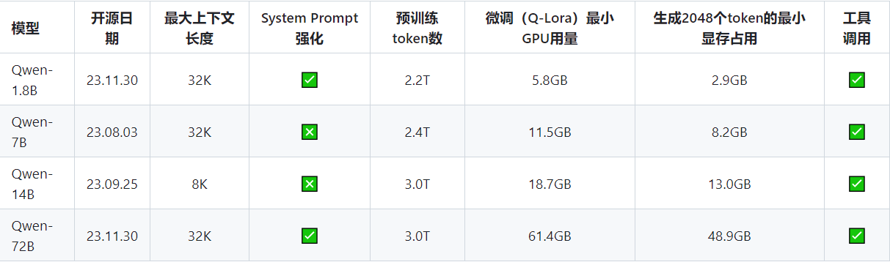


<br>

## BELLE：Be Everyone's Large Language model Engine:

- 代码地址：https://github.com/LianjiaTech/BELLE
- 模型大小：LLaMA -7B/13B；BLOOMZ-7B
- 项目目标：本项目的目标是促进中文对话大模型开源社区的发展，愿景是成为能够帮到每一个人的LLM Engine

&nbsp;&nbsp;&nbsp;&nbsp;相比如何做好大语言模型的预训练，BELLE更关注如何在开源预训练大语言模型的基础上，帮助每一个人都能够得到一个属于自己的、效果尽可能好的具有指令表现能力的语言模型，降低大语言模型、特别是中文大语言模型的研究和应用门槛。为此，BELLE项目会持续开放指令训练数据、相关模型、训练代码、应用场景等，也会持续评估不同训练数据、训练算法等对模型表现的影响。BELLE针对中文做了优化，模型调优仅使用由ChatGPT生产的数据（不包含任何其他数据）。

### 局限性和使用限制：

基于当前数据和基础模型训练得到的SFT模型，在效果上仍存在以下问题：
1. 在涉及事实性的指令上可能会产生违背事实的错误回答。
2. 对于具备危害性的指令无法很好的鉴别，由此会产生危害性言论。
3. 在一些涉及推理、代码等场景下模型的能力仍有待提高。

基于以上模型局限性，我们要求开发者仅将我们开源的代码、数据、模型及后续用此项目生成的衍生物用于研究目的，不得用于商业，以及其他会对社会带来危害的用途。

### 开放模型:

地址：https://github.com/LianjiaTech/BELLE/tree/main/models

&nbsp;&nbsp;&nbsp;&nbsp;现阶段本项目基于一些开源预训练大语言模型（如BLOOM、LLAMA等），针对中文做了优化，模型调优仅使用由ChatGPT生产的数据（不包含任何其他数据）；

- **调优BLOOMZ-7B1-mt模型：**

&nbsp;&nbsp;&nbsp;&nbsp;我们采取了不同大小规模（20万、60万、100万和200万样本）的指令学习的数据集训练模型，基于BLOOMZ-7B1-mt训练调优后的模型，现已开放:

| Datasize| 200,000 | 600,000 | 1,000,000 | 2,000,000 |
| :-----: | :-----: | :-----: | :-----: | :-----: |
| Finetuned Model | [BELLE-7B-0.2M](https://huggingface.co/BelleGroup/BELLE-7B-0.2M) | [BELLE-7B-0.6M](https://huggingface.co/BelleGroup/BELLE-7B-0.6M) | [BELLE-7B-1M](https://huggingface.co/BelleGroup/BELLE-7B-1M) | [BELLE-7B-2M](https://huggingface.co/BelleGroup/BELLE-7B-2M) |

- **调优LLaMA模型：**

考虑到LLaMA模型的限制，调优后的模型只能用作研究和学习使用，请严格遵守LLaMA的使用约束。LLaMA模型不允许发布调优后的完整模型权重，但是可以发布原始的模型的diff。因此，我们使用文件间的XOR，保证拥有LLaMA原始模型授权的人才可以将本项目发布的模型转化成可以使用的格式。文件XOR的代码参考[point-alpaca](https://github.com/pointnetwork/point-alpaca) 

模型列表：
* [BELLE-LLaMA-7B-0.6M-enc](https://huggingface.co/BelleGroup/BELLE-LLaMA-7B-0.6M-enc)
* [BELLE-LLaMA-7B-2M-enc](https://huggingface.co/BelleGroup/BELLE-LLaMA-7B-2M-enc)
* [BELLE-LLaMA-7B-2M-gptq-enc](https://huggingface.co/BelleGroup/BELLE-LLaMA-7B-2M-gptq-enc)
* [BELLE-LLaMA-13B-2M-enc](https://huggingface.co/BelleGroup/BELLE-LLaMA-13B-2M-enc)

### 评估打分：

地址：https://github.com/LianjiaTech/BELLE/tree/main/eval

其中包含1k测试集，其中涵盖多个类别。需要说明的是，该测试集是本项目中的相关论文中的测试集的一个子集。
请注意，有一些类型的问题，例如generation，rewrite，brainstorming，不需要标准答案，所以std_answer为空。

测试集使用统一的字段：

```json
"question": "指令"
"class": "类型"
"std_answer": "标准答案"
```

样例如下：

```json
{
  "question": "将以下句子翻译成英语:我想学一门新语言，法语听起来很有趣。",
  "class": "translation",
  "std_answer": "I want to learn a new language and French sounds interesting."
}
```

### 训练：

地址：https://github.com/LianjiaTech/BELLE/tree/main/train

微调：https://github.com/LianjiaTech/BELLE/blob/main/train/README_FT.md

RLHF：https://github.com/LianjiaTech/BELLE/blob/main/train/README_RLHF.md


<br>

## BLOOM：BigScience Large Open-science Open-access Multilingual Language Model:

- decoder-only
- 论文地址：https://arxiv.org/pdf/2211.05100.pdf
- 训练数据：1.61T tokens
- 模型大小：176B、7B、3B等
- 目标：BLOOM目标不仅是公开发布一个能够和近期开发的系统相媲美的大规模多语言的语言模型，而且还记录其开发中的协调过程；【在BLOOM之前几乎没有开源的大模型】


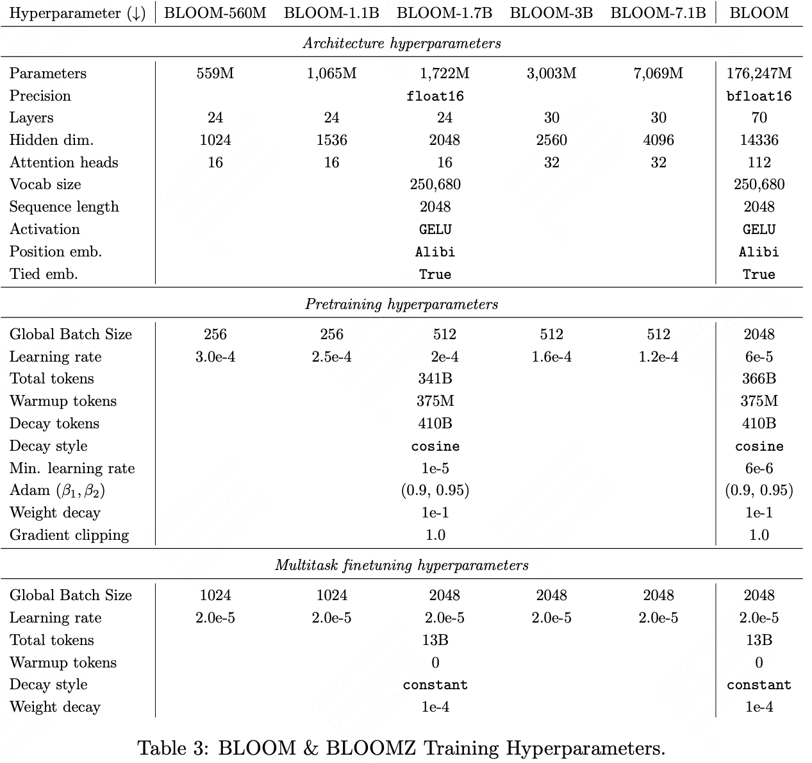

### 数据预处理:

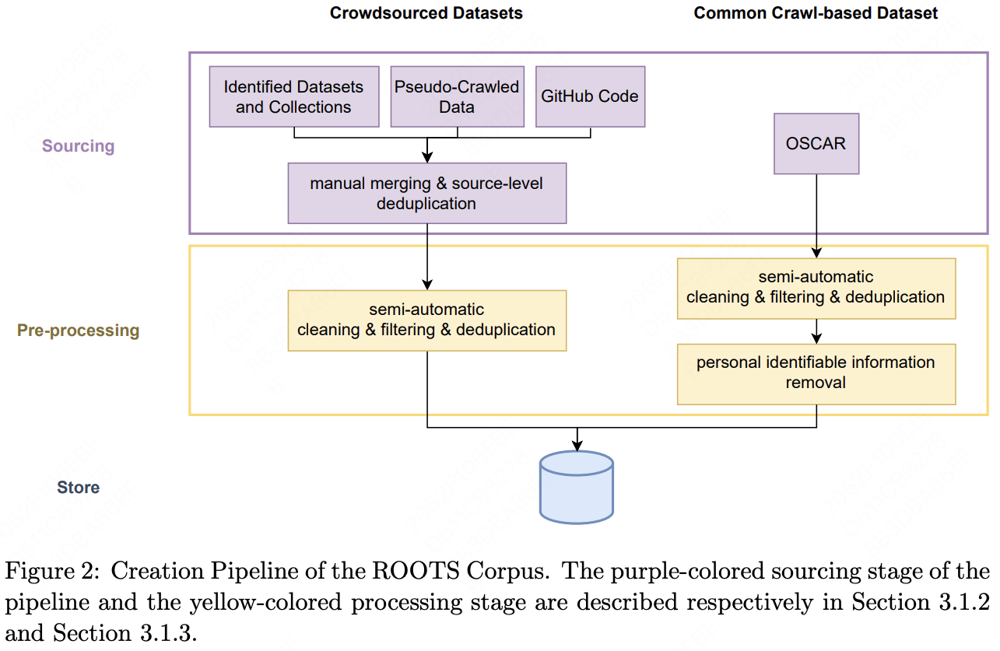

- **获得源数据**：第一步涉及到从确定的数据源中获得文本数据，这包含从各种格式的NLP数据集中下载和提取文本字段、从档案中抓取和处理大量的PDF文件、从目录中的192个网站条目和数据工作组成员选择的另一些地理上不同的456个网站中提取和预处理文本。后者需要开发新工具来从Common Crawl WARC文件中的HTML中抽取文本。我们能够从539个网络的所有URL中找到并提取可用的数据。

- **质量过滤**：在获得文本后，我们发现大多数源中包含了大量的非自然语言，例如预处理错误、SEO页面或者垃圾。为了过滤非自然语言，我们定义了一组质量指标，其中高质量文本被定义为“由人类为人类编写的”，不区分内容或者语法的先验判断。重要的是，这些指标以两种主要的方法来适应每个源的需求。首先，它们的参数，例如阈值和支持项列表是由每个语言的流利使用者单独选择的。第二、我们首先检测每个独立的源来确定哪些指标最有可能确定出非自然语言。这两个过程都是由工具进行支持来可视化影响。

- **去重和隐私编辑**：最终，我们使用两种重复步骤来移除几乎重复的文档，并编辑了从OSCAR语料中确定出的个人身份信息。因为其被认为是最高隐私风险的来源，这促使我们使用基于正则表达式的编辑，即使表达式有一些假阳性的问题。



### Prompted数据集:

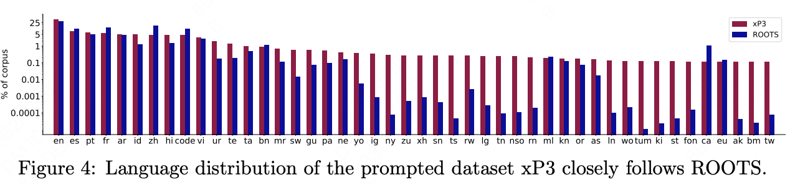

&nbsp;&nbsp;&nbsp;&nbsp;多任务提示微调(也称为instruction tuning)涉及到对预训练语言模型的微调，微调的数据集由通过自然语言提示构成的大量不同任务组成。T0证明了在多任务混合的prompted数据集上微调的模型具有强大的zero-shot泛化能力。此外，T0优于那些数量级大但是没有经过这种微调的语言模型。受这些结果启发，我们探索了使用现有自然语言数据集来进行多任务prompted微调。

&nbsp;&nbsp;&nbsp;&nbsp;T0是在Public Pool of Prompt(P3)子集上进行训练的，其是一个各种现有的、开源的应用自然语言数据集的prompt集合。该prompt集合是通过BigScience合作者参与的一系列黑客马拉松创建的，其中黑客马拉松参与者为170+数据集编写了2000+的prompt。P3中的数据集覆盖了各种自然语言任务，包括情感分析、问答、自然语言推理，并且排除了有害的内容或者非自然语言。PromptSource，一个开源工具包促进了自然语言prompt的创建、共享和使用。

&nbsp;&nbsp;&nbsp;&nbsp;**对BLOOM预训练之后，我们应用相同的大规模多任务微调，使BLOOM具有多语言zero-shot任务泛化能力，我们称得到的模型为BLOOMZ**。为了训练BLOOMZ，我们扩展了P3来包含非英语中新数据集和新任务，例如翻译。这产生了xP3，它是83个数据集的提升集合，覆盖46种语言和16中任务。正如上图4所述，xP3反映了ROOTS的语言分布。xP3中的任务包含跨语言和单语言。我们使用PromptSource来收集这些prompts，为prompt添加额外的元数据，例如输入和目标语言。为了研究多语言prompt的重要性，我们还将xP3中的英语提示用机器翻译为相应的数据集语言，来生成一个称为xP3mt的集合。


### 模型架构:

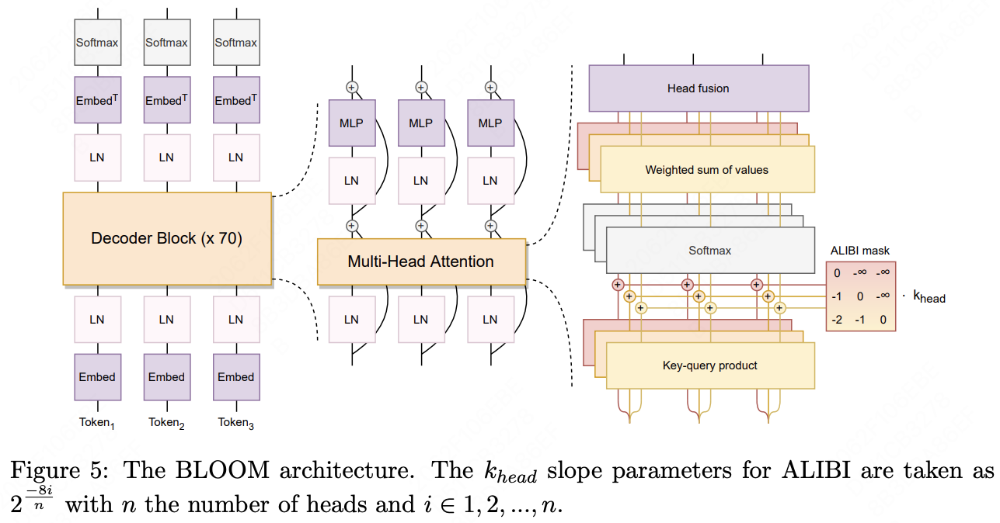

- **消融实验设计**：LLM的主要吸引力是其以"zero/few-shot"的方式执行任务的能力：足够大的模型可以简单的从in-context指令和例子执行新的任务，不需要在监督样本上训练。由于对100B+模型微调很麻烦，我们评估架构决策专注在zero-shot泛化能力上，并且不考虑迁移学习。具体来说，我们衡量了不同任务集合的zero-shot表现：29个任务来自于EleutherAI Language Model Evaluation Harness(EAI-Eval)，9个任务来自T0的验证集(T0-Eval)。两者之间有很大的重叠：T0-Eval中仅有一个任务是不在EAI-Eval，尽管两者的所有prompt都不同。此外，也使用更小的模型进行了消融实验。使用6.7B模型对预训练目标进行消融实验，使用1.3B模型对位置嵌入、激活函数和layer normalization进行消融实验。近期，Dettmers在大于6.7B的模型上发现了相变，观察到了"异常特征"出现。那么在1.3B规模上是否能够外推自最终模型尺寸上？
- **超出范围的架构**：我们没有考虑mixture-of-experts(MoE)，因为缺乏适合大规模训练它的广泛使用的基于GPU的代码库。类似地，我们也没有考虑state-space模型。在设计BLOOM时，它们在自然语言任务中一种表现不佳。这两种方法都很有前景，现在证明了在大规模MoE上有竞争力的结果，并在较小规模上使用具有H3的state-space模型。【提到了MoE和state-space的形式？】


### 架构和预训练目标:

&nbsp;&nbsp;&nbsp;&nbsp;虽然大多数现代语言模型都是基于Transformer架构，但是架构实现之间存在着显著的不同。显然，原始的Transformer是基于encoder-decoder架构的，许多流行的模型仅选择encoder-only或者decoder-only方法。当前，所有超过100B参数的state-of-the-art模型都是decoder-only模型。这与Raffel等人的发现相反，在迁移学习方面encoder-decoder模型显著优于decoder-only模型；

&nbsp;&nbsp;&nbsp;&nbsp;在我们工作之前，文献缺乏不同架构和预训练目标的系统性评估zero-shot泛化能力。我们在Wang et al.(2022a)等人的工作中探索了这个问题，其探索了encoder-decoder和decoder-only架构以及与causal、prefix和masked language modeling预训练模型的相互作用。我们的结果显示，经过预训练之后，causal decoder-only模型的表现最好，验证了state-of-the-art LLM的选择。


### 建模细节:

1. **ALiBi位置嵌入**：相比于在embedding层添加位置信息，ALiBi直接基于keys和queries的距离来衰减注意力分数。虽然ALiBi的最初动机是它能够外推至更长的序列，我们发现其在原始序列长度上也能够带来更平衡的训练以及更好的下游表现，超越了可学习embeddings和旋转embeddings。
<br>
2. **embedding LayerNorm**：在训练104B参数模型的初步试验中，我们尝试在嵌入层后立即进行layer normalization，正如bitsandbytes库及其StableEmbedding层所推荐的那样。我们发现这可以显著的改善训练稳定性。尽管我们在Le Scao et al.工作中发现其对zero-shot泛化有惩罚，但我们还是在BLOOM的第一个embedding层后添加了额外的layer normalization层来避免训练不稳定性。注意初步的104B实验中使用float16，而最终的训练上使用bfloat16。因为float16一直被认为是训练LLM时观察的许多不稳定的原因。bfloat16有可能缓解对embedding LayerNorm的需要。

### 训练框架:

&nbsp;&nbsp;&nbsp;&nbsp;BLOOM使用Megatron-DeepSpeed训练，一个用于大规模分布式训练的框架。其由两部分组成：
- Megatron-LM提供Transformer实现、张量并行和数据加载原语；
- DeepSpeed提供ZeRO优化器、模型流水线、通过分布式训练组件。

这个框架允许我们使用3D并行来高效训练---融合了三种互补的分布式深度学习方法。这些方法描述如下：

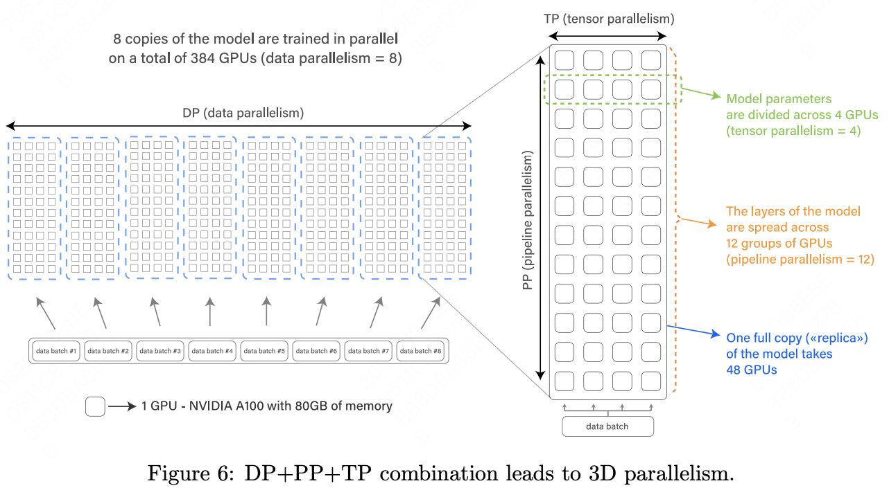

1. 数据并行(Data parallelism, DP)：复制多份模型，每个副本被放置在不同设备上，并输入数据分片。该过程是并行完成的，所有模型副本在每个训练step结束时同步。
2. 张量并行(Tensor parallelism, TP)：跨多个设备来划分模型的独立层。这种方式，我们不把整个激活张量或者梯度张量放在单个GPU上，而是把这个张量的碎片放在单个GPU上。该技术有时被称为水平并行或者层内模型并行。
3. 流水线并行(Pipeline parallelism, PP)：在多个GPU上划分模型的层，每个GPU仅放置模型层的一小部分。这有时也称为垂直并行。
4. 最终，Zero Redundancy Optimizer(ZeRO)运行不同的进程仅持有部分数据(参数、梯度和优化器状态)以及一个训练step所需要的数据。我们使用ZeRO stage 1，意味着仅优化器状态以这种方法进行分片。

上面描述的四个组件组合在一起，可以扩展至数百个GPU，具有极高的GPU利用率。我们能在A100 GPU的最快配置下实现156 TFLOPs，实现了理论峰值312 TFLOPs的一半。

### 浮点数格式:

&nbsp;&nbsp;&nbsp;&nbsp;在初步的实验中，104B参数模型在NVIDIA V100 GPUs，我们观察到数值不稳定，导致不可逆的训练发散。我们假设这些不稳定来自于最初使用的IEEE float16，动态范围非常有限的16-bit浮点数格式，可能导致溢出。我们最终获得了支持bfloat16格式的权限，其具有同float32相同的动态范围。另一方面，bfloat16精度仍然低很多，这促使我们使用混合精度训练。该技术**在float32精度上执行精度敏感的操作，例如梯度累积和softmax，余下的操作则使用低精度，这允许实现高表现和训练稳定性之间的平衡**。最终，我们以bfloat16混合精度执行最终的训练，其被证明解决了训练不稳定的问题。

### 融合CUDA核:

&nbsp;&nbsp;&nbsp;&nbsp;一般来说，GPU无法在检索数据同时执行这些计算。此外，现代GPU的计算性能远远高于每个操作(被称为GPU编程中的核)所需的内存传输速度。核融合是一种基于GPU计算的优化方法，通过在一次内核调用中执行多个连续操作。该方法提供了一种最小化数据传输的方法：中间结果留在GPU寄存器中，而不是复制到VRAM，从而节省开销。
&nbsp;&nbsp;&nbsp;&nbsp;我们使用了Megatron-LM提供了几个定制化融合CUDA核。首先，我们使用一个优化核来执行LayerNorm，以及用核来融合各种缩放、掩码和softmax操作的各种组合。使用Pytorch的JIT功能将一个偏差项添加至GeLU激活中。作为一个使用融合核的例子，在GeLU操作中添加偏差项不会增加额外的时间，因为该操作受内存限制：与GPU VRAM和寄存器之间的数据传输相比，额外的计算可以忽略不计。因此融合这两个操作基本上减少了它们的运行时间。

### 额外的挑战:

&nbsp;&nbsp;&nbsp;&nbsp;扩展至384个GPU需要两个修改：禁止异步CUDA内核启动(为了方便调试和防止死锁)，并将参数组划分至更小的子组(以避免过多的CPU内存分配)。
&nbsp;&nbsp;&nbsp;&nbsp;在训练过程中，我们面临硬件故障的问题：平均来说，每周有1-2个GPU故障。由于备份节点可用并自动使用，并且每三个小时保存一次checkpoint，因此这不会显著影响训练吞吐量。在数据loader中Pytorch死锁bug和磁盘空间故障会导致5-10h的停机时间。考虑到工程问题相对稀疏，而且由于只有一次损失峰值，该模型很快就恢复了，因此人工干预的必要性低于类似项目。


### 训练:

1. **预训练模型**：我们使用上表3中详细描述的超参数来训练BLOOM的6个尺寸变体。架构和超参数来自于我们的实验结果(Le Scao et al.)和先前的训练大语言模型(Brown et al.)。非176B模型的深度和宽度大致遵循先前的文献(Brown et al.)，偏离的3B和7.1B只是为了更容易适合我们训练设置。由于更大的多语言词表，BLOOM的embedding参数尺寸更大。在开发104B参数模型的过程中，我们使用了不同的Adam b参数、权重衰减和梯度裁剪来对目标稳定性进行实验，但没有发现其有帮助。对于所有模型，我们在410B tokens使用cosine学习率衰减调度，在计算允许的情况下，将其作为训练长度的上限，并对375M tokens进行warmup。我们使用权重衰减、梯度裁剪，不使用dropout。ROOTS数据集包含341B tokens的文本。然而，基于训练期间发布的修订scaling laws，我们决定在重复数据上对大模型进行额外25B tokens的训练。由于warmup tokens + decay tokens大于总的token数量，所以学习率衰减始终未达到终点。
2. **多任务微调**：微调的BLOOMZ模型维持了与BLOOM模型相同架构超参数。微调的超参数大致基于T0和FLAN。学习率则是将对应预训练模型的最小学习率加倍，然后再四舍五入。对于较小的变体，全局batch size乘以4来增加吞吐量。模型在13B tokens上进行微调，最优checkpoint根据独立的验证集选择。经过1-6B tokens微调后，性能趋于平稳。
3. **对比微调**：我们还使用了SGPT Bi-Encoder方案对1.3B和7.1B参数的BLOOM模型进行对比微调，以训练产生高质量文本嵌入的模型。我们创建了用于多语言信息检索的SGPT-BLOOM-1.7B-msmarco，以及用于多语言语义相似度的SGPT-BLOOM-1.7B-nli。然而，近期的基准测试发现，这种模型也能够推广到各种其他的嵌入任务，例如bitext挖掘、重排或者下游分类的特征抽取。


    参考来源：https://zhuanlan.zhihu.com/p/603518061


<br>

## 【Baichuan Intelligent Technology】Baichuan:

- 代码地址：https://github.com/baichuan-inc
- 开源模型大小：Baichuan-7B，Baichuan-13B

|         | 基座模型  | 对齐模型 | 对齐模型 4bits 量化 |
|:-------:|:-------:|:-------:|:-----------------:|
| 7B      | 🤗 [Baichuan2-7B-Base](https://huggingface.co/baichuan-inc/Baichuan2-7B-Base) | 🤗 [Baichuan2-7B-Chat](https://huggingface.co/baichuan-inc/Baichuan2-7B-Chat) | 🤗 [Baichuan2-7B-Chat-4bits](https://huggingface.co/baichuan-inc/Baichuan2-7B-Chat-4bits) |
| 13B     | 🤗 [Baichuan2-13B-Base](https://huggingface.co/baichuan-inc/Baichuan2-13B-Base) | 🤗 [Baichuan2-13B-Chat](https://huggingface.co/baichuan-inc/Baichuan2-13B-Chat) | 🤗 [Baichuan2-13B-Chat-4bits](https://huggingface.co/baichuan-inc/Baichuan2-13B-Chat-4bits) |


## Baichuan-7B:

- 代码地址：https://github.com/baichuan-inc/Baichuan-7B
- 模型结构：和LLaMA完全一致
- 模型大小：7B
- 训练数据量：1.2万亿tokens

&nbsp;&nbsp;&nbsp;&nbsp;Baichuan-7B 是由百川智能开发的一个开源可商用的大规模预训练语言模型。基于 Transformer 结构，在大约 1.2 万亿 tokens 上训练的 70 亿参数模型，支持中英双语，上下文窗口长度为 4096。在标准的中文和英文 benchmark（C-Eval/MMLU）上均取得同尺寸最好的效果。

### 数据:

1. 原始数据包括开源的中英文数据和自行抓取的中文互联网数据，以及部分高质量知识性数据。
2. 参考相关数据工作，频率和质量是数据处理环节重点考虑的两个维度。 我们基于启发式规则和质量模型打分，对原始数据集进行篇章和句子粒度的过滤。在全量数据上，利用局部敏感哈希方法，对篇章和句子粒度做滤重。

整体流程如下所示：

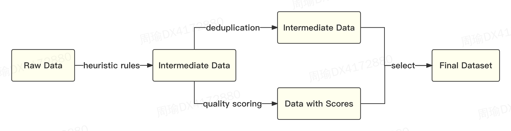

- 经过不断的调整和多轮测试，最终确认了一个在下游任务上表现最好的中英文配比。
- 我们使用了一个基于自动学习的数据权重策略，对不同类别的数据进行配比。

### 分词:

我们参考学术界方案使用 SentencePiece 中的 Byte-Pair Encoding (BPE) 作为分词算法，并且进行了以下的优化：
1. 目前大部分开源模型主要基于英文优化，因此对中文语料存在效率较低的问题。我们使用 2000 万条以中英为主的多语言语料训练分词模型，显著提升对于中文的压缩率。
2. 对于数学领域，我们参考了 LLaMA 和 Galactica 中的方案，对数字的每一位单独分开，避免出现数字不一致的问题，对于提升数学能力有重要帮助。
3. 对于罕见字词（如特殊符号等），支持 UTF-8 characters 的 byte 编码，因此做到未知字词的全覆盖。
4. 我们分析了不同分词器对语料的压缩率，如下表，可见我们的分词器明显优于 LLaMA, Falcon 等开源模型，并且对比其他中文分词器在压缩率相当的情况下，训练和推理效率更高。

|     Model     | Baichuan-7B | LLaMA  | Falcon | mpt-7B | ChatGLM | moss-moon-003 |
| :-----------: | :---------: | :----: | :----: | :----: | :-----: | :-----------: |
| Compress Rate |    0.737    | 1.312  | 1.049  | 1.206  |  0.631  |     0.659     |
|  Vocab Size   |   64,000    | 32,000 | 65,024 | 50,254 | 130,344 |    106,029    |


### 模型结构:

整体模型基于标准的 Transformer 结构，我们采用了和 LLaMA 一样的模型设计：
1. **位置编码**：[rotary-embedding](https://arxiv.org/abs/2104.09864) 是现阶段被大多模型采用的位置编码方案，具有更好的外延效果。虽然训练过程中最大长度为4096，但是实际测试中模型可以很好的扩展到 5000 tokens 以上；
2. **激活层**：SwiGLU, Feedforward 变化为 8/3 倍的隐含层大小，即 11,008；
3. **Layer-Normalization**: 基于 [RMSNorm](https://arxiv.org/abs/1910.07467) 的 Pre-Normalization；

### 训练稳定性和吞吐:

我们在原本的 LLaMA 框架上进行诸多修改以提升训练时的吞吐，具体包括：
1. 算子优化技术：采用更高效算子，如 Flash-Attention，NVIDIA apex 的 RMSNorm 等。
2. 算子切分技术：将部分计算算子进行切分，减小内存峰值。
3. 混合精度技术：降低在不损失模型精度的情况下加速计算过程。
4. 训练容灾技术：训练平台和训练框架联合优化，IaaS + PaaS 实现分钟级的故障定位和任务恢复。
5. 通信优化技术，具体包括：
   1. 采用拓扑感知的集合通信算法，避免网络拥塞问题，提高通信效率。
   2. 根据卡数自适应设置 bucket size，提高带宽利用率。
   3. 根据模型和集群环境，调优通信原语的触发时机，从而将计算和通信重叠。
   
基于上述的几个优化技术，我们在千卡 A800 显卡上达到了 7B 模型 182 TFLOPS 的吞吐，GPU 峰值算力利用率高达 58.3%。

<br>

## Baichuan-13B:

- 代码地址：https://github.com/baichuan-inc/Baichuan-13B
- 模型结构：和Baichuan-7B相对，在PE上从RoPE调整为ALiBi
- 模型大小：13B
- 训练数据量：1.4万亿tokens

&nbsp;&nbsp;&nbsp;&nbsp;Baichuan-13B 是由百川智能继[Baichuan-7B](https://github.com/baichuan-inc/baichuan-7B)之后开发的包含 130 亿参数的开源可商用的大规模语言模型，在权威的中文和英文 benchmark 上均取得同尺寸最好的效果。本次发布包含有预训练 (Baichuan-13B-Base) 和对齐 (Baichuan-13B-Chat) 两个版本。Baichuan-13B 有如下几个特点：
1. **更大尺寸、更多数据**：Baichuan-13B 在 Baichuan-7B 的基础上进一步扩大参数量到 130 亿，并且在高质量的语料上训练了 1.4 万亿 tokens，超过 LLaMA-13B 40%，是当前开源 13B 尺寸下训练数据量最多的模型。支持中英双语，使用 ALiBi 位置编码，上下文窗口长度为 4096。
2. **同时开源预训练和对齐模型**：预训练模型是适用开发者的『 基座 』，而广大普通用户对有对话功能的对齐模型具有更强的需求。因此本次开源我们同时发布了对齐模型（Baichuan-13B-Chat），具有很强的对话能力，开箱即用，几行代码即可简单的部署。
3. **更高效的推理**：为了支持更广大用户的使用，我们本次同时开源了 int8 和 int4 的量化版本，相对非量化版本在几乎没有效果损失的情况下大大降低了部署的机器资源门槛，可以部署在如 Nvidia 3090 这样的消费级显卡上。
4. **开源免费可商用**：Baichuan-13B 不仅对学术研究完全开放，开发者也仅需邮件申请并获得官方商用许可后，即可以免费商用。

### 模型细节:

| 模型名称      | 隐藏层维度  | 层数 | 注意力头数 |词表大小 | 总参数量        | 训练数据（tokens）| 位置编码                                     | 最大长度 |
|--------------|:---------:|:---:|:--------:|:------:|:--------------:|:---------------:|:------------------------------------------:|:-------:|
| Baichuan-7B  | 4,096     | 32  | 32       | 64,000 | 7,000,559,616  | 1.2 万亿         | [RoPE](https://arxiv.org/abs/2104.09864)   | 4,096  |
| Baichuan-13B | 5,120     | 40  | 40       | 64,000 | 13,264,901,120 | 1.4 万亿         | [ALiBi](https://arxiv.org/abs/2108.12409)  | 4,096  |


### 推理性能:

&nbsp;&nbsp;&nbsp;&nbsp;Baichuan-13B 使用了 ALiBi 线性偏置技术，相对于 Rotary Embedding 计算量更小，对推理性能有显著提升；与标准的 LLaMA-13B 相比，平均推理速度 (tokens/s) 实测提升 31.6%：

| Model       | tokens/s |
|-------------|:--------:|
| LLaMA-13B   | 19.4     |
| Baichuan-13B| 25.4     |


<br>

## Baichuan 2:

- 代码地址：https://github.com/baichuan-inc/Baichuan2
- 模型大小：7B、13B
- 训练数据量：2.6万亿tokens


### 特点:

- Baichuan 2 是百川智能推出的新一代开源大语言模型，采用 2.6 万亿 Tokens 的高质量语料训练。
- Baichuan 2 在多个权威的中文、英文和多语言的通用、领域 benchmark 上取得同尺寸最佳的效果。
- 本次发布包含有 7B、13B 的 Base 和 Chat 版本，并提供了 Chat 版本的 4bits 量化。

### 模型评估:

**通用领域7B**：Baichuan2-7B-Base > ChatGLM2-6B > Baichuan-7B > LLaMA2-7B > LLaMA-7B
<br>
**通用领域13B**：ChatGLM2-12B = Baichuan2-13B-Base > Baichuan-13B-Base > LLaMA2-13B > LLaMA-13B
（Baichuan2-7B-Base > Baichuan-13B-Base）
<br>
**法律、医疗 7B**：Baichuan2-7B-Base > ChatGLM2-6B > Baichuan-7B > LLaMA2-7B > LLaMA-7B
<br>
**法律、医疗 13B**：Baichuan2-13B-Base > Baichuan-13B-Base > LLaMA2-13B > LLaMA-13B
（Baichuan2-7B-Base > Baichuan-13B-Base）
<br>
**数学、代码 7B**：ChatGLM2-6B > Baichuan2-7B-Base > LLaMA2-7B > LLaMA-7B > Baichuan-7B
<br>
**数学、代码 13B**：Baichuan2-13B-Base > LLaMA2-13B > Baichuan-13B-Base > LLaMA-13B
（Baichuan2-7B-Base > Baichuan-13B-Base）

<font color="#dd0000"> 从评估结果看，整体上Baichuan2优于ChatGLM2，好于Baichuan，好于 LLaMA2，好于LLaMA；</font>


### 7B 模型通用领域:


|                       | **C-Eval** | **MMLU** | **CMMLU** | **Gaokao** | **AGIEval** | **BBH** |
|:---------------------:|:----------:|:--------:|:---------:|:----------:|:-----------:|:-------:|
|                       |  5-shot    |  5-shot  |  5-shot   | 5-shot     | 5-shot      | 3-shot  |
| **GPT-4**             | 68.40      | 83.93    | 70.33     | 66.15      | 63.27       | 75.12   |
| **GPT-3.5 Turbo**     | 51.10      | 68.54    | 54.06     | 47.07      | 46.13       | 61.59   |
| **LLaMA-7B**          | 27.10      | 35.10    | 26.75     | 27.81      | 28.17       | 32.38   |
| **LLaMA2-7B**         | 28.90      | 45.73    | 31.38     | 25.97      | 26.53       | 39.16   |
| **MPT-7B**            | 27.15      | 27.93    | 26.00     | 26.54      | 24.83       | 35.20   |
| **Falcon-7B**         | 24.23      | 26.03    | 25.66     | 24.24      | 24.10       | 28.77   |
| **ChatGLM2-6B**       | 50.20      | 45.90    | 49.00     | 49.44      | 45.28       | 31.65   |
| **Baichuan-7B**       | 42.80      | 42.30    | 44.02     | 36.34      | 34.44       | 32.48   |
| **Baichuan2-7B-Base** | 54.00      | 54.16    | 57.07     | 47.47      | 42.73       | 41.56   |


### 13B 模型通用领域:

|                             | **C-Eval** | **MMLU** | **CMMLU** | **Gaokao** | **AGIEval** | **BBH** |
|:---------------------------:|:----------:|:--------:|:---------:|:----------:|:-----------:|:-------:|
|                             |  5-shot    |  5-shot  |  5-shot   | 5-shot     | 5-shot      | 3-shot  |
| **GPT-4**                   | 68.40      | 83.93    | 70.33     | 66.15      | 63.27       | 75.12   |
| **GPT-3.5 Turbo**           | 51.10      | 68.54    | 54.06     | 47.07      | 46.13       | 61.59   |
| **LLaMA-13B**               | 28.50      | 46.30    | 31.15     | 28.23      | 28.22       | 37.89   |
| **LLaMA2-13B**              | 35.80      | 55.09    | 37.99     | 30.83      | 32.29       | 46.98   |
| **Vicuna-13B**              | 32.80      | 52.00    | 36.28     | 30.11      | 31.55       | 43.04   |
| **Chinese-Alpaca-Plus-13B** | 38.80      | 43.90    | 33.43     | 34.78      | 35.46       | 28.94   |
| **XVERSE-13B**              | 53.70      | 55.21    | 58.44     | 44.69      | 42.54       | 38.06   |
| **Baichuan-13B-Base**       | 52.40      | 51.60    | 55.30     | 49.69      | 43.20       | 43.01   |
| **Baichuan2-13B-Base**      | 58.10      | 59.17    | 61.97     | 54.33      | 48.17       | 48.78   |


### 量化部署:

为了让不同的用户以及不同的平台都能运行 Baichuan 2 模型，我们针对 Baichuan 2 模型做了相应地量化工作（包括 Baichuan2-7B-Chat 和 Baichuan2-13B-Chat），方便用户快速高效地在自己的平台部署 Baichuan 2 模型。

### 量化方法:

Baichuan 2 的采用社区主流的量化方法：[BitsAndBytes](https://github.com/TimDettmers/bitsandbytes)。该方法可以保证量化后的效果基本不掉点，目前已经集成到 transformers 库里，并在社区得到了广泛应用。BitsAndBytes 支持 8bits 和 4bits 两种量化，其中 4bits 支持 FP4 和 NF4 两种格式，Baichuan 2 选用 NF4 作为 4bits 量化的数据类型。  
  
基于该量化方法，Baichuan 2 支持在线量化和离线量化两种模式。

### 在线量化:

对于在线量化，我们支持 8bits 和 4bits 量化，使用方式和 [Baichuan-13B](https://huggingface.co/baichuan-inc/Baichuan-13B-Chat) 项目中的方式类似，只需要先加载模型到 CPU 的内存里，再调用`quantize()`接口量化，最后调用 `cuda()`函数，将量化后的权重拷贝到 GPU 显存中。实现整个模型加载的代码非常简单，我们以 Baichuan2-7B-Chat 为例：

8bits 在线量化:
```python
model = AutoModelForCausalLM.from_pretrained("baichuan-inc/Baichuan2-7B-Chat", torch_dtype=torch.float16, trust_remote_code=True)
model = model.quantize(8).cuda() 
```
4bits 在线量化:
```python
model = AutoModelForCausalLM.from_pretrained("baichuan-inc/Baichuan2-7B-Chat", torch_dtype=torch.float16, trust_remote_code=True)
model = model.quantize(4).cuda() 
```
需要注意的是，在用 `from_pretrained` 接口的时候，用户一般会加上 `device_map="auto"`，在使用在线量化时，需要去掉这个参数，否则会报错。

#### 离线量化:

为了方便用户的使用，我们提供了离线量化好的 4bits 的版本 [Baichuan2-7B-Chat-4bits](https://huggingface.co/baichuan-inc/Baichuan2-7B-Chat-4bits/tree/main)，供用户下载。
用户加载 Baichuan2-7B-Chat-4bits 模型很简单，只需要执行:
```python
model = AutoModelForCausalLM.from_pretrained("baichuan-inc/Baichuan2-7B-Chat-4bits", device_map="auto", trust_remote_code=True)
```
对于 8bits 离线量化，我们没有提供相应的版本，因为 Hugging Face transformers 库提供了相应的 API 接口，可以很方便的实现 8bits 量化模型的保存和加载。用户可以自行按照如下方式实现 8bits 的模型保存和加载：
```python
# Model saving: model_id is the original model directory, and quant8_saved_dir is the directory where the 8bits quantized model is saved.
model = AutoModelForCausalLM.from_pretrained(model_id, load_in_8bit=True, device_map="auto", trust_remote_code=True)
model.save_pretrained(quant8_saved_dir)
model = AutoModelForCausalLM.from_pretrained(quant8_saved_dir, device_map="auto", trust_remote_code=True)
```

#### 量化效果:

量化前后显存占用对比 (GPU Mem in GB)：
| Precision   | Baichuan2-7B |Baichuan2-13B |
|-------------|:------------:|:------------:|
| bf16 / fp16 | 15.3         | 27.5         |
| 8bits       | 8.0          | 16.1         |
| 4bits       | 5.1          | 8.6          |

量化后在各个 benchmark 上的结果和原始版本对比如下：

| Model 5-shot           | C-Eval | MMLU | CMMLU |
|------------------------|:------:|:----:|:-----:|
| Baichuan2-13B-Chat      | 56.74  | 57.32| 59.68  |
| Baichuan2-13B-Chat-4bits | 56.05   | 56.24 | 58.82  |
| Baichuan2-7B-Chat       | 54.35   | 52.93 | 54.99  |
| Baichuan2-7B-Chat-4bits | 53.04   | 51.72 | 52.84  |
> C-Eval 是在其 val set 上进行的评测

可以看到，4bits 相对 bfloat16 精度损失在 1 - 2 个百分点左右。


<br>

## 【Google】Switch Transformers:

- 代码地址：https://github.com/tensorflow/mesh
- 论文地址：https://arxiv.org/abs/2101.03961
- 模型结构：在transformer中FNN部分，采用多FNN路由方式
- 模型大小：1571B

&nbsp;&nbsp;&nbsp;&nbsp;在现有的深度神经网络方法中，针对模型的输入，所有的参数都会参与计算。在预训练模型参数量变的越来越大的情况下，计算资源的需求也会变得巨大。而Mixture of Experts（MoE）改变了这种情况。MoE可以为不同的输入选择性地激活模型中的一部分参数参与计算，这样在增大模型参数量的同时，计算量可以维持相对不变。
&nbsp;&nbsp;&nbsp;&nbsp;**本文就基于MoE的思想，将Transformer中的前馈全连接子层（Feed-Forward Network，FFN）视为Expert，使用多个FFN代替原来单一的FFN，并且使用了最简单的路由选择策略，将K设置为1，即不同的输入只会选择一个FFN进行计算**。这样相比较于原来的结构，计算量只增加了路由选择的计算量，而新增的计算量相比较于原来的计算量而言可以忽略，这样就实现了增大模型参数的同时维持相对不变的计算量。

1）Switch Transformer在网络结构上最大的改进是Sparse routing的稀疏结构，相比于OpenAI在GPT-3里所使用的Sparse Attention，需要用到稀疏算子而很难发挥GPU、TPU硬件性能的问题。Switch Transformer不需要稀疏算子，可以更好的适应GPU、TPU等硬件
2）Switch Transformer虽然有1.6万亿参数，但通过Sparse routing的改进，每轮迭代只会触发部分Expert的计算，而每个token也只会路由给一个Expert，所以对算力的需求并没有随着参数量的增加而大幅增长，使得这个模型更加容易训练。
3）数据并行、模型并行、Expert并行的并行策略设计，在MoE网络结构上能够获得更低的通信开销，提高并行的效率。

### 模型结构:

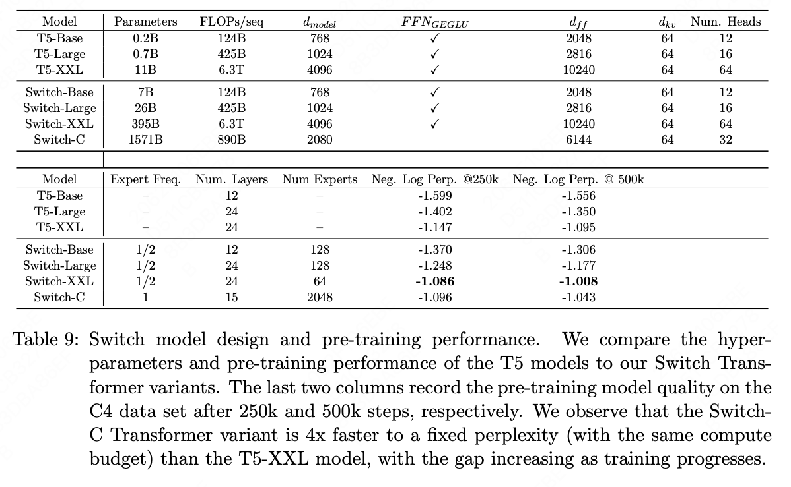

### 1.模型结构——简化稀疏路由:

&nbsp;&nbsp;&nbsp;&nbsp;混合专家模型（MoE）：x表示每一个token的输入，则通过路由权重计算得到的logits为h(x)，门控值（gated value）通过所有专家的logits使用softmax计算得到。输出y来自不同的专家的加权和，权重即路由门控值得到。

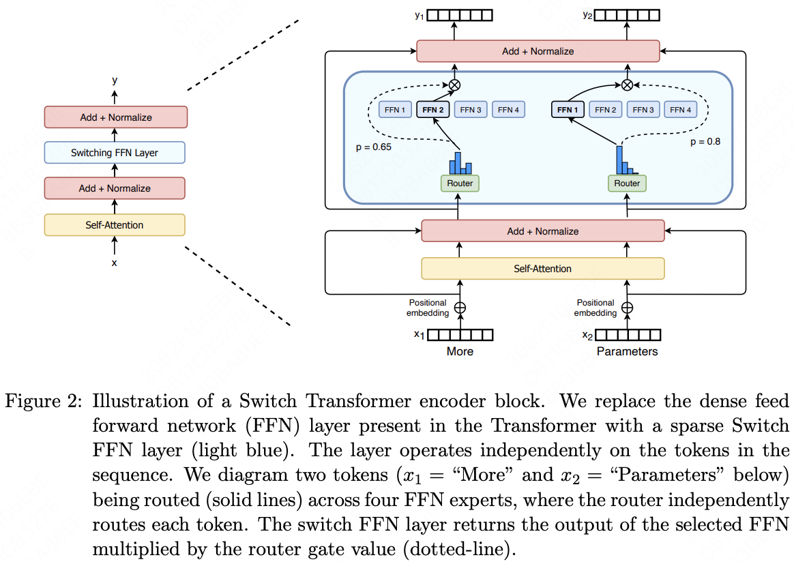

从上图可以看出，Router路由专家模块，是作用在token维度上；
<br>
<br>
**Switch Routing:**

本文中使用了一个创新的路由策略，即每次只发给一个专家，这样可以简化路由的计算量的同时保证模型的性能。这样做的优势：
- （1）路由计算量减少，只有一个expert激活；
- （2）expert中的batch_size（专家容量）至少减半；
- （3）简化路由的实现，减少传统MOE方法中通信的代价。

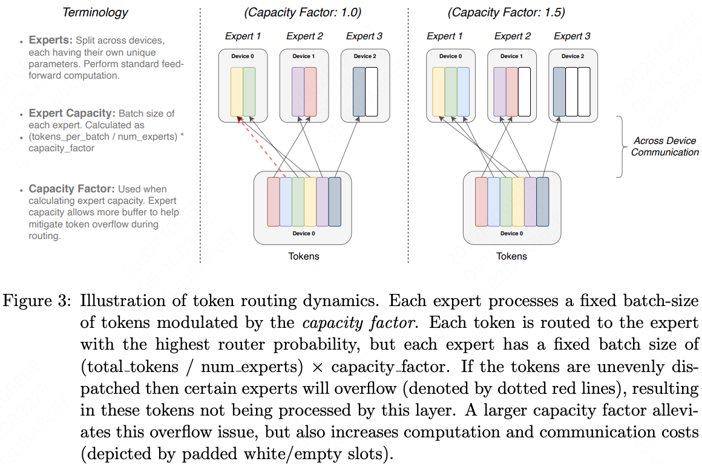

&nbsp;&nbsp;&nbsp;&nbsp;由上图可以看出，每个experts都有一个固定的batchsize = (total_tokens / num_experts) * capacty_factor；每个token只会被路由到概率最大的expert，如果说超出了experts上限，则新的token将不会被该层进行处理；


### 2. 模型结构——高效稀疏路由:

**分布式Switch实现**：
- （1）问题：模型编译是静态确定的，计算是动态的，如何确定每一个expert维度；
- （2）方法：使用capacity factor扩展，太多的容量导致计算和内存消耗增加，太小的容量导致token被放弃计算传到下一层，结论是经验性的根据“model quality and speed”的权衡来选择较低比例“dropped tokens”。

**Load Balancing Loss**:
为了促使每个expert都可以拿到近似均匀分布的样本，这里引入负载均衡损失。当f_i= p_i= 1/N的时候损失是最小的。

**实验：**

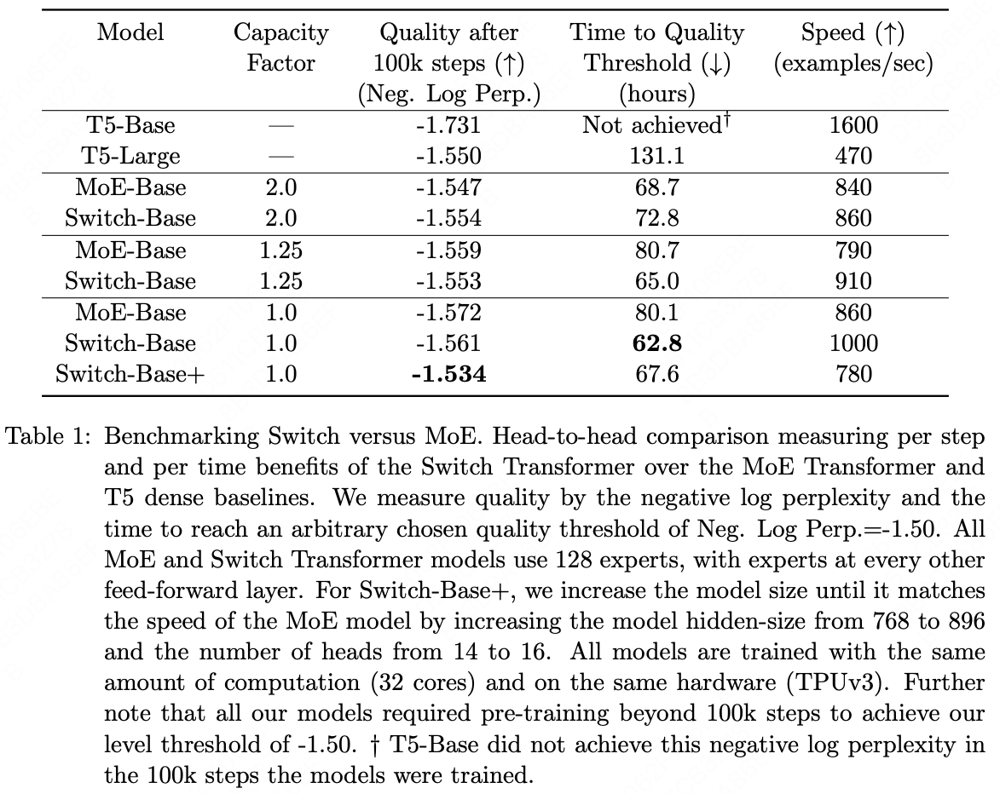

本文采用的实验是T5模型的基础上应用switch transformer和MOE，下面是一些结论：
- （1）Switch Transformer比MoE和Dense模型都要好；
- （2）Switch Transformer在capacity比较小的时候效果更好；
- （3）Switch Transformer比MoE要少一点计算量，如果让它们计算量相等的话，那么Switch Transformer还可以有更多提升(Switch-base-Expand)。


### 3. 为什么高效——数据、模型及专家并行:

&nbsp;&nbsp;&nbsp;&nbsp;本章属于高效执行这小部中最重要的部分，是关于并行部分的解释，这里补充一下关于各种并行的方法的解释。标准的数据并行的定义是一个batch的数据在不同的device上并行处理，这时每一个device上都保存了模型的一份完整拷贝，前向计算完进行梯度汇总和更新。模型并行表示模型不同的参数（层、组件）分配到不同的device上，处理一个batch的数据。
&nbsp;&nbsp;&nbsp;&nbsp;本文中下图中上面一行整体表示权重的分配方式，下面一行表示数据的分配方式，一种颜色表示一个矩阵（a unique weight matrix）。其中每一个方格表示一个core。

**数据并行：**
&nbsp;&nbsp;&nbsp;&nbsp;第一列表示数据并行，模型权重拷贝16份，16个同一种颜色矩阵分别表示一个完整的模型，数据侧则是一个完整的矩阵，这里可以理解为16个模型计算完成后由于存在梯度汇总再更新的步骤，所以整体更新的是一个batch，因此这里数据侧是一个唯一的矩阵。简单来说就是模型复制，数据并行。

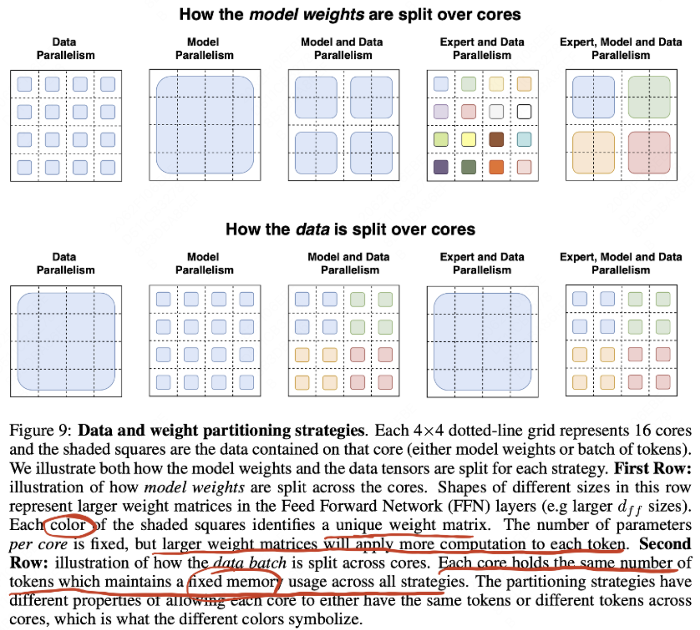


**模型并行：**

&nbsp;&nbsp;&nbsp;&nbsp;模型并行部分从模型侧看出来，16个cores维护的是一个整体的模型，但是每一个core只分配到其中非常高通信代价，同一个batch在所有的core上计算，由于1个core中分布了不同的模型权重，每次计算完都需要和其他的core进行通信。

**专家并行：**

&nbsp;&nbsp;&nbsp;&nbsp;原本路由机制只会分配给当前core中的不同的expert，现在则有可能会分配到其他的core下的expert，范围更大。

**实验结论：**
- （1）switch-C表示和T5有相同的ppl下速度是T5的4倍，并且随着训练进行还会继续扩大优势；
- （2）switch-xxl是和T5有相同的FLOPs/seq下，效果好于T5；
- （3）从最后两列看出，switch的两个模型的样本利用率高于T5，T5在500k steps下才能达到switch效果。

**Training Tricks：**

- **1.大型稀疏模型中使用随机精度：**

    - Switch Transformer参数量达到了一万多亿，为了保证计算效率，降低到每次过只过一个expert，这样相当于关闭了模型某些部分的硬切换机制，就引入了稀疏性，而稀疏性会导致模型训练不稳定，换句话说，就是稀疏模型可能会对随机种子比较敏感。
    - 当使用bfloat16精度的时候，模型的不稳定性会影响训练性能。这个bfloat16是谷歌的一个格式，全称叫Google Brain Floating Point。MoE Transformer中使用了float32精度来训练，这样会带来一定的通信成本。所以这里作者使用了selectively casting，只在模型的local部分使用float32的精度，这样可以实现稳定性。
    - 具体来说，在router的输入端使用float32精度，并且只在router函数中使用，也就是说在当前设备的局部进行计算。在函数结束进行广播通信的时候，使用bfloat16精度，把这个API暴露给网络其余部分，因此float32的值永远不会离开本地设备，而且设备间通信仍然保持低精度。这样既可以从float32精度中获得收益，也不会带来额外的通信成本。
  
下面这个表说明了这种方法的好处，可以看到，作者提出的这种方法可以保证和bfloat16一样的训练速度，但是获得了媲美float32精度训练的稳定性。

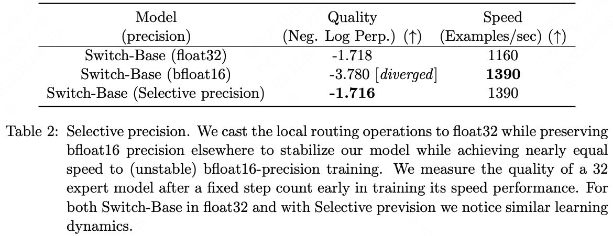


- **2.使用更小的参数初始化来保证稳定性：**

    - 其motivation还是为了保证模型的稳定性。作者观察到，在Switch Transformer中，合适的初始化方法也是成功训练的一个重要因素。他们的做法是，用均值μ=0，标准差σ=√s / n的截断正态分布来对权重矩阵进行初始化，其中s是放缩超参，n是权重向量输入的数量。这里作为减小路由数量不稳定性的一个补救，作者把transformer默认的初始化s从1.0缩小10倍。他们发现这样的话既可以提高质量，又可以减少实验中训练不稳定的可能性。
    - 下面的表三测量了训练初期，模型质量的改善还有方差的降低。作者发现，用这个negative log perp度量的平均模型质量得到了一个比较大的改善，而且运行多次的方差也减少了很多，从0.68到0.01。他们使用这个方法，把200多兆参数量的baseline稳定地训练成了超过一万亿个参数的超大模型。

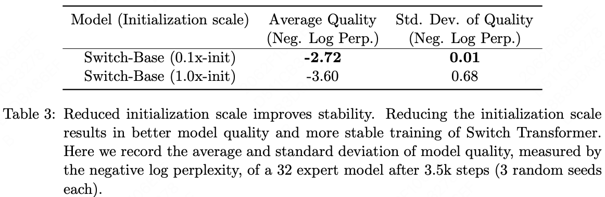


- **3.对Switch Tranformer这种大型稀疏模型做正则：**

    - 因为这篇论文是在一个大的语料库上做预训练，然后在比较小的下游任务做微调，一个比较自然的问题就是过拟合问题，因为许多微调任务中比较缺乏数据。Switch Transformer比一些dense model的参数要多很多，这样可能会导致在这种比较小的下游任务上更容易过拟合。
    - 之前有一些工作使用dropout来防止过拟合。这篇文章是提出了一种比较简单的在微调时候减轻过拟合问题的方法，就是增加expert内部的dropout，他们叫expert dropout。在微调的时候，只在每个expert层的过渡的feed-forward层计算的时候大幅增加dropout的概率。
    - 下面的表四做了这部分的实验，我们可以发现，只是简单对所有层都增加dropout之后，会得到一个比较差的结果，当给非expert层设置一个比较小的dropout，也就是0.1，给expert层设置一个比较大的dropout rate会在四个下游任务上得到一定性能的提升。


- **4.No-Token-Left-Behind机制：**

    - 因为TPU是有限制的，张量的shape必须是静态的，所以每个expert处理token表示的能力是有限而且固定的，但是模型在运行时是动态路由token的，通过softmax概率来进行路由，这样可能会导致在expert上的不均匀分布。如果发送给expert的token数小于expert的实际容量，这样是对硬件的低效使用。所以作者用了一个方法解决这个问题。这里作者构建了No-Token-Left-Behind机制，它重点在于反复地把第一次路由的所有溢出的token重新进行路由，下图是这个机制的说明。
	- 可以看到，第一轮路由溢出的token，在第二轮被重新路由到了概率第二高的expert中，这样正好达到了饱和。如果第二轮还有溢出，就还会继续迭代下去。这里需要注意的是，作者在实验中发现，这种trick虽然保证了资源的利用率，但是并没有带来什么性能上的提升。这里他们猜测，一旦网络学习到了token和expert之间的联系，如果使用这种机制，向第二甚至第三的expert发送了token，相当于对token和expert的联系进行了更改，这样可能也会影响性能。

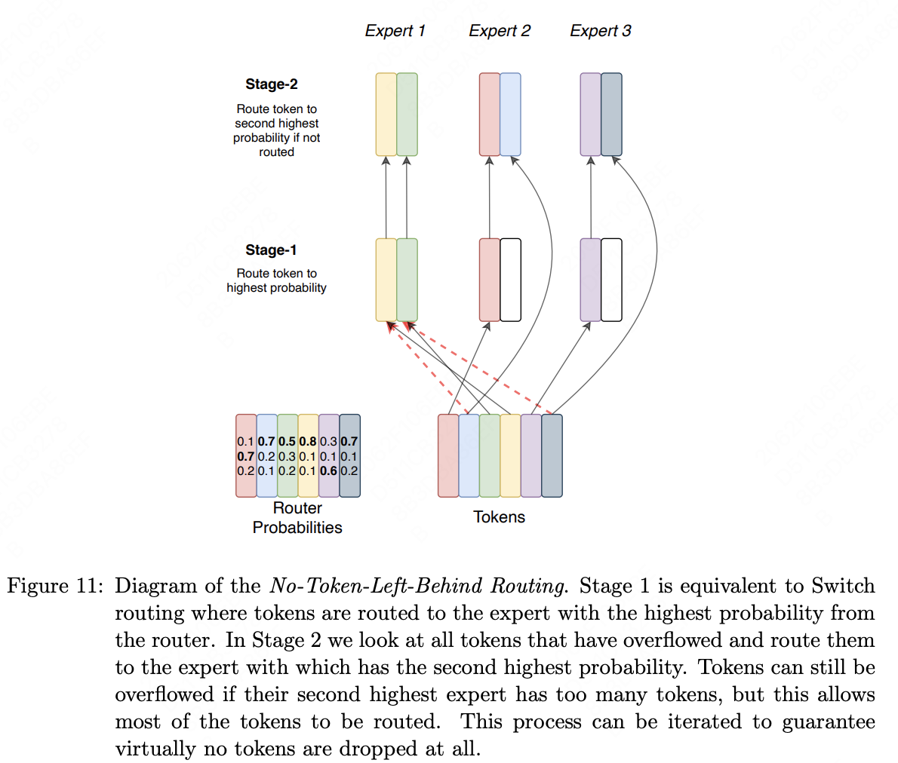


### 4.Switch for Attention:

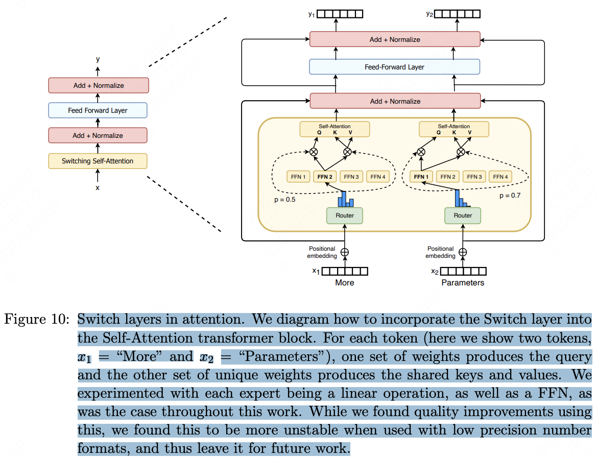

每个token通过Router模块选择对应的FNN，再生成attention部分需要的k，q，v矩阵；


### 5.为什么Sparse Model尚未广泛使用？

尝试Sparse Model的动机受到了Dense Model的巨大成功的阻碍（其成功是由与深度学习硬件的共同适应驱动的）。此外，Sparse Model存在以下几方面的阻碍：
- （1）模型复杂性；
- （2）训练困难；
- （3）通信成本。Switch Transformer在缓解这些问题上取得了巨大进步。


