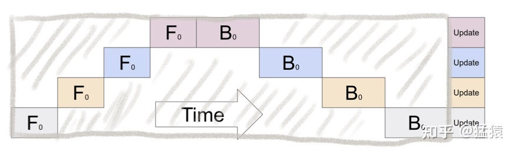

# LLM训练指南

## 目录

- [1.方法总览](#1方法总览)
- [2.分布式并行范式](#2分布式并行范式)
  - [2.1 pipeline-parallelism](#21-流水线并行pipeline-parallelism)
  - [2.2 dp-ddp](#22-数据并行dp-ddp)
  - [2.3 zero](#23-zero-redundancy-optimizer)
- [3.参数高效微调](#3参数高效微调)
  - [3.1 prefix/prompt tuning](#31-prefixprompt-tuning)
  - [3.2 adapter](#32-adapter-tuning)
  - [3.3 lora](#33-lora)
- [4.训练框架对比](#4训练框架对比)

 

## 1.方法总览:

对于大模型的训练，最关键的就是两个问题：能训练更大的模型、能更快地训练模型；
 
下表将目前主流的训练优化方式，分为工程/算法两个大类，从规模/速度两个角度进行的总结，工程侧主要侧重于分布式并行，算法侧主要关注参数高效微调。

|分类| 方向 | 方法                          | 思路                                                                                                            | 优劣                                                                                                        | 实现                                               |
|-|----|-----------------------------|---------------------------------------------------------------------------------------------------------------|-----------------------------------------------------------------------------------------------------------|--------------------------------------------------|
|工程| 规模 | 流水线并行(Pipeline Parallelism) | <li> 将模型的不同层放到不同的GPU上   <li> 通过切割mini-batch实现对训练数据的流水线处理，提升GPU计算通讯比   <li> 通过re-materialization机制降低显存消耗 | <li> 优势：能突破单卡显存限制，训练大模型   <li> 劣势：模型不能均匀切割时，影响了整体计算效率                                                  | Gpipe                                            |
|工程| 速度 | 数据并行(Data Parallelisim）     | <li> 各个GPU上都拷贝一份模型   <li> 各自吃一份数据、算一份梯度   <li> 最后对梯度进行累加，更新模型                                           | <li> 优势：GPU利用率高，空转时间少   <li> 劣势： 1、模型大小受单卡显存限制； 2、GPU间的通讯量巨大                                     | DP、DDP                                           |
|工程| 规模 | 张量并行(Tensor Parallelisim)   | <li> 将模型参数纵向切开，放到不同的GPU上独立计算，再进行聚合                                                                            | <li> 优势： 1、能突破单卡显存限制，训练大模型；  2、GPU利用率高，空转时间少   <li> 劣势： 1、通讯量大，成为训练瓶颈之一； 2、需要对模型进行分割和重新设计，增加了实现的难度 | Megatron                                         |
|工程| 速度 | 混合精度训练                      | <li> 优化器参数用fp32存储，模型参数、激活值、梯度值用fp16存储。计算量和存储量减少                                                               | <li> 优势：训练速度快   <li> 劣势：精度下降，效果可能有一定程度下降                                                                                                      |                                                  |
|工程| 规模 | 零冗余优化(ZeRO)                 | <li> 将优化器、梯度、模型都切分后放到不同的gpu上   <li> 每次计算时，通过AllReduce将各gpu保存的参数聚合后再计算，计算完成后立即释放                            | <li> 优势：大幅度减少显存占用                                                                                                      | Deepspeed                                        |
|工程| 规模 | 异构内存                        | <li> 显存不够，内存来凑   <li> 将计算量高的部分保留在gpu中   <li> 将计算量低的部分卸载到cpu上                                            | <li> 优势：相比跨机，既能降显存，又能减少一些通讯压力                                                                                                      | ZeRO-Offload Gemini                              |
|算法| 速度 | Adapter                     | <li> 在每个Transformer层中加入两个adapter，adapter通过映射减小参数量   <li>进行微调时，只训练adapter参数                                 | <li> 劣势：引入了额外的推理延迟                                                                                                      |                                              |
|算法| 速度  | prompt                      | <li> 固定预训练LM不动，为LM添加可训练、任务特定的连续向量前缀                                                                           | <li> 劣势：难以训练，且预留给prompt的序列挤占了下游任务的输入序列空间，影响模型性能                                                                                                      | Prefix-Tuning、P-tuning、Prompt-tuning、P-Tuning v2 |
|算法| 速度 | lora                        | <li> 在自注意力层的四个权重矩阵旁边增加一个旁路，做一个降维再升维的操作   <li> 训练的时候固定PLM的参数，只训练降维矩阵A与升维矩阵B。而模型的输入输出维度不变，输出时将BA与PLM的输出叠加    |                                                                                                       |                                              |

 

## 2.分布式并行范式:

### 2.1 流水线并行（Pipeline Parallelism）
	朴素的模型并行存在GPU利用度不足，中间结果消耗内存大的问题。而Gpipe提出的流水线并行，就是用来解决这两个主要问题的。GPU利用度不够&内存消耗大：

&nbsp;&nbsp;&nbsp;&nbsp;阴影部分所表示的时间段里，总有GPU在空转。GPU的数量越多时，空置的比例接近1，即GPU的资源都被浪费掉了。

&nbsp;&nbsp;&nbsp;&nbsp;在做backward计算梯度的过程中，我们需要用到每一层的中间结果z。假设我们的模型有L层，每一层的宽度为d，则对于每块GPU，不考虑其参数本身的存储，额外的空间复杂度为 O(N*(L/K)*d)。从这个复杂度可以看出，随着模型的增大，N，L，d三者的增加可能会平滑掉K增加带来的GPU内存收益。因此，这也是需要优化的地方。

#### 2.1.1 切分micro-batch：

&nbsp;&nbsp;&nbsp;&nbsp;流水线并行的核心思想是：**在模型并行的基础上，进一步引入数据并行的办法，即把原先的数据再划分成若干个batch，送入GPU进行训练**。未划分前的数据，叫mini-batch。在mini-batch上再划分的数据，叫micro-batch。

#### 2.1.2 re-materialization (active checkpoint)：

&nbsp;&nbsp;&nbsp;&nbsp;随着模型的增加，每块GPU中存储的中间结果也会越大，因此，Gpipe采用时间换空间的方法，即在计算过程中几乎不存中间结果，等到backward的时候，再重新算一遍forward，图例如下：

### 2.2 数据并行（DP, DDP）：

#### 2.2.1 Data Parallelism：

一个经典数据并行的过程如下：
1. 若干块计算GPU，如图中GPU0~GPU2；1块梯度收集GPU，如图中AllReduce操作所在GPU。
2. 在每块计算GPU上都拷贝一份完整的模型参数。
3. 把一份数据X（例如一个batch）均匀分给不同的计算GPU。
4. 每块计算GPU做一轮FWD和BWD后，算得一份梯度G。
5. 每块计算GPU将自己的梯度push给梯度收集GPU，做聚合操作。这里的聚合操作一般指梯度累加。当然也支持用户自定义。
6. 梯度收集GPU聚合完毕后，计算GPU从它那pull下完整的梯度结果，用于更新模型参数W。更新完毕后，计算GPU上的模型参数依然保持一致。

实现DP的一种经典编程框架叫“参数服务器”，在这个框架里，计算GPU称为Worker，梯度聚合GPU称为Server。在实际应用中，为了尽量减少通讯量，一般可选择一个Worker同时作为Server。比如可把梯度全发到GPU0上做聚合。

#### 2.2.2 Distributed Data Parallelism：

&nbsp;&nbsp;&nbsp;&nbsp;DDP采用Ring-AllReduce的方法，非常有效的解决了数据并行中通讯负载不均的问题，将Server上的通讯压力均衡转移到各个Worker上，实现这一点后，可以进一步去Server，留Worker。

Ring-AllReduce会定义网络拓扑关系，使得每个GPU只和其相邻的两块GPU通讯。每次发送对应位置的数据进行累加。每一次累加更新都形成一个拓扑环，因此被称为Ring。
DP和DDP的总通讯量相同，但因负载不均的原因，DP需要耗费更多的时间搬运数据。

### 2.3 Zero Redundancy Optimizer：

在大模型训练的过程中，GPU需要存储的内容主要分为两大块：Model States和Residual States。

|分类| 名称 | 作用                          | 是否必要 |
|-|----|-----------------------------|------|
|Model States| optimizer state | Adam优化算法中的momentum和variance | 是    |
|Model States| gradients | 模型梯度                        | 是    |
|Model States| parameters | 模型参数W                       | 是    |
|Residual States| activation | 激活值。在backward过程中使用链式法则计算梯度时会用到，有了它算梯度会更快，但它不是必须存储的，因为可以通过重新做Forward来算它                          | 否    |
|Residual States| temporary buffers | 临时存储。例如把梯度发送到某块GPU上做加总聚合时产生的存储。                          | 否   |
|Residual States| unusable fragment memory | 碎片化的存储空间。虽然总存储空间是够的，但是如果取不到连续的存储空间，相关的请求也会被fail掉。对这类空间浪费可以通过内存整理来解决。                          | 否   |

实际上，在整个训练中，有很多states并不会每时每刻都在用，举例来说：
1. Adam优化下的optimizer states只在最终做update时才用到；
2. 数据并行中，gradients只在最后做AllReduce和updates时才用到；
3. 参数W只在做forward和backward的那一刻才用到；
因此，ZeRO的思路是：如果数据算完即废，等需要时的时候，再想办法从其他地方拿回来，这样就节省出一笔存储空间了：

#### 2.3.1 优化状态分割：

将optimizer state分成若干份，每块GPU上各自维护一份。这样就减少了相当一部分的显存开销；
- 每块GPU上存一份完整的参数W。将一个batch的数据分成3份，每块GPU各吃一份，做完一轮foward和backward后，各得一份梯度；
- 做一次AllReduce，得到完整的梯度G；
- 整梯度G，就可以对W做更新。我们知道W的更新由optimizer states和梯度共同决定。由于每块GPU上只保管部分optimizer states，因此只能将相应的W（第二幅图蓝色部分）进行更新；
- 每块GPU上都有部分W没有完成更新（图中白色部分）。所以我们需要对W做一次All-Gather，从别的GPU上把更新好的部分W取回来。

#### 2.3.2 优化状态与梯度分割：

更近一步，把梯度也拆开，每个GPU只维护一块梯度；
- 每块GPU上存一份完整的参数W。将一个batch的数据分成3份，每块GPU各吃一份，做完一轮foward和backward后，算得一份完整的梯度（第二幅图中绿色+白色）
- 做一次Reduce-Scatter，保证每个GPU上所维持的那块梯度是聚合梯度。例如对GPU1，它负责维护G1，因此其他的GPU只需要把G1对应位置的梯度发给GPU1做加总就可。汇总完毕后，白色块对GPU无用，可以从显存中移除。
- PU用自己对应的O和G去更新相应的W。更新完毕后，每块GPU维持了一块更新完毕的W。同理，对W做一次All-Gather，将别的GPU算好的W同步到自己这来。

#### 2.3.3 优化状态与梯度分割：

ZeRO的思想就是：万物皆可切，万物皆可抛。最终把参数也切开。每块GPU置维持对应的optimizer states，gradients和parameters（即W）；
- 每块GPU上只保存部分参数W。将一个batch的数据分成3份，每块GPU各吃一份。
- 做forward时，对W做一次All-Gather，取回分布在别的GPU上的W，得到一份完整的W，forward做完，立刻把不是自己维护的W抛弃
- 做backward时，对W做一次All-Gather，取回完整的W，backward做完，立刻把不是自己维护的W抛弃。
- 做完backward，算得一份完整的梯度G，对G做一次Reduce-Scatter，从别的GPU上聚合自己维护的那部分梯度，聚合操作结束后，立刻把不是自己维护的G抛弃。
- 用自己维护的O和G，更新W。由于只维护部分W，因此无需再对W做任何AllReduce操作。

 

## 3.参数高效微调:

### 3.1 Prefix/Prompt-Tuning：

在模型的输入或隐层添加 K个额外可训练的前缀 tokens（这些前缀是连续的伪 tokens，不对应真实的 tokens），只训练这些前缀参数；

#### 3.1.1 Prefix Tuning：

&nbsp;&nbsp;&nbsp;&nbsp;**Prefix-Tuning 在模型输入前添加一个连续的且任务特定的向量序列（continuous task-specific vectors），称之为前缀（prefix）**。前缀被视为一系列“虚拟 tokens”，但是它由不对应于真实 tokens 的自由参数组成。与更新所有 PLM 参数的全量微调不同，**Prefix-Tuning 固定 PLM 的所有参数，只更新优化特定任务的 prefix**。因此，在生产部署时，只需要存储一个大型 PLM 的副本和一个学习到的特定任务的 prefix，每个下游任务只产生非常小的额外的计算和存储开销。

#### 3.1.2 P-Tuning：
&nbsp;&nbsp;&nbsp;&nbsp;P-Tuning 的方法思路与 Prefix-Tuning 很相近，P-Tuning 利用少量连续的 embedding 参数作为 prompt 使 GPT 更好的应用于 NLU 任务，而 Prefix-Tuning 是针对 NLG 任务设计，同时，P-Tuning 只在 embedding 层增加参数，而 Prefix-Tuning 在每一层都添加可训练参数。

### 3.2 Adapter Tuning：

&nbsp;&nbsp;&nbsp;&nbsp;将较小的神经网络层或模块插入预训练模型的每一层，这些新插入的神经模块称为adaptor（适配器），下游任务微调时也只训练这些适配器参数.
Adapter 主要包括 Series Adapter（串行） 和 Parallel Adapter（并行）：
- Series Adapter的适配器结构和与 Transformer 的集成如下图（a）所示。适配器模块被添加到每个 Transformer 层两次：多头注意力映射之后和两层前馈神经网络之后。适配器是一个 bottleneck（瓶颈）结构的模块，由一个两层的前馈神经网络（由向下投影矩阵、非线性函数和向上投影矩阵构成）和一个输入输出之间的残差连接组成。
- Parallel Adapter如下图（b）所示。将适配器模块与每层 Transformer 的多头注意力和前馈层并行计算集成。

### 3.3 LoRA：

&nbsp;&nbsp;&nbsp;&nbsp;通过学习小参数的低秩矩阵来近似模型权重矩阵的参数更新，训练时只优化低秩矩阵参数。
1. 在自注意力层的四个权重矩阵Wq, Wk, Wv, Wo的所有或者部分旁边增加一个旁路，做一个降维再升维的操作，来模拟所谓的 intrinsic rank 。
2. 训练的时候固定LLM的参数，只训练降维矩阵A与升维矩阵B。而模型的输入输出维度不变，输出时将BA与LLM的输出叠加。
3. 用随机高斯分布初始化A，用0矩阵初始化B，保证训练的开始此旁路矩阵依然是0矩阵。
4. 这种思想有点类似于残差连接，同时使用这个旁路的更新来模拟full fine-tuning的过程。并且，full fine-tuning可以被看做是LoRA的特例（当r等于k时）。

## 4.训练框架对比：

| 名称 | 介绍   | 适用范围 |
|--|------|------|
| transformers | huggingface开源的预训练模型库 | SFT  |
| peft | huggingface开源的参数高效微调库，实现了四种低参数微调方法。封装程度较高，和transformers适配程度强，一键式微调模型 | SFT  |
| trlx | 强大的transformer 强化学习库，当前支持模型有Hugging Face【基于transformers库训练CausalLm和Bloom】、facebook【opt】、google【opt】、EleutherAI【gpt-neox-20b】，还支持加速能力，超过20B参数量，就是感觉封装的有点重，除了上述预训练模型外，不支持自定义预训练模型。 | RLHF  |
| trl | 轻量版强化学习ppo模块库，基于transformers 库【Hugging Face】实现的，代码很轻量化，只要是基于ransformers 库开发的预训练库，均可适配 | RLHF  |
| ColossalChat | 全家桶方案，第一个基于LLaMA预训练模型开源完整RLHF pipline实现 | SFT+RM+RLHF  |
| RLHF | 国人写的一套框架，基于transformers库实现的【过度依赖这套框架实现，核心要编写代码较少】,支持Pangu和GLM为主，其他目前测试是不支持的 | RLHF  |
| DeepSpeedChat | 全家桶方案，重新实现了一遍SFT+RM+RLHF的流程，并对中间的环节做了很多优化，结合deepspeed的zero大幅提升了训练效率 | SFT+RM+RLHF  |

