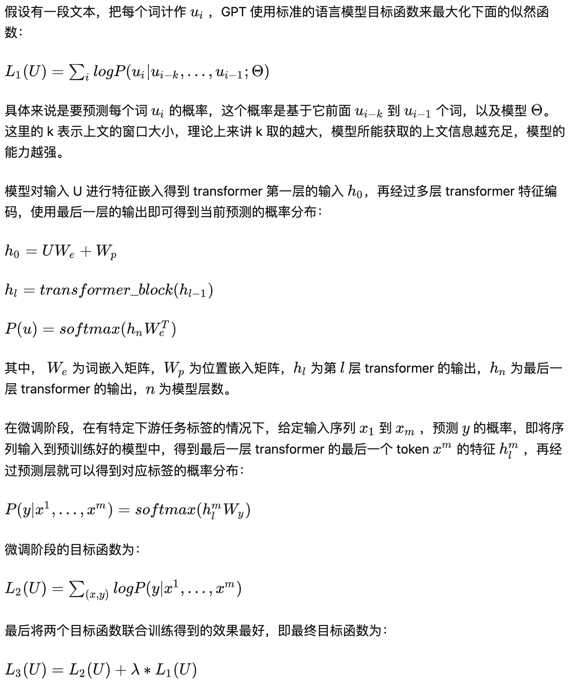
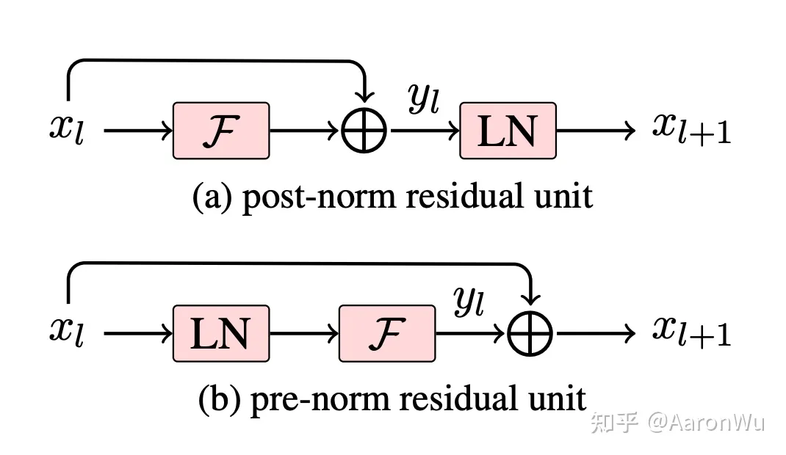
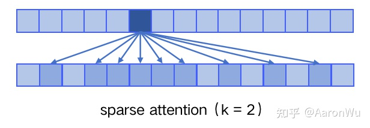
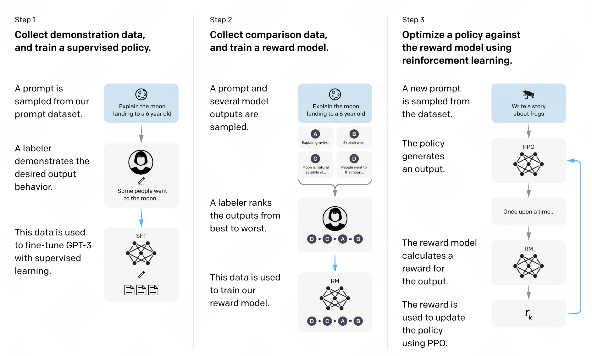
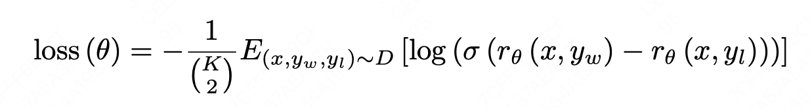
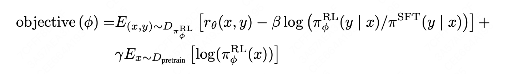
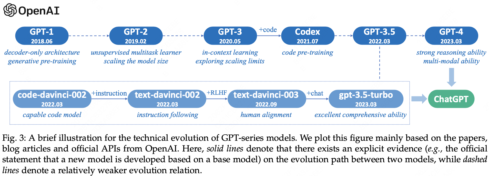

# GPT发展

|-|GPT-1|GPT-2|GPT-3|Instruct GPT|ChatGPT|
|-|--|--|--|--|--|
|模型贡献|提出：pretrained + fine-tuning|主推zero-shot|in-context learning（few-shot）|SFT （对齐语言习惯，理解用户诉求）+ RM + RLHF（对齐意图偏好价值观）|基于对话数据的指令微调，API提供（system_msg、history_chat_msg、realtime_sys_msg、now_input_message的形式）|
|模型大小|110MB|最大1.5B|175B|175B|175B|
|一些特点|decoder-only结构|调整为pre-LN，增大训练数据和模型大小|提出sparse-attention，进一步增大训练数据和模型大小，提出in-context learning|1）SFT：监督学习微调GPT-3；2）RM：将SFT模型最后的嵌入层去掉后的模型，它的输入是prompt和response，增加一个线性层来投影，将所有词的输出投影到一个值上面，输出即是标量的奖励值；3）RLHF：以RM作为奖励函数，采用PPO强化学习，对SFT训练完的模型进行RL的微调；||

参考知乎：https://zhuanlan.zhihu.com/p/609716668、https://www.zhihu.com/question/596230048

1. 与RNN相比，Transformer 具有更加结构化的记忆单元来解决长距离依赖问题，处理更长的文本信息，从而使得学习到的特征在各个任务中的迁移具有更强的鲁棒性；
2. 与BERT相比，两者的核心区别在于训练目标的差异性，GPT 选择的是一个更难的训练目标，它是根据前面的信息去预测下文，即语言模型目标LM；BERT则是一种 mask 语言模型，也就是在预测句子中某一个词的时候可以同时看到它前后的所有上下文信息，类似于一种完形填空任务；从认知来看预测未来肯定是比完形填空难度要更大的；
`这也能从某种程度上解释了为什么相同规模的GPT和BERT模型，GPT的效果要比BERT差；`

## GPT-1:

预训练+ 微调阶段训练目标，有所不同:
1. 在预训练阶段为语言模型目标LM；
2. 在微调阶段为下游任务目标 + 语言模型目标LM；

### gpt目标：

初代gpt参数量：33000 * 768 + 12 * 768 * 768 * 12 = 110MB；

初代gpt有三个总结：

**第一**：它是最早一批提出在 NLP 任务上使用 pre-train + fine-tuning 范式的工作；

**第二**：GPT 的实验证明了模型的精度和泛化能力会随着解码器层数增加而不断提升，而且目前还有提升空间；

**第三**：预训练模型具有 zero-shot 的能力，并且能随着预训练的进行不断增强；

## GPT-2:

gpt2指出模型从大规模数据中学到的能力能够直接在多个任务之间进行迁移，而不需要额外提供特定任务的数据，**因此引出了 GPT-2 的主要观点：zero-shot**。

gpt2下zero-shot为啥可靠：

  在 zero-shot 前提下，我们无法根据不同的下游任务去添加类似初代GPT这些标识符，因为不进行额外的微调训练，模型在预测的时候根本不认识这些特殊标记。所以在 zero-shot 的设定下，**不同任务的输入序列应该与训练时见到的文本长得一样，也就是以自然语言的形式去作为输入**；

Q：为什么上述输入序列的改造是有效的？或者说为什么 zero-shot 是有效的？

A：在论文中给出了解释：从一个尽可能大且多样化的数据集中一定能收集到不同领域不同任务相关的自然语言描述示例，例如下图中展示了英法互译任务在自然语言中出现的示例，表明了不同任务的任务描述在语料中真实存在；

所以 GPT-2 的核心思想就是，**当模型的容量非常大且数据量足够丰富时，仅仅靠语言模型的学习便可以完成其他有监督学习的任务，不需要在下游任务微调**。

GPT-2提供了4种模型结构；其基础结构和BERT-BASE和GPT-1相同为（12，768，12）；BERT-LARGE为（24，1024，12）；GPT-2 LARGE为（48，1600，12）；
其中GPT-2 LATGE = 33000 * 1600 + 48 * 1600 * 1600 * 12 = 1.5B；

整体来看，GPT-2 相比于 GPT-1 有如下几点区别：
1. 主推 zero-shot，而 GPT-1 为 pre-train + fine-tuning；
2. 训练数据规模更大，GPT-2 为 800w 文档 40G，GPT-1 为 5GB；
3. 模型大小，GPT-2 最大 15 亿参数，GPT-1为 1 亿参数；
4. 模型结构调整，层归一化和参数初始化方式进行调整；
5. 训练参数，batch_size 从 64 增加到 512，上文窗口大小从 512 增加到 1024等；

### pre-norm：

    gpt2相比gpt1，在LN上进行了创新，将原先postLN，调整为preLN；

post-norm 将 transformer 中每一个 block 的层归一化放在了残差层之后，而 pre-norm 将层归一化放在了每个 block 的输入位置；进行上述模型调整的主要原因在于，随着模型层数不断增加，梯度消失和梯度爆炸的风险越来越大，**这些调整能够减少预训练过程中各层之间的方差变化，使梯度更加稳定【但是改变了输入数据的表达，对模型泛化性有一定影响】**。

注：
> 1）上述这个图有一个问题，即ADD&LN在attention和FFN之后都有，如果只在FFN模块调整，attention部分和FFN本身就有一个add&LN的模块，所以FNN的输入是归一化之后的数据，为此我们不是很理解，在FFN部分将post-norm调整为pre-norm的做法；猜测还有一个原因就是self-attention部分，也进行了调整，因为原先是输入侧是没有做过过一化的；

> 2）即调整完之后的结构是：embedding + LN + multi-head self-attention + Add + LN + FNN + Add 的形式；

> 3）在最后一个block输出的时候再加了一个LN；

## GPT-3:

GPT-3 不再去追求那种极致的不需要任何样本就可以表现很好的模型，而是考虑像人类的学习方式那样，**仅仅使用极少数样本就可以掌握某一个任务，因此就引出了 GPT-3 标题 Language Models are Few-Shot Learners**。 

    这里的 few-shot 不是像之前的方式那样，使用少量样本在下游任务上去做微调，因为在 GPT-3 那样的参数规模下，即使是参数微调的成本也是高到无法估计。

### sparse-attention：
GPT-3采用GPT-1的模型结构，同时self-attention部分从原先dense attention调整为sparse attention；具体来说，sparse attention 除了相对距离不超过 k 以及相对距离为 k，2k，3k，... 的 token，其他所有 token 的注意力都设为 0，如下图所示：

使用 sparse attention 的好处主要有以下两点：
1. 减少注意力层的计算复杂度，节约显存和耗时，从而能够处理更长的输入序列（kv cache节省）；
2. 具有“局部紧密相关和远程稀疏相关”的特性，对于距离较近的上下文关注更多，对于距离较远的上下文关注较少；

GPT-3 large的版本（96，12288，96），训练batchsize=3.2M；整体参数量 33000 * 12288 + 96 * 12288 * 12288 * 12 = 175B；

**GPT-3 在下游任务的评估与预测时，提供了三种不同的方法：**
- Zero-shot：仅使用当前任务的自然语言描述，不进行任何梯度更新；
- One-shot：当前任务的自然语言描述，加上一个简单的输入输出样例，不进行任何梯度更新；
- Few-shot：当前任务的自然语言描述，加上几个简单的输入输出样例，不进行任何梯度更新；

其中 Few-shot 也被称为 in-context learning，虽然它与 fine-tuning 一样都需要一些有监督标注数据，但是两者的区别是：
1. **本质区别** fine-tuning 基于标注数据对模型参数进行更新，而 in-context learning 使用标注数据时不做任何的梯度回传，模型参数不更新；
2. in-context learning 依赖的数据量（10～100）远远小于 fine-tuning 一般的数据量；

整体来看，GPT-3 相比于 GPT-2 有如下几点区别：
1. 效果上，超出 GPT-2 非常多，能生成人类难以区分的新闻文章；
2. 主推 few-shot，相比于 GPT-2 的 zero-shot，具有很强的创新性；
3. 模型结构略微变化，采用 sparse attention 模块，可以处理更长的输入序列；
4. 海量训练语料 45TB（清洗后 570GB），相比于 GPT-2 的 40GB明显增加；
5. 海量模型参数，最大模型为 1750 亿，GPT-2 最大为 15 亿参数；

## Instruct GPT：

本文的主要目标是探索如何训练语言模型（LMs）来遵循用户的指示，执行各种任务，并提供有用和可靠的输出；语言模型存在如下一些挑战和局限性：
1. 语言模型可能会对不同类型或格式的任务缺乏适应性或灵活性，例如回答问题、写作文、编程等；
2. 语言模型可能会对用户的意图或偏好缺乏理解或对齐，例如保持客观、礼貌、有趣等；
3. 语言模型可能会生成不准确、不相关或有害的内容，尤其是在没有明确指示或监督的情况下。

GPT-3在微调后：
1. 可以更有效地利用提示中提供的信息或结构，并在需要时进行合理推断或创造；
2. 可以更好地理解用户指示中隐含或显式地表达出来的目标、约束和偏好，并生成更符合用户期望和需求的输出；
3. 可以更稳定地保持输出质量，并减少错误或失败率。

微调后的结果，正好对应原来GPT-3 前面提到的三个缺陷；

————
即GPT-3 虽然在各大 NLP 任务以及文本生成的能力上令人惊艳，但是他仍然还是会生成一些带有偏见的，不真实的，有害的造成负面社会影响的信息，而且很多时候，他并不按人类喜欢的表达方式去说话。在这个背景下，OpenAI 提出了一个概念“Alignment”，意思是模型输出与人类真实意图对齐，符合人类偏好；

InstructGPT **在 SFT 中标注的数据，正是为了消除这种模型预测与用户表达习惯之间的 gap**。在标注过程中，他们从 GPT-3 的用户真实请求中采样大量下游任务的描述，然后让标注人员对任务描述进行续写，从而得到该问题的高质量回答。这里用户真实请求又被称为某个任务的指令，即 InstructGPT 的核心思想“基于人类反馈的指令微调”；

RLHF，就是基于RM打分结合PPO的强化学习；其主要还是改善模型的helpful、harmless、honest的能力；但对偏见这块效果有效；

**总的来说**，InstructGPT 相对于之前的 GPT 系列，有以下几点值得注意：
1. 解决 GPT-3 的输出与人类意图之间的 Align 问题；
2. 让具备丰富世界知识的大模型，学习“人类偏好”；
3. 标注人员明显感觉 InstructGPT 的输出比 GPT-3 的输出更好，更可靠；
4. InstructGPT 在真实性，丰富度上表现更好；
5. InstructGPT 对有害结果的生成控制的更好，但是对于“偏见”没有明显改善；
6. 基于指令微调后，在公开任务测试集上的表现仍然良好；
7. InstructGPT 有令人意外的泛化性，在缺乏人类指令数据的任务上也表现很好；

*下面是对Instruct GTP 精读【Alignment】Training language models to follow instructions with human feedback ：*

- **背景：**

  训练更大的语言模型并不代表它们会更好地按照用户的意图进行工作，大语言模型很可能会生成一些不真实的、有害的或者是没有帮助的答案。这些模型和用户的意图并不一致，这是因为整个语言模型训练的目标函数有问题，**语言模型通过预测下一个词的方式进行训练，其目标函数是最大化给定语言序列的条件概率，而不是“有帮助且安全地遵循用户的指示”，因此两者之间并未对齐**。

- **方法：**

  本文提出了一种解决方法，通过利用人类反馈进行微调使语言模型与用户意图相一致，模型称为InstructGPT。实现步骤：
  - 1）收集人工给出的示范性数据对GPT-3进行有监督的微调（SFT）； 
  - 2）收集人工标注的排序数据，训练奖励模型（RM）；
  - 3）使用RM作为强化学习的优化目标，利用PPO微调SFT模型。

- **数据集：**
1. SFT数据集：用来训练SFT模型，包含13k个训练prompts（来源于API和人工撰写）；
    
    对于每个自然语言提示，任务通常直接通过自然语言指令指定（例如“写一个关于聪明的青蛙的故事”），但也可以通过少量示例间接指定（例如给出两个青蛙故事的例子，并提示模型生成一个新的）或隐式续写（例如提供一个关于青蛙的故事的开头）；在每种情况下，**要求标注者尽力推断编写提示的用户的意图，并要求他们跳过任务非常不清楚的输入。此外，标注者还考虑到了隐含意图，如回应的真实性以及潜在有害输出，如偏见或有毒语言，由提供给他们的指示和他们最好的判断来指导**；

2. RM数据集：人工标注排序模型输出结果，用来训练RM，包含33k个训练prompts（来源于API和人工撰写）；

    与早期收集人类偏好数据的工作不同，输入涵盖了更广泛的任务范围，偶尔会包括有争议和敏感的话题。目标是选择一组对不同人群偏好敏感且能够识别潜在有害输出的标注者。
    > 在训练和评估过程中，对齐标准可能会发生冲突：例如，当用户请求潜在有害的响应时。在训练期间，我们优先考虑对用户的帮助（不这样做需要做出一些困难的设计决策，将其留给未来的工作）。然而，最终的评估中，要求标注者优先考虑真实性和无害性（因为这是作者真正关心的）。
———— 从上面来看，RM训练评估方式上，helpful、honest、harmless是有提升的，但在偏见这块确实没有；

3. PPO数据集：用来训练强化模型，即InstructGPT。这个时候就不需要标注，标注来自于 RM ，包含31k个训练prompts（仅来源于API）；

- **有监督微调（SFT）:**
1. 训练：与GPT-3的训练过程类似，基于收集的SFT数据集，使用监督学习微调GPT-3。训练参数：1）16个epochs；2）余弦学习率衰减；3）0.2的残差dropout。

2. 选择：根据验证集上的RM分数，选择最终的SFT模型。作者发现，训练更多的epochs尽管会产生过拟合，但训练更多的epochs，可以提升RM分数和人类便好评分；

- **奖励模型（RM）：**

1. 训练：RM是将SFT模型最后的嵌入层去掉后的模型，它的输入是prompt和response，**增加一个线性层来投影，将所有词的输出投影到一个值上面，输出即是标量的奖励值**；
    

    其模型选择为6B模型，而非175B大模型，文中给出的解释是175B的模型在RM阶段训练可能不稳定，不适合作为RL的奖励函数；

2. 损失函数：RM的损失函数使用的是排序中常见的pairwise ranking loss（即所有排序关系的累积交叉熵损失），模型以pair对作为输入得到两个输出，将人工标注的比较结果做为label；两个reward之间差异，代表人工标注者对不同的respose的偏爱的程度的对数几率；由此得到偏爱排序的概率为sigmoid(r1 - r2)；

    论文中给了k=4和k=9两种形式；R theta(x,y)是prompt x和respose y在参数为theta的奖励模型下的奖励分数， yw是标注人员相对yl更喜欢的respose结果。对于每个prompt，标注人员对模型随机生成的K个输出进行排序，每个prompt的输出可以产生C(k,2)对。 D是整个训练数据集。

- **强化学习模型（PPO）：**

利用训练完的RM对SFT训练完的模型进行 RL 的微调，这里用的是 PPO 算法，目标函数如下：

    其中，pi-RL是学习的RL策略，所以第一项R theta(x,y)就是期望最大化RL策略在RM上的奖励分数。pi-SFT是训练的SFT模型，随着模型的更新，RL产生的输出和原始SFT模型的输出会逐渐不一样，即数据分布的差异会越来越大，RL的输出可能会不准，所以加入一个KL散度惩罚项，确保在SFT模型的基础上优化一些就行，不要偏差太大。最后一项是GPT-3模型原来的的目标函数，期望模型不仅仅对人类的排序结果较好，在通用NLP任务上的性能不会大幅下降。

### 总结：
解决了 GPT-3 的输出与人类意图之间的对齐问题，通过将人工反馈引入模型，提升了模型的真实性和无害性，但对于偏见问题没有明显改善。

提高模型的效果，不能只是单纯地提高参数量，优化数据的质量和组成同样可以有很大地提升。

- **关于RM模型：**

1. 采用排名而不是打分的原因是，标注者的价值观不同导致这些分数的绝对值无法对齐，而通过排名可以比较多个模型的输出并构建更好的规范数据集。可以理解为，这里就是训练了一个pair-wise 模型作为RM。

2. 使用RM而不是直接使用人类标注进行fine-tuning的原因是，人类标注数据收集效率比较低，使用RM来代替人类可以提升在“人类价值对齐”上的训练效率；

- **评估：**
1. 评估模型的对齐度，模型如果有用、诚实和无害，则被认为是对齐的。
2. 有用性helpful：要有用，模型应遵循指令，也应从提示或其他可解释模式（如“Q：{问题}\nA：”）中推断意图。主要指标是标注者偏好评级；
3. 诚实性honest：使用两个指标来衡量真实性：（1）评估模型在封闭领域任务上编造信息的倾向；（2）使用TruthfulQA数据集；
4. 无害性harmless：使用一套更具体的代理标准，旨在捕捉部署模型中可能最终有害的不同方面的行为：让标注者评估输出是否在客户助手背景下不适当，贬低受保护类别，或包含性或暴力内容。此外，将模型在基准测试数据集上验证偏见和毒性；

- **InstructGPT仍会犯一些简单错误：**
>（1）假设错误前提是正确的；

>（2）过度回避；给出多个答案，即使有一个明确答案；

>（3）在指令有多个约束或约束具有挑战时时性能下降。

模型不完全对齐或安全；它们仍会生成有毒、有偏见、编造或性暴力的输出，并在某些输入上失败。最大的局限是，它们遵循用户的指令，即使可能导致危害。

- **对齐技术RLHF（来自人类反馈的强化学习）：**

是对齐超人类系统的重要构建块。可以从这项工作中得到对齐研究的经验教训：

**提高模型对齐度的成本比预训练低**：训练175B SFT模型需要4.9 petaflops/s-days，而训练175B PPO-ptx模型需要 60 petaflops/s-days，GPT-3需要 3,640 petaflops/s-days。同时，RLHF使语言模型更有用，比增加100倍模型大小更有效。这表明提高现有语言模型对齐度比训练更大的模型更划算——至少对于我们客户的自然语言任务是这样。

**InstructGPT将“遵循提示”推广到了不监督它的设置中**，比如非英语语言任务和代码任务。这很重要，因为人类监督模型做每个任务太贵了。需要更多研究来看这种推广能力如何随着能力增加而扩展。

**通过微调能够减少大部分性能下降**。否则，这些性能下降将是对齐税——对齐模型的额外成本。高税收的技术可能不会被采用。为了避免未来人工智能系统与人类意图不一致，需要低对齐税的对齐技术。

**验证了对齐技术在现实世界中的应用**。对齐研究一直很抽象，关注理论结果、小型合成领域或公共NLP数据集。本工作为生产中的AI系统提供了对齐研究基础，形成了技术有效性和局限性的反馈循环。

参考来源：https://zhuanlan.zhihu.com/p/613688211

## GPT系列演进：

    可以看出在InstructGPT之后，SFT和RLHF的方式，被广泛应用在GPT系列微调强化上，一方面可以让模型学会用户表达习惯，更好理解指令；另一方面强化模型在某方面的能力；

这里简单介绍一下ChatGPT在多轮对话历史上微调，来提升其在对话历史的上的能力【下面内容全部来自个人的猜测】：

通过一下方式，构造相应的输入格式：
1. 通过查阅ChatGPT调用接口，可以发现其输入端支持四个message，即：system_msg、history_chat_msg、realtime_sys_msg、now_input_message；
2. 其中每一message，都是一个json的list，同时json的格式均为{"rol":"yyy","context":"xxx"}；其中rol的取值分为两类“user”，“system”，可以理解为用户和对话机器人；由此来区分输入的信息，是用户的，还是系统机器人的；
3. system_msg：为一些通用指令，例如：任务定义，角色定义，固定约束和流程等；
4. history_chat_msg：为历史对话内容，包含了user context，和system context两部分；
5. realtime_sys_msg：动态指令，具体指基于当前用户的query，基于向量检索调取矢量数据库，获取参考的知识内容【历史对话中出现过的case呀，特定知识等，这部分知识由于是离线操作，可以人为描述更细致，更准确一些】，将读取到的外部知识，放入realtime_sys_msg；
6. now_input_message：本次对话用户的输入query；
通过构造以上格式的训练数据，就可以在Instruct GPT的基础上进行进一步的微调，让模型理解，这种输入的形式，是一种多轮对话的结构；

## 为什么不用reward-model的数据直接做SFT？

在Instruct中，reward-model的目的是基于人类打标的数据集，学习什么样的回答是好的（helpful、harmless、honest），什么样的回答是不好的，对回答结果给出一个分数；

**1）建模目标（太 high level了），不好被量化计算出来：**

看到RLHF的第一反应，我想到是alpha-go；alpha-go里面有两个网络，一个走子网络，一个估值网络；其中估值网络中就是通过强化学习去学习，预估走哪一步棋胜算最大；在一个非常复杂的棋局里面，如何去判断棋局未来的走势，直接去评估胜率是一个非常难的问题，因为直接在中盘去计算胜率太难了，单单走子网络由于计算复杂度提升很容易就限于死局；那这时候一个想法，当很难用数学语言去表达我想要的目的，我又有数据，那是不是直接找一个模型去学习这个表达，然后给出一个分数来告诉我，我目前这个动作，在这个目标下得几分，这样是不是就变向解决了这个问题。

为此我们此时就需要一个reward-model，来学习在特定目标下，给输入数据进行打分，来评价这个输入数据在特定目标下的分数；

【问题点：直接训练可量化的目标会更合理一些，相当于学习一个区分的边际；转化为reward-model，一般采用list rank或者pairwise的方式，去学习正样本和负样本之间的差异】

**2）假设建模目标，可以量化计算出来，为什么不加入到sft中？**

下面假设建模目标可以被量化出来，那么很大概率上，也不是语言模型类似的目标；需要进行相关的后处理，这与语言模型本身的训练模型是不同的；总不能在输入一段话之后，chatgpt给返回了一个socre，来告诉我这段输入得几分。这肯定是不符合serve时候的预期；所以在训练的时候，可能会带来一些语义学习上的gap；

而且就算以LM目标进行训练，模型很可能会把它当成是一个任务类型，而不会学习到这应该是在所有任务上都具有的通用能力；

【这里补充下，为什么instruct gpt中第一步是进行sft，因为第一步的目标是对于人类指示输入；消除模型表达和人类语言习惯的gap，本身也是一个LM的目标；】

**3）数据标注的难度比较大：**

这里难度主要指我们的LLM，会经历一些微调或者sft的操作，这样会导致模型发生一些变化，这种变化可能不大好描述，但会体现在对“helpful、harmless、honest、偏见” 等和基模型存在一定的差异，即前面所说的区分边际有所不同。

在这种情况，基模型上训练的标注样本，在微调或者sft的模型上可能就不适用了，需要重新标注，成本很高；

**4）进一步假设，模型的目标可以统一在一起都是LM的形式，那还有为什么问题？**

这时候，目标分为多块，进行多目标建模的话，还需要解决多目标建模中存在的各种问题；相关训练成本，在线serve形式等，都不是很符合工业界应用的需求；

假设我还真训练出这样一个sft模型，但他可能很可能存在幻觉问题，即他对于自己不知道的知识，会“编”答案；在truthfulness上存在很大问题，答非所问，随意编造；核心原因还是再远，它并不知道那种回答是不对的，虽然有负样本，但本质上没有有效的负反馈；因为负样本和正样本之间本身是比较模糊的边际；

**5）为什么是强化学习PPO算法？**

首先PPO算法是目前认为能力最强的强化学习算法，本身有很有优势点（数据利用的能力？），会考虑OOD（分布外泛化）、EE（探索-利用）等问题，使得其训练的结果比直接作为一个SL任务训练的结果泛化性要好的多，同时精度可能是降低的；

至于为什么是强化学习？理解应该是RL可以更好的学习到上面提到的边界；RLHF 和RM两者之间应该是相互动态的，交替训练，提升精度的关系；
