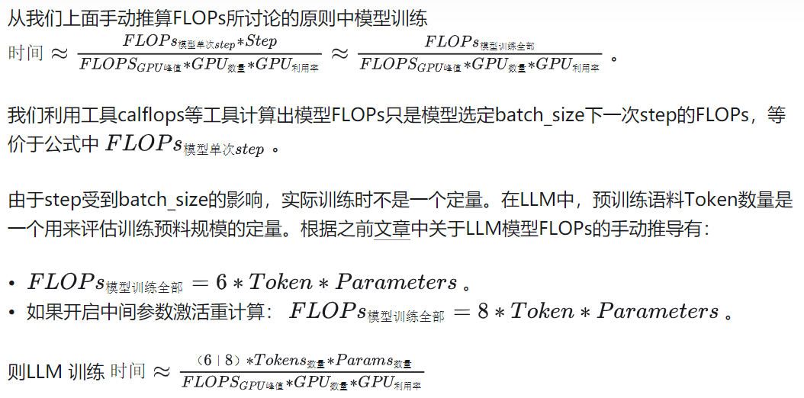

# LLM中FLOPs

## 目录

- [FLOPs](#1-flopsfloating-point-prerations-per-second)
- [flops计算](#2-flops计算)
- [手动推导flops原则](#3-手动推导flops原则)
- [使用工具](#4-使用工具)
- [计算flops到预估llm训练时间](#5-计算flops到预估llm训练时间)
- [关于同款识别bert模型训练时长预估](#6-关于同款识别bert模型训练时长预估)

<br>


## 1 FLOPs（floating point prerations per second）：

&nbsp;&nbsp;&nbsp;&nbsp;FLOPS（Floating Point Operations per Second）指每秒浮点运算次数，可以理解为评估计算速度的单位。主要作为用来描述硬件性能的指标，比如评估某型号GPU的计算算力，即能够产生多少算力速度给模型。同时也可以作为描述深度学习模型在GPU上实际运行时速度的单位，即模型在GPU提供多少算力速度下进行训练、推理的任务。
以**A100 80G为例，在FP64上，算力为9.7TFLOPs（即 每秒9.7万亿次）；在FP32上，算力为19.5TFLOPs（每秒19.5万亿次）**；


从定义中可以看出FLOPs是一个与计算性能相关的指标，那么它的作用主要体现在当你在训练、部署模型时需要对模型的计算性能进行考虑。

- 比如训练一个模型（LLM）时，通常通过计算模型训练全部FLOPs与使用GPU峰值的FLOPs以及GPU的利用率，来大致估算训练所需的时间和卡数：
- 
- 比如能够通过计算模型每个部分FLOPs得到哪个部分计算量最大，从而分析如何对模型计算性能进行优化；
- 比如当几个模型的效果体验差不多，尽量选择FLOPs小的模型进行部署来满足服务的要求；


<br>

## 2 FLOPs计算：

```text
- 根据计算公式和模型结构手动推算；
- 借助第三方工具：calflops、ptflops、thop、torchstat、torchsumary、fvcore。
```

<br>

## 3 手动推导FLOPs原则：

- 手动推导模型的FLOPs时只推导前向传播，**大部分情况默认模型后向传播的计算量是前向传播的2倍， 总共FLOPs是前向的3倍**。(结论出自——https://epochai.org/blog/backward-forward-FLOP-ratio)

- 由于LLM模型参数过大，占用显存过多，有时候为了降低显存在训练采用将中间参数保留在内存里——激活重计算。因此推导LLM训练时**FLOPs如果考虑到中间参数的激活重计算的过程，需要计算整体FLOPs需要再加一份前向计算量**，即1(前向） + 2(反向）+ 1(激活重计算）= 4 倍 计算量。 （结论出自——https://arxiv.org/pdf/2205.05198.pdf）

- 手动推导模型的FLOPs时，优先推导整个过程计算量占大头部分，通常忽略激活函数、layer normalize，softmax等等部分计算量。

<br>

## 4 使用工具：

&nbsp;&nbsp;&nbsp;&nbsp;综合从计算FLOPs的准确性和对语言模型使用更简易上，计算模型FLOPs最推荐工具是calflops，其开源地址：https://github.com/MrYxJ/calculate-flops.pytorch，使用文档非常详细。

<br>

## 5 计算FLOPs到预估LLM训练时间：




## 6 关于同款识别bert模型训练时长预估：

- bert-base 参数量为1.1亿；
- 计算80w正样本，正负比例1:5，则总样本400w，每条样本tokens长度平均为 2 * 3.5【类目】 + 2 * 4.5【属性】 + 16【标题】 = 7 + 9 + 16 = 32；则总tokens = 400w * 32 = 1.28亿tokens；
- 按照上述公式，4张A100-80G，利用率80%：
- 当epoch = 3，训练时长 = （6 * 1.28亿 * 1.1亿 * 3） / （9.7万亿 * 4 * 0.8）= 253440.0 / 3.2 = 52800秒 = 22.0小时；
- 算上GPU之间通讯成本，真实训练时长24个小时左右；

