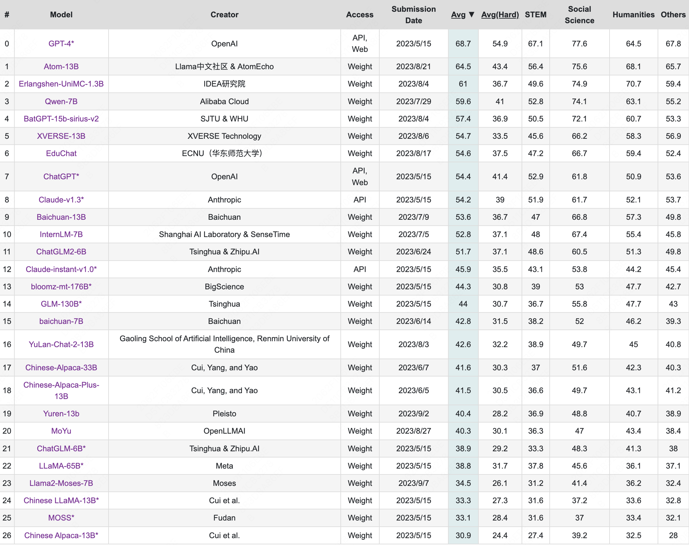

# LLM大语言模型

ChatGLM、LLaMA、OPT、FLAN、Alpaca、PaLM、Baichuan、Qwen等；

## 目录

 

## 开源模型整理:

| 模型                          | 含义                                                                                                                                                              | 模型结构            | 模型大小                    | 训练数据                                       | 参数结构 | PE                          | attention，FNN                                                                | norm    | MSL  | 激活函数   | 备注其他                                                                                                                                                                                                                                                                                                                                                                                                                                                                                                                                                                                                                                                                                                                                                                                                                                                                                                                                                                                                                                                                                                                                                                                                                                                                                                                                                                                                                                                                                                                                                                                                                                                                                                                                                                                                                                                                                                                                                                                                                                                                                                                                                                                                                                                                                                                                                                                                                                                                                                                                                                                                                                                                                      |
|:-|:-|:-|:-|:-|:-----|:----------------------------|:-----------------------------------------------------------------------------|:--------|:-----|:-------|:------------------------------------------------------------------------------------------------------------------------------------------------------------------------------------------------------------------------------------------------------------------------------------------------------------------------------------------------------------------------------------------------------------------------------------------------------------------------------------------------------------------------------------------------------------------------------------------------------------------------------------------------------------------------------------------------------------------------------------------------------------------------------------------------------------------------------------------------------------------------------------------------------------------------------------------------------------------------------------------------------------------------------------------------------------------------------------------------------------------------------------------------------------------------------------------------------------------------------------------------------------------------------------------------------------------------------------------------------------------------------------------------------------------------------------------------------------------------------------------------------------------------------------------------------------------------------------------------------------------------------------------------------------------------------------------------------------------------------------------------------------------------------------------------------------------------------------------------------------------------------------------------------------------------------------------------------------------------------------------------------------------------------------------------------------------------------------------------------------------------------------------------------------------------------------------------------------------------------------------------------------------------------------------------------------------------------------------------------------------------------------------------------------------------------------------------------------------------------------------------------------------------------------------------------------------------------------------------------------------------------------------------------------------------------------------|
| LLaMA等小模型：                  | -                                                                                                                                                               | -               | -                       | -                                          | -    | -                           | -                                                                            | -       | -    | -      | -                                                                                                                                                                                                                                                                                                                                                                                                                                                                                                                                                                                                                                                                                                                                                                                                                                                                                                                                                                                                                                                                                                                                                                                                                                                                                                                                                                                                                                                                                                                                                                                                                                                                                                                                                                                                                                                                                                                                                                                                                                                                                                                                                                                                                                                                                                                                                                                                                                                                                                                                                                                                                                                                                         |
| LLaMA                       | 通过比通常情况下使用更多的token进行训练，在各种推理预算下达到最佳性能，由此产生的模型被称为LLaMA                                                                                                           | decoder-only    | 7B、13B、30B、65B          | 1.4T tokens                                |      | 旋转位置嵌入（RoPE）                | 因果多头注意力算子                                                                    | RMSNorm | 2048 | SwiGLU |                                                                                                                                                                                                                                                                                                                                                                                                                                                                                                                                                                                                                                                                                                                                                                                                                                                                                                                                                                                                                                                                                                                                                                                                                                                                                                                                                                                                                                                                                                                                                                                                                                                                                                                                                                                                                                                                                                                                                                                                                                                                                                                                                                                                                                                                                                                                                                                                                                                                                                                                                                                                                                                                                           |
| LLaMA-2                     | -同上                                                                                                                                                             | decoder-only    | 7B、13B、34B、70B          | 1.96T tokens                               |      | 旋转位置嵌入（RoPE）                | <li> 分组查询注意力(GQA)；  <li> Faster Transformer推理加速；  <li> PagedAttention； | RMSNorm | 4096 | SwiGLU | 

**LLaMA-2-chat**：
   Llama 2 使用公开的在线数据进行预训练。 然后通过使用监督微调创建 Llama-2-chat 的初始版本。 接下来，Llama-2-chat 使用人类反馈强化学习 (RLHF) 进行迭代细化，其中包括拒绝采样和近端策略优化 (PPO)。
                                                                                                                                                                                                                                                                                                                                                                                                                                                                                                                                                                                                                                                                                                                                                                                                                                                                                                                                                                                                                                                                                                                                                                                                                                                                                                                                                                                                                                                                                                                                                                                                                                                                                                                                                                                                                                                                                                                                                                                                                                                                                                                                                                                                                                                                                                                                                                                                                                                                                                    |
| Alpaca                      | 引入了self-instruction框架，调用GPT3模型生成一系列instruction来对LLaMA进行微调，提高指令遵循能力来自我迭代进化，指令遵循语言模型叫Alpaca                                                                       | decoder-only    | 7B                      | 微调52K指令                                    |      | -                           | -                                                                            | -       | 2048 | -      | 

 **中文指令数据**：
   原英文版数据用175 个人工编写的任务种子集合作为初始化指令样例，用text-davinci-003生成。[中文指令数据](https://github.com/carbonz0/alpaca-chinese-dataset)是由原英文版数据集用机器翻译和self-instruct生成。
   

**训练**：
 使用了完全分片数据并行（Fully Sharded Data Parallel） 和混合精度（mixed precision） 等训练等技术。
                                                                                                                                                                                                                                                                                                                                                                                                                                                                                                                                                                                                                                                                                                                                                                                                                                                                                                                                                                                                                                                                                                                                                                                                                                                                                                                                                                                                                                                                                                                                                                                                                                                                                                                                                                                                                                                                                                                                                                                                                                                                                                                                                                                                                                                                                                                                                       |
| BELLE                       | Be Everyone’s Large Language Engine，对LLaMA，BLOOMZ等开源大模型进行微调                                                                                                     | decoder-only    | LLaMA -7B/13B、BLOOMZ-7B | 20万、60万、100万、200万样本的指令数据                   |      | -                           | -                                                                            | -       | 2048 | -      |                                                                                                                                                                                                                                                                                                                                                                                                                                                                                                                                                                                                                                                                                                                                                                                                                                                                                                                                                                                                                                                                                                                                                                                                                                                                                                                                                                                                                                                                                                                                                                                                                                                                                                                                                                                                                                                                                                                                                                                                                                                                                                                                                                                                                                                                                                                                                                                                                                                                                                                                                                                                                                                                                           |
| Baichuan                    | 是由百川智能开发的一个开源可商用的大规模预训练语言模型。基于 Transformer 结构，支持中英双语，上下文窗口长度为 4096；在标准的中文和英文 benchmark（C-Eval/MMLU）上均取得同尺寸最好的效果                                                 | decoder-only    | 7B、13B                  | 1.2T tokens【7B】；1.4T tokens【13B】           |      | 旋转位置嵌入（RoPE）【7B】、ALiBi【13B】 | Flash-Attention                                                              | RMSNorm | 4096 | SwiGLU | 

 **数据处理：** 
   <li>原始数据包括开源的中英文数据和自行抓取的中文互联网数据，以及部分高质量知识性数据；<li>参考相关数据工作，频率和质量是数据处理环节重点考虑的两个维度。我们基于启发式规则和质量模型打分，对原始数据集进行篇章和句子粒度的过滤。在全量数据上，利用局部敏感哈希方法，对篇章和句子粒度做滤重；<li>经过不断的调整和多轮测试，最终确认了一个在下游任务上表现最好的中英文配比；<li>使用了一个基于自动学习的数据权重策略，对不同类别的数据进行配比；
   

**分词SentencePiece**：
  参考学术界方案使用 SentencePiece 中的 Byte-Pair Encoding (BPE) 作为分词算法，并且进行了以下的优化：  <li>目前大部分开源模型主要基于英文优化，因此对中文语料存在效率较低的问题。我们使用2000万条以中英为主的多语言语料训练分词模型，显著提升对于中文的压缩率。 <li> 对于数学领域，我们参考了 LLaMA 和 Galactica 中的方案，对数字的每一位单独分开，避免出现数字不一致的问题，对于提升数学能力有重要帮助。 <li> 对于罕见字词（如特殊符号等），支持 UTF-8 characters 的 byte 编码，因此做到未知字词的全覆盖。
   

**ALiBi**：
   <li> ALiBi 线性偏置技术，相对于 Rotary Embedding 计算量更小，对推理性能有显著提升。
                                                                                                                                                                                                                                                                                                                                                                                                                                                                                                                                                                                                                                                                                                                                                                                                                                                                                                                                                                                                                                                                                                                                                                                                                                                                                                                                                                                                                                                                                                                                                                                                                                                                                                                                                                                                                                                                                               |
| Baichuan-2                  | -                                                                                                                                                               | decoder-only    | 7B、13B                  | 2.6T tokens                                |      | -                           |                                                                              |         |      |        |                                                                                                                                                                                                                                                                                                                                                                                                                                                                                                                                                                                                                                                                                                                                                                                                                                                                                                                                                                                                                                                                                                                                                                                                                                                                                                                                                                                                                                                                                                                                                                                                                                                                                                                                                                                                                                                                                                                                                                                                                                                                                                                                                                                                                                                                                                                                                                                                                                                                                                                                                                                                                                                                                           |
| Qwen                        | -                                                                                                                                                               | 未披露             | 开源7B，闭源上T               | 2.2T tokens                                |      | -                           |                                                                              |         | 8K   |        |                                                                                                                                                                                                                                                                                                                                                                                                                                                                                                                                                                                                                                                                                                                                                                                                                                                                                                                                                                                                                                                                                                                                                                                                                                                                                                                                                                                                                                                                                                                                                                                                                                                                                                                                                                                                                                                                                                                                                                                                                                                                                                                                                                                                                                                                                                                                                                                                                                                                                                                                                                                                                                                                                           |
| ChatGLM-2                   | ChatGLM GLM-130B上中注入了代码预训练，通过有监督微调（Supervised Fine-Tuning）、RLHF等技术实现人类意图对齐；不同于 BERT、GPT-3 以及 T5 的架构，是一个包含多目标函数的自回归预训练模型                                         | prefix LM       | 6B、12B、32B、66B、130B     | 1.4T tokens                                |      | 旋转位置嵌入（RoPE）                | <li> **Flash Attention** 扩充上下文长度；  <li> **Muilt-Query Attention**，更高效推理；  |         | 32K  |        | 

 **Muilt-Query Attention：** 
   [Multi-Query Attention](https://arxiv.org/abs/1911.02150)，提高了生成速度，同时也降低了生成过程中KV Cache的显存占用，此外，ChatGLM2-6B采用Causal Mask进行对话训练，连续对话时可复用前面轮次的KV Cache，进一步优化了显存占用。因此，使用6GB显存的显卡进行INT4量化的推理时，初代的ChatGLM-6B模型最多能够生成1119个字符就会提示显存耗尽，而ChatGLM2-6B能够生成至少8192个字符。
    

**Flash Attention：** 
   基于[FlashAttention](https://github.com/Dao-AILab/flash-attention)技术，我们将基座模型的上下文长度（Context Length）由 ChatGLM-6B 的2K扩展到了32K，并在对话阶段使用8K的上下文长度训练。
                                                                                                                                                                                                                                                                                                                                                                                                                                                                                                                                                                                                                                                                                                                                                                                                                                                                                                                                                                                                                                                                                                                                                                                                                                                                                                                                                                                                                                                                                                                                                                                                                                                                                                                                                                                                                                                                                                                                                                                                                                                                                                                                        |
| 100B以上大模型：                  | -                                                                                                                                                               | -               | -                       | -                                          | -    | -                           | -                                                                            |-|-|-| -                                                                                                                                                                                                                                                                                                                                                                                                                                                                                                                                                                                                                                                                                                                                                                                                                                                                                                                                                                                                                                                                                                                                                                                                                                                                                                                                                                                                                                                                                                                                                                                                                                                                                                                                                                                                                                                                                                                                                                                                                                                                                                                                                                                                                                                                                                                                                                                                                                                                                                                                                                                                                                                                                         |
| GLM                         | 采用自回归空白填充方式（auto-regressive blank infilling），随机对tokens中连续的spans机进行掩盖，以autoregressive blank infilling objective目标，通过调整span的长度和数量，让模型分别训练NLU、LM长文本生成，seq2seq等多个目标 | prefix LM       | 130B                    | 1.2T英文tokens + 1.3T 中文tokens               |      | 旋转位置嵌入（RoPE）                | <li> Faster Transformer推理加速；   <li> FNN替换为GLU；                            |Post-Norm + DeepNorm|2048|GeLU| 

**RoPE优点**：
   <li> 当序列长度增长时，RoPE的实现速度更快；  <li> RoPE对双向注意力更友好，在下游微调实验中效果更好；
     

 **训练目标：自回归文本填空** 
   GLM利用自回归文本填空作为其主要的预训练目标。它掩盖了随机的连续跨度，并对其进行自回归预测；  <li> 上下文之间的注意力（例如，"like a [MASK], like a rolling stone"）是双向 fully vision attention的；
  <li>被掩盖的标记之间的注意力，和从上下文到被掩盖的标识符的注意力是自回归掩码的，即causal attention；
     

**两种不同的MASK标识符，表示两个不同的目的**：
   <li> **[MASK]**根据[泊松分布](https://en.wikipedia.org/wiki/Poisson_distribution) (λ=3)对输入中标识符进行短跨度的采样；训练时进行掩码回填，类似MLM；
  <li> **[gMASK]**掩盖一个长的跨度，从其位置到整个文本的结束；训练时预估后面全部的文本，类似LM；当输入不包含任何 MASK 标记时，[gMASK] 将被自动附加到文本的末尾；
     

**归一化DeepNorm**：
   <li> 1）在现有的实践中，Pre-LN在用FP16训练大规模模型时仍然可能不稳定。[OPT-175B](https://arxiv.org/abs/2205.01068)在训练崩溃时手动调整学习率；[BLOOM](https://huggingface.co/bigscience/bloom)使用BF16（仅适用于NVIDIA Ampere GPU：A100s和3090s）以获得更好的浮点精度来避免崩溃。[CogView](https://proceedings.neurips.cc/paper/2021/file/a4d92e2cd541fca87e4620aba658316d-Paper.pdf)提出了Sandwich-LN作为一种补救措施。更重要的是，[近期工作](https://aclanthology.org/2021.findings-acl.81.pdf)表明，与Post-LN相比，Pre-LN的下游微调性能更差。  <li> 2）考虑到所有这些因素，在GLM-130B中，我们决定使用Post-LN，并使用新提出的[DeepNorm](https://arxiv.org/abs/2203.00555)来克服不稳定性。DeepNorm的重点是改进初始化，可以帮助Post-LN变换器扩展到1000层以上。在我们的初步实验中，模型扩展到130B，Sandwich-LN的梯度在大约2.5k步时就会出现损失突变（导致损失发散），而带有DeepNorm的Post-Ln则保持健康并呈现出较小的梯度大小（即更稳定）。
     

**多目标构造方式**：
   对于[MASK]，为short span，其中span长度满足λ=3的泊松分布，同时spans至少覆盖15% tokens；在autoregressive blank infilling objective下，进行训练，不同的span在训练时进行随机shuffling，由此训练得到的模型在下游NLU任务上性能显著；另一方面为使模型，具备长文本生成能力，在autoregressive blank infilling objective中，进行多目标训练，新增两个目标：  <li> **文本级别**：从原文长度的50%～100%中进行随机采样，用于长文本生成训练；
  <li> **句子级别**：强约束mask spans必须是一个完整的句子，且覆盖15% tokens；该目标针对seq2seq任务类型；
 这两个新目标，采用[gMASK]的形式。
                                                                                                                                                                                                                                                                                                                                                                                                                                                                                                                                                                                                                                                                                                                            |
| BLOOM                       | BLOOM目标不仅是公开发布一个能够和近期开发的系统相媲美的大规模多语言的语言模型，而且还记录其开发中的协调过程；【在BLOOM之前几乎没有开源的大模型】                                                                                   | decoder-only    | 176B                    | 1.61T tokens                               |      | ALiBi                       ||Pre-Norm|2048|GeLU| 

**浮点数格式**：
  在初步的实验中，104B参数模型在NVIDIA V100 GPUs，我们观察到数值不稳定，导致不可逆的训练发散。我们假设这些不稳定来自于最初使用的IEEE float16，动态范围非常有限的16-bit浮点数格式，可能导致溢出。我们最终获得了支持bfloat16格式的权限，其具有同float32相同的动态范围。另一方面，bfloat16精度仍然低很多，这促使我们使用混合精度训练。**该技术在float32精度上执行精度敏感的操作，例如梯度累积和softmax**，余下的操作则使用低精度，这允许实现高表现和训练稳定性之间的平衡。最终，我们以bfloat16混合精度执行最终的训练，其被证明解决了训练不稳定的问题。
                                                                                                                                                                                                                                                                                                                                                                                                                                                                                                                                                                                                                                                                                                                                                                                                                                                                                                                                                                                                                                                                                                                                                                                                                                                                                                                                                                                                                                                                                                                                                                                                                                                                                                                                                                                                                                                                                                                                                                                                                                                                                                                                                                                                                                                                                                                 |
| OPT                         | Open Pre-trained Transformer Language Models，一个完全开放的预训练Transformer语言模型                                                                                          | decoder-only    | 175B                    | 0.18T tokens                               |      | Learned                     ||Pre-Norm|2048|ReLU|                                                                                                                                                                                                                                                                                                                                                                                                                                                                                                                                                                                                                                                                                                                                                                                                                                                                                                                                                                                                                                                                                                                                                                                                                                                                                                                                                                                                                                                                                                                                                                                                                                                                                                                                                                                                                                                                                                                                                                                                                                                                                                                                                                                                                                                                                                                                                                                                                                                                                                                                                                                                                                                                                           |
| PaLM                        | Pathways Language Model                                                                                                                                         | decoder-only    | 8B、62B、540B             | 0.78T tokens                               |      | 旋转位置嵌入（RoPE）                |<li> Multi-query attention；  <li> FNN和Attention 并行；  <li> FNN替换为GLU；|Pre-Norm|2048|SwiGLU| 

**Bias**：
   去除所有Bias，提升训练稳定性；
   

**batchsize**：
   在训练时增加batch size。在50k step之前使用的batch size为512，在115k步骤之前则使用的batch size为1024，在训练完成的255k step之前则使用2048的batch size。较小的模型遵循类似的方案。使用这种batch size调度的方法主要原因有2个：(1) 较小的batch size在训练早期样本效率更高；(2) 更大的batch size会带来更大的矩阵乘法维度，其增加TPU效率；
   

**训练不稳定性**：
   <li> 对于最大的模型，尽管使用了梯度裁剪，在训练过程中观察到大于20次损失函数锋值。这些峰值的出现非常的不规律，有时出现在训练的后期，且在较小的模型中没有观察到。由于训练最大模型的代价，不能确定缓解这些峰值的主要策略。  <li> 相反，本文发现一个简单的策略可以有效的缓解这个问题：从峰值前的100步的checkpoints训练，并且跳过200-500个data batches，其涵盖了爆炸前以及爆炸之间的batches。通过这种缓解策略，损失函数不会在相同的点爆炸。这些峰值不太可能是由"bad data"导致的，因为跑了一些消融实验，将峰值周围的batch数据拿出来，然后从一个较早的不同的checkpoint上训练这些数据。在这些案例中，没有看到峰值。这意味着峰值仅会由特定batch的数据和特定模型参数结合而发生。
   

**关于记忆**：
   <li> 相比于小模型，更大的模型有更高的记忆率。  <li> 记忆需要一定的数量，因此模型对常见的模板能够生成精确的匹配。然而，训练数据上的记忆率显著的高于留出数据上的记忆率，这意味着模型确实记忆住了部分数据。  <li> 一个样本被记住的几率和其在训练中的独特性高度相关。被看见一次的样本不太可能比看见多次的样本更容易被记忆。
                                                                                                                                                                                                                                                                                                                                                                                                                                                                                                                                                                                                                                                                                                                                                                                                                                                                                                                                                                                                                                                                                                                                                                                                                                                                                                                                                                                                                                                                                                                                                                                                                                      |
| T5                          | Text-To-Text transfer Transformer，提出统一框架，将所有NLP任务转化为text-to-text任务；适合NLU和“有条件”的文本生成任务，例如文本总结，respose生成等                                                         | encoder-decoder | 3B、11B                  |                                            |      | Relative PE                 ||RMSNorm|512|ReLU| 

**text-to-text**：
   <li> “text-to-text” format—that is, a task where the model is fed some text for context or conditioning and is then asked to produce some output text；  <li> This framework provides a consistent training objective both for pre-training and fine-tuning. Specifically, the model is trained with a maximum likelihood objective；  <li> To specify which task the model should
perform, we add a task-specific (text) prefix to the original input sequence before feeding it
to the model. 
   整体框架还是有那种任务导向味道在里面，首先不同的任务数据，需要设定相关的prefix来区分任务类型，同时训练数据要进行相关的结构构造；  

**几个关键Takeaways**：
   <li> Text-to-text Our text-to-text framework provides a simple way to train a single model
on a wide variety of text tasks using the same loss function and decoding procedure.
We showed how this approach can be successfully applied to generative tasks like
abstractive summarization, classification tasks like natural language inference, and
even regression tasks like STS-B. In spite of its simplicity, we found the text-to-
text framework obtained comparable performance to task-specific architectures and
ultimately produced state-of-the-art results when combined with scale.   <li> Architectures While some work on transfer learning for NLP has considered architectural
variants of the Transformer, we found the original encoder-decoder form worked
best in our text-to-text framework. Though an encoder-decoder model uses twice as
many parameters as “encoder-only” (e.g. BERT) or “decoder-only” (language model)
architectures, it has a similar computational cost. We also showed that sharing the
parameters in the encoder and decoder did not result in a substantial performance
drop while halving the total parameter count.   <li> Unsupervised objectives Overall, we found that most “denoising” objectives, which train
the model to reconstruct randomly corrupted text, performed similarly in the text-to-
text setup. As a result, we suggest using objectives that produce short target sequences
so that unsupervised pre-training is more computationally efficient.  
   

**Relative PE**：
   <li> 原版Transformer里的PE是一种绝对的位置信息，但相对位置性质没有显式地体现；更严重的是，当测试集里的样本长度远大于训练集中的普遍长度时，得到的位置编码是网络没见过的，因此网络会得到不鲁棒的结果；  <li>计算i和j的attention时，考虑i和j的差值，超过k则取k；  <li>在计算attention weight，及context vector的时候分别作用一次； 
   

**一些训练超参数**：
   <li> BERT-style 式的破坏方法；
  <li> Replace Span（小段替换）法；
  <li> 破坏比为15%；
  <li> 小段长度破坏长度为3。
|
| 基于指令微调【Instruction Tuning】： | -                                                                                                                                                               | -               | -                       | -                                          | -    | -                           |-|-|-|-| -                                                                                                                                                                                                                                                                                                                                                                                                                                                                                                                                                                                                                                                                                                                                                                                                                                                                                                                                                                                                                                                                                                                                                                                                                                                                                                                                                                                                                                                                                                                                                                                                                                                                                                                                                                                                                                                                                                                                                                                                                                                                                                                                                                                                                                                                                                                                                                                                                                                                                                                                                                                                                                                                                         |
| FLAN                        | 在137B LaMDA-PT的预训练LM上，将60个NLP任务用自然语言指令的方式描述并把它们混合在一起，进行指令微调（instruction tuning）；这个模型，我们称之为FLAN（Finetuned Language Net）                                          | decoder-only    | 137B                    | <li> 1）预训练 2.49T tokens；<li> 2）微调60*30K指令； | -    | -                           |-|-|1024|-| 

**Instruction Tuning**：
   <li> 首次提出指令微调Instruction Tuning，不仅提升了对多种NLP任务的适应性，而且提升了对于zero-shot任务的准确率；  <li> 在消融实验中，我们发现，提升微调时的任务cluster数量，能提升模型在未见过任务上的效果，另外，指令微调的增益只在大型语言模型上才会出现。  <li> “instruction tuning”的目的，是提升LM响应NLP指令的能力——通过监督学习让LM执行指令形式的任务，LM可以习得遵循指令的能力，从而能够泛化到未见过的任务上。
                                                                                                                                                                                                                                                                                                                                                                                                                                                                                                                                                                                                                                                                                                                                                                                                                                                                                                                                                                                                                                                                                                                                                                                                                                                                                                                                                                                                                                                                                                                                                                                                                                                                                                                                                                                                                                                                                                                                                                                                                                                                                                                                                                                                                                                                                                                                                           |
| FLAN-T5                     | 通过在超大规模的任务上进行微调，让语言模型具备了极强的泛化性能，做到单个模型就可以在1800多个NLP任务上都能有很好的表现                                                                                                  | encoder-decoder | 3B、11B                  | -                                          | -    | -                           ||||| 

**关键结论**：
   <li> 与不微调相比，通过基于指令的微调（FLAN）可以大幅度提高语言模型的效果；   <li> 模型越大效果越好&任务越多效果越好；   <li> 混杂CoT相关的任务很重要；    【本质上任务还是需要多样性的，相似的任务增加并不会带来性能提升，增加一些难度大的推理性的任务，带来的效果提升更明显】
                                                                                                                                                                                                                                                                                                                                                                                                                                                                                                                                                                                                                                                                                                                                                                                                                                                                                                                                                                                                                                                                                                                                                                                                                                                                                                                                                                                                                                                                                                                                                                                                                                                                                                                                                                                                                                                                                                                                                                                                                                                                                                                                                                                                                                                                                                                                                                                                                                                                 |
| COT                         | 对于某些问题，即使给出一个示范（one-shot或者few-shot），LM也无法很好的解答，但是如果我们一步一步地引导，那么模型就能够得到正确答案，这种一步一步引导的prompting就称为Chain of Thought prompting                                      | -               | 100B以上                  | -                                          | -    | -                           ||||| 

**COT背景、定义**：
   <li> 怎么结合 in-context few shot 和中间步骤来改善算术推理、常识推理和符号推理等能力是一个问题。COT思维链的一系列工作就是在这样的大环境下诞生的；
  <li> 思维链是解决推理任务时，人类思维过程遵循的一系列典型步骤。它可以帮助我们将一个问题分解成一系列的子问题，然后逐个解决这些子问题，从而得出最终的答案。在大型语言模型中，思维链可以用来引出推理。相比于传统的上下文学习，思维链多了中间的推导提示；
 
     

**COT结论**：
   <li> CoT 对小模型作用不大，模型参数至少达到 10B 才有效果，达到 100B 效果才明显；  <li> CoT 对复杂的问题的性能增益更大；  <li> 加上 CoT 的 PaLM 540B 超过了任务特定的用监督学习训练的模型的最优结果；  <li> CoT 可以通过将其加入到 few-shot prompting 示例中，从而在足够大的语言模型中引导出推理能力；  <li> 人工设计思维链仍然是代价过大，大规模的人工标注思维链是不可行的；
                                                                                                                                                                                                                                                                                                                                                                                                                                                                                                                                                                                                                                                                                                                                                                                                                                                                                                                                                                                                                                                                                                                                                                                                                                                                                                                                                                                                                                                                                                                                                                                                                                                                                                                                                                                                                                                                                                                                                                                                                                                                                    |

GPT-3，FLAN、T5都有类似提示词的味道，但三者本质上是完全不同的：
1. GPT-3提示的方式是使提示看起来像模型已经预训练过的数据，然后模型完成接下来的内容；
    `————> 非人类自然语言的形式，像书面语；`
2. T5的提示主要只是数据集的标签，这在zero-shot设置中是行不通的；
   `————>本身并不适合自然语言的形式；`
3. FLAN中使用的提示与要求人类执行任务时使用的提示类似；
    `————> 人类的自然语言形式；`

    所以在这种情况下，FLAN的prompts，是需要在预训练模型上进行微调的，让模型理解人类自然语言的沟通形式；

*PaLM几个点补充：*
- **1）在偏见方面**，模型会错误的肯定刻板印象；这种影响的来源和训练数据有关，为此对训练数据进行高质量的清洗非常重要，例如性别、年龄、职业、种族、宗教等；
- **2）在有毒性方面**，模型生成的毒性与prompt的毒性高度相关。这表明与人类生成的文本相比，模型严重依赖于prompt的风格；
- **3）关于记忆性**，大模型在这方面能力强于小模型；为此对于预训练好的模型，在进行in-context learning时，输入prompts模版和训练数据中出现的模版更接近效果更好，可以生成更准确的回答；同时也说明了，记忆是需要成本的，一个独特且有一定出现次数的样本，更容易被记住；

*一些vocabuary size*：

 

## benchmark:

### 相关结果:
主要看中文C-Eval、CMMLU，英文MMLU，BBH，TruthfulQA等：
- 在7B模型上，Baichuan2-7B 优于ChatGLM2-6B，好于Baichuan-7B，好于 LLaMA2-7B，好于LLaMA-7B；
- 在13B模型上，Baichuan2-13B 基本等于 ChatGLM2-12B，好于Baichuan-13B，好于 LLaMA2-13B，好于LLaMA-13B；
- Qwen-7B 和 Baichuan2-13B 、ChatGLM2-12B基本可以接近持平，且明显好于LLaMA 2-13B；

### 常见评测指标:

|评测内容|指标| 方式                                                                                                                                                                          |
|-|-|-----------------------------------------------------------------------------------------------------------------------------------------------------------------------------|
|有毒性|RealToxicityPrompts基准| 模型完成大约10万个提示组成，然后通过向PerspectiveAPI 3提出请求来自动评估毒性分数，每个提示的得分范围从0（无毒）到1（有毒                                                                                                      |
|偏见|CrowSPairs| 在CrowSPairs（Nangia等人，2020）上评估模型偏见，该数据集包括9个类别的偏差：性别、宗教、种族/肤色、性取向、年龄、国籍、残疾、体貌和社会经济地位。每个例子都由一个刻板印象和一个反刻板印象组成，在zero-shot的情况下，用两个句子的困惑度来衡量模型对刻板印象句子的偏好。因此，较高的分数表示较高的偏差性，该分数越小越好。 |
|真实性|TruthfulQA| 这个基准可以评估一个模型产生错误信息或错误主张的风险。这些问题的写法多种多样，涵盖了38个类别，并被设计成对抗性的，该分数越高越好。                                                                                                          |

### 模型列表:
>https://github.com/lonePatient/awesome-pretrained-chinese-nlp-models#LLM

>https://github.com/wgwang/LLMs-In-China

### 公开BenchMark榜单:

SuperCLUE中文大模型排行榜：https://www.yuanyu.ai/superclue.html

HuggingFace BenchMark：https://huggingface.co/spaces/HuggingFaceH4/open_llm_leaderboard

参考：https://zhuanlan.zhihu.com/p/640880251、https://zhuanlan.zhihu.com/p/638508365

#### 通用领域:

在通用领域我们在以下数据集上进行了 5-shot 测试:
- **[C-Eval](https://cevalbenchmark.com/index.html#home)**：是一个全面的中文基础模型评测数据集，涵盖了 52 个学科和四个难度的级别。我们使用该数据集的 dev 集作为 few-shot 的来源，在 test 集上进行测试。我们采用了 [Baichuan-7B](https://github.com/baichuan-inc/Baichuan-7B/tree/main) 的评测方案。
- **[MMLU](https://arxiv.org/abs/2009.03300)**：是包含 57 个任务的英文评测数据集，涵盖了初等数学、美国历史、计算机科学、法律等，难度覆盖高中水平到专家水平，是目前主流的 LLM 评测数据集。我们采用了[开源评测方案](https://github.com/hendrycks/test)。
- **[CMMLU](https://github.com/haonan-li/CMMLU)**：是一个包含 67 个主题的综合性性中文评估基准，专门用于评估语言模型在中文语境下的知识和推理能力。我们采用了其官方的评测方案。
- **[Gaokao](https://github.com/OpenLMLab/GAOKAO-Bench)**：是一个以中国高考题作为评测大语言模型能力的数据集，用以评估模型的语言能力和逻辑推理能力。 我们只保留了其中的单项选择题，并进行了随机划分。我们采用了与 C-Eval 类似的评测方案。
- **[AGIEval](https://arxiv.org/abs/2304.06364)**：旨在评估模型的认知和解决问题相关的任务中的一般能力。 我们只保留了其中的四选一单项选择题，并进行了随机划分。我们采用了与 C-Eval 类似的评测方案。
- **[BBH](https://huggingface.co/datasets/lukaemon/bbh)**：是一个挑战性任务 Big-Bench 的子集。Big-Bench 目前包括 204 项任务。任务主题涉及语言学、儿童发展、数学、常识推理、生物学、物理学、社会偏见、软件开发等方面。BBH 是从 204 项 Big-Bench 评测基准任务中大模型表现不好的任务单独拿出来形成的评测基准。

#### 法律、医疗:
- 法律领域我们使用了[JEC-QA](https://jecqa.thunlp.org/)数据集。JEC-QA 数据集来源于中国国家司法考试。我们只保留了其中的单选题。我们采用了与 C-Eval 类似的评测方案。
- 医疗领域则使用通用领域数据集（C-Eval、MMLU、CMMLU）中的医学相关学科、[MedQA](https://arxiv.org/abs/2009.13081)和[MedMCQA](https://medmcqa.github.io/)。我们采用了与 C-Eval 类似的评测方案。

#### 数学、代码:

数学领域我们使用[OpenCompass](https://opencompass.org.cn/)评估框架，对[GSM8K](https://huggingface.co/datasets/gsm8k)和[MATH](https://huggingface.co/datasets/hendrycks/competition_math)数据集进行了 4-shot 测试。

- **GSM8K**：是由 OpenAI 发布的一个由 8.5K 高质量的语言多样化的小学数学应用题组成的数据集，要求根据给定的场景和两个可能的解决方案，选择最合理的方案。
- **MATH**：数据集包含 12,500 个数学问题（其中 7500 个属于训练集，5000 个属于测试集），这些问题收集自 AMC 10、AMC 12、AIME 等数学竞赛。

代码领域则采用了[HumanEval](https://huggingface.co/datasets/openai_humaneval)和[MBPP](https://huggingface.co/datasets/mbpp)数据集。我们使用 OpenCompass，对 HumanEval 进行了 0-shot 测试，MBPP 数据集进行了 3-shot 测试。

- **HumanEval**：中的编程任务包括模型语言理解、推理、算法和简单数学，以评估模型功能正确性，并衡量模型的问题解决能力。
- **MBPP**：包括 974 个 Python 短函数、程序的文字描述以及用于检查功能正确性的测试用例的数据集。

#### Models-With-Open-Access:
>截止时间：2023-09-17

#### 英文榜单:

MMLU是包含 57 个多选任务的英文评测数据集，涵盖了初等数学、美国历史、计算机科学、法律等，难度覆盖高中水平到专家水平，是目前主流的LLM评测数据集。
结果：

 

## 【META】LLaMA：Open and Efficient Foundation Language Models:

