# LLM大语言模型

ChatGLM、LLaMA、OPT、FLAN、Alpaca、PaLM、Baichuan、Qwen等；

## 目录

 

## 开源模型整理:

| 模型                          | 含义                                                                                                                                                              | 模型结构            | 模型大小                    | 训练数据                                       | 参数结构 | PE                          | attention，FNN                                                                | norm    | MSL  | 激活函数   | 备注其他                                                                                                                                                                                                                                                                                                                                                                                                                                                                                                                                                                                                                                                                                                                                                                                                                                                                                                                                                                                                                                                                                                                                                                                                                                                                                                                                                                                                                                                                                                                                                                                                                                                                                                                                                                                                                                                                                                                                                                                                                                                                                                                                                                                                                                                                                                                                                                                                                                                                                                                                                                                                                                                                                      |
|:-|:-|:-|:-|:-|:-----|:----------------------------|:-----------------------------------------------------------------------------|:--------|:-----|:-------|:------------------------------------------------------------------------------------------------------------------------------------------------------------------------------------------------------------------------------------------------------------------------------------------------------------------------------------------------------------------------------------------------------------------------------------------------------------------------------------------------------------------------------------------------------------------------------------------------------------------------------------------------------------------------------------------------------------------------------------------------------------------------------------------------------------------------------------------------------------------------------------------------------------------------------------------------------------------------------------------------------------------------------------------------------------------------------------------------------------------------------------------------------------------------------------------------------------------------------------------------------------------------------------------------------------------------------------------------------------------------------------------------------------------------------------------------------------------------------------------------------------------------------------------------------------------------------------------------------------------------------------------------------------------------------------------------------------------------------------------------------------------------------------------------------------------------------------------------------------------------------------------------------------------------------------------------------------------------------------------------------------------------------------------------------------------------------------------------------------------------------------------------------------------------------------------------------------------------------------------------------------------------------------------------------------------------------------------------------------------------------------------------------------------------------------------------------------------------------------------------------------------------------------------------------------------------------------------------------------------------------------------------------------------------------------------|
| LLaMA等小模型：                  | -                                                                                                                                                               | -               | -                       | -                                          | -    | -                           | -                                                                            | -       | -    | -      | -                                                                                                                                                                                                                                                                                                                                                                                                                                                                                                                                                                                                                                                                                                                                                                                                                                                                                                                                                                                                                                                                                                                                                                                                                                                                                                                                                                                                                                                                                                                                                                                                                                                                                                                                                                                                                                                                                                                                                                                                                                                                                                                                                                                                                                                                                                                                                                                                                                                                                                                                                                                                                                                                                         |
| LLaMA                       | 通过比通常情况下使用更多的token进行训练，在各种推理预算下达到最佳性能，由此产生的模型被称为LLaMA                                                                                                           | decoder-only    | 7B、13B、30B、65B          | 1.4T tokens                                |      | 旋转位置嵌入（RoPE）                | 因果多头注意力算子                                                                    | RMSNorm | 2048 | SwiGLU |                                                                                                                                                                                                                                                                                                                                                                                                                                                                                                                                                                                                                                                                                                                                                                                                                                                                                                                                                                                                                                                                                                                                                                                                                                                                                                                                                                                                                                                                                                                                                                                                                                                                                                                                                                                                                                                                                                                                                                                                                                                                                                                                                                                                                                                                                                                                                                                                                                                                                                                                                                                                                                                                                           |
| LLaMA-2                     | -同上                                                                                                                                                             | decoder-only    | 7B、13B、34B、70B          | 1.96T tokens                               |      | 旋转位置嵌入（RoPE）                | <li> 分组查询注意力(GQA)；  <li> Faster Transformer推理加速；  <li> PagedAttention； | RMSNorm | 4096 | SwiGLU | 

**LLaMA-2-chat**：
   Llama 2 使用公开的在线数据进行预训练。 然后通过使用监督微调创建 Llama-2-chat 的初始版本。 接下来，Llama-2-chat 使用人类反馈强化学习 (RLHF) 进行迭代细化，其中包括拒绝采样和近端策略优化 (PPO)。
                                                                                                                                                                                                                                                                                                                                                                                                                                                                                                                                                                                                                                                                                                                                                                                                                                                                                                                                                                                                                                                                                                                                                                                                                                                                                                                                                                                                                                                                                                                                                                                                                                                                                                                                                                                                                                                                                                                                                                                                                                                                                                                                                                                                                                                                                                                                                                                                                                                                                                    |
| Alpaca                      | 引入了self-instruction框架，调用GPT3模型生成一系列instruction来对LLaMA进行微调，提高指令遵循能力来自我迭代进化，指令遵循语言模型叫Alpaca                                                                       | decoder-only    | 7B                      | 微调52K指令                                    |      | -                           | -                                                                            | -       | 2048 | -      | 

 **中文指令数据**：
   原英文版数据用175 个人工编写的任务种子集合作为初始化指令样例，用text-davinci-003生成。[中文指令数据](https://github.com/carbonz0/alpaca-chinese-dataset)是由原英文版数据集用机器翻译和self-instruct生成。
   

**训练**：
 使用了完全分片数据并行（Fully Sharded Data Parallel） 和混合精度（mixed precision） 等训练等技术。
                                                                                                                                                                                                                                                                                                                                                                                                                                                                                                                                                                                                                                                                                                                                                                                                                                                                                                                                                                                                                                                                                                                                                                                                                                                                                                                                                                                                                                                                                                                                                                                                                                                                                                                                                                                                                                                                                                                                                                                                                                                                                                                                                                                                                                                                                                                                                       |
| BELLE                       | Be Everyone’s Large Language Engine，对LLaMA，BLOOMZ等开源大模型进行微调                                                                                                     | decoder-only    | LLaMA -7B/13B、BLOOMZ-7B | 20万、60万、100万、200万样本的指令数据                   |      | -                           | -                                                                            | -       | 2048 | -      |                                                                                                                                                                                                                                                                                                                                                                                                                                                                                                                                                                                                                                                                                                                                                                                                                                                                                                                                                                                                                                                                                                                                                                                                                                                                                                                                                                                                                                                                                                                                                                                                                                                                                                                                                                                                                                                                                                                                                                                                                                                                                                                                                                                                                                                                                                                                                                                                                                                                                                                                                                                                                                                                                           |
| Baichuan                    | 是由百川智能开发的一个开源可商用的大规模预训练语言模型。基于 Transformer 结构，支持中英双语，上下文窗口长度为 4096；在标准的中文和英文 benchmark（C-Eval/MMLU）上均取得同尺寸最好的效果                                                 | decoder-only    | 7B、13B                  | 1.2T tokens【7B】；1.4T tokens【13B】           |      | 旋转位置嵌入（RoPE）【7B】、ALiBi【13B】 | Flash-Attention                                                              | RMSNorm | 4096 | SwiGLU | 

 **数据处理：** 
   <li>原始数据包括开源的中英文数据和自行抓取的中文互联网数据，以及部分高质量知识性数据；<li>参考相关数据工作，频率和质量是数据处理环节重点考虑的两个维度。我们基于启发式规则和质量模型打分，对原始数据集进行篇章和句子粒度的过滤。在全量数据上，利用局部敏感哈希方法，对篇章和句子粒度做滤重；<li>经过不断的调整和多轮测试，最终确认了一个在下游任务上表现最好的中英文配比；<li>使用了一个基于自动学习的数据权重策略，对不同类别的数据进行配比；
   

**分词SentencePiece**：
  参考学术界方案使用 SentencePiece 中的 Byte-Pair Encoding (BPE) 作为分词算法，并且进行了以下的优化：  <li>目前大部分开源模型主要基于英文优化，因此对中文语料存在效率较低的问题。我们使用2000万条以中英为主的多语言语料训练分词模型，显著提升对于中文的压缩率。 <li> 对于数学领域，我们参考了 LLaMA 和 Galactica 中的方案，对数字的每一位单独分开，避免出现数字不一致的问题，对于提升数学能力有重要帮助。 <li> 对于罕见字词（如特殊符号等），支持 UTF-8 characters 的 byte 编码，因此做到未知字词的全覆盖。
   

**ALiBi**：
   <li> ALiBi 线性偏置技术，相对于 Rotary Embedding 计算量更小，对推理性能有显著提升。
                                                                                                                                                                                                                                                                                                                                                                                                                                                                                                                                                                                                                                                                                                                                                                                                                                                                                                                                                                                                                                                                                                                                                                                                                                                                                                                                                                                                                                                                                                                                                                                                                                                                                                                                                                                                                                                                                               |
| Baichuan-2                  | -                                                                                                                                                               | decoder-only    | 7B、13B                  | 2.6T tokens                                |      | -                           |                                                                              |         |      |        |                                                                                                                                                                                                                                                                                                                                                                                                                                                                                                                                                                                                                                                                                                                                                                                                                                                                                                                                                                                                                                                                                                                                                                                                                                                                                                                                                                                                                                                                                                                                                                                                                                                                                                                                                                                                                                                                                                                                                                                                                                                                                                                                                                                                                                                                                                                                                                                                                                                                                                                                                                                                                                                                                           |
| Qwen                        | -                                                                                                                                                               | 未披露             | 开源7B，闭源上T               | 2.2T tokens                                |      | -                           |                                                                              |         | 8K   |        |                                                                                                                                                                                                                                                                                                                                                                                                                                                                                                                                                                                                                                                                                                                                                                                                                                                                                                                                                                                                                                                                                                                                                                                                                                                                                                                                                                                                                                                                                                                                                                                                                                                                                                                                                                                                                                                                                                                                                                                                                                                                                                                                                                                                                                                                                                                                                                                                                                                                                                                                                                                                                                                                                           |
| ChatGLM-2                   | ChatGLM GLM-130B上中注入了代码预训练，通过有监督微调（Supervised Fine-Tuning）、RLHF等技术实现人类意图对齐；不同于 BERT、GPT-3 以及 T5 的架构，是一个包含多目标函数的自回归预训练模型                                         | prefix LM       | 6B、12B、32B、66B、130B     | 1.4T tokens                                |      | 旋转位置嵌入（RoPE）                | <li> **Flash Attention** 扩充上下文长度；  <li> **Muilt-Query Attention**，更高效推理；  |         | 32K  |        | 

 **Muilt-Query Attention：** 
   [Multi-Query Attention](https://arxiv.org/abs/1911.02150)，提高了生成速度，同时也降低了生成过程中KV Cache的显存占用，此外，ChatGLM2-6B采用Causal Mask进行对话训练，连续对话时可复用前面轮次的KV Cache，进一步优化了显存占用。因此，使用6GB显存的显卡进行INT4量化的推理时，初代的ChatGLM-6B模型最多能够生成1119个字符就会提示显存耗尽，而ChatGLM2-6B能够生成至少8192个字符。
    

**Flash Attention：** 
   基于[FlashAttention](https://github.com/Dao-AILab/flash-attention)技术，我们将基座模型的上下文长度（Context Length）由 ChatGLM-6B 的2K扩展到了32K，并在对话阶段使用8K的上下文长度训练。
                                                                                                                                                                                                                                                                                                                                                                                                                                                                                                                                                                                                                                                                                                                                                                                                                                                                                                                                                                                                                                                                                                                                                                                                                                                                                                                                                                                                                                                                                                                                                                                                                                                                                                                                                                                                                                                                                                                                                                                                                                                                                                                                        |
| 100B以上大模型：                  | -                                                                                                                                                               | -               | -                       | -                                          | -    | -                           | -                                                                            |-|-|-| -                                                                                                                                                                                                                                                                                                                                                                                                                                                                                                                                                                                                                                                                                                                                                                                                                                                                                                                                                                                                                                                                                                                                                                                                                                                                                                                                                                                                                                                                                                                                                                                                                                                                                                                                                                                                                                                                                                                                                                                                                                                                                                                                                                                                                                                                                                                                                                                                                                                                                                                                                                                                                                                                                         |
| GLM                         | 采用自回归空白填充方式（auto-regressive blank infilling），随机对tokens中连续的spans机进行掩盖，以autoregressive blank infilling objective目标，通过调整span的长度和数量，让模型分别训练NLU、LM长文本生成，seq2seq等多个目标 | prefix LM       | 130B                    | 1.2T英文tokens + 1.3T 中文tokens               |      | 旋转位置嵌入（RoPE）                | <li> Faster Transformer推理加速；   <li> FNN替换为GLU；                            |Post-Norm + DeepNorm|2048|GeLU| 

**RoPE优点**：
   <li> 当序列长度增长时，RoPE的实现速度更快；  <li> RoPE对双向注意力更友好，在下游微调实验中效果更好；
     

 **训练目标：自回归文本填空** 
   GLM利用自回归文本填空作为其主要的预训练目标。它掩盖了随机的连续跨度，并对其进行自回归预测；  <li> 上下文之间的注意力（例如，"like a [MASK], like a rolling stone"）是双向 fully vision attention的；
  <li>被掩盖的标记之间的注意力，和从上下文到被掩盖的标识符的注意力是自回归掩码的，即causal attention；
     

**两种不同的MASK标识符，表示两个不同的目的**：
   <li> **[MASK]**根据[泊松分布](https://en.wikipedia.org/wiki/Poisson_distribution) (λ=3)对输入中标识符进行短跨度的采样；训练时进行掩码回填，类似MLM；
  <li> **[gMASK]**掩盖一个长的跨度，从其位置到整个文本的结束；训练时预估后面全部的文本，类似LM；当输入不包含任何 MASK 标记时，[gMASK] 将被自动附加到文本的末尾；
     

**归一化DeepNorm**：
   <li> 1）在现有的实践中，Pre-LN在用FP16训练大规模模型时仍然可能不稳定。[OPT-175B](https://arxiv.org/abs/2205.01068)在训练崩溃时手动调整学习率；[BLOOM](https://huggingface.co/bigscience/bloom)使用BF16（仅适用于NVIDIA Ampere GPU：A100s和3090s）以获得更好的浮点精度来避免崩溃。[CogView](https://proceedings.neurips.cc/paper/2021/file/a4d92e2cd541fca87e4620aba658316d-Paper.pdf)提出了Sandwich-LN作为一种补救措施。更重要的是，[近期工作](https://aclanthology.org/2021.findings-acl.81.pdf)表明，与Post-LN相比，Pre-LN的下游微调性能更差。  <li> 2）考虑到所有这些因素，在GLM-130B中，我们决定使用Post-LN，并使用新提出的[DeepNorm](https://arxiv.org/abs/2203.00555)来克服不稳定性。DeepNorm的重点是改进初始化，可以帮助Post-LN变换器扩展到1000层以上。在我们的初步实验中，模型扩展到130B，Sandwich-LN的梯度在大约2.5k步时就会出现损失突变（导致损失发散），而带有DeepNorm的Post-Ln则保持健康并呈现出较小的梯度大小（即更稳定）。
     

**多目标构造方式**：
   对于[MASK]，为short span，其中span长度满足λ=3的泊松分布，同时spans至少覆盖15% tokens；在autoregressive blank infilling objective下，进行训练，不同的span在训练时进行随机shuffling，由此训练得到的模型在下游NLU任务上性能显著；另一方面为使模型，具备长文本生成能力，在autoregressive blank infilling objective中，进行多目标训练，新增两个目标：  <li> **文本级别**：从原文长度的50%～100%中进行随机采样，用于长文本生成训练；
  <li> **句子级别**：强约束mask spans必须是一个完整的句子，且覆盖15% tokens；该目标针对seq2seq任务类型；
 这两个新目标，采用[gMASK]的形式。
                                                                                                                                                                                                                                                                                                                                                                                                                                                                                                                                                                                                                                                                                                                            |
| BLOOM                       | BLOOM目标不仅是公开发布一个能够和近期开发的系统相媲美的大规模多语言的语言模型，而且还记录其开发中的协调过程；【在BLOOM之前几乎没有开源的大模型】                                                                                   | decoder-only    | 176B                    | 1.61T tokens                               |      | ALiBi                       ||Pre-Norm|2048|GeLU| 

**浮点数格式**：
  在初步的实验中，104B参数模型在NVIDIA V100 GPUs，我们观察到数值不稳定，导致不可逆的训练发散。我们假设这些不稳定来自于最初使用的IEEE float16，动态范围非常有限的16-bit浮点数格式，可能导致溢出。我们最终获得了支持bfloat16格式的权限，其具有同float32相同的动态范围。另一方面，bfloat16精度仍然低很多，这促使我们使用混合精度训练。**该技术在float32精度上执行精度敏感的操作，例如梯度累积和softmax**，余下的操作则使用低精度，这允许实现高表现和训练稳定性之间的平衡。最终，我们以bfloat16混合精度执行最终的训练，其被证明解决了训练不稳定的问题。
                                                                                                                                                                                                                                                                                                                                                                                                                                                                                                                                                                                                                                                                                                                                                                                                                                                                                                                                                                                                                                                                                                                                                                                                                                                                                                                                                                                                                                                                                                                                                                                                                                                                                                                                                                                                                                                                                                                                                                                                                                                                                                                                                                                                                                                                                                                 |
| OPT                         | Open Pre-trained Transformer Language Models，一个完全开放的预训练Transformer语言模型                                                                                          | decoder-only    | 175B                    | 0.18T tokens                               |      | Learned                     ||Pre-Norm|2048|ReLU|                                                                                                                                                                                                                                                                                                                                                                                                                                                                                                                                                                                                                                                                                                                                                                                                                                                                                                                                                                                                                                                                                                                                                                                                                                                                                                                                                                                                                                                                                                                                                                                                                                                                                                                                                                                                                                                                                                                                                                                                                                                                                                                                                                                                                                                                                                                                                                                                                                                                                                                                                                                                                                                                                           |
| PaLM                        | Pathways Language Model                                                                                                                                         | decoder-only    | 8B、62B、540B             | 0.78T tokens                               |      | 旋转位置嵌入（RoPE）                |<li> Multi-query attention；  <li> FNN和Attention 并行；  <li> FNN替换为GLU；|Pre-Norm|2048|SwiGLU| 

**Bias**：
   去除所有Bias，提升训练稳定性；
   

**batchsize**：
   在训练时增加batch size。在50k step之前使用的batch size为512，在115k步骤之前则使用的batch size为1024，在训练完成的255k step之前则使用2048的batch size。较小的模型遵循类似的方案。使用这种batch size调度的方法主要原因有2个：(1) 较小的batch size在训练早期样本效率更高；(2) 更大的batch size会带来更大的矩阵乘法维度，其增加TPU效率；
   

**训练不稳定性**：
   <li> 对于最大的模型，尽管使用了梯度裁剪，在训练过程中观察到大于20次损失函数锋值。这些峰值的出现非常的不规律，有时出现在训练的后期，且在较小的模型中没有观察到。由于训练最大模型的代价，不能确定缓解这些峰值的主要策略。  <li> 相反，本文发现一个简单的策略可以有效的缓解这个问题：从峰值前的100步的checkpoints训练，并且跳过200-500个data batches，其涵盖了爆炸前以及爆炸之间的batches。通过这种缓解策略，损失函数不会在相同的点爆炸。这些峰值不太可能是由"bad data"导致的，因为跑了一些消融实验，将峰值周围的batch数据拿出来，然后从一个较早的不同的checkpoint上训练这些数据。在这些案例中，没有看到峰值。这意味着峰值仅会由特定batch的数据和特定模型参数结合而发生。
   

**关于记忆**：
   <li> 相比于小模型，更大的模型有更高的记忆率。  <li> 记忆需要一定的数量，因此模型对常见的模板能够生成精确的匹配。然而，训练数据上的记忆率显著的高于留出数据上的记忆率，这意味着模型确实记忆住了部分数据。  <li> 一个样本被记住的几率和其在训练中的独特性高度相关。被看见一次的样本不太可能比看见多次的样本更容易被记忆。
                                                                                                                                                                                                                                                                                                                                                                                                                                                                                                                                                                                                                                                                                                                                                                                                                                                                                                                                                                                                                                                                                                                                                                                                                                                                                                                                                                                                                                                                                                                                                                                                                                      |
| T5                          | Text-To-Text transfer Transformer，提出统一框架，将所有NLP任务转化为text-to-text任务；适合NLU和“有条件”的文本生成任务，例如文本总结，respose生成等                                                         | encoder-decoder | 3B、11B                  |                                            |      | Relative PE                 ||RMSNorm|512|ReLU| 

**text-to-text**：
   <li> “text-to-text” format—that is, a task where the model is fed some text for context or conditioning and is then asked to produce some output text；  <li> This framework provides a consistent training objective both for pre-training and fine-tuning. Specifically, the model is trained with a maximum likelihood objective；  <li> To specify which task the model should
perform, we add a task-specific (text) prefix to the original input sequence before feeding it
to the model. 
   整体框架还是有那种任务导向味道在里面，首先不同的任务数据，需要设定相关的prefix来区分任务类型，同时训练数据要进行相关的结构构造；  

**几个关键Takeaways**：
   <li> Text-to-text Our text-to-text framework provides a simple way to train a single model
on a wide variety of text tasks using the same loss function and decoding procedure.
We showed how this approach can be successfully applied to generative tasks like
abstractive summarization, classification tasks like natural language inference, and
even regression tasks like STS-B. In spite of its simplicity, we found the text-to-
text framework obtained comparable performance to task-specific architectures and
ultimately produced state-of-the-art results when combined with scale.   <li> Architectures While some work on transfer learning for NLP has considered architectural
variants of the Transformer, we found the original encoder-decoder form worked
best in our text-to-text framework. Though an encoder-decoder model uses twice as
many parameters as “encoder-only” (e.g. BERT) or “decoder-only” (language model)
architectures, it has a similar computational cost. We also showed that sharing the
parameters in the encoder and decoder did not result in a substantial performance
drop while halving the total parameter count.   <li> Unsupervised objectives Overall, we found that most “denoising” objectives, which train
the model to reconstruct randomly corrupted text, performed similarly in the text-to-
text setup. As a result, we suggest using objectives that produce short target sequences
so that unsupervised pre-training is more computationally efficient.  
   

**Relative PE**：
   <li> 原版Transformer里的PE是一种绝对的位置信息，但相对位置性质没有显式地体现；更严重的是，当测试集里的样本长度远大于训练集中的普遍长度时，得到的位置编码是网络没见过的，因此网络会得到不鲁棒的结果；  <li>计算i和j的attention时，考虑i和j的差值，超过k则取k；  <li>在计算attention weight，及context vector的时候分别作用一次； 
   

**一些训练超参数**：
   <li> BERT-style 式的破坏方法；
  <li> Replace Span（小段替换）法；
  <li> 破坏比为15%；
  <li> 小段长度破坏长度为3。
|
| 基于指令微调【Instruction Tuning】： | -                                                                                                                                                               | -               | -                       | -                                          | -    | -                           |-|-|-|-| -                                                                                                                                                                                                                                                                                                                                                                                                                                                                                                                                                                                                                                                                                                                                                                                                                                                                                                                                                                                                                                                                                                                                                                                                                                                                                                                                                                                                                                                                                                                                                                                                                                                                                                                                                                                                                                                                                                                                                                                                                                                                                                                                                                                                                                                                                                                                                                                                                                                                                                                                                                                                                                                                                         |
| FLAN                        | 在137B LaMDA-PT的预训练LM上，将60个NLP任务用自然语言指令的方式描述并把它们混合在一起，进行指令微调（instruction tuning）；这个模型，我们称之为FLAN（Finetuned Language Net）                                          | decoder-only    | 137B                    | <li> 1）预训练 2.49T tokens；<li> 2）微调60*30K指令； | -    | -                           |-|-|1024|-| 

**Instruction Tuning**：
   <li> 首次提出指令微调Instruction Tuning，不仅提升了对多种NLP任务的适应性，而且提升了对于zero-shot任务的准确率；  <li> 在消融实验中，我们发现，提升微调时的任务cluster数量，能提升模型在未见过任务上的效果，另外，指令微调的增益只在大型语言模型上才会出现。  <li> “instruction tuning”的目的，是提升LM响应NLP指令的能力——通过监督学习让LM执行指令形式的任务，LM可以习得遵循指令的能力，从而能够泛化到未见过的任务上。
                                                                                                                                                                                                                                                                                                                                                                                                                                                                                                                                                                                                                                                                                                                                                                                                                                                                                                                                                                                                                                                                                                                                                                                                                                                                                                                                                                                                                                                                                                                                                                                                                                                                                                                                                                                                                                                                                                                                                                                                                                                                                                                                                                                                                                                                                                                                                           |
| FLAN-T5                     | 通过在超大规模的任务上进行微调，让语言模型具备了极强的泛化性能，做到单个模型就可以在1800多个NLP任务上都能有很好的表现                                                                                                  | encoder-decoder | 3B、11B                  | -                                          | -    | -                           ||||| 

**关键结论**：
   <li> 与不微调相比，通过基于指令的微调（FLAN）可以大幅度提高语言模型的效果；   <li> 模型越大效果越好&任务越多效果越好；   <li> 混杂CoT相关的任务很重要；    【本质上任务还是需要多样性的，相似的任务增加并不会带来性能提升，增加一些难度大的推理性的任务，带来的效果提升更明显】
                                                                                                                                                                                                                                                                                                                                                                                                                                                                                                                                                                                                                                                                                                                                                                                                                                                                                                                                                                                                                                                                                                                                                                                                                                                                                                                                                                                                                                                                                                                                                                                                                                                                                                                                                                                                                                                                                                                                                                                                                                                                                                                                                                                                                                                                                                                                                                                                                                                                 |
| COT                         | 对于某些问题，即使给出一个示范（one-shot或者few-shot），LM也无法很好的解答，但是如果我们一步一步地引导，那么模型就能够得到正确答案，这种一步一步引导的prompting就称为Chain of Thought prompting                                      | -               | 100B以上                  | -                                          | -    | -                           ||||| 

**COT背景、定义**：
   <li> 怎么结合 in-context few shot 和中间步骤来改善算术推理、常识推理和符号推理等能力是一个问题。COT思维链的一系列工作就是在这样的大环境下诞生的；
  <li> 思维链是解决推理任务时，人类思维过程遵循的一系列典型步骤。它可以帮助我们将一个问题分解成一系列的子问题，然后逐个解决这些子问题，从而得出最终的答案。在大型语言模型中，思维链可以用来引出推理。相比于传统的上下文学习，思维链多了中间的推导提示；
 
     

**COT结论**：
   <li> CoT 对小模型作用不大，模型参数至少达到 10B 才有效果，达到 100B 效果才明显；  <li> CoT 对复杂的问题的性能增益更大；  <li> 加上 CoT 的 PaLM 540B 超过了任务特定的用监督学习训练的模型的最优结果；  <li> CoT 可以通过将其加入到 few-shot prompting 示例中，从而在足够大的语言模型中引导出推理能力；  <li> 人工设计思维链仍然是代价过大，大规模的人工标注思维链是不可行的；
                                                                                                                                                                                                                                                                                                                                                                                                                                                                                                                                                                                                                                                                                                                                                                                                                                                                                                                                                                                                                                                                                                                                                                                                                                                                                                                                                                                                                                                                                                                                                                                                                                                                                                                                                                                                                                                                                                                                                                                                                                                                                    |

GPT-3，FLAN、T5都有类似提示词的味道，但三者本质上是完全不同的：
1. GPT-3提示的方式是使提示看起来像模型已经预训练过的数据，然后模型完成接下来的内容；
    `————> 非人类自然语言的形式，像书面语；`
2. T5的提示主要只是数据集的标签，这在zero-shot设置中是行不通的；
   `————>本身并不适合自然语言的形式；`
3. FLAN中使用的提示与要求人类执行任务时使用的提示类似；
    `————> 人类的自然语言形式；`

    所以在这种情况下，FLAN的prompts，是需要在预训练模型上进行微调的，让模型理解人类自然语言的沟通形式；

*PaLM几个点补充：*
- **1）在偏见方面**，模型会错误的肯定刻板印象；这种影响的来源和训练数据有关，为此对训练数据进行高质量的清洗非常重要，例如性别、年龄、职业、种族、宗教等；
- **2）在有毒性方面**，模型生成的毒性与prompt的毒性高度相关。这表明与人类生成的文本相比，模型严重依赖于prompt的风格；
- **3）关于记忆性**，大模型在这方面能力强于小模型；为此对于预训练好的模型，在进行in-context learning时，输入prompts模版和训练数据中出现的模版更接近效果更好，可以生成更准确的回答；同时也说明了，记忆是需要成本的，一个独特且有一定出现次数的样本，更容易被记住；

*一些vocabuary size*：
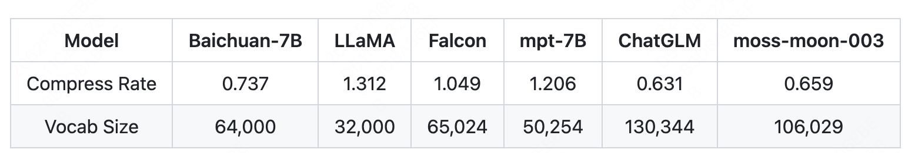

 

## benchmark:

### 相关结果:
主要看中文C-Eval、CMMLU，英文MMLU，BBH，TruthfulQA等：
- 在7B模型上，Baichuan2-7B 优于ChatGLM2-6B，好于Baichuan-7B，好于 LLaMA2-7B，好于LLaMA-7B；
- 在13B模型上，Baichuan2-13B 基本等于 ChatGLM2-12B，好于Baichuan-13B，好于 LLaMA2-13B，好于LLaMA-13B；
- Qwen-7B 和 Baichuan2-13B 、ChatGLM2-12B基本可以接近持平，且明显好于LLaMA 2-13B；

### 常见评测指标:

|评测内容|指标| 方式                                                                                                                                                                          |
|-|-|-----------------------------------------------------------------------------------------------------------------------------------------------------------------------------|
|有毒性|RealToxicityPrompts基准| 模型完成大约10万个提示组成，然后通过向PerspectiveAPI 3提出请求来自动评估毒性分数，每个提示的得分范围从0（无毒）到1（有毒）                                                                                                     |
|偏见|CrowSPairs| 在CrowSPairs（Nangia等人，2020）上评估模型偏见，该数据集包括9个类别的偏差：性别、宗教、种族/肤色、性取向、年龄、国籍、残疾、体貌和社会经济地位。每个例子都由一个刻板印象和一个反刻板印象组成，在zero-shot的情况下，用两个句子的困惑度来衡量模型对刻板印象句子的偏好。因此，较高的分数表示较高的偏差性，该分数越小越好。 |
|真实性|TruthfulQA| 这个基准可以评估一个模型产生错误信息或错误主张的风险。这些问题的写法多种多样，涵盖了38个类别，并被设计成对抗性的，该分数越高越好。                                                                                                          |

### 模型列表:
>https://github.com/lonePatient/awesome-pretrained-chinese-nlp-models#LLM

>https://github.com/wgwang/LLMs-In-China

### 公开BenchMark榜单:

SuperCLUE中文大模型排行榜：https://www.yuanyu.ai/superclue.html

HuggingFace BenchMark：https://huggingface.co/spaces/HuggingFaceH4/open_llm_leaderboard

参考：https://zhuanlan.zhihu.com/p/640880251、https://zhuanlan.zhihu.com/p/638508365

#### 通用领域:

在通用领域我们在以下数据集上进行了 5-shot 测试:
- **[C-Eval](https://cevalbenchmark.com/index.html#home)**：是一个全面的中文基础模型评测数据集，涵盖了 52 个学科和四个难度的级别。我们使用该数据集的 dev 集作为 few-shot 的来源，在 test 集上进行测试。我们采用了 [Baichuan-7B](https://github.com/baichuan-inc/Baichuan-7B/tree/main) 的评测方案。
- **[MMLU](https://arxiv.org/abs/2009.03300)**：是包含 57 个任务的英文评测数据集，涵盖了初等数学、美国历史、计算机科学、法律等，难度覆盖高中水平到专家水平，是目前主流的 LLM 评测数据集。我们采用了[开源评测方案](https://github.com/hendrycks/test)。
- **[CMMLU](https://github.com/haonan-li/CMMLU)**：是一个包含 67 个主题的综合性性中文评估基准，专门用于评估语言模型在中文语境下的知识和推理能力。我们采用了其官方的评测方案。
- **[Gaokao](https://github.com/OpenLMLab/GAOKAO-Bench)**：是一个以中国高考题作为评测大语言模型能力的数据集，用以评估模型的语言能力和逻辑推理能力。 我们只保留了其中的单项选择题，并进行了随机划分。我们采用了与 C-Eval 类似的评测方案。
- **[AGIEval](https://arxiv.org/abs/2304.06364)**：旨在评估模型的认知和解决问题相关的任务中的一般能力。 我们只保留了其中的四选一单项选择题，并进行了随机划分。我们采用了与 C-Eval 类似的评测方案。
- **[BBH](https://huggingface.co/datasets/lukaemon/bbh)**：是一个挑战性任务 Big-Bench 的子集。Big-Bench 目前包括 204 项任务。任务主题涉及语言学、儿童发展、数学、常识推理、生物学、物理学、社会偏见、软件开发等方面。BBH 是从 204 项 Big-Bench 评测基准任务中大模型表现不好的任务单独拿出来形成的评测基准。

#### 法律、医疗:
- 法律领域我们使用了[JEC-QA](https://jecqa.thunlp.org/)数据集。JEC-QA 数据集来源于中国国家司法考试。我们只保留了其中的单选题。我们采用了与 C-Eval 类似的评测方案。
- 医疗领域则使用通用领域数据集（C-Eval、MMLU、CMMLU）中的医学相关学科、[MedQA](https://arxiv.org/abs/2009.13081)和[MedMCQA](https://medmcqa.github.io/)。我们采用了与 C-Eval 类似的评测方案。

#### 数学、代码:

数学领域我们使用[OpenCompass](https://opencompass.org.cn/)评估框架，对[GSM8K](https://huggingface.co/datasets/gsm8k)和[MATH](https://huggingface.co/datasets/hendrycks/competition_math)数据集进行了 4-shot 测试。

- **GSM8K**：是由 OpenAI 发布的一个由 8.5K 高质量的语言多样化的小学数学应用题组成的数据集，要求根据给定的场景和两个可能的解决方案，选择最合理的方案。
- **MATH**：数据集包含 12,500 个数学问题（其中 7500 个属于训练集，5000 个属于测试集），这些问题收集自 AMC 10、AMC 12、AIME 等数学竞赛。

代码领域则采用了[HumanEval](https://huggingface.co/datasets/openai_humaneval)和[MBPP](https://huggingface.co/datasets/mbpp)数据集。我们使用 OpenCompass，对 HumanEval 进行了 0-shot 测试，MBPP 数据集进行了 3-shot 测试。

- **HumanEval**：中的编程任务包括模型语言理解、推理、算法和简单数学，以评估模型功能正确性，并衡量模型的问题解决能力。
- **MBPP**：包括 974 个 Python 短函数、程序的文字描述以及用于检查功能正确性的测试用例的数据集。

#### Models-With-Open-Access:
>截止时间：2023-09-17

#### 英文榜单:

MMLU是包含 57 个多选任务的英文评测数据集，涵盖了初等数学、美国历史、计算机科学、法律等，难度覆盖高中水平到专家水平，是目前主流的LLM评测数据集。
结果：

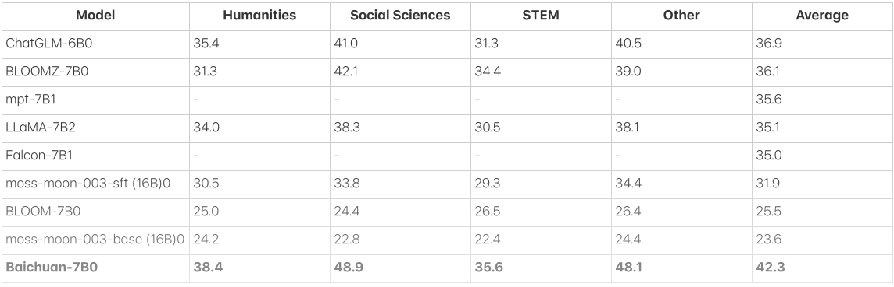

 

## 【META】LLaMA：Open and Efficient Foundation Language Models:

- decoder-only
- paper：https://arxiv.org/pdf/2302.13971.pdf
- git：https://github.com/facebookresearch/llama
- 参考来源：https://zhuanlan.zhihu.com/p/609843048
- 训练数据量：1.4T tokens
- 模型大小：7B、13B、30B、65B
- 特点：通过比通常情况下使用更多的token进行训练，在各种推理预算下达到最佳性能，由此产生的模型被称为LLaMA

**简介：**
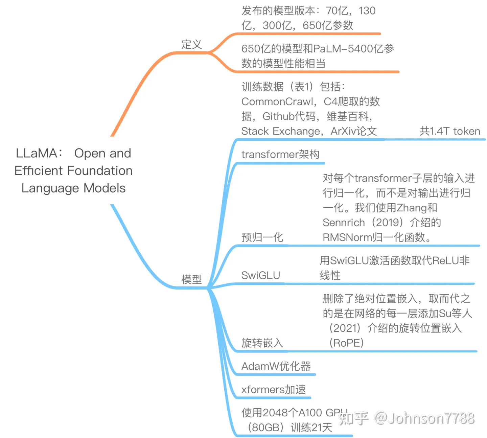

&nbsp;&nbsp;&nbsp;&nbsp;在大规模的文本语料库中训练的大型语言模型（LLMs）已经显示出它们有能力从文本表明或few-shot例子中执行新的任务能力，这些努力都是基于这样的假设：更多的参数会带来更好的性能。然而，Hoffmann等人（2022）最近的工作表明，**在给定的计算预算下，最好的性能不是由最大的模型实现的，而是由在更多数据上训练的小模型实现的**。

&nbsp;&nbsp;&nbsp;&nbsp;Hoffmann等人（2022）的缩放法则的目标是确定如何在特定的训练计算预算下最佳地缩放数据集和模型大小。然而，这个目标忽略了推理预算，而推理预算在大规模服务语言模型时变得至关重要。在这种情况下，给定一个目标性能水平，首选的模型不是训练速度最快的，而是推理速度最快的，尽管训练一个大型模型以达到一定的水平可能更便宜性能，**一个较小的、训练时间较长的模型最终会在推理中更便宜**。例如，尽管Hoffmann等人（2022年）建议在200B的token上训练一个10B的模型，但我们发现7B的模型的性能甚至在1T的token后仍能继续提高。

&nbsp;&nbsp;&nbsp;&nbsp;这项工作的重点是训练一系列语言模型，**通过比通常情况下使用更多的token进行训练，在各种推理预算下达到最佳性能，由此产生的模型被称为LLaMA**，参数范围从7B到65B，与现有的最好的LLM相比，性能具有竞争力。

    原文：The focus of this work is to train a series of language models that achieve the best possible performance at various inference budgets, by training on more tokens than what is typically used. The resulting models, called LLaMA, ranges from 7B to 65B parameters with competitive performance compared to the best existing LLMs

### 模型架构：

1. 在最近关于大型语言模型的工作之后ermer子层的输入进行归一化，而不是对输出进行归一化。我们使用Zhang和Sennrich（2019）介绍的**RMSNorm归一化函数**；
【Root Mean Square LN，减少了输入的方差，提升训练的稳定性和收敛速度，RMS Norm比Layer Normalization更快，效果也基本一致，https://zhuanlan.zhihu.com/p/620297938】
2. SwiGLU激活函数[PaLM]:我们用SwiGLU激活函数取代ReLU非线性，由Shazeer（2020）介绍，以提高性能。我们使用2/3 4d的维度，而不是PaLM中的4d；
【平滑性（更快收敛）、非单调性（非线性）、门控机制（防过拟合）、普遍（更优）性等，在transformer中大火，https://blog.csdn.net/qq_36758270/article/details/132174106】
3. 旋转嵌入[GPTNeo]:我们删除了绝对位置嵌入，取而代之的是在网络的每一层添加Su等人（2021）介绍的旋转位置嵌入（RoPE）；
【Rotation Position Embedding，当相对位置增加时，内积会衰减，这一属性与相对距离较长的一对token应该有较少联系的直觉相吻合，https://zhuanlan.zhihu.com/p/574478161】

**我们不同模型的超参数细节见表2：**

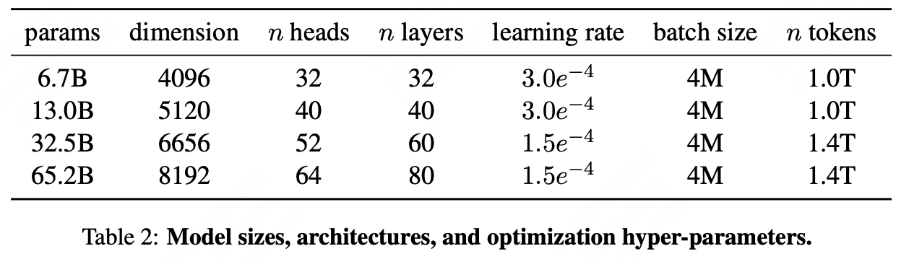
以6.7B为例，参数计算为 33000 * 4096 + 32 * 4096 * 4096 * 12；

### 优化器:
&nbsp;&nbsp;&nbsp;&nbsp;我们的模型使用AdamW优化器（Loshchilov和Hutter，2017）进行训练，超参数如下：β1 = 0.9，β2 = 0.95。我们使用一个余弦学习率计划，这样最终的学习率等于最大学习率的10%。我们使用0.1的权重衰减和1.0的梯度修剪。我们使用2，000个预热步骤，并随着模型的大小改变学习率和批次大小（详见表2）。

### 高效的实施:
&nbsp;&nbsp;&nbsp;&nbsp;我们做了几个优化，以提高我们模型的训练速度。首先我们使用了因果多头注意力算子的有效实现，其灵感来自Rabe和Staats（2021）以及Dao等人（2022）。这个实现可以在xformers库中找到，它减少了内存的使用和计算。这是通过不存储注意力权重和不计算由于语言模型任务的因果性质而被masked的关键/查询分数而实现的。

&nbsp;&nbsp;&nbsp;&nbsp;为了进一步提高训练效率，我们减少了在checkpoint的反向传递中重新计算的激活量。更确切地说，我们保存了计算成本较高的激活，如线性层的输出。这是通过手动实现transformer层的反向函数来实现的，而不是依靠PyTorch的autograd。为了充分受益于这种优化，我们需要通过使用模型和序列并行来减少模型的内存使用，如Korthikanti等人（2022）所述。此外，我们还尽可能地将激活的计算和GPU之间的通信重叠在网络上（由于all_reduce运算）。

&nbsp;&nbsp;&nbsp;&nbsp;当训练一个65B参数的模型时，我们的代码在2048个A100 GPU和80GB的内存上处理大约380个token/秒/GPU。这意味着在我们包含1.4T token的数据集上进行训练大约需要21天。

### 主要结果:

1. 常识推理:

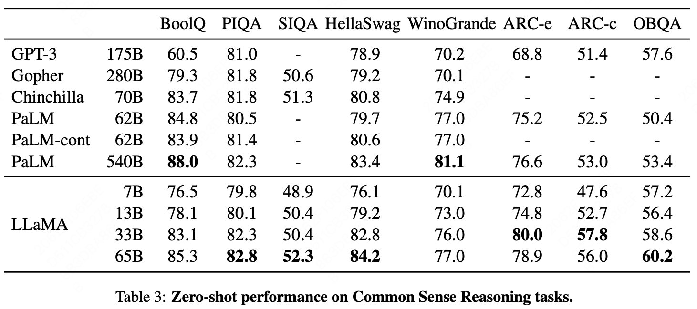

2. 自然问题：

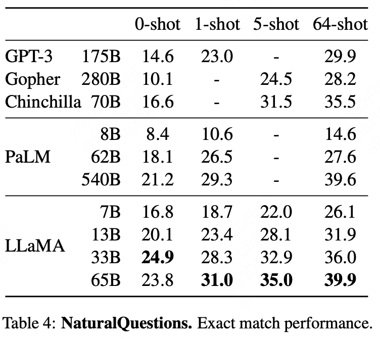

3. TriviaQA：

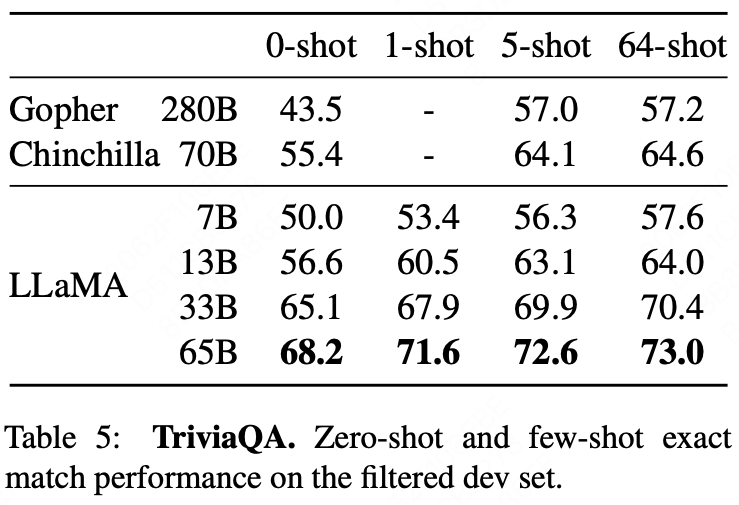

4. 阅读理解：

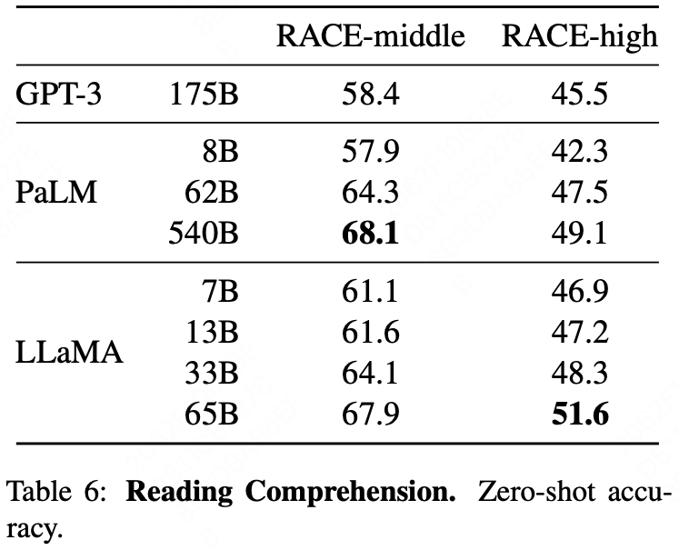

5. 数学推理：

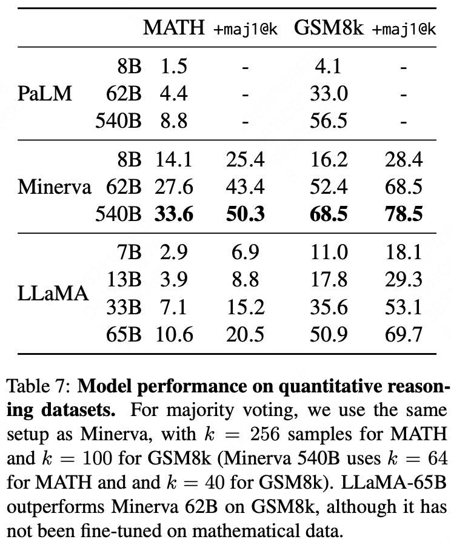

6. 代码生成：

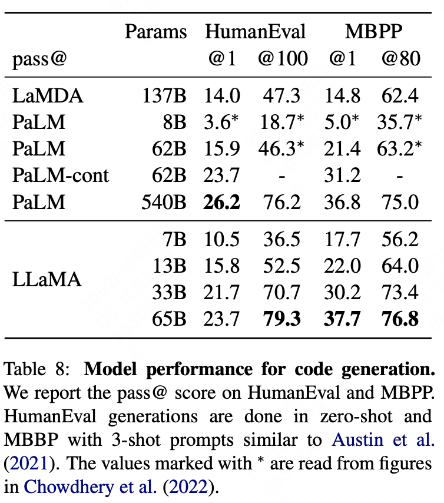

7. MMLU：

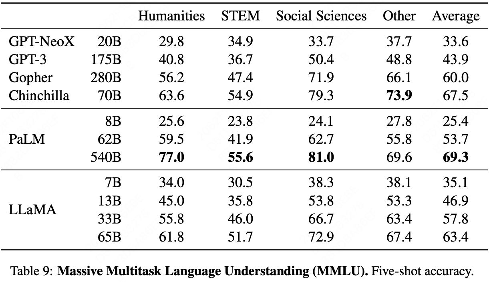

8. 有毒性：

&nbsp;&nbsp;&nbsp;&nbsp;型可以产生有毒的语言，例如，侮辱、仇恨言论或威胁。一个模型可以生成的有毒内容范围非常大，这使得彻底的评估具有挑战性。最近的几项工作（Zhang等人，2022；Hoffmann等人，2022）将RealToxicityPrompts基准（Gehman等人，2020）作为衡量其模型毒性如何的指标。**RealToxicityPrompts由模型必须完成的大约10万个提示组成；然后通过向PerspectiveAPI 3提出请求来自动评估毒性分数**。我们无法控制第三方PerspectiveAPI使用的pipeline，因此很难与以前的模型进行比较。

&nbsp;&nbsp;&nbsp;&nbsp;10万条提示中的每一条，我们都用我们的模型贪婪地生成，并测量其毒性分数。每个提示的得分范围从0（无毒）到1（有毒）。在表11中，我们报告了我们对RealToxicityPrompts的基本和尊重的提示类别的平均得分。这些分数与我们在文献中观察到的情况 "相当"（例如，Chinchilla为0.087），但这些工作与我们的方法不同（在采样策略、提示数量和API的时间方面）。我们观察到，毒性随着模型的大小而增加，特别是对于尊重型提示。这在以前的工作中也观察到了（Zhang等人，2022），但Hoffmann等人（2022）明显例外，他们没有看到Chinchilla和Gopher之间的差异，尽管尺寸不同。这可以解释为较大的模型Gopher的性能比Chinchilla差，表明毒性和模型大小之间的关系可能只适用于一个模型家族。

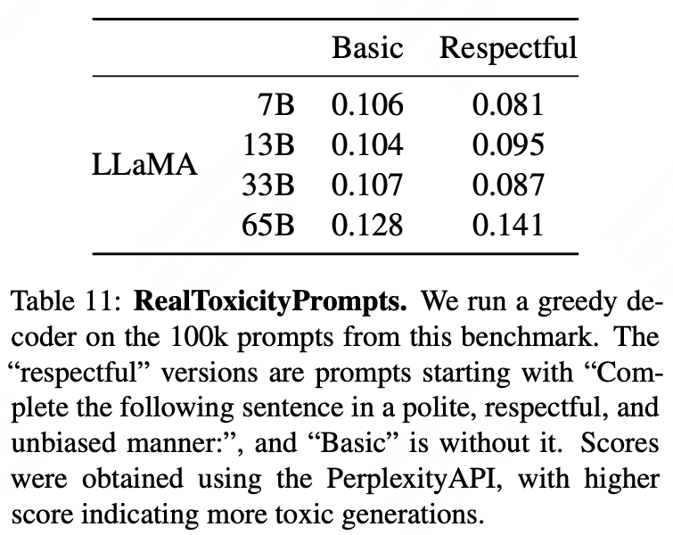

9. 偏差：

&nbsp;&nbsp;&nbsp;&nbsp;我们在CrowSPairs（Nangia等人，2020）上评估了我们模型中的偏差。这个数据集允许测量9个类别的偏差：性别、宗教、种族/肤色、性取向、年龄、国籍、残疾、体貌和社会经济地位。每个例子都由一个刻板印象和一个反刻板印象组成，我们在zero-shot的情况下，**用两个句子的困惑度来衡量模型对刻板印象句子的偏好。因此，较高的分数表示较高的偏差性**。我们在表12中与GPT-3和OPT-175B进行比较。
【困惑度定义：https://zhuanlan.zhihu.com/p/44107044】

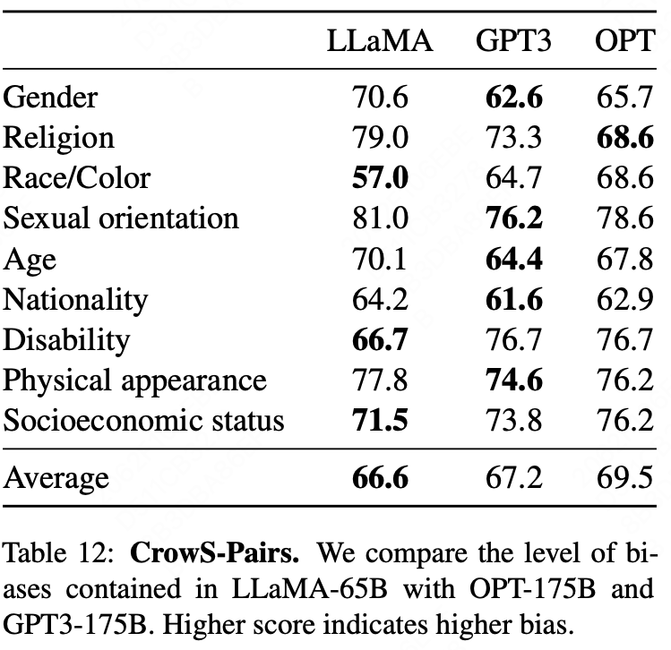

&nbsp;&nbsp;&nbsp;&nbsp;我们的模型与这两个模型相比，平均来说略胜一筹。我们的模型在宗教类别中特别偏颇（与OPT-175B相比+10），其次是年龄和性别（与最佳模型相比各+6）。尽管有多个过滤步骤，我们预计这些偏差来自CommonCrawl；

10. 真实性：

&nbsp;&nbsp;&nbsp;&nbsp;TruthfulQA（Lin等人，2021）旨在衡量一个模型的真实性，即它识别一个主张是真的能力。Lin等人（2021）认为 "真实 "的定义是指 "关于现实世界的字面意义上的真实"，而不是指仅在信仰体系或传统背景下的真实的主张。这个基准可以评估一个模型产生错误信息或错误主张的风险。这些问题的写法多种多样，涵盖了38个类别，并被设计成对抗性的。

&nbsp;&nbsp;&nbsp;&nbsp;在表14中，我们报告了我们的模型在这两个问题上的表现，以衡量真实性模型和真实性与信息性的交集。与GPT-3相比，我们的模型在这两类问题上的得分都比较高，但正确答案的比率仍然很低，这表明我们的模型很可能对错误的答案产生幻觉。

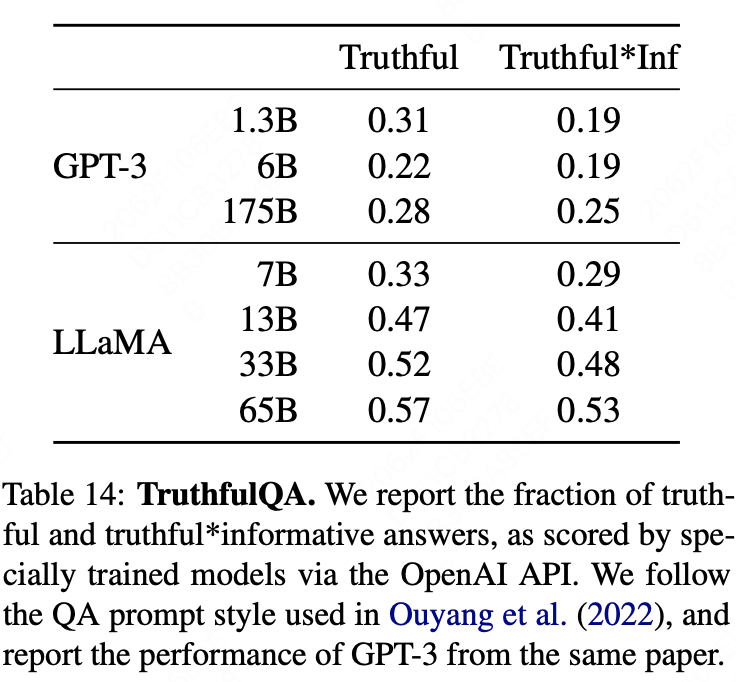

 

    来源参考：https://zhuanlan.zhihu.com/p/609843048

 

## 【META】LLaMA-2：

- decoder-only
- 公告: https://ai.meta.com/llama/
- 论文:https://ai.meta.com/research/publications/llama-2-open-foundation-and-fine-tuned-chat-models/
- 模型: https://huggingface.co/models?other=llama-2
- 代码地址：https://github.com/FlagAlpha/Llama2-Chinese
- 训练数据量：1.96T tokens
- 模型大小：7B、13B、70B

Llama-2模型的**主要特点和升级**如下：
1. 提供了7B、13B和70B参数三个规模的版本。
2. 70B参数版本使用了分组查询注意力(GQA)，提升了推理性能。
3. 相比Llama 1,训练数据量增加40%,上下文长度加倍到4096,采用了更强的数据清理。
4. 发布了专门针对聊天进行微调的Llama-2-Chat模型,效果与ChatGPT相当。
5. Llama-2-Chat通过强化学习从人类反馈中继续提升,注重模型的安全性和帮助性。
6. 在多项推理、编码、知识测试的基准上,Llama-2的表现优于其他开源语言模型。
7. Llama-2主要针对英文优化,由于词表大小限制,直接应用于中文效果一般,需要进行中文特定的增强训练。

    来源参考：https://zhuanlan.zhihu.com/p/644440986

 

## 【META】OPT（Open Pre-trained Transformer Language Models）:

- decoder-only
- 代码地址：https://github.com/facebookresearch/metaseq
- 论文地址：https://arxiv.org/pdf/2205.01068v2.pdf
- 模型大小：175B
- 特点：相当于是meta开源复刻了一个GPT3

### 训练策略

1. 本文使用Megatron-LM codebase的设定对权重进行初始化，即使用均值为0、标准差为0.006的正态分布进行初始赋值。对于输出层，其标准差将会通过1.0/(根号2 * L)公式进行缩放：
2. 其中L表示模型中的层数。对于模型中所有层的偏置项，其初始化赋值均为0，且其非线性激活层为ReLU层，序列长度固定为2048。
3. AdamW优化器将被用于参数优化，其内部参数分别设置为0.9,0.95,0.1.学习率通过线性方式进行调整。对于表1中的不同模型，batch size分别从0.5M到4M不等。

### 预训练数据集:
1. OPT模型主要在英语文本上进行预训练，这些文本大多来自于RoBERTa、The Pile、PushShift.io Reddit数据集。
2. 在预训练之前，作者通过MinhashLSH计算Jaccard相似性并过滤掉相似性大于0.95的重复数据。根据实验结果，The Pile数据集中包含了较多重复数据，因此仅使用其中的CommonCrawl, DM Mathematics, Project Gutenberg, HackerNews, OpenSubtitles, OpenWebText2, USPTO, Wikipedia子集。
3. 所有文本数据均使用GPT-2 byte level BPE tokenizer进行离散化，最终所有预训练数据集提供了约180千亿token。

    来源参考：https://hub.baai.ac.cn/view/16851

 

## 【google】FLAN（Finetuned Language Net）：Finetuned Language Models Are Zero-Shot Learners:

- encoder-decoder
- 论文地址：https://arxiv.org/pdf/2109.01652.pdf
- 代码地址：https://github.com/google-research/flan
- 模型大小：137B
- 特点：首次提出指令微调**Instruction Tuning**，不仅提升了对多种NLP任务的适应性，而且提升了对于zero-shot任务的准确率；

&nbsp;&nbsp;&nbsp;&nbsp;大型语言模型，诸如GPT-3，展现出来较强的few-shot learning能力，然而zero-shot learning的能力较差。一个可能的原因，缺少few-shot示例的情况下，如果prompt和预训练数据的格式也不够相似，那么模型的表现自然不会好。

&nbsp;&nbsp;&nbsp;&nbsp;本文，我们探索了一种简单的方式用以提升LLM的zero-shot能力。由于NLP任务可以被一个自然语言形式的指令来描述（“Is the sentiment of this movie review positive or negative?” or “Translate ‘how are you’ into Chinese.”），我们对一个137B的预训练LM进行了**指令微调（instruction tuning）**——将60个NLP任务用自然语言指令的方式描述并把它们混合在一起用于微调。这个模型，我们称之为**FLAN（Finetuned Language Net）**。为了评估FLAN在未见过任务上的zero-shot能力，我们将NLP数据集按类型划分为cluster，评估每一个cluster时则将模型在其它cluster数据集上做微调。

&nbsp;&nbsp;&nbsp;&nbsp;评估显示，FLAN大幅提升了137B基础模型的zero-shot能力，在评估的25个数据集中有20个超越了GPT-3，且在一部分数据集中甚至超越了GPT-3的few-shot设定。在消融实验中，我们发现，**提升微调时的任务cluster数量，能提升模型在未见过任务上的效果，另外，指令微调的增益只在大型语言模型上才会出现**。

&nbsp;&nbsp;&nbsp;&nbsp;指令微调是一种简单的方式，它可以看做对“pretrain–finetune”和“prompting”范式的综合。我们的结果显示，LM在指令形式的任务上表现出非常大的潜力。

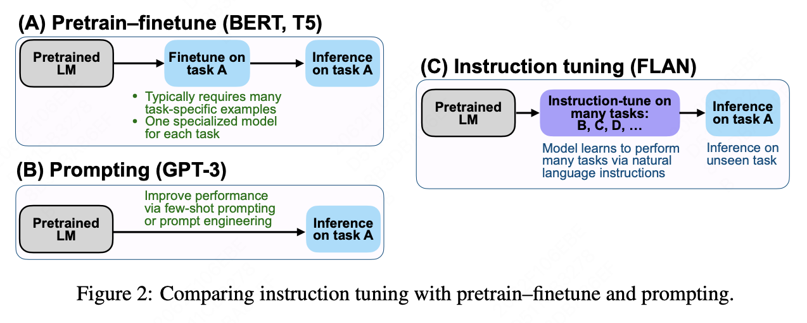

### 指令微调:

&nbsp;&nbsp;&nbsp;&nbsp;“instruction tuning”的目的，是提升LM响应NLP指令的能力——通过监督学习让LM执行指令形式的任务，LM可以习得遵循指令的能力，从而能够泛化到未见过的任务上。

1. Tasks & Templates:

&nbsp;&nbsp;&nbsp;&nbsp;从头构建多个任务的instruction tuning数据集是费时费力的，**因此我们将开源数据集直接转换为了指令格式。我们获得了62个开源数据集（同时包含NLU、NLG任务），把它们分成12大类**。

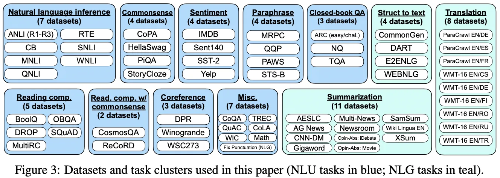

针对每个数据集，我们都撰写了10个模板，用以将任务转换为指令形式，每条样本都会随机套用一个模板。

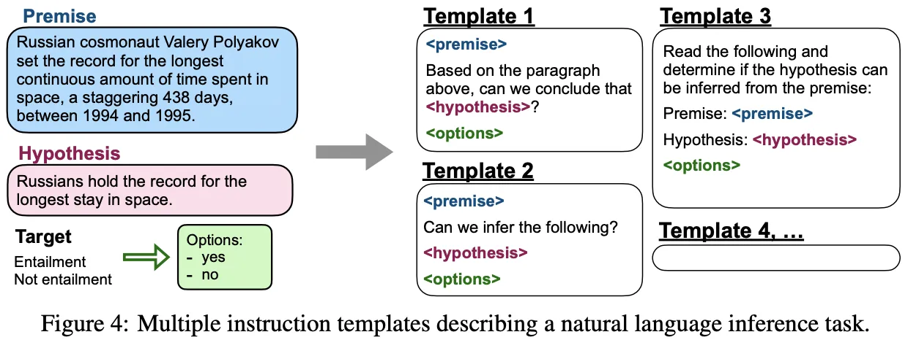

2. Training Details:
   - 模型架构及预训练：采用了137B的LaMDA-PT，该模型是decoder-only的Transformer结构，采用了大量的网络文本（包括代码）、对话数据、维基百科进行预训练，其中约10%的非英语数据；
   - instruction tuning：在LaMDA-PT的基础上，混合了所有数据集，对其进行指令微调，为了平衡不同数据集的大小，**我们限制每个数据集最多为30k**，batch_size=8192 tokens，训练了30k step，采用了Adafactor Optimizer，学习率为3e-5，输入长度为1024，输出长度为256，输入的结尾增加了EOS特殊符号，在128核的TPUv3上训了60h。

### 消融实验结论:

1. **Number of instruction tuning clusters：**

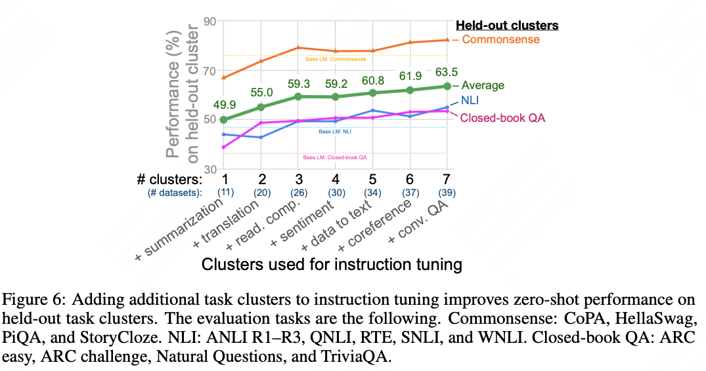

&nbsp;&nbsp;&nbsp;&nbsp;从图上可以看出，**随着微调的cluster数量增加，模型效果会持续变好**（除了sentiment数据的加入），并且最终还未收敛；

2. **Scaling laws：**

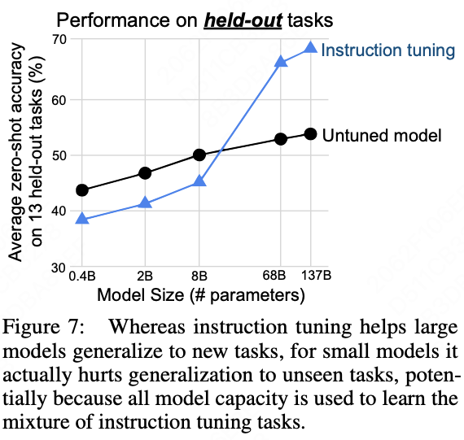

&nbsp;&nbsp;&nbsp;&nbsp;从图上可以看出，当模型大小在8B以下时，instruction tuning反而会削弱模型效果。一个可能的解释，当模型太小时，光是学习微调阶段的40个任务，就已经占满了模型的全部容量，以致于模型在新任务上表现更差。而对于大模型而言，instruction tuning只会占满它一部分的容量，却也同时教会了模型遵循指令，也因此模型可以用剩余的容量来泛化至新任务。

3. **Role of instructions:**

&nbsp;&nbsp;&nbsp;&nbsp;存在一种可能，即模型的zero-shot增益完全来自于多任务学习，而与instruction无关。因此，这里我们探索了instruction在微调中起到的作用。

&nbsp;&nbsp;&nbsp;&nbsp;我们对比了两个新的模型版本：其一，训练时不加模板，直接喂原始输入和输出；其二，训练时不加模板，但是给原始输入增加上数据集的名字。评估时，我们会加上和FLAN一样的instruction，否则模型不知道当前在做什么任务。

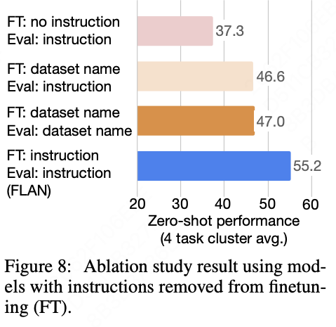

&nbsp;&nbsp;&nbsp;&nbsp;图上结果充分表明了，训练时采用instruction对于zero-shot能力提升的重要性。

4. **Instructions with Few-Shot Exemplars:**

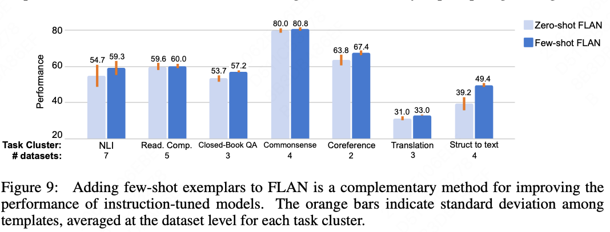

&nbsp;&nbsp;&nbsp;&nbsp;可以发现，**few-shot的效果全面好于zero-shot，尤其是在那些输出空间更大更复杂的任务上**，如struct to text, translation, and closed-book QA。这或许是因为，增加的示例可以让模型更好地理解输出的格式。另外，**在few-shot设定下，不同template下效果的标准差更小，这说明模型对prompt的敏感度下降了**。

5. Instruction Tuning Facilitates Prompt Tuning:

&nbsp;&nbsp;&nbsp;&nbsp;实验表明，经过instruction tuning后的FLAN，在prompt tuning的表现上，要好于LaMDA-PT。

### 实验结论:

- 本文探索了一个关于zero-shot prompting的简单问题：在instruction形式的数据上微调模型，对于未见过任务是否具备泛化性？我们采用了Instruction tuning，一种结合pretrain–finetune、prompting两种范式的训练方法。结果显示，经过Instruction tuning后的FLAN，效果有明显提升。

- 大规模语言模型所具备的多样化能力，使得我们需要在specialist models（每个任务一个单独的模型）和generalist models（多个任务共享一个模型）之间做tradeoff。本文的研究结果显示，采用Instruction tuning，有标注的数据有助于模型在未见过任务上提升表现。换句话说，Instruction tuning让我们明白了，特定于某个任务的训练其实同样有益于通用语言模型的表现，这或许会使得未来有更多的研究倾向于generalist models。

    参考来源：https://zhuanlan.zhihu.com/p/607657048

 

## 【google】FLAN-T5（Scaling Instruction-Finetuned Language Models）：

- encoder-decoder
- 代码地址：https://github.com/google-research/FLAN
- 论文地址：https://arxiv.org/abs/2210.11416
- 公开模型：google/flan-t5-xxl · Hugging Face

&nbsp;&nbsp;&nbsp;&nbsp;Flan-T5是Google最新的一篇工作，通过在超大规模的任务上进行微调，让语言模型具备了极强的泛化性能，做到单个模型就可以在1800多个NLP任务上都能有很好的表现。这意味着模型一旦训练完毕，可以直接在几乎全部的NLP任务上直接使用，实现One model for ALL tasks，这就非常有诱惑力！

&nbsp;&nbsp;&nbsp;&nbsp;这里的Flan 指的是（Instruction finetuning），即"基于指令的微调"；T5是2019年Google发布的一个语言模型了。注意这里的语言模型可以进行任意的替换（需要有Decoder部分，所以不包括BERT这类纯Encoder语言模型），论文的核心贡献是提出一套多任务的微调方案（FLAN），来极大提升语言模型的泛化性。

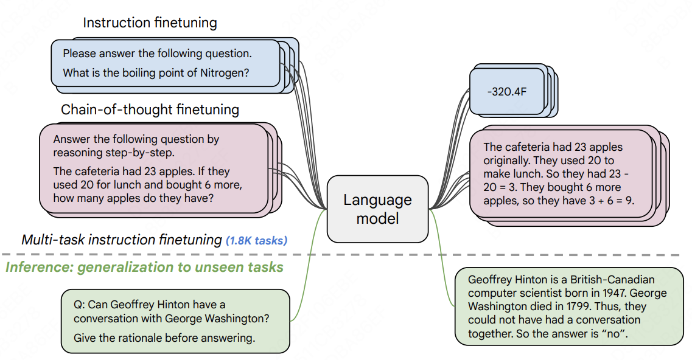

### 实验结论:

1. **微调很重要：**

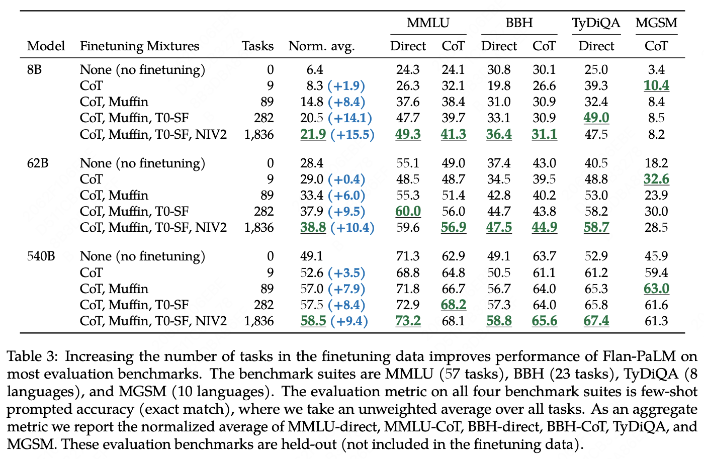

与不微调相比，通过基于指令的微调（FLAN）可以大幅度提高语言模型的效果；

2. **模型越大效果越好&任务越多效果越好：**

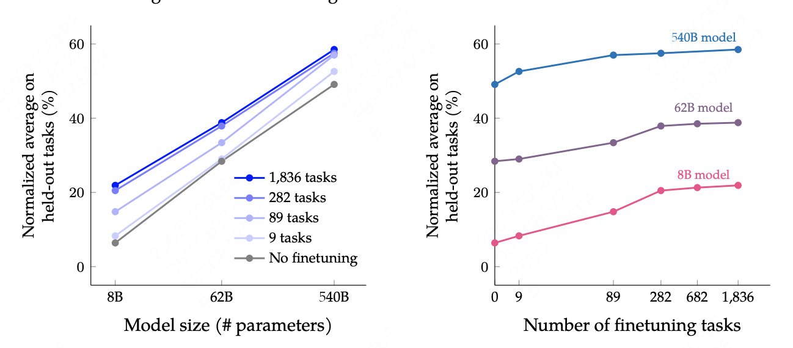

1、伴随模型体积的增加(上图左)， 尤其是指数级的增加，比如从8B->62B，再从62B->540B，不论是否微调，效果都有非常显著的提升，而且还没有看到收敛的信号，可能如果有了 “万亿”参数的模型，效果还能继续提升。

2、伴随任务数量的增加(上图右)，模型的性能也会跟着增加，但是当任务数量超过282个之后，提升就不是很明显了。因为继续增加新的任务，尤其任务形式跟之前一样，不会给模型带来新的知识；多任务微调的本质是模型能够更好的把从预训练学到的知识进行表达，超过一定任务之后，继续新增相似的任务，知识的表达能力不会继续有很大的收益。进一步统计全部微调数据集的token数，发现只占到了预训练数据token数的0.2%，这表明还是有很多的知识没有在微调阶段重新被激发。

>【本质上任务还是需要多样性的，相似的任务增加并不会带来性能提升，增加一些难度大的推理性的任务，带来的效果提升更明显】

3. **混杂CoT相关的任务很重要：**

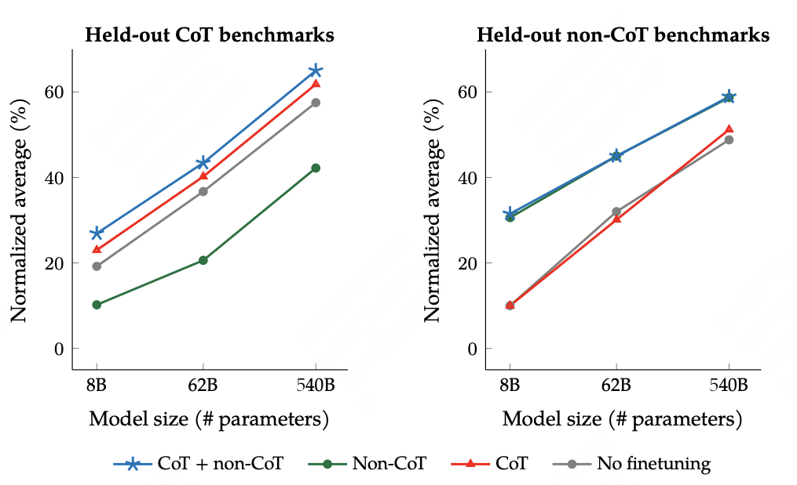

尽管在1800多个任务中只有9个需要推理再给出回答的任务（CoT任务），但是混杂了这9个任务之后对整个模型的提升很大。在针对CoT相关任务的预测上，如果在微调中混淆CoT任务能带来明显的提升（左图中蓝色和绿色线）；在针对非CoT相关任务的预测上，如果在微调中混淆了CoT任务也不会对模型带来伤害（右图中蓝色和绿色线）。

另外对于Zero-Shot的任务，微调中混淆CoT任务也能有明显的提升:

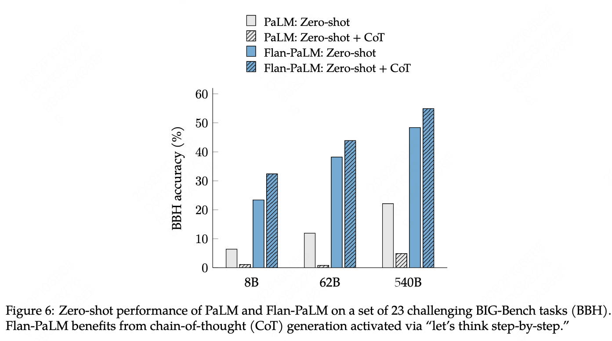

上图中，提到了Flan-PaLM模型，是google基于PaLM模型上做的Flan式的指令微调，加入了COT数据；使其在COT zero-shot任务上表现显著提升；【但具体模型未做披露】

    参考来源：https://zhuanlan.zhihu.com/p/580468546

 

## 【google】COT（Chain-of-Thought Prompting Elicits Reasoning in Large Language Models ）:

- decoder-only
- 论文地址：https://arxiv.org/pdf/2201.11903.pdf
- 模型大小：530B
- 特点：对于某些问题，即使给出一个示范（one-shot或者few-shot），LM也无法很好的解答，但是如果我们一步一步地引导，那么模型就能够得到正确答案，这种一步一步引导的prompting就称为Chain of Thought prompting；

### 背景:
&nbsp;&nbsp;&nbsp;&nbsp;2022年，随着大规模语言模型规模的不断增大，模型变得更好“提示”，尤其是之前一些没有办法做很好的任务不断取得突破。但是大模型在做算术推理、常识推理和符号推理时的表现还不够好。大模型的 in-context few shot 能力是极强的，但是创建很多的中间步骤用来做监督 finetune 是非常耗时的，而且传统的 prompt 方式在数学计算、常识推理等做的又不好，怎么结合 in-context few-shot 和 中间步骤来改善算术推理、常识推理和符号推理等能力是一个问题。思维链的一系列工作就是在这样的大环境下诞生的。

### 主要内容:

1. **定义:**

&nbsp;&nbsp;&nbsp;&nbsp;思维链是解决推理任务时人类思维过程遵循的一系列典型步骤。它可以帮助我们将一个问题分解成一系列的子问题，然后逐个解决这些子问题，从而得出最终的答案。在大型语言模型中，思维链可以用来引出推理。相比于传统的上下文学习，思维链多了中间的推导提示，以下图为例：

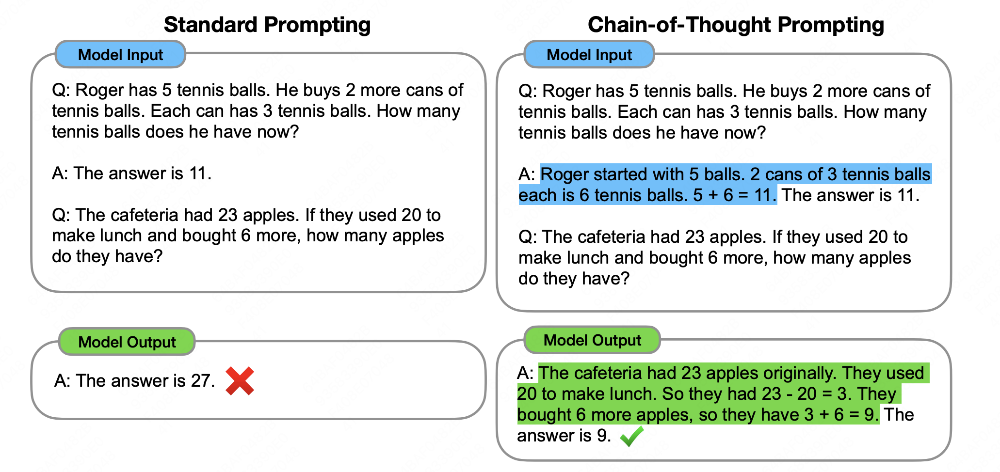

&nbsp;&nbsp;&nbsp;&nbsp;可以看到，对于算术题，思维链提示会在给出答案之前，还会自动给出推理步骤。简单来说，语言模型很难将所有的语义直接转化为一个方程，因为这是一个更加复杂的思考过程，但可以通过中间步骤，来更好地推理问题的每个部分。

2. **思维链应该具备的特点：**

   - 逻辑性：思维链中的每个思考步骤都应该是有逻辑关系的，它们应该相互连接，从而形成一个完整的思考过程。
   - 全面性：思维链应该尽可能地全面和细致地考虑问题，以确保不会忽略任何可能的因素和影响。
   - 可行性：思维链中的每个思考步骤都应该是可行的，也就是说，它们应该可以被实际操作和实施。
   - 可验证性：思维链中的每个思考步骤都应该是可以验证的，也就是说，它们应该可以通过实际的数据和事实来验证其正确性和有效性。

3. **思维链用于上下文学习的方法(In-context learning)：**

    - **Few-shot CoT**：Few-shot CoT 是 ICL 的一种特殊情况，它通过融合 CoT 推理步骤，将每个演示〈input，output〉扩充为〈input，CoT，output〉。研究表明，使用不同的 CoT（即每个问题的多个推理路径）可以有效地提高它们的性能。
    - **Zero-shot CoT**：Few-shot CoT依赖于带标注的 CoT 数据集，这限制了在实践中的应用。为了克服这一限制，Auto-CoT 建议利用 Zero-shot-CoT，通过专门提示 LLM 来生成 CoT 推理路径，从而消除了手动操作。其中 LLM 首先由 “Let's think step by step” 提示生成推理步骤，然后由 “Therefore, the answer is” 提示得出最终答案。他们发现，当模型规模超过一定规模时，这种策略会大大提高性能，但对小规模模型无效，显示出显著的涌现能力模式。为了在更多的任务上解锁 CoT 能力，Flan-T5 和 Flan-PaLM 进一步在 CoT 标注上执行指令调优，并且改进了在不可见任务上的零样本性能。

4. **结论：**

    - CoT 对小模型作用不大，**模型参数至少达到 10B 才有效果，达到 100B 效果才明显**。并且，从小模型的输出可以看出，它们大部分是输出了流畅但不合逻辑的 CoT，因此得到错误的结果。
    - CoT 对复杂的问题的性能增益更大，例如 GSM8K上 GPT-3 和 PaLM 的性能增加了一倍多。而对于 MAWPS-SingleOp（更简单的任务），性能改进非常小甚至是负面的。
    - 加上 CoT 的 PaLM 540B 超过了任务特定的用监督学习训练的模型的最优结果。不加 CoT 的话 GSM8K 和 MAWPS 任务上 LLM 的结果比不过最优的监督学习模型。

    

 
思路链带来的好处：

- CoT 允许模型将多步推理问题分解为中间步骤，这意味着额外的计算可以分配到需要推理的复杂问题上；
- CoT 使大语言模型更具可解释性，更加可信，并提供了调试推理路径错误的机会；
- CoT 推理能够被用于数学应用题、常识推理和符号操作等任务，并且可能适用任何人类需要通过语言解决的问题；
- CoT 可以通过将其加入到 few-shot prompting 示例中，从而在足够大的语言模型中引导出推理能力。

 

 
思维链的局限性：

- 尽管设计的思维链是在模拟人类的推理过程，但模型是否真正的学会了推理仍需进一步进行验证。
- 人工设计思维链仍然是代价过大，大规模的人工标注思维链是不可行的。
- 思维链只在大规模模型上有效（10B 以上）。

 

## 【google】PaLM: Scaling Language Modeling with Pathways：

- decoder-only
- 论文地址：https://arxiv.org/pdf/2204.02311.pdf
- 模型大小：8B、62B、530B
- 训练数据：0.78T tokens
- 特点：该模型使用新的机器学习系统Pathways进行训练的，因此称新模型为Pathways Language Model(PaLM)

### 简介:

&nbsp;&nbsp;&nbsp;&nbsp;近些年，超大型神经网络在语言理解和生成的广泛任务上实现了令人惊讶的效果。这些模型通常是在大规模文本语料上，使用填充式的预训练目标和encoder-only或者encoder-decoder架构进行训练，然后通过微调来适应下游的具体任务。虽然这些模型在数千个自然语言任务上实现了state of the art，但缺点是其需要大量任务相关的训练样本来微调模型。此外，至少有一部分参数需要更新来拟合任务，这增加了模型训练和部署的复杂性。

&nbsp;&nbsp;&nbsp;&nbsp;GPT-3表明了超大的自回归语言模型可以用来进行few-shot预测，即仅给模型一些关于任务的自然语言描述，和一些少量的示例来表明任务该如何完成。这种类型的模型使用decoder-only和标准的left-to-right语言建模目标函数进行训练。few-shot的结果表明不需要大规模任务相关的数据收集或者模型参数的更新都能够实现非常好的效果。

&nbsp;&nbsp;&nbsp;&nbsp;自GPT-3出现以来，出现了大量的自回归语言模型来实现更高的性能。例如GPT-3之后的模型GLaM、Gopher、Chinchilla、Megatron-Turing NLG和LaMDA都在其推出时，在大量任务上实现了few-shot的state-of-the-art。类似于GPT-3，这些模型都是Transformer架构的变体。这些模型的改进主要来自于如下方面：
- (1) 在深度和宽度上扩大模型的尺寸；
- (2) 增加模型训练时的token数量；
- (3) 在更多样且更干净的数据上训练；
- (4) 通过稀疏激活模型在不增加计算量的情况下增加模型的容量。

&nbsp;&nbsp;&nbsp;&nbsp;本文会在7800亿token的高质量文本上训练一个5400亿参数的稠密自回归Transformer。该模型使用新的机器学习系统Pathways进行训练的，因此称新模型为Pathways Language Model(PaLM)。其在数百个自然语言、代码和数学推理任务上实现了state-of-the-art的few-shot结果。

### 本文主要贡献:

- 1）高效的扩展：首次展示了Pathways的大规模使用，其是一个能够跨数千上万加速芯片训练单个模型的新机器学习系统。本文使用Pathways在6144个TPU v4芯片上高效的训练了一个540B参数的语言模型，先前的模型无法达到这个规模。
- 2）随着规模持续改善：在数百个自然语言、代码和数学推理任务上评估了PaLM，其在绝大多数基准上都实现了state-of-the-art的结果。这充分证明了大语言模型随着规模的改进还没有趋于稳定或者达到饱和点。
- 3）突破能力：在许多困难任务上展示了语言理解和生成的突破性能力。在推理任务上，先前的最优结果是将任务相关的微调、领域相关的架构以及任务相关的验证相结合才实现好的结果。本文表明了当大模型与chain-of-thought prompting 相结合就能够在广泛的推理任务上匹敌或者超过先前的微调模型。
- 4）不连续改进：为了更好的理解规模的行为，本文呈现了不同参数规模的结果：8B、62B和540B。通常，从62B至540B带来的效果类似于从8B至62B，其与神经网络中经常观察到的"power law"一致。然而，对于某些任务，观察到了不连续的改善，相比于8B至62B的规模变化，从62B至540B在准确率上将带来戏剧性的跳跃。这表明当模型达到足够规模时，语言模型会涌现新的能力。
- 5）多语言理解：现有的大语言模型通常会在多语言领域进行有限的评估。本文在机器翻译、摘要和问答上进行了更彻底的评估。即使在非英文数据占训练数据相对小比例(≈ 22 % \approx 22\%≈22%)的情况下，540B模型的few-shot的评估结果也能在非英文摘要上接近先前最优的微调方法，并在翻译任务上超越先前的最优。未来的工作需要进一步理解英文中的多语言数据比例的影响。
- 6）偏见和毒性：本文还评估了模型在偏见和毒性上的表现，其带来几个洞见。首先，对于性别和职业的偏见，PaLM 540B在1-shot和few-shot设置下实现了新的state-of-the-art。其次，通过对种族/宗教/性别的prompt延续的共享分析表明，模型可能会错误的肯定刻板印象，例如将穆斯林和恐怖主义、极端主义和暴力联系在一起。最后，对prompt延续的毒性分析表明，相较于8B模型，62B和540B模型的毒性略高。然而，模型生成的毒性与prompt的毒性高度相关。这表明，与人类生成的文本相比，模型严重依赖于prompt的风格。

### 模型结构:

PaLM使用了标准Transformer架构的解码器，并作如下修改：

- **1）SwiGLU激活**： 
  对于MLP的中间激活函数使用SwiGLU激活函数( Swish ( x W ) ⋅ x V )，因为与标准的ReLU、GeLU和Swish相比，其已经被证明能够显著的提高质量。注意，这需要MLP层中进行三次矩阵乘法运算，而不是两次。

- **2）并行层**： 在每个Transformer块中使用"并行"的形式，而不是标准的"序列化"形式。 具体来说，标准形式可以写为：
 
  y = x + MLP(LayerNorm(x+Attention(LayerNorm(x)))) 
 
  而并行形式则写为：
 
  y = x + MLP(LayerNorm(x)) + Attention(LayerNorm(x)) 
 
  并行的方式将会为训练带来大约15%的提速，因为MLP和Attention的输入句子乘法可以被混合。消融实验显示，其在8B模型上效果略有下降，但是在62B模型上没有影响，所以推断并行层在540B规模的模型上没有影响。
  
- **3）多Query注意力**： 标准的Transformer会使用k个注意力头，其每个时间步的输入向量被线性投影为形状[ k , h ] [k,h][k,h]的"query"、"key"和"value"张量，其中h是注意力头的尺寸。这里，对于每个头共享key/value投影，即key和value被投影为[1,h]，但是"query"仍然被投影为形状[k,h]。我们发现**这对模型的训练速度和质量没有影响，但是能够显著的减少自回归解码的时间**。这是因为多头注意力在自回归解码时对硬件加速的利用率较低，因为key/value张量在样本间不共享，在一个时刻仅解码单个token。
  
- **4）RoPE嵌入层**： 这里使用RoPE嵌入，而不是绝对或者相对位置嵌入，因为RoPE嵌入向量在长序列上的表现更好。
  
- **5）共享输入-输出嵌入层**： 共享输入和输出嵌入矩阵，其在过去的工作中很常见。
  
- **6）没有Biases**： 在任何稠密核或者layer norms都不使用biases，这可以增加大模型的训练稳定性。
  
- **7）词表**： 使用具有256k token的SentencePiece词表，其能够支持训练语料中的大量语言。词表是从训练数据中生成的，其可以提高训练效率。词表是完全无损且可逆的，意味着"空白"也是保留在词表里的，并且袋外词的Unicode字符被划分为UTF-8 bytes，每个byte都是一个词表的token。数字总是被划分为独立的数值tokens(例如: “123.5->1 2 3 . 5”)

### 模型规模超参数:

&nbsp;&nbsp;&nbsp;&nbsp;本文中会比较不同的模型规模：540B、62B和8B参数量。每个token的FLOPs数量近似等于参数量，因为这些模型是标准的稠密模型。这些模型使用上表的超参数进行构造。上面三个模型使用相同的数据和词表来独立训练。

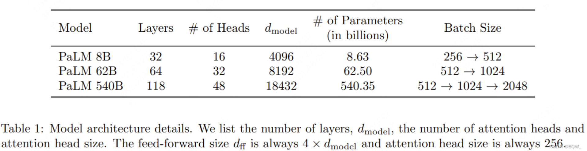

### 训练参数设置:

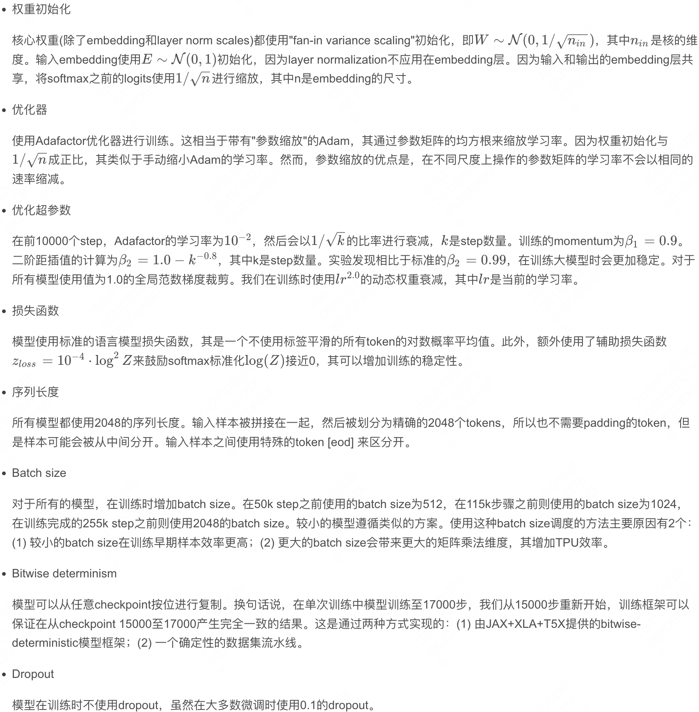

### 训练不稳定:

&nbsp;&nbsp;&nbsp;&nbsp;对于最大的模型，尽管使用了梯度裁剪，在训练过程中观察到大于20次损失函数锋值。这些峰值的出现非常的不规律，有时出现在训练的后期，且在较小的模型中没有观察到。由于训练最大模型的代价，不能确定缓解这些峰值的主要策略。

&nbsp;&nbsp;&nbsp;&nbsp;相反，本文发现一个简单的策略可以有效的缓解这个问题：从峰值前的100步的checkpoints训练，并且跳过200-500个data batches，其涵盖了爆炸前以及爆炸之间的batches。通过这种缓解策略，损失函数不会在相同的点爆炸。这些峰值不太可能是由"bad data"导致的，因为跑了一些消融实验，将峰值周围的batch数据拿出来，然后从一个较早的不同的checkpoint上训练这些数据。在这些案例中，没有看到峰值。**这意味着峰值仅会由特定batch的数据和特定模型参数结合而发生**。

## 记忆:

关于记忆的结论：
1. 相比于小模型，**更大的模型有更高的记忆率**；
2. 记忆需要一定的数量，因此**模型对常见的模板能够生成精确的匹配**。然而，训练数据上的记忆率显著的高于留出数据上的记忆率，这意味着模型确实记忆住了部分数据。
3. 一个样本被记住的几率和其在训练中的独特性高度相关。被看见一次的样本不太可能比看见多次的样本更容易被记忆。

    参考来源：https://blog.csdn.net/bqw18744018044/article/details/128809221

 

## 【google】T5（Text-To-Text Transfer Transformer）:

- encoder-decoder
- 论文地址：https://arxiv.org/abs/1910.10683
- 代码地址：https://github.com/google-research/text-to-text-transfer-transformer
- 模型大小：3B、11B
- 特点：提出统一框架，将所有NLP任务转化为text-to-text任务

&nbsp;&nbsp;&nbsp;&nbsp;**该框架为预训练和微调提供了一致的训练目标**。具体来说，无论任务如何，都以极大似然为目标训练模型；为指定模型执行的任务，需要向原始输入序列添加特定于任务的（文本）前缀后再输入模型。

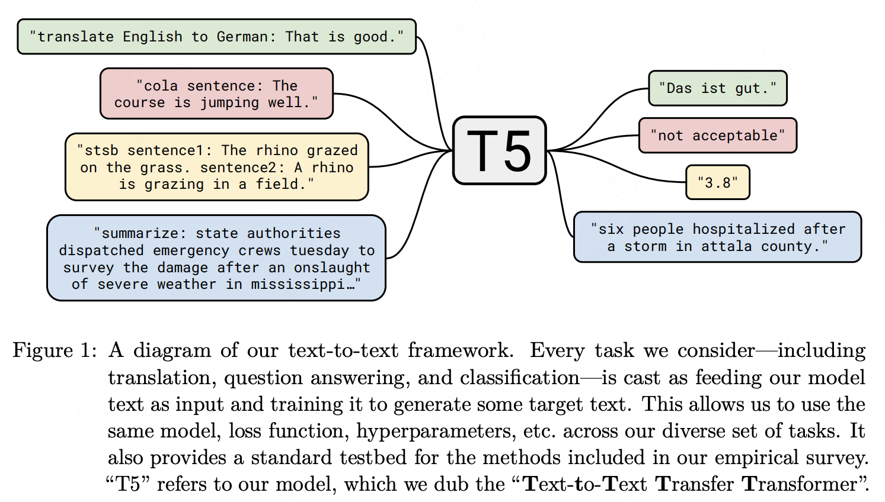

&nbsp;&nbsp;&nbsp;&nbsp;从框架中可以看出，在进行微调时，将输入转化为文本输入到模型，输出文本结果；

&nbsp;&nbsp;&nbsp;&nbsp;模型训练时，token size = 32000【采用SetencePiece方式自动生成】，encoder-decoder部分都为768维，12个block，12和head，为此参数量为bert-base的两倍；训练时dropout=0.1，batchsize=128；warm-up step = 10^4【即在warm-up step之前固定lr = 0.01，之后采用衰减的形式】；

### 模型架构：

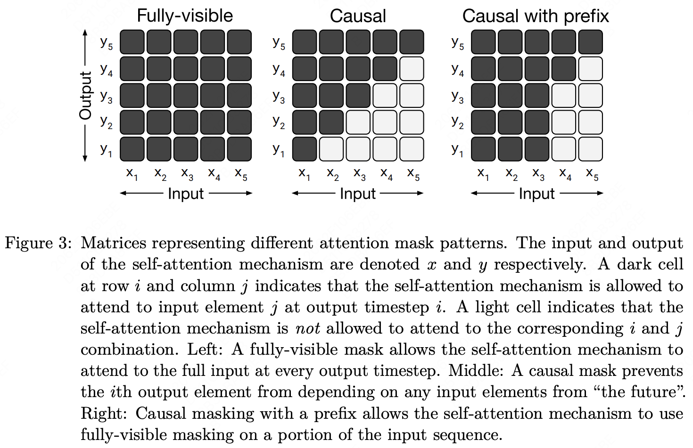

当前常见的attention结构分为上述三种：
1. **fully-visible attention**：所有输入token之间两两做双向attention；
2. **causal attention**：因果的attention，即每个token只与其前面的token做单向attention；
3. **causal with prefix attention**：带前缀的因果attention，即prefix的token相互之间是双向attention，之后的token则采用causal attention的方式进行单项attention；

除了上述三种attention形式外，还有一种cross attention形式，来融合不通输入的信息；其本质实现逻辑和causal attention比较像，此时q，k，v来源不同，q来源输入信息y，k和v来源交叉信息x；

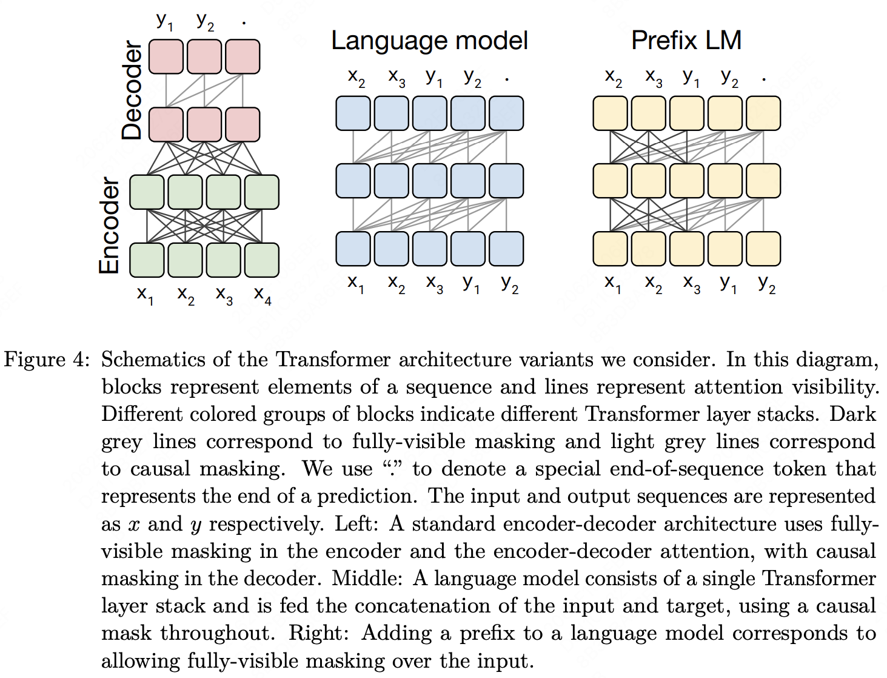

当前常见的大语言模型的架构（不包括 encoder-only）：
1. **encoder-decoder**：在encoder部分采用双向fully-vision attention，而在decoder部分，则采用cross attention形式进行casual attention（encoder和decoder参数可以share，也可以不share）；
2. **decoder-only（Language model）**：在decoder部分采用casual attention的形式，docoder-only架构 + LM obj 是目前预训练语言模型中最常用的结构；但对于text-to-text任务，由于存在前缀prefix/context，对采用causal attention会对prefix信息利用不全的现象；
3. **prefix LM**：即采用Causal with prefix attention的结果，对前缀输入进行fully vision attention，对后面进行causal attention 的生成；这种架构对于text-to-text任务非常高效；

**下面介绍下prefix LM和encoder-decoder，以及encoder之间关系**：
1. prefix LM和encoder-decoder结构很相似，共享encoder和decoder参数，同时encoder和decoder交互从cross attention转化为causal attention形式；
2. 从分类任务上来看，prefix LM和BERT非常相似；prefix LM通过构造相关的prefix，基于最后一个词预估分类label，此时前缀都是fully vision attention；而BERT采用encoder-only架构，也是在做fully vision attention，然后再CLS token输出结果；即BERT是整体作为一个分类器，而prefix LM则是在prefix LM 前部分集成分类器能力；

### 模型架构对比:

模型架构对比，需要考虑参数量和计算量两部分：

1）L + L层的encoder-decoder计算量，和L层decoder计算量相当：
  - 按照LLM中FLOPs的计算逻辑，encoder部分计算量约等于（6｜8）* tokens/2 * parameters，decoder也约等于（6｜8）* tokens/2 * parameters；两者FLOPs之和约等于 decoder-only的计算量；

2）L + L层的encoder-decoder参数量，和2个L层decoder参数量接近：
  - 以（33000 token，12层，12 head ，768维）为例，decoder架构中，参数量为 33000 * 768 + (1+1+1+1+4+4)*768*768*12 = 110MB；
  - encoder-decoder架构中，encoder部分：33000 * 768 + 12 * 768 * 768 * 12，decoder部分：(1 + 1 + 1 + 1 + 1 + 1 + 4 + 4) * 768 * 768 * 12，总共 = 209MB；

以12层768维 transformer layer参数为P，FLOPs为M，则有如下：

| 模型 | 参数量 | FLOPs |
|-|-----|-------|
|encoder-decoder| 2P  | M     |
|decoder-only| P   | M     |
|prefix-LM| P   | M     |

———— 这里的FLOPs其实存在一定偏差，因为encoder-decoder参数量是其他的两倍，在训练时为了不占用显存，可能会存在内存里面，这时候就涉及到参数激活重计算时长，大约是1/4M的FLOPs；

———— 参数激活重计算是指，由于参数量太大，无法存在显存，为此前向计算完成后，直接从显存中删掉；为此在反向更新参数时，还需要重新计算一遍；这是一种常见的大模型训练时，时间换空间的方法；

T5论文中，对不同的encoder-decoder、decoder-only、prefix-LM的结果进行对比，**发现encoder-decoder的效果最佳，在训练机器资源情况下，训练计算量并没有提升**；为此他们采用来encoder-decoder的结构；

### 训练目标:

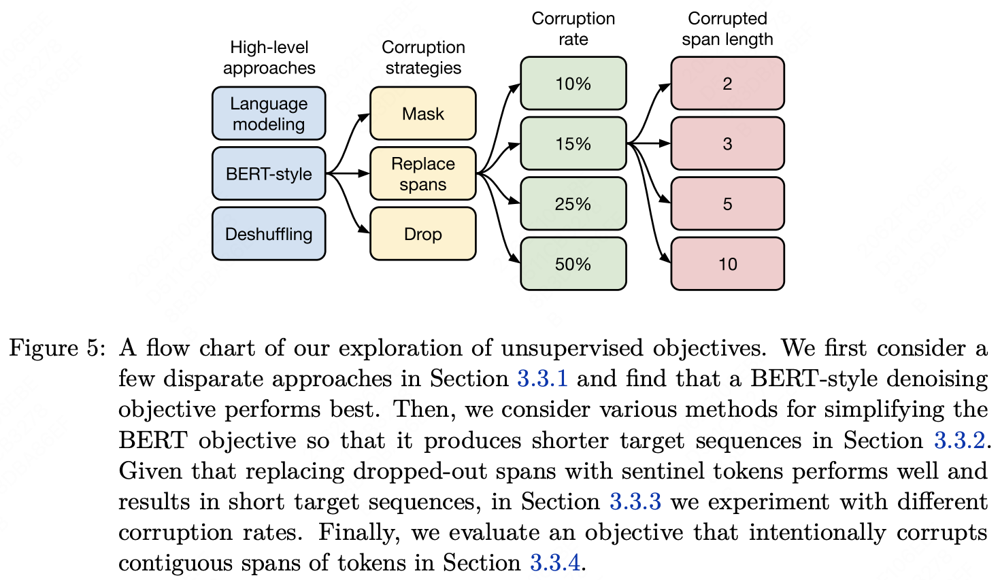

T5模型在进行目标选择时，进行了大量实验，终于获得了完整的 T5 模型，还有它的训练方法：
- Transformer Encoder-Decoder 模型；
- BERT-style 式的破坏方法；
- Replace Span（小段替换）法；
- 破坏比为15%；
- 小段长度破坏长度为3。

    参考来源：https://zhuanlan.zhihu.com/p/88438851

 

## 【Stanford】Alpaca（SELF-INSTRUCT: Aligning Language Models with Self-Generated Instructions）:

- decoder-only【基于LLaMA】
- 论文地址：https://arxiv.org/pdf/2212.10560.pdf
- 代码地址：https://github.com/tatsu-lab/stanford_alpaca
- 模型大小：7B
- 特点：调用GPT3模型生成一系列instruction来对LLaMA进行微调，有点类似蒸馏；

下图给出基于LLaMA的微调模型体系：

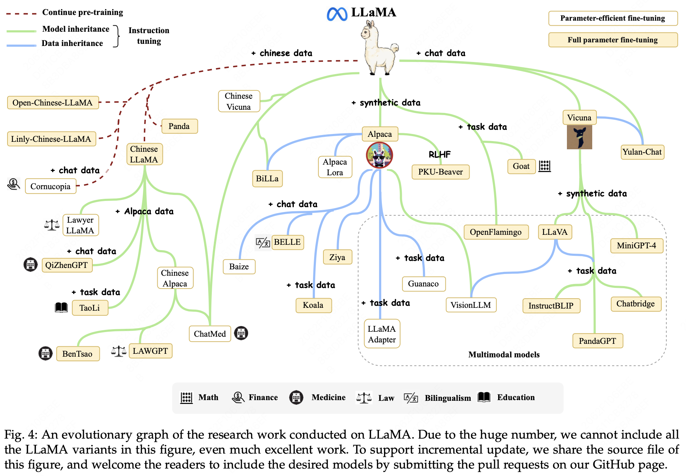

> 上图可以看出Alpaca本身是一个全参数微调。

&nbsp;&nbsp;&nbsp;&nbsp;大型“指令调优”语言模型在新任务上展现了Zero-shot的卓越能力，但严重依赖于人类编写的指令数据，而这些数据在数量、多样性和创造性方面都是有限的。[自驱力超强的羊驼？斯坦福Alpaca媲美text-davinci-003，成本不到600美元！](https://mp.weixin.qq.com/s/lUO1a-UFv5IdBvOB6QTxVg)

&nbsp;&nbsp;&nbsp;&nbsp;斯坦福科研人员引入了self-instruction框架，提高指令遵循能力来自我迭代进化，与InstructGPT的性能相当，相比原始GPT3提升33%！将大模型与指令对齐再也不用人工标注（annotation-free），最后还发布了他们合成的自生成指令数据集，来促进对指令调优的研究。

### Part1：自我提示self-instruct

&nbsp;&nbsp;&nbsp;&nbsp;self-instruct是一种任务不可知（task-agnostic）的方法，通过自己生成指令数据(指令、输入和输出样本)并使用它进行引导来提高语言模型的指令遵循能力。自动指示执行的流程：

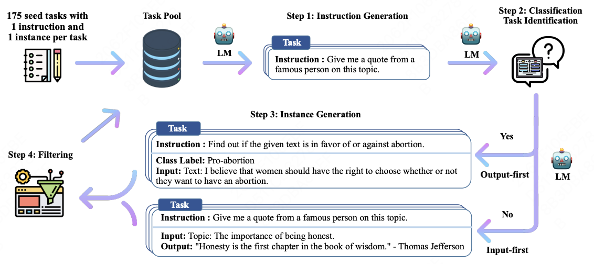

&nbsp;&nbsp;&nbsp;&nbsp;首先准备好一个小的任务种子集(每个任务的一条指令和一个输入-输出实例)作为任务池开始，从任务池中抽取随机任务用于提示语言模型LM（例如GPT3）生成新的指令和实例，再过滤低质量或类似的生成，合格的就添加回任务池；

### Part2：羊驼Alpaca模型

&nbsp;&nbsp;&nbsp;&nbsp;指令遵循语言模型叫Alpaca羊驼，是在近期Meta开源的LLaMA 7B模型上进行微调的。语料使用的是text-davinci-003生成的52K指令。stanford_alpaca在GitHub开源，alpaca_data.json文件中。

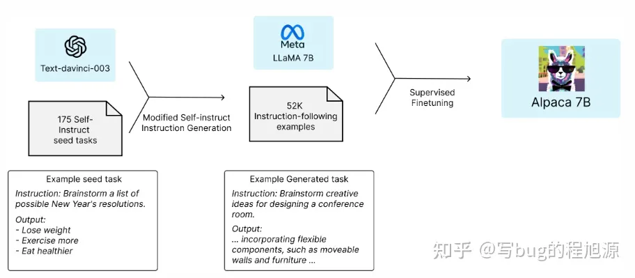

训练过程中，使用了**完全分片数据并行（Fully Sharded Data Parallel） 和混合精度（mixed precision） 等训练等技术**，硬件方面：**在8个80GB A100上对7B LLaMA模型进行微调3个小时**，成本竟然不到100美元！但效果惊人，与InstructGPT_001的性能相当。

### 数据集合评估方法:

52k数据集分布：

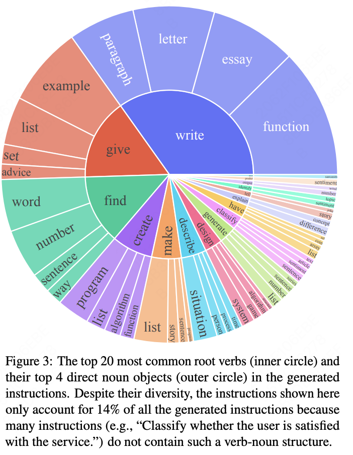

模型评估 采用四级评级系统，用于分类模型输出的质量，定义如下:
- A：回答是有效和令人满意的；
- B：响应是可以接受的，但有一些小错误或缺陷可以改进；
- C：响应是相关的，并响应指令，但它在内容中有重大错误；
- D：响应不相关或无效，包括重复输入，完全不相关的输出等。

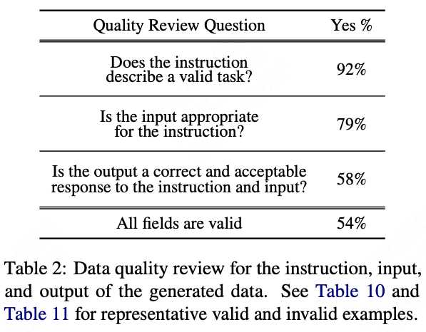

### Alpaca微调指令（中文版）:

| 数据集                                                          | 规模  | 数据类型                    |数据特点|
|--------------------------------------------------------------|-----|-------------------------|-|
| [中文指令数据](https://github.com/carbonz0/alpaca-chinese-dataset) | 52k | 种子数据包含：问答、摘要、数学推理、代码生成等 |原英文版数据用175 个人工编写的任务种子集合作为初始化指令样例，用text-davinci-003生成|
| [Alpaca_GPT4](https://github.com/Instruction-Tuning-with-GPT-4/GPT-4-LLM) | 52k | 同上                      |用 GPT-4 生成的，并做了中文翻译|

    参考来源：https://zhuanlan.zhihu.com/p/615279976

 

## 【清华】ChatGLM：

&nbsp;&nbsp;&nbsp;&nbsp;ChatGLM 参考了 ChatGPT 的设计思路，在千亿基座模型 [GLM-130B](https://chatglm.cn/blog#fn:1) 中注入了代码预训练，通过有监督微调（Supervised Fine-Tuning）等技术实现人类意图对齐。ChatGLM 当前版本模型的能力提升主要来源于独特的千亿基座模型 GLM-130B。它是不同于 BERT、GPT-3 以及 T5 的架构，是一个包含多目标函数的自回归预训练模型。
参考来源：https://chatglm.cn/blog

## ChatGLM-2:

- prefix LM
- 代码地址：https://github.com/THUDM/ChatGLM2-6B
- 模型大小：6B、12B、32B、66B、130B
- 训练数据：1.4T tokens

&nbsp;&nbsp;&nbsp;&nbsp;ChatGLM2-6B 是开源中英双语对话模型[ChatGLM-6B](https://github.com/THUDM/ChatGLM-6B)的第二代版本，在保留了初代模型对话流畅、部署门槛较低等众多优秀特性的基础之上，ChatGLM2-6B 引入了如下新特性：

1. **更强大的性能**：基于 ChatGLM 初代模型的开发经验，我们全面升级了 ChatGLM2-6B 的基座模型。ChatGLM2-6B 使用了 [GLM](https://github.com/THUDM/GLM) 的混合目标函数，经过了 1.4T 中英标识符的预训练与人类偏好对齐训练，[评测结果](https://github.com/THUDM/ChatGLM2-6B#%E8%AF%84%E6%B5%8B%E7%BB%93%E6%9E%9C)显示，相比于初代模型，ChatGLM2-6B 在 MMLU（+23%）、CEval（+33%）、GSM8K（+571%） 、BBH（+60%）等数据集上的性能取得了大幅度的提升，在同尺寸开源模型中具有较强的竞争力。
2. **更长的上下文**：基于 [FlashAttention](https://github.com/Dao-AILab/flash-attention) 技术，我们将**基座模型的上下文长度（Context Length）由 ChatGLM-6B 的 2K 扩展到了 32K**，**并在对话阶段使用 8K 的上下文长度训练**。对于更长的上下文，我们发布了 [ChatGLM2-6B-32K](https://huggingface.co/THUDM/chatglm2-6b-32k) 模型。[LongBench](https://github.com/THUDM/LongBench) 的测评结果表明，在等量级的开源模型中，ChatGLM2-6B-32K 有着较为明显的竞争优势。
3. **更高效的推理**：基于 [Multi-Query Attention](https://arxiv.org/abs/1911.02150) 技术，ChatGLM2-6B 有更高效的推理速度和更低的显存占用：在官方的模型实现下，推理速度相比初代提升了 42%，INT4 量化下，6G 显存支持的对话长度由 1K 提升到了 8K。
4. **优化的模型架构和大小**： 吸取 GLM-130B 训练经验，修正了二维 RoPE 位置编码实现，使用传统FFN结构。6B（62亿）的参数大小，也使得研究者和个人开发者自己微调和部署 ChatGLM-6B 成为可能。
5. **充分的中英双语预训练**： ChatGLM-6B 在 1:1 比例的中英语料上训练了 1T 的 token 量，兼具双语能力。
6. **人类意图对齐训练**： 使用了监督微调（Supervised Fine-Tuning）、反馈自助（Feedback Bootstrap）、人类反馈强化学习（Reinforcement Learning from Human Feedback） 等方式，使模型初具理解人类指令意图的能力。输出格式为 markdown，方便展示。
7. **更开放的协议**：ChatGLM2-6B 权重对学术研究完全开放，在填写[问卷](https://open.bigmodel.cn/mla/form)进行登记后亦允许免费商业使用。

### 效果评估:

**通用领域7B**：Baichuan2-7B-Base > ChatGLM2-6B > Baichuan-7B > LLaMA2-7B > LLaMA-7B

**通用领域13B**：ChatGLM2-12B = Baichuan2-13B-Base > Baichuan-13B-Base > LLaMA2-13B > LLaMA-13B
（Baichuan2-7B-Base > Baichuan-13B-Base）

**法律、医疗 7B**：Baichuan2-7B-Base > ChatGLM2-6B > Baichuan-7B > LLaMA2-7B > LLaMA-7B

**法律、医疗 13B**：Baichuan2-13B-Base > Baichuan-13B-Base > LLaMA2-13B > LLaMA-13B
（Baichuan2-7B-Base > Baichuan-13B-Base）

**数学、代码 7B**：ChatGLM2-6B > Baichuan2-7B-Base > LLaMA2-7B > LLaMA-7B > Baichuan-7B

**数学、代码 13B**：Baichuan2-13B-Base > LLaMA2-13B > Baichuan-13B-Base > LLaMA-13B
（Baichuan2-7B-Base > Baichuan-13B-Base）

** 从评估结果看：**

1）在7B模型上，Baichuan2-7B 优于ChatGLM2-6B，好于Baichuan-7B，好于 LLaMA2-7B，好于LLaMA-7B；

2）在13B模型上，Baichuan2-13B 基本等于 ChatGLM2-12B，好于Baichuan-13B，好于 LLaMA2-13B，好于LLaMA-13B；

### 13B模型结果:

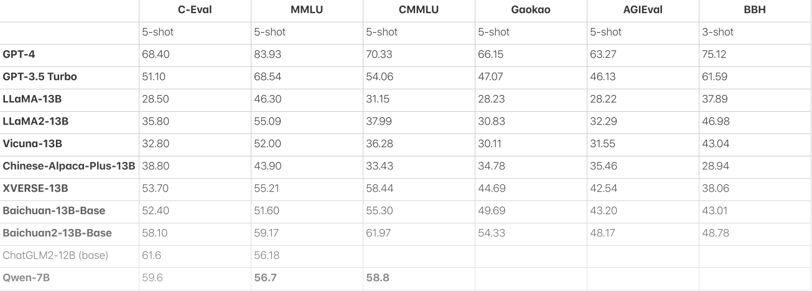

### 7B模型结果:

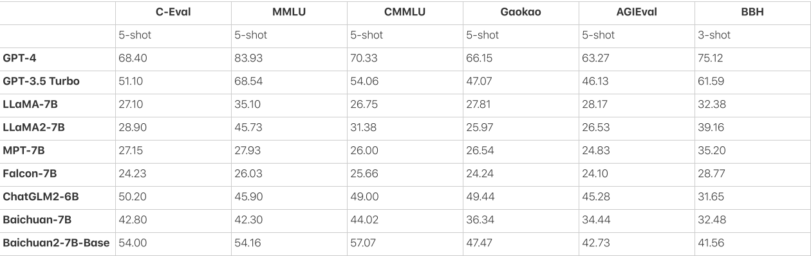